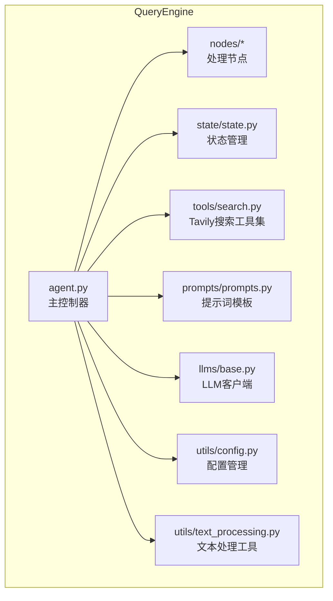
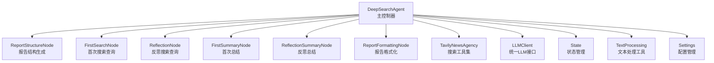
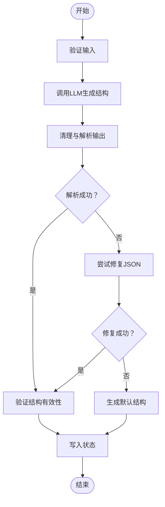
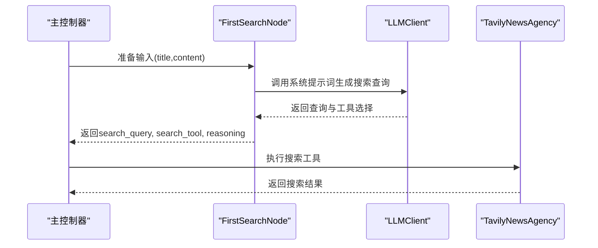
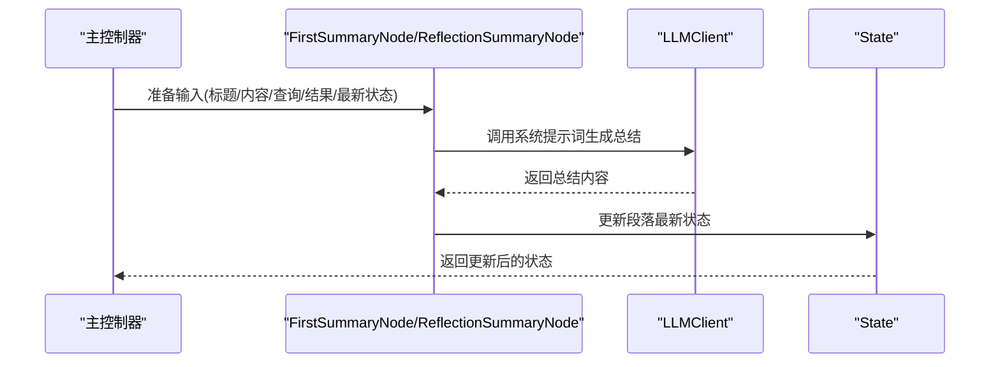
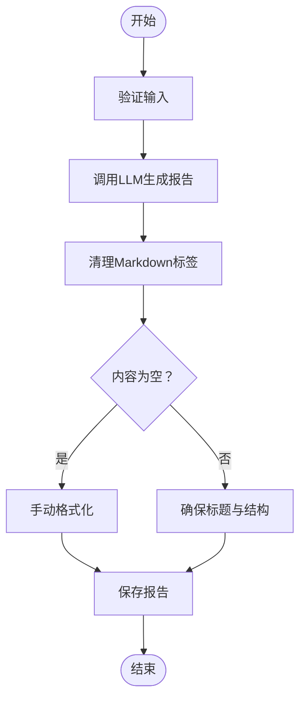
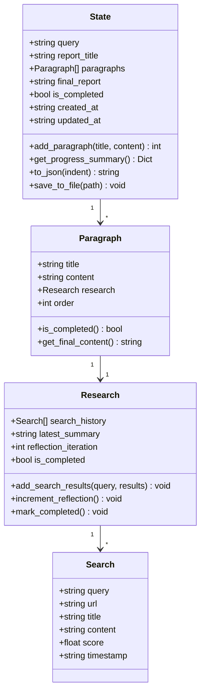
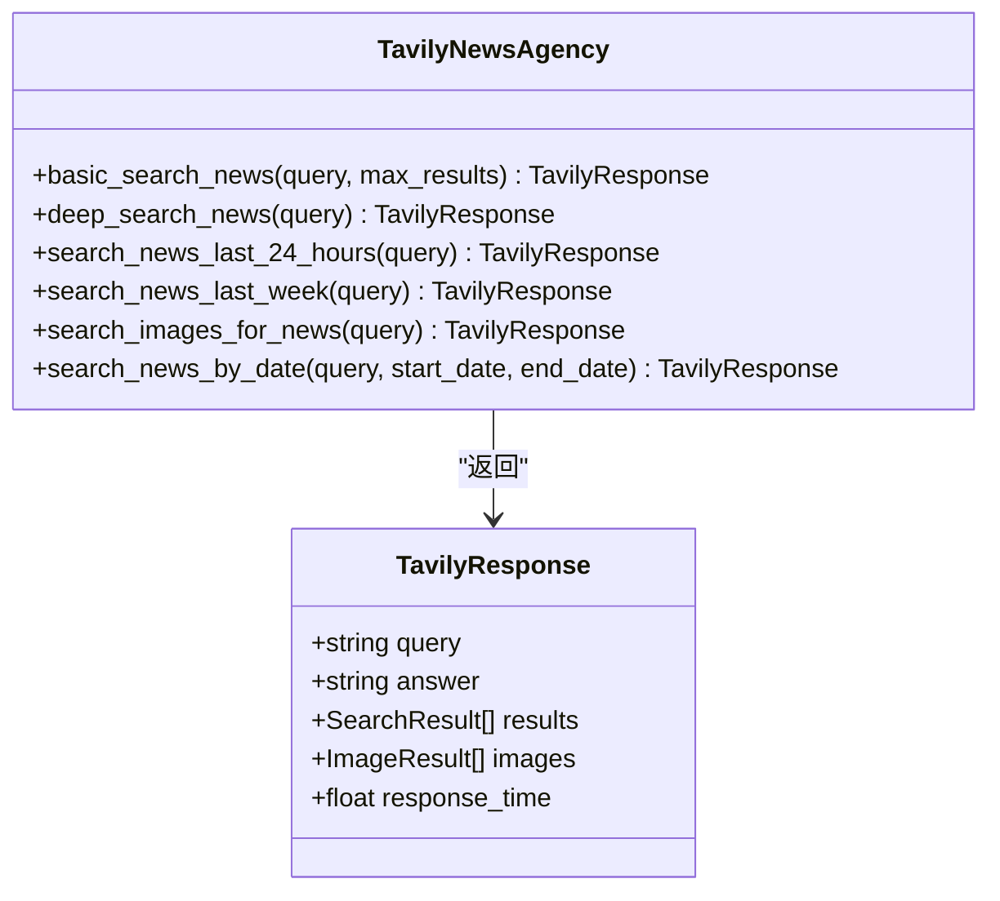
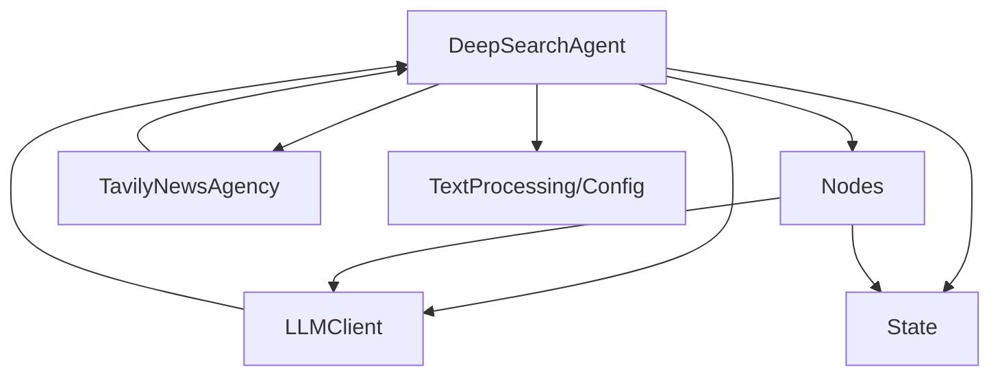

# Query Engine（精准信息搜索引擎）

<cite>
**本文档引用的文件**
- [QueryEngine/__init__.py](file://QueryEngine/__init__.py)
- [QueryEngine/agent.py](file://QueryEngine/agent.py)
- [QueryEngine/nodes/base_node.py](file://QueryEngine/nodes/base_node.py)
- [QueryEngine/nodes/search_node.py](file://QueryEngine/nodes/search_node.py)
- [QueryEngine/nodes/summary_node.py](file://QueryEngine/nodes/summary_node.py)
- [QueryEngine/nodes/report_structure_node.py](file://QueryEngine/nodes/report_structure_node.py)
- [QueryEngine/nodes/formatting_node.py](file://QueryEngine/nodes/formatting_node.py)
- [QueryEngine/state/state.py](file://QueryEngine/state/state.py)
- [QueryEngine/utils/config.py](file://QueryEngine/utils/config.py)
- [QueryEngine/utils/text_processing.py](file://QueryEngine/utils/text_processing.py)
- [QueryEngine/tools/search.py](file://QueryEngine/tools/search.py)
- [QueryEngine/prompts/prompts.py](file://QueryEngine/prompts/prompts.py)
- [QueryEngine/llms/base.py](file://QueryEngine/llms/base.py)
- [SingleEngineApp/query_engine_streamlit_app.py](file://SingleEngineApp/query_engine_streamlit_app.py)
- [README.md](file://README.md)
</cite>

## 目录
1. [简介](#简介)
2. [项目结构](#项目结构)
3. [核心组件](#核心组件)
4. [架构总览](#架构总览)
5. [详细组件分析](#详细组件分析)
6. [依赖关系分析](#依赖关系分析)
7. [性能考虑](#性能考虑)
8. [故障排查指南](#故障排查指南)
9. [结论](#结论)
10. [附录](#附录)

## 简介
Query Engine（精准信息搜索引擎）是一个基于多智能体与LLM协同的深度信息检索与报告生成系统。其核心目标是通过“结构生成—多源检索—反思增强—格式化输出”的流水线，为用户提供高质量、可追溯、可复现的精准信息分析报告。系统支持多平台新闻搜索、关键词优化、反思迭代、结果排序与去重、质量评估与输出处理等关键能力。

## 项目结构
Query Engine位于项目顶层的QueryEngine目录中，采用模块化设计，包含Agent主控制器、节点处理模块、状态管理、工具集、提示词模板与LLM客户端等核心子模块。整体结构如下：

**图表来源**
- [QueryEngine/agent.py](file://QueryEngine/agent.py#L1-L474)
- [QueryEngine/nodes/base_node.py](file://QueryEngine/nodes/base_node.py#L1-L95)
- [QueryEngine/state/state.py](file://QueryEngine/state/state.py#L1-L259)
- [QueryEngine/tools/search.py](file://QueryEngine/tools/search.py#L1-L251)
- [QueryEngine/prompts/prompts.py](file://QueryEngine/prompts/prompts.py#L1-L447)
- [QueryEngine/llms/base.py](file://QueryEngine/llms/base.py#L1-L168)
- [QueryEngine/utils/config.py](file://QueryEngine/utils/config.py#L1-L80)
- [QueryEngine/utils/text_processing.py](file://QueryEngine/utils/text_processing.py#L1-L309)

**章节来源**
- [README.md](file://README.md#L118-L297)

## 核心组件
- 主控制器（DeepSearchAgent）：协调报告结构生成、段落处理、反思迭代与最终报告格式化，负责搜索工具调用与状态持久化。
- 处理节点：包含报告结构节点、搜索节点、总结节点、格式化节点，分别承担结构规划、查询生成、信息整合与报告输出职责。
- 状态管理（State）：维护查询、段落、研究过程、最终报告与时间戳等状态数据，支持序列化与进度查询。
- 搜索工具集（TavilyNewsAgency）：提供基础新闻搜索、深度分析、最近24小时/一周新闻、图片搜索与按日期范围搜索等工具。
- LLM客户端（LLMClient）：统一OpenAI兼容接口，支持流式调用、重试与超时控制。
- 文本处理工具：负责JSON清理、Markdown清理、推理文本剥离、不完整JSON修复与内容截断等。
- 配置管理（Settings）：集中管理LLM、搜索、输出与反思等参数，支持从环境变量与.env文件自动加载。

**章节来源**
- [QueryEngine/agent.py](file://QueryEngine/agent.py#L26-L180)
- [QueryEngine/nodes/report_structure_node.py](file://QueryEngine/nodes/report_structure_node.py#L22-L65)
- [QueryEngine/nodes/search_node.py](file://QueryEngine/nodes/search_node.py#L21-L80)
- [QueryEngine/nodes/summary_node.py](file://QueryEngine/nodes/summary_node.py#L34-L60)
- [QueryEngine/nodes/formatting_node.py](file://QueryEngine/nodes/formatting_node.py#L18-L47)
- [QueryEngine/state/state.py](file://QueryEngine/state/state.py#L142-L259)
- [QueryEngine/tools/search.py](file://QueryEngine/tools/search.py#L77-L191)
- [QueryEngine/llms/base.py](file://QueryEngine/llms/base.py#L30-L168)
- [QueryEngine/utils/text_processing.py](file://QueryEngine/utils/text_processing.py#L12-L309)
- [QueryEngine/utils/config.py](file://QueryEngine/utils/config.py#L22-L56)

## 架构总览
Query Engine采用“主控制器 + 多节点 + 工具集 + LLM”的分层架构。主控制器负责流程编排与状态管理，各节点承担特定处理职责，工具集提供多平台搜索能力，LLM客户端提供统一的模型调用接口。

**图表来源**
- [QueryEngine/agent.py](file://QueryEngine/agent.py#L67-L74)
- [QueryEngine/nodes/report_structure_node.py](file://QueryEngine/nodes/report_structure_node.py#L168-L205)
- [QueryEngine/nodes/search_node.py](file://QueryEngine/nodes/search_node.py#L21-L80)
- [QueryEngine/nodes/summary_node.py](file://QueryEngine/nodes/summary_node.py#L170-L200)
- [QueryEngine/nodes/formatting_node.py](file://QueryEngine/nodes/formatting_node.py#L48-L86)
- [QueryEngine/state/state.py](file://QueryEngine/state/state.py#L142-L259)
- [QueryEngine/utils/text_processing.py](file://QueryEngine/utils/text_processing.py#L288-L309)
- [QueryEngine/utils/config.py](file://QueryEngine/utils/config.py#L22-L56)
- [QueryEngine/tools/search.py](file://QueryEngine/tools/search.py#L77-L191)
- [QueryEngine/llms/base.py](file://QueryEngine/llms/base.py#L30-L168)

## 详细组件分析

### 报告结构节点（ReportStructureNode）
- 职责：根据用户查询生成报告段落结构，包含标题与内容规划。
- 输入：用户查询字符串。
- 输出：段落结构列表（标题、内容）。
- 处理流程：调用LLM生成结构，清理与验证输出，必要时回退到默认结构；将结构写入状态。
- 关键点：支持JSON Schema校验与修复，保证输出结构稳定。

**图表来源**
- [QueryEngine/nodes/report_structure_node.py](file://QueryEngine/nodes/report_structure_node.py#L40-L147)
- [QueryEngine/prompts/prompts.py](file://QueryEngine/prompts/prompts.py#L126-L140)

**章节来源**
- [QueryEngine/nodes/report_structure_node.py](file://QueryEngine/nodes/report_structure_node.py#L22-L205)
- [QueryEngine/prompts/prompts.py](file://QueryEngine/prompts/prompts.py#L10-L123)

### 搜索节点（FirstSearchNode / ReflectionNode）
- 职责：为段落生成首次与反思阶段的搜索查询与工具选择，并解释推理过程。
- 输入：段落标题、内容、最新状态（反思阶段）。
- 输出：搜索查询、工具名称、推理说明，必要时附带日期范围参数。
- 处理流程：准备提示词，调用LLM，清理与解析输出，必要时回退默认查询。
- 关键点：支持6种搜索工具选择，含按日期范围搜索的特殊参数校验。

**图表来源**
- [QueryEngine/nodes/search_node.py](file://QueryEngine/nodes/search_node.py#L45-L151)
- [QueryEngine/agent.py](file://QueryEngine/agent.py#L100-L140)
- [QueryEngine/tools/search.py](file://QueryEngine/tools/search.py#L127-L190)

**章节来源**
- [QueryEngine/nodes/search_node.py](file://QueryEngine/nodes/search_node.py#L21-L287)
- [QueryEngine/prompts/prompts.py](file://QueryEngine/prompts/prompts.py#L142-L194)

### 总结节点（FirstSummaryNode / ReflectionSummaryNode）
- 职责：根据搜索结果与预期内容生成或更新段落总结，支持读取论坛最新发言作为上下文。
- 输入：标题、内容、搜索查询、搜索结果、最新状态（反思阶段）。
- 输出：段落最新状态或更新后的状态。
- 处理流程：准备提示词，调用LLM生成总结，清理与解析输出，更新状态。
- 关键点：支持HOST发言读取与格式化，具备JSON修复与回退策略。

**图表来源**
- [QueryEngine/nodes/summary_node.py](file://QueryEngine/nodes/summary_node.py#L60-L200)
- [QueryEngine/state/state.py](file://QueryEngine/state/state.py#L170-L200)

**章节来源**
- [QueryEngine/nodes/summary_node.py](file://QueryEngine/nodes/summary_node.py#L34-L369)
- [QueryEngine/prompts/prompts.py](file://QueryEngine/prompts/prompts.py#L196-L328)

### 报告格式化节点（ReportFormattingNode）
- 职责：将各段落的最新状态整合为最终报告，支持流式输出与手动回退。
- 输入：段落标题与最新状态列表。
- 输出：Markdown格式的最终报告。
- 处理流程：准备提示词，调用LLM生成报告，清理Markdown标签，必要时手动格式化。
- 关键点：自动补全标题与结构，确保输出可读性。

**图表来源**
- [QueryEngine/nodes/formatting_node.py](file://QueryEngine/nodes/formatting_node.py#L48-L115)

**章节来源**
- [QueryEngine/nodes/formatting_node.py](file://QueryEngine/nodes/formatting_node.py#L18-L169)
- [QueryEngine/prompts/prompts.py](file://QueryEngine/prompts/prompts.py#L330-L446)

### 状态管理（State）
- 职责：维护查询、段落、研究过程、最终报告与时间戳，支持序列化与进度查询。
- 数据结构：Search（单条搜索）、Research（段落研究过程）、Paragraph（段落）、State（全局状态）。
- 关键能力：搜索历史记录、反思次数、完成标记、进度统计、持久化。

**图表来源**
- [QueryEngine/state/state.py](file://QueryEngine/state/state.py#L12-L259)

**章节来源**
- [QueryEngine/state/state.py](file://QueryEngine/state/state.py#L142-L259)

### 搜索工具集（TavilyNewsAgency）
- 职责：封装Tavily搜索API，提供基础新闻搜索、深度分析、最近24小时/一周新闻、图片搜索与按日期范围搜索等工具。
- 关键点：统一返回结构（TavilyResponse），包含结果列表与图片列表，支持重试与错误处理。

**图表来源**
- [QueryEngine/tools/search.py](file://QueryEngine/tools/search.py#L77-L191)

**章节来源**
- [QueryEngine/tools/search.py](file://QueryEngine/tools/search.py#L1-L251)

### LLM客户端（LLMClient）
- 职责：统一OpenAI兼容接口，支持同步与流式调用、重试与超时控制。
- 关键点：自动注入当前时间提示，支持温度、采样等参数透传，提供字符串拼接的安全流式聚合。

**章节来源**
- [QueryEngine/llms/base.py](file://QueryEngine/llms/base.py#L30-L168)

### 文本处理工具（text_processing）
- 职责：清理JSON/Markdown标签、剥离推理文本、修复不完整JSON、截断内容、格式化搜索结果。
- 关键点：多策略解析与回退，确保LLM输出的稳定性与可用性。

**章节来源**
- [QueryEngine/utils/text_processing.py](file://QueryEngine/utils/text_processing.py#L12-L309)

### 配置管理（Settings）
- 职责：集中管理LLM、搜索、输出与反思等参数，支持从环境变量与.env文件自动加载。
- 关键点：统一前缀与默认值，便于平滑过渡与跨环境部署。

**章节来源**
- [QueryEngine/utils/config.py](file://QueryEngine/utils/config.py#L22-L80)

## 依赖关系分析
- 耦合与内聚：主控制器与节点之间通过统一接口耦合，节点内部保持高内聚；工具集与LLM客户端相对独立，便于替换与扩展。
- 外部依赖：Tavily搜索API、OpenAI兼容LLM、retry_helper（可选）。
- 潜在循环依赖：未发现直接循环依赖，状态管理与节点通过接口交互，避免循环。

**图表来源**
- [QueryEngine/agent.py](file://QueryEngine/agent.py#L67-L74)
- [QueryEngine/nodes/base_node.py](file://QueryEngine/nodes/base_node.py#L13-L95)
- [QueryEngine/tools/search.py](file://QueryEngine/tools/search.py#L77-L191)
- [QueryEngine/llms/base.py](file://QueryEngine/llms/base.py#L30-L168)
- [QueryEngine/utils/text_processing.py](file://QueryEngine/utils/text_processing.py#L288-L309)
- [QueryEngine/utils/config.py](file://QueryEngine/utils/config.py#L22-L56)

**章节来源**
- [QueryEngine/agent.py](file://QueryEngine/agent.py#L1-L474)
- [QueryEngine/nodes/base_node.py](file://QueryEngine/nodes/base_node.py#L1-L95)

## 性能考虑
- 流式调用与拼接：LLM客户端提供流式调用与安全的UTF-8拼接，避免多字节字符截断，提升长文本生成效率。
- 搜索结果截断：文本处理工具对搜索结果进行长度截断，控制提示词长度，降低Token消耗与延迟。
- 反思轮次控制：通过配置MAX_REFLECTIONS限制反思轮次，平衡质量与性能。
- 搜索工具选择：根据段落主题与时间范围选择合适工具，减少无关结果，提高相关性与效率。
- 重试与超时：LLM与搜索工具均支持重试与超时控制，提升稳定性与鲁棒性。

[本节为通用指导，无需列出具体文件来源]

## 故障排查指南
- LLM调用失败：检查API密钥、模型名称与Base URL配置，确认网络连通性与超时设置。
- 搜索工具异常：确认Tavily API Key配置，检查搜索参数（特别是按日期范围搜索的日期格式）。
- JSON解析失败：节点输出处理包含多策略解析与修复，若仍失败，检查提示词格式与LLM输出稳定性。
- 状态持久化问题：确认输出目录权限与路径配置，检查序列化/反序列化流程。
- Web界面问题：Streamlit应用需正确加载配置与依赖，检查端口占用与环境变量。

**章节来源**
- [QueryEngine/llms/base.py](file://QueryEngine/llms/base.py#L30-L85)
- [QueryEngine/tools/search.py](file://QueryEngine/tools/search.py#L83-L94)
- [QueryEngine/utils/text_processing.py](file://QueryEngine/utils/text_processing.py#L85-L134)
- [QueryEngine/state/state.py](file://QueryEngine/state/state.py#L248-L259)
- [SingleEngineApp/query_engine_streamlit_app.py](file://SingleEngineApp/query_engine_streamlit_app.py#L92-L104)

## 结论
Query Engine通过模块化设计与稳健的处理流程，实现了从查询到报告的全链路自动化。其核心优势在于：多平台搜索集成、LLM驱动的结构化输出、反思迭代增强、状态可追溯与可持久化、以及完善的错误处理与性能优化策略。结合提示词Schema与文本处理工具，系统能够在复杂信息环境中保持高精度与高稳定性。

[本节为总结性内容，无需列出具体文件来源]

## 附录

### 使用示例
- 独立运行Query Engine Streamlit应用：启动后输入查询，系统将自动完成报告结构生成、段落处理、反思迭代与报告输出。
- 配置API密钥：在.env文件中配置QUERY_ENGINE_API_KEY、TAVILY_API_KEY与模型参数，确保系统正常运行。
- 自定义参数：通过Settings调整最大反思轮次、搜索结果数、内容长度等参数，满足不同场景需求。

**章节来源**
- [SingleEngineApp/query_engine_streamlit_app.py](file://SingleEngineApp/query_engine_streamlit_app.py#L124-L184)
- [QueryEngine/utils/config.py](file://QueryEngine/utils/config.py#L22-L56)
- [README.md](file://README.md#L456-L464)

### 搜索策略配置
- 工具选择：根据主题选择基础搜索、深度分析、最近24小时/一周新闻、图片搜索或按日期范围搜索。
- 参数校验：按日期范围搜索需提供YYYY-MM-DD格式的起止日期，系统将进行格式验证与回退处理。
- 结果截断：通过SEARCH_CONTENT_MAX_LENGTH控制单条结果长度，避免提示词过长。

**章节来源**
- [QueryEngine/nodes/search_node.py](file://QueryEngine/nodes/search_node.py#L127-L190)
- [QueryEngine/utils/text_processing.py](file://QueryEngine/utils/text_processing.py#L288-L309)
- [QueryEngine/utils/config.py](file://QueryEngine/utils/config.py#L37-L42)

### 性能优化建议
- 合理设置MAX_REFLECTIONS与MAX_SEARCH_RESULTS，避免过度迭代与结果膨胀。
- 使用流式调用与安全拼接，减少内存占用与字符截断风险。
- 选择合适的搜索工具与参数，提升相关性与减少无效结果。
- 定期清理输出目录与中间状态文件，避免磁盘空间压力。

**章节来源**
- [QueryEngine/utils/config.py](file://QueryEngine/utils/config.py#L37-L46)
- [QueryEngine/llms/base.py](file://QueryEngine/llms/base.py#L133-L154)