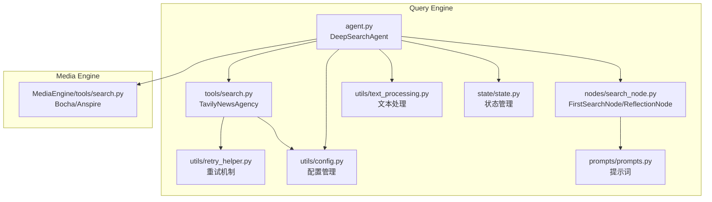
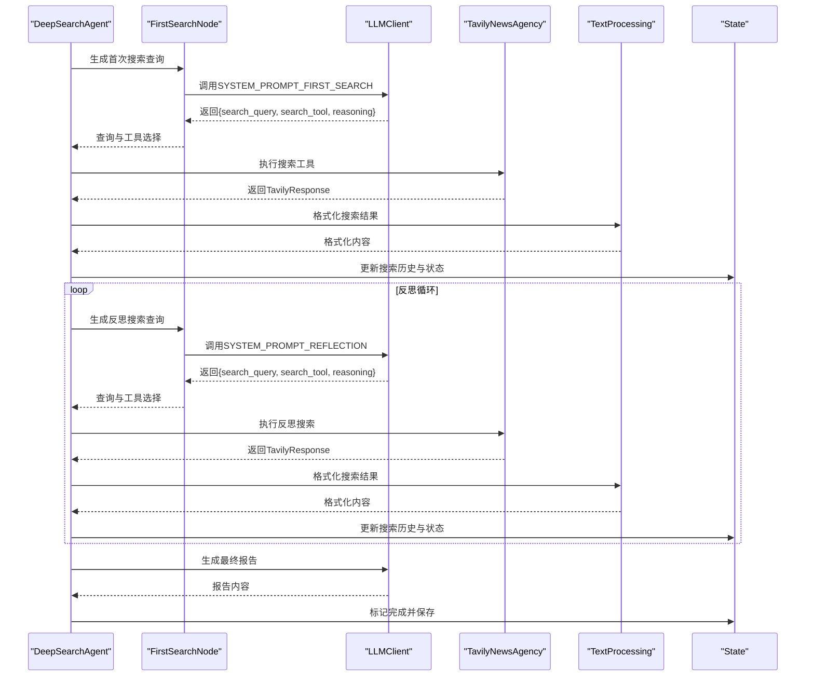
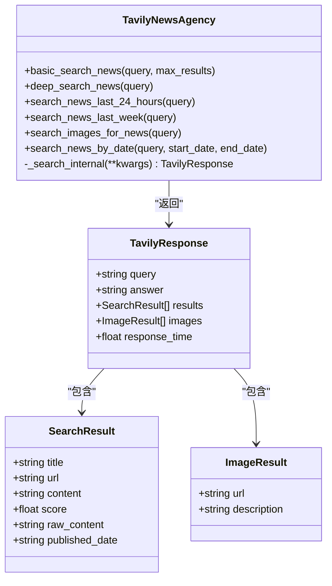
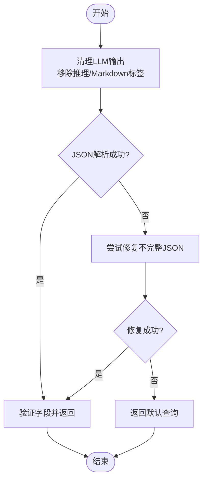
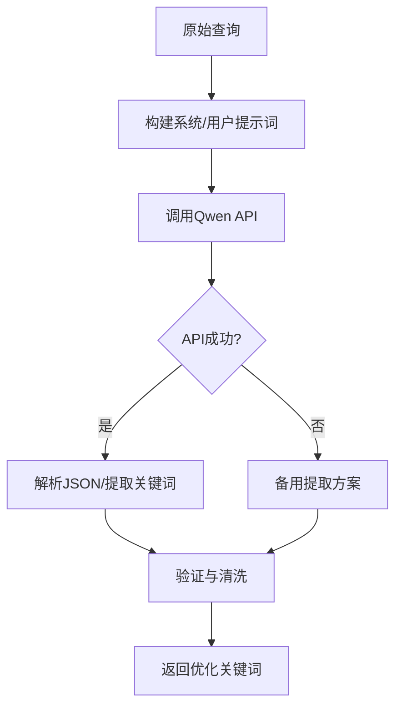
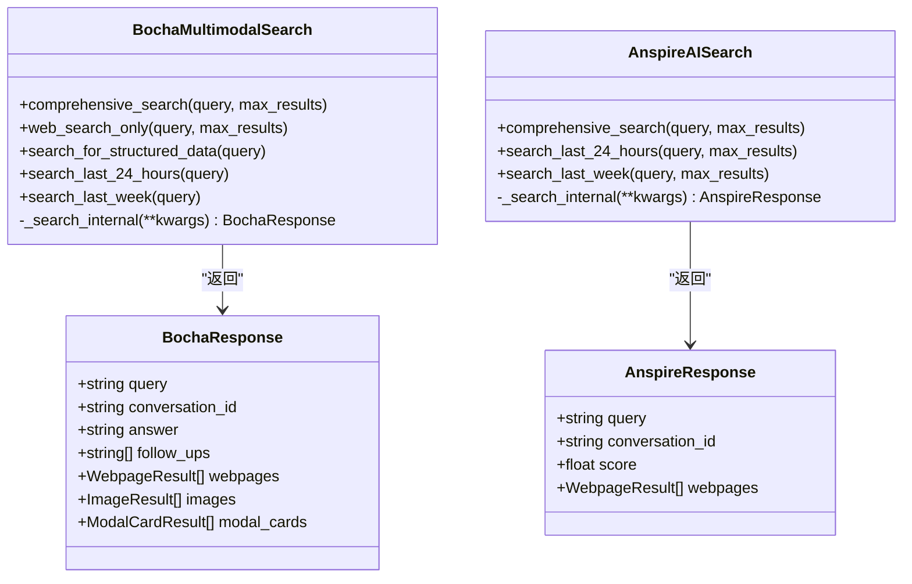
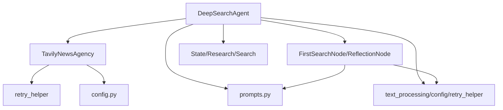

# 搜索工具与多平台集成

<cite>
**本文档引用的文件**
- [QueryEngine/tools/search.py](file://QueryEngine/tools/search.py)
- [QueryEngine/tools/keyword_optimizer.py](file://InsightEngine/tools/keyword_optimizer.py)
- [QueryEngine/nodes/search_node.py](file://QueryEngine/nodes/search_node.py)
- [QueryEngine/utils/config.py](file://QueryEngine/utils/config.py)
- [QueryEngine/utils/text_processing.py](file://QueryEngine/utils/text_processing.py)
- [QueryEngine/utils/retry_helper.py](file://utils/retry_helper.py)
- [QueryEngine/prompts/prompts.py](file://QueryEngine/prompts/prompts.py)
- [QueryEngine/nodes/base_node.py](file://QueryEngine/nodes/base_node.py)
- [QueryEngine/agent.py](file://QueryEngine/agent.py)
- [MediaEngine/tools/search.py](file://MediaEngine/tools/search.py)
</cite>

## 目录
1. [简介](#简介)
2. [项目结构](#项目结构)
3. [核心组件](#核心组件)
4. [架构总览](#架构总览)
5. [详细组件分析](#详细组件分析)
6. [依赖关系分析](#依赖关系分析)
7. [性能考量](#性能考量)
8. [故障排查指南](#故障排查指南)
9. [结论](#结论)
10. [附录](#附录)

## 简介
本文件面向Query Engine的搜索工具与多平台集成，系统性阐述：
- 搜索工具的设计架构与多平台API集成策略
- 搜索结果处理与质量控制机制
- 关键词优化算法的实现原理（语义扩展、同义词处理、搜索意图理解）
- 搜索结果的去重、排序与质量评估算法
- 搜索工具扩展与自定义搜索策略的技术指导
- TavilyNewsAgency类的多工具支持、搜索参数配置与结果格式化处理

## 项目结构
Query Engine采用模块化设计，围绕“提示词-节点-工具-状态-代理”的链路组织代码。核心模块包括：
- 工具层：TavilyNewsAgency（QueryEngine）与BochaMultimodalSearch/AnspireAISearch（MediaEngine）等多平台搜索工具
- 节点层：FirstSearchNode、ReflectionNode等LLM驱动的搜索查询生成节点
- 工具辅助：文本处理、重试机制、配置管理
- 状态层：State/Research/Search等状态数据结构
- 代理层：DeepSearchAgent协调流程与工具调用

**图表来源**
- [QueryEngine/agent.py](file://QueryEngine/agent.py#L26-L180)
- [QueryEngine/nodes/search_node.py](file://QueryEngine/nodes/search_node.py#L21-L152)
- [QueryEngine/tools/search.py](file://QueryEngine/tools/search.py#L77-L191)
- [QueryEngine/utils/text_processing.py](file://QueryEngine/utils/text_processing.py#L1-L309)
- [QueryEngine/utils/retry_helper.py](file://utils/retry_helper.py#L1-L248)
- [QueryEngine/utils/config.py](file://QueryEngine/utils/config.py#L22-L56)
- [QueryEngine/prompts/prompts.py](file://QueryEngine/prompts/prompts.py#L126-L328)
- [QueryEngine/state/state.py](file://QueryEngine/state/state.py#L12-L259)
- [MediaEngine/tools/search.py](file://MediaEngine/tools/search.py#L100-L369)

**章节来源**
- [QueryEngine/agent.py](file://QueryEngine/agent.py#L26-L180)
- [QueryEngine/nodes/search_node.py](file://QueryEngine/nodes/search_node.py#L21-L152)
- [QueryEngine/tools/search.py](file://QueryEngine/tools/search.py#L77-L191)
- [QueryEngine/utils/text_processing.py](file://QueryEngine/utils/text_processing.py#L1-L309)
- [QueryEngine/utils/retry_helper.py](file://utils/retry_helper.py#L1-L248)
- [QueryEngine/utils/config.py](file://QueryEngine/utils/config.py#L22-L56)
- [QueryEngine/prompts/prompts.py](file://QueryEngine/prompts/prompts.py#L126-L328)
- [QueryEngine/state/state.py](file://QueryEngine/state/state.py#L12-L259)
- [MediaEngine/tools/search.py](file://MediaEngine/tools/search.py#L100-L369)

## 核心组件
- TavilyNewsAgency：面向新闻舆情的多工具搜索客户端，提供基础搜索、深度分析、时效检索、图片检索、按日期检索等工具
- FirstSearchNode/ReflectionNode：基于LLM的搜索查询生成节点，负责将段落主题转化为可执行的搜索查询与工具选择
- DeepSearchAgent：编排器，协调提示词、节点、工具与状态，执行多轮反思与报告生成
- 文本处理与重试机制：统一处理LLM输出、JSON解析与API重试，保障稳定性
- 配置管理：集中管理LLM、搜索、输出等配置项

**章节来源**
- [QueryEngine/tools/search.py](file://QueryEngine/tools/search.py#L77-L191)
- [QueryEngine/nodes/search_node.py](file://QueryEngine/nodes/search_node.py#L21-L287)
- [QueryEngine/agent.py](file://QueryEngine/agent.py#L26-L180)
- [QueryEngine/utils/text_processing.py](file://QueryEngine/utils/text_processing.py#L12-L309)
- [QueryEngine/utils/retry_helper.py](file://utils/retry_helper.py#L141-L199)
- [QueryEngine/utils/config.py](file://QueryEngine/utils/config.py#L22-L56)

## 架构总览
Query Engine的搜索流程由“结构生成-初始搜索-反思循环-最终报告”构成，搜索工具贯穿其中，提供多粒度、多维度的信息获取能力。

**图表来源**
- [QueryEngine/agent.py](file://QueryEngine/agent.py#L141-L424)
- [QueryEngine/nodes/search_node.py](file://QueryEngine/nodes/search_node.py#L45-L151)
- [QueryEngine/prompts/prompts.py](file://QueryEngine/prompts/prompts.py#L142-L304)
- [QueryEngine/tools/search.py](file://QueryEngine/tools/search.py#L127-L191)
- [QueryEngine/utils/text_processing.py](file://QueryEngine/utils/text_processing.py#L288-L309)
- [QueryEngine/state/state.py](file://QueryEngine/state/state.py#L58-L100)

## 详细组件分析

### TavilyNewsAgency：多工具搜索客户端
- 多工具支持：basic_search_news、deep_search_news、search_news_last_24_hours、search_news_last_week、search_images_for_news、search_news_by_date
- 参数配置：通过工具方法显式传参，内部统一映射为API参数；支持时间范围、最大结果数、是否包含图片/答案等
- 结果格式化：将API响应映射为SearchResult/ImageResult/TavilyResponse，保留发布时间等关键字段
- 错误处理：使用with_graceful_retry装饰器，失败时返回默认响应，保证系统稳健性

**图表来源**
- [QueryEngine/tools/search.py](file://QueryEngine/tools/search.py#L77-L191)
- [QueryEngine/tools/search.py](file://QueryEngine/tools/search.py#L46-L73)

**章节来源**
- [QueryEngine/tools/search.py](file://QueryEngine/tools/search.py#L77-L191)
- [QueryEngine/tools/search.py](file://QueryEngine/tools/search.py#L46-L73)

### 搜索查询生成节点：FirstSearchNode 与 ReflectionNode
- FirstSearchNode：接收段落标题与内容，调用SYSTEM_PROMPT_FIRST_SEARCH生成首次搜索查询与工具选择，支持默认查询回退
- ReflectionNode：基于段落最新状态生成反思搜索查询，支持默认查询回退
- 输出处理：统一清理LLM输出、提取JSON、修复不完整JSON，确保Agent稳定消费

**图表来源**
- [QueryEngine/nodes/search_node.py](file://QueryEngine/nodes/search_node.py#L81-L140)
- [QueryEngine/utils/text_processing.py](file://QueryEngine/utils/text_processing.py#L85-L134)

**章节来源**
- [QueryEngine/nodes/search_node.py](file://QueryEngine/nodes/search_node.py#L21-L287)
- [QueryEngine/utils/text_processing.py](file://QueryEngine/utils/text_processing.py#L12-L309)
- [QueryEngine/prompts/prompts.py](file://QueryEngine/prompts/prompts.py#L142-L304)

### 关键词优化算法（InsightEngine）
- 目标：将Agent生成的搜索查询优化为更适合舆情数据库的关键词，贴近网民语言，避免专业术语
- 方法：系统提示词约束关键词数量、格式与情感色彩；优先调用Qwen API解析JSON；失败时采用备用提取策略
- 质量控制：关键词长度与合法性校验、去除不良关键词集合、限制数量上限

**图表来源**
- [InsightEngine/tools/keyword_optimizer.py](file://InsightEngine/tools/keyword_optimizer.py#L63-L149)
- [InsightEngine/tools/keyword_optimizer.py](file://InsightEngine/tools/keyword_optimizer.py#L150-L295)

**章节来源**
- [InsightEngine/tools/keyword_optimizer.py](file://InsightEngine/tools/keyword_optimizer.py#L36-L298)

### 多平台搜索集成：Bocha 与 Anspire
- BochaMultimodalSearch：支持全面搜索、网页搜索、结构化数据查询、24小时/一周时效检索；返回网页、图片、AI摘要、追问建议与模态卡
- AnspireAISearch：支持综合搜索与时效检索；返回网页与评分
- 统一重试：均使用with_graceful_retry装饰器，失败返回默认响应

**图表来源**
- [MediaEngine/tools/search.py](file://MediaEngine/tools/search.py#L100-L369)
- [MediaEngine/tools/search.py](file://MediaEngine/tools/search.py#L47-L96)

**章节来源**
- [MediaEngine/tools/search.py](file://MediaEngine/tools/search.py#L100-L369)

### 搜索结果处理与质量控制
- 结果格式化：统一将工具返回映射为标准结构，便于后续提示词与报告生成
- 内容截断：format_search_results_for_prompt按最大长度截断，避免提示词过长
- 状态更新：update_state_with_search_results将搜索历史写入State/Research/Search，支持进度追踪与恢复
- 质量评估：通过score字段与发布时间等元信息辅助排序与筛选

**章节来源**
- [QueryEngine/utils/text_processing.py](file://QueryEngine/utils/text_processing.py#L222-L309)
- [QueryEngine/state/state.py](file://QueryEngine/state/state.py#L58-L100)
- [QueryEngine/agent.py](file://QueryEngine/agent.py#L264-L303)

## 依赖关系分析
- 组件耦合
  - DeepSearchAgent依赖LLMClient、TavilyNewsAgency、各节点与状态模块
  - 节点依赖提示词与文本处理工具
  - 搜索工具依赖重试机制与配置管理
- 外部依赖
  - Tavily API（QueryEngine）、Bocha/Anspire API（MediaEngine）
  - OpenAI兼容客户端（InsightEngine关键词优化）

**图表来源**
- [QueryEngine/agent.py](file://QueryEngine/agent.py#L29-L74)
- [QueryEngine/nodes/search_node.py](file://QueryEngine/nodes/search_node.py#L12-L18)
- [QueryEngine/utils/text_processing.py](file://QueryEngine/utils/text_processing.py#L1-L309)
- [QueryEngine/utils/retry_helper.py](file://utils/retry_helper.py#L1-L248)
- [QueryEngine/utils/config.py](file://QueryEngine/utils/config.py#L22-L56)
- [QueryEngine/prompts/prompts.py](file://QueryEngine/prompts/prompts.py#L1-L447)

**章节来源**
- [QueryEngine/agent.py](file://QueryEngine/agent.py#L29-L74)
- [QueryEngine/nodes/search_node.py](file://QueryEngine/nodes/search_node.py#L12-L18)
- [QueryEngine/utils/text_processing.py](file://QueryEngine/utils/text_processing.py#L1-L309)
- [QueryEngine/utils/retry_helper.py](file://utils/retry_helper.py#L1-L248)
- [QueryEngine/utils/config.py](file://QueryEngine/utils/config.py#L22-L56)
- [QueryEngine/prompts/prompts.py](file://QueryEngine/prompts/prompts.py#L1-L447)

## 性能考量
- 重试与退避：SEARCH_API_RETRY_CONFIG采用指数退避，最大延迟与重试次数可调，降低瞬时故障影响
- 结果截断：format_search_results_for_prompt按阈值截断，避免提示词膨胀导致Token超限
- 并发与批处理：当前实现为串行调用，建议在Agent层引入并发队列与结果聚合，以缩短总耗时
- 缓存策略：可对高频查询与相似查询结果进行缓存，减少重复调用

[本节为通用性能建议，不直接分析具体文件]

## 故障排查指南
- API密钥与环境变量
  - Tavily：确认TAVILY_API_KEY已设置；否则初始化时报错
  - Bocha/Anspire：确认对应API Key与Base URL配置
  - InsightEngine关键词优化：确认SiliconFlow相关配置
- LLM输出解析失败
  - FirstSearchNode/ReflectionNode会尝试修复JSON并回退默认查询；检查提示词与输出格式
- 搜索结果为空
  - 检查工具参数（如时间范围、最大结果数）与API可用性
- 状态保存与恢复
  - 使用save_state/load_state进行调试与恢复；确认输出目录权限

**章节来源**
- [QueryEngine/tools/search.py](file://QueryEngine/tools/search.py#L83-L93)
- [MediaEngine/tools/search.py](file://MediaEngine/tools/search.py#L108-L123)
- [QueryEngine/agent.py](file://QueryEngine/agent.py#L52-L57)
- [QueryEngine/nodes/search_node.py](file://QueryEngine/nodes/search_node.py#L110-L140)

## 结论
Query Engine通过“提示词-节点-工具-状态-代理”的闭环，实现了从搜索查询生成到多轮反思与报告产出的完整流程。TavilyNewsAgency提供了面向新闻舆情的多工具搜索能力，结合FirstSearchNode/ReflectionNode与文本处理、重试机制，形成稳健的搜索与质量控制体系。InsightEngine的关键词优化算法进一步提升了搜索意图理解与结果相关性。多平台集成（Bocha/Anspire）为复杂场景提供结构化数据与多模态信息支持。建议在Agent层引入并发与缓存策略，持续优化性能与稳定性。

[本节为总结性内容，不直接分析具体文件]

## 附录

### 自定义搜索策略与扩展指南
- 新增工具
  - 在TavilyNewsAgency中添加新方法，遵循现有参数风格与默认值
  - 在prompts.py中更新工具说明与Schema，确保Agent能正确选择
- 自定义提示词
  - 在prompts.py中扩展SYSTEM_PROMPT_FIRST_SEARCH/REFLECTION，增加工具选择逻辑
- 结果格式化
  - 在text_processing.py中扩展format_search_results_for_prompt，满足新字段需求
- 多平台接入
  - 参考BochaMultimodalSearch/AnspireAISearch的结构，实现新的客户端类与解析逻辑
- 质量控制
  - 在Agent层增加去重与排序逻辑，结合score/published_date等字段进行评估

**章节来源**
- [QueryEngine/tools/search.py](file://QueryEngine/tools/search.py#L127-L191)
- [QueryEngine/prompts/prompts.py](file://QueryEngine/prompts/prompts.py#L142-L304)
- [QueryEngine/utils/text_processing.py](file://QueryEngine/utils/text_processing.py#L288-L309)
- [MediaEngine/tools/search.py](file://MediaEngine/tools/search.py#L100-L369)