# 核心代理设计架构

<cite>
**本文档引用的文件**
- [agent.py](file://QueryEngine/agent.py)
- [search.py](file://QueryEngine/tools/search.py)
- [search_node.py](file://QueryEngine/nodes/search_node.py)
- [state.py](file://QueryEngine/state/state.py)
- [config.py](file://QueryEngine/utils/config.py)
- [base_node.py](file://QueryEngine/nodes/base_node.py)
- [prompts.py](file://QueryEngine/prompts/prompts.py)
- [text_processing.py](file://QueryEngine/utils/text_processing.py)
- [report_structure_node.py](file://QueryEngine/nodes/report_structure_node.py)
- [summary_node.py](file://QueryEngine/nodes/summary_node.py)
- [formatting_node.py](file://QueryEngine/nodes/formatting_node.py)
- [keyword_optimizer.py](file://InsightEngine/tools/keyword_optimizer.py)
</cite>

## 目录
1. [简介](#简介)
2. [项目结构](#项目结构)
3. [核心组件](#核心组件)
4. [架构概览](#架构概览)
5. [详细组件分析](#详细组件分析)
6. [依赖关系分析](#依赖关系分析)
7. [性能考虑](#性能考虑)
8. [故障排除指南](#故障排除指南)
9. [结论](#结论)

## 简介

Query Engine的核心代理设计架构是一个高度模块化的深度搜索系统，专注于提供精准的多平台搜索集成和智能关键词优化。该架构围绕DeepSearchAgent类构建，实现了完整的深度研究流程，包括报告结构生成、多轮搜索、反思循环和最终报告格式化。

系统采用分层架构设计，通过节点化处理单元实现功能模块的解耦，每个组件都有明确的职责分工和清晰的接口定义。架构支持灵活的配置管理，可扩展的搜索工具集，以及强大的状态管理系统。

## 项目结构

Query Engine模块采用功能驱动的组织方式，将相关功能按领域划分为不同的子包：

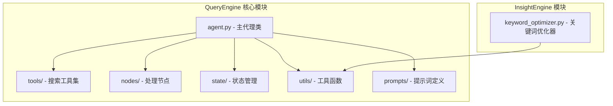

**图表来源**
- [agent.py](file://QueryEngine/agent.py#L1-L50)
- [search.py](file://QueryEngine/tools/search.py#L1-L30)
- [search_node.py](file://QueryEngine/nodes/search_node.py#L1-L20)

**章节来源**
- [agent.py](file://QueryEngine/agent.py#L1-L50)
- [search.py](file://QueryEngine/tools/search.py#L1-L30)
- [search_node.py](file://QueryEngine/nodes/search_node.py#L1-L20)

## 核心组件

### DeepSearchAgent 主代理类

DeepSearchAgent是整个系统的中枢控制器，负责协调各个组件的工作流程。其核心设计理念包括：

- **模块化架构**：通过依赖注入的方式管理各个子组件
- **状态驱动**：完全基于状态机的处理流程
- **容错机制**：完善的错误处理和回退策略
- **可配置性**：支持环境变量和配置文件的灵活配置

### 搜索工具集 (TavilyNewsAgency)

系统集成了Tavily搜索引擎的多种搜索工具，提供不同粒度和类型的搜索能力：

- **基础新闻搜索**：标准、快速的通用搜索
- **深度新闻分析**：全面的主题分析和AI摘要
- **时间范围搜索**：特定时间段内的历史搜索
- **图片搜索**：与新闻主题相关的视觉内容搜索

### 节点化处理系统

系统采用节点化架构，每个处理节点都有特定的功能职责：

- **报告结构节点**：生成报告的整体框架
- **搜索节点**：生成搜索查询和反思查询
- **总结节点**：基于搜索结果生成段落内容
- **格式化节点**：将最终结果格式化为报告

**章节来源**
- [agent.py](file://QueryEngine/agent.py#L26-L74)
- [search.py](file://QueryEngine/tools/search.py#L77-L191)
- [base_node.py](file://QueryEngine/nodes/base_node.py#L13-L95)

## 架构概览

Query Engine采用分层架构设计，从底层到顶层依次为：

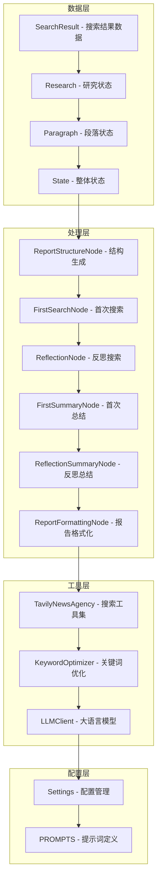

**图表来源**
- [state.py](file://QueryEngine/state/state.py#L12-L152)
- [report_structure_node.py](file://QueryEngine/nodes/report_structure_node.py#L22-L205)
- [search_node.py](file://QueryEngine/nodes/search_node.py#L21-L287)
- [summary_node.py](file://QueryEngine/nodes/summary_node.py#L34-L369)
- [formatting_node.py](file://QueryEngine/nodes/formatting_node.py#L18-L169)

## 详细组件分析

### DeepSearchAgent 类设计

DeepSearchAgent是系统的核心控制器，实现了完整的深度搜索流程：

#### 初始化流程

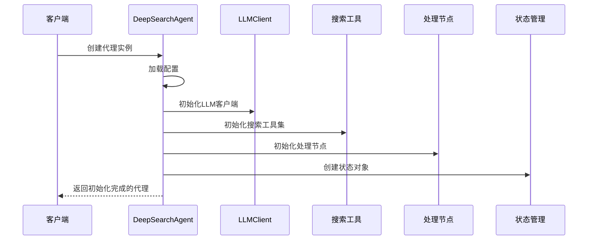

**图表来源**
- [agent.py](file://QueryEngine/agent.py#L29-L57)

#### 搜索执行机制

系统支持多种搜索工具的统一调用机制：

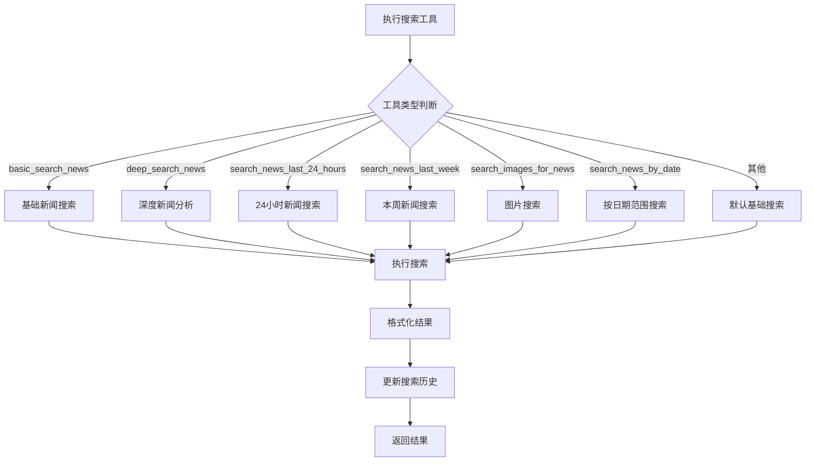

**图表来源**
- [agent.py](file://QueryEngine/agent.py#L100-L139)
- [search.py](file://QueryEngine/tools/search.py#L127-L190)

#### 反思循环机制

系统实现了多轮反思的智能搜索优化：

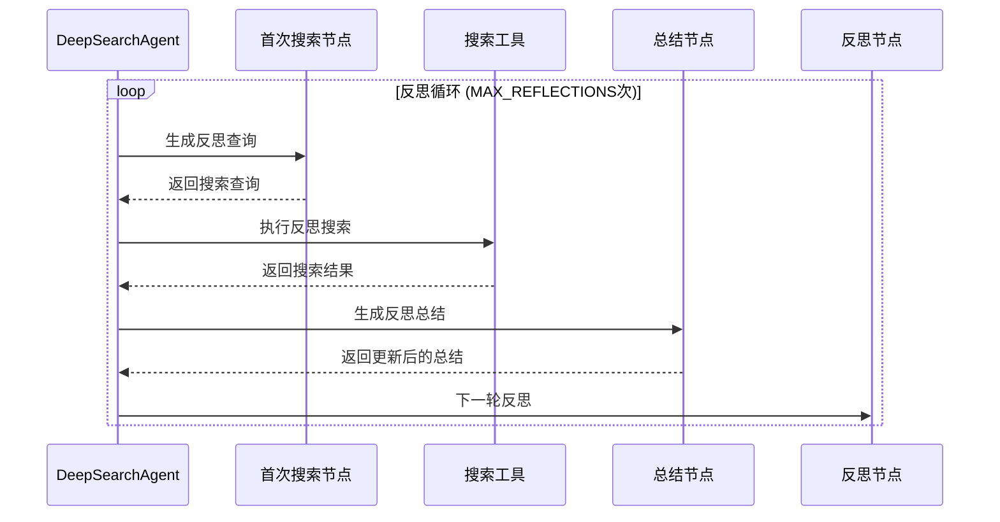

**图表来源**
- [agent.py](file://QueryEngine/agent.py#L307-L397)
- [search_node.py](file://QueryEngine/nodes/search_node.py#L154-L287)

**章节来源**
- [agent.py](file://QueryEngine/agent.py#L26-L474)

### 状态管理系统

状态管理系统是整个架构的核心，负责跟踪研究过程中的所有信息：

#### 数据结构设计

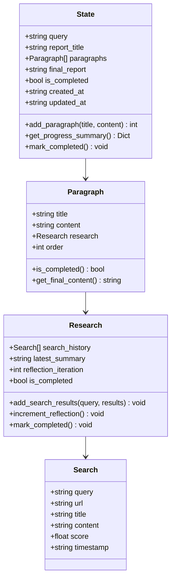

**图表来源**
- [state.py](file://QueryEngine/state/state.py#L12-L259)

#### 状态协调机制

状态管理实现了完整的生命周期管理：

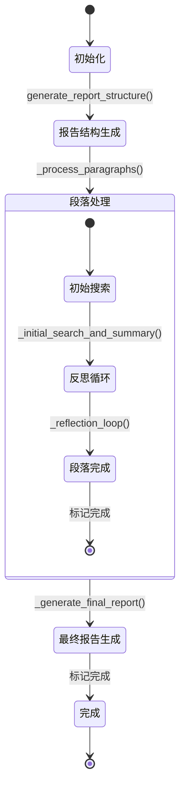

**图表来源**
- [state.py](file://QueryEngine/state/state.py#L188-L192)

**章节来源**
- [state.py](file://QueryEngine/state/state.py#L1-L259)

### 搜索节点系统

搜索节点系统负责生成智能的搜索查询和反思查询：

#### 查询生成机制

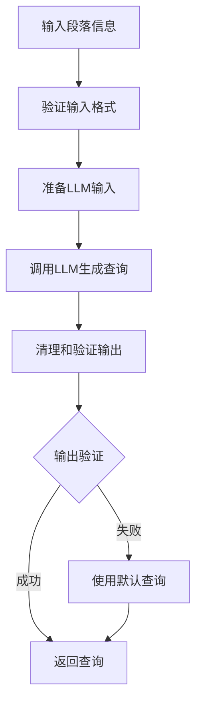

**图表来源**
- [search_node.py](file://QueryEngine/nodes/search_node.py#L45-L151)

#### 输出处理管道

系统实现了多层次的输出处理机制：

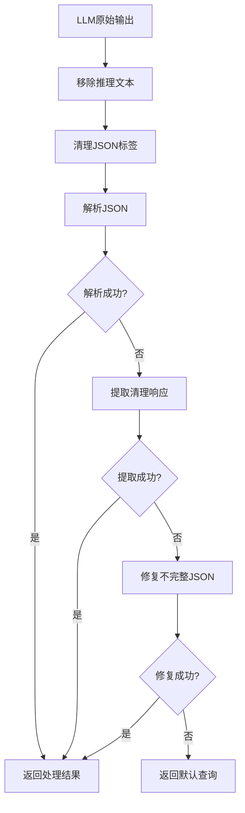

**图表来源**
- [search_node.py](file://QueryEngine/nodes/search_node.py#L81-L139)

**章节来源**
- [search_node.py](file://QueryEngine/nodes/search_node.py#L1-L287)

### 关键词优化中间件

虽然主要位于InsightEngine模块，但关键词优化中间件为Query Engine提供了重要的搜索质量提升：

#### 优化策略

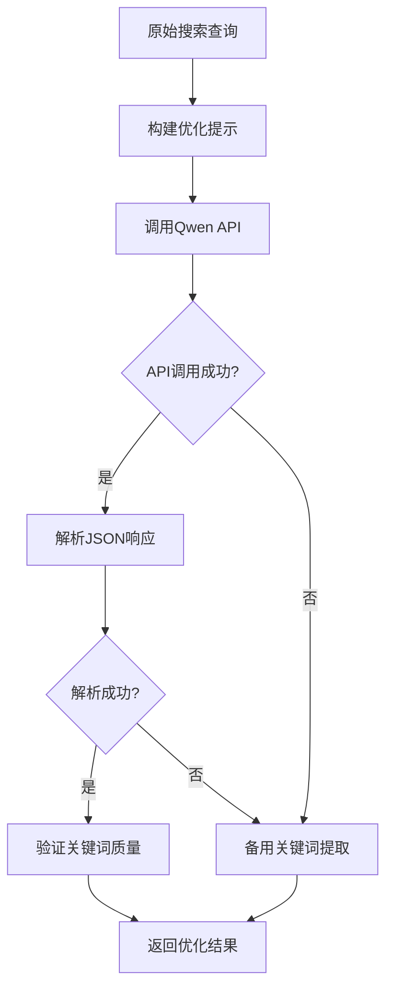

**图表来源**
- [keyword_optimizer.py](file://InsightEngine/tools/keyword_optimizer.py#L63-L148)

**章节来源**
- [keyword_optimizer.py](file://InsightEngine/tools/keyword_optimizer.py#L1-L298)

## 依赖关系分析

系统采用了松耦合的设计原则，通过接口和抽象类实现组件间的解耦：

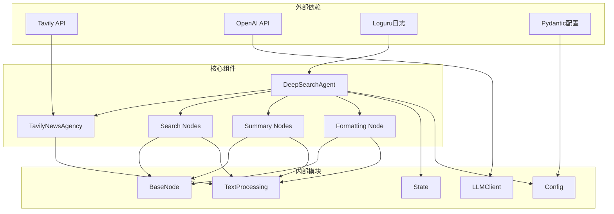

**图表来源**
- [agent.py](file://QueryEngine/agent.py#L12-L24)
- [search.py](file://QueryEngine/tools/search.py#L39-L42)
- [base_node.py](file://QueryEngine/nodes/base_node.py#L9-L10)

### 关键依赖关系

系统的关键依赖关系包括：

- **LLM客户端依赖**：所有节点都依赖LLMClient进行智能处理
- **配置管理依赖**：所有组件都依赖Settings进行配置管理
- **工具函数依赖**：文本处理工具被广泛应用于各个组件
- **状态管理依赖**：状态管理贯穿整个处理流程

**章节来源**
- [agent.py](file://QueryEngine/agent.py#L12-L24)
- [search.py](file://QueryEngine/tools/search.py#L39-L42)
- [base_node.py](file://QueryEngine/nodes/base_node.py#L9-L10)

## 性能考虑

### 并发处理

系统支持多线程和异步处理，通过合理的并发控制实现高效的资源利用：

- **搜索并发**：多个搜索工具可以并行执行
- **LLM调用**：支持流式响应处理
- **状态更新**：原子性的状态更新操作

### 缓存策略

系统实现了多层次的缓存机制：

- **搜索结果缓存**：避免重复的网络请求
- **LLM响应缓存**：缓存相似的查询结果
- **配置缓存**：减少配置文件的读取开销

### 内存管理

系统采用了高效的内存管理模式：

- **流式处理**：避免大文件的内存占用
- **增量更新**：状态的增量更新减少内存压力
- **垃圾回收**：及时释放不再使用的对象

## 故障排除指南

### 常见问题诊断

#### 配置问题

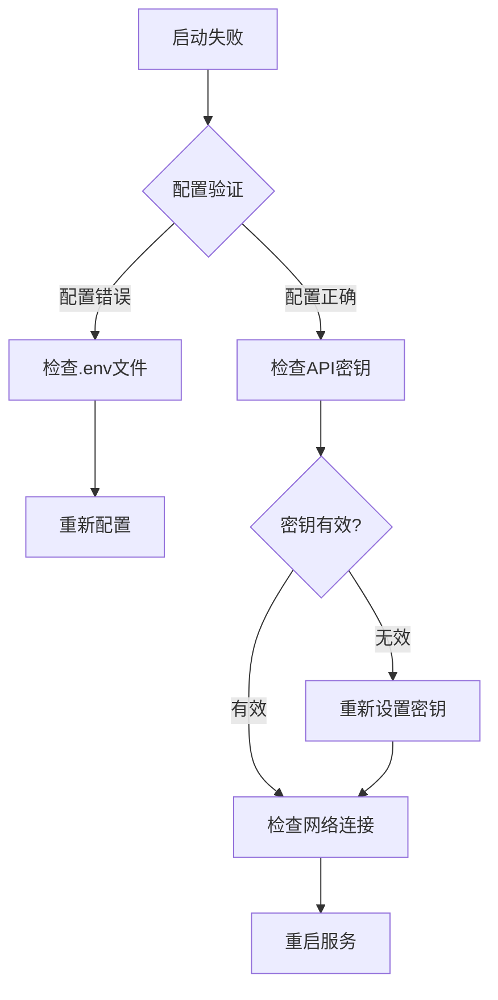

#### 搜索失败

系统提供了完善的错误处理机制：

- **重试机制**：自动重试失败的API调用
- **降级策略**：在API不可用时使用本地处理
- **错误日志**：详细的错误信息记录

#### 性能问题

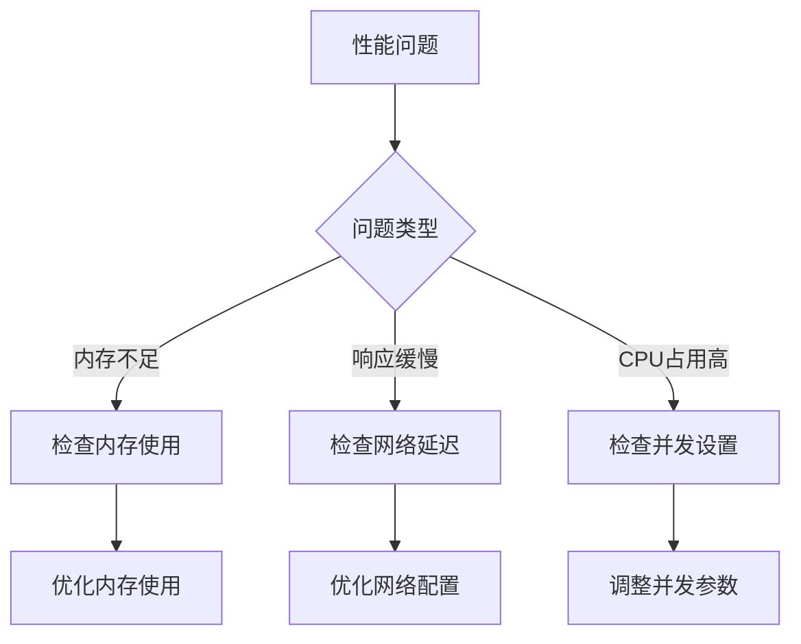

**章节来源**
- [agent.py](file://QueryEngine/agent.py#L176-L180)
- [search.py](file://QueryEngine/tools/search.py#L95-L124)

## 结论

Query Engine的核心代理设计架构展现了现代AI应用系统的最佳实践。通过模块化设计、状态驱动的处理流程和强大的容错机制，系统实现了高效、可靠的深度搜索功能。

### 设计优势

1. **模块化架构**：清晰的职责分离和接口定义
2. **状态管理**：完整的生命周期管理和持久化支持
3. **容错机制**：多层次的错误处理和回退策略
4. **可扩展性**：灵活的配置管理和插件化设计
5. **性能优化**：高效的并发处理和资源管理

### 技术创新

- **智能搜索优化**：通过关键词优化中间件提升搜索质量
- **反思机制**：多轮反思确保搜索结果的全面性
- **状态协调**：统一的状态管理简化复杂流程
- **配置驱动**：灵活的配置管理适应不同需求

该架构为构建复杂的AI搜索系统提供了优秀的参考模型，其设计理念和实现方式值得在类似项目中借鉴和应用。