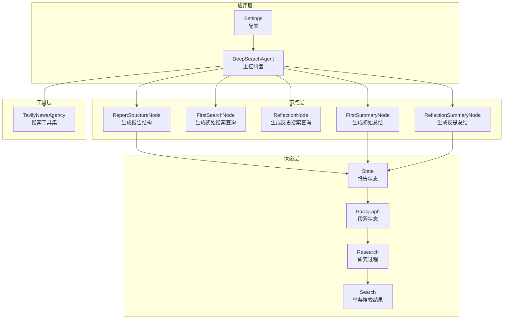
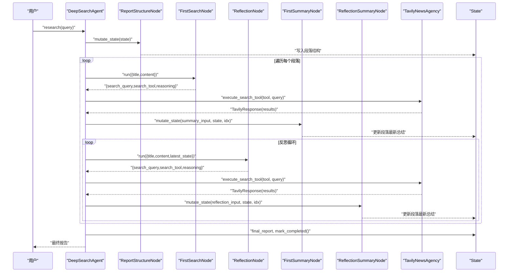
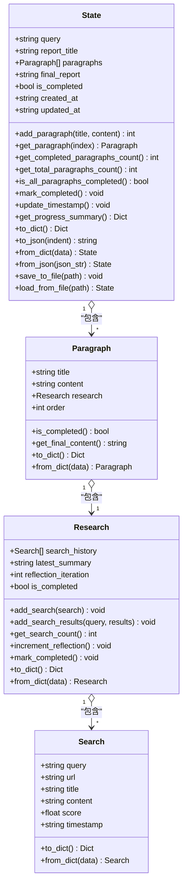
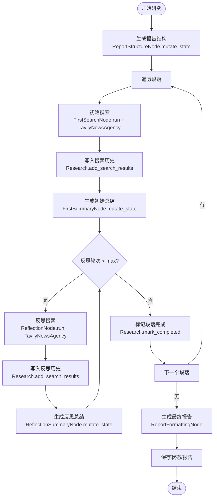
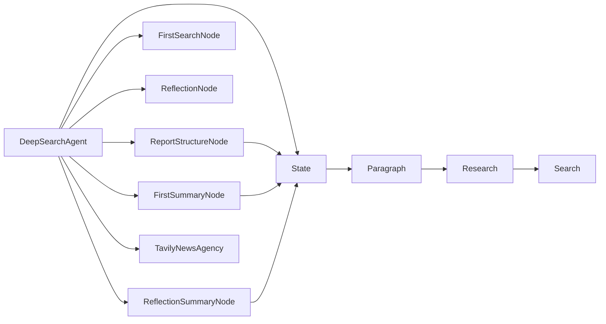

# 状态协调与搜索流程

<cite>
**本文引用的文件**
- [QueryEngine/state/state.py](file://QueryEngine/state/state.py)
- [QueryEngine/agent.py](file://QueryEngine/agent.py)
- [QueryEngine/utils/config.py](file://QueryEngine/utils/config.py)
- [QueryEngine/nodes/base_node.py](file://QueryEngine/nodes/base_node.py)
- [QueryEngine/nodes/search_node.py](file://QueryEngine/nodes/search_node.py)
- [QueryEngine/nodes/report_structure_node.py](file://QueryEngine/nodes/report_structure_node.py)
- [QueryEngine/nodes/summary_node.py](file://QueryEngine/nodes/summary_node.py)
- [QueryEngine/tools/search.py](file://QueryEngine/tools/search.py)
</cite>

## 目录
1. [简介](#简介)
2. [项目结构](#项目结构)
3. [核心组件](#核心组件)
4. [架构总览](#架构总览)
5. [详细组件分析](#详细组件分析)
6. [依赖关系分析](#依赖关系分析)
7. [性能考量](#性能考量)
8. [故障排查指南](#故障排查指南)
9. [结论](#结论)
10. [附录](#附录)

## 简介
本文件聚焦 Query Engine 的状态协调与搜索流程，系统性阐述状态管理的设计架构与实现细节，覆盖以下关键点：
- 状态数据结构：搜索状态、结果状态与流程状态的定义与职责边界
- 状态在搜索流程中的传递机制：从搜索请求状态、中间结果状态到最终结果状态的转换
- 状态持久化、并发控制与错误恢复策略
- 状态调试与流程优化建议
- 重点类：State 类的状态管理机制、Paragraph 类的段落状态跟踪、Research 类的研究过程记录

## 项目结构
Query Engine 的状态管理位于 QueryEngine/state/state.py，配合节点层（搜索、结构生成、总结）与工具层（Tavily 搜索）共同构成完整的搜索与报告生成流水线。

图表来源
- [QueryEngine/state/state.py](file://QueryEngine/state/state.py#L14-L259)
- [QueryEngine/agent.py](file://QueryEngine/agent.py#L26-L474)
- [QueryEngine/nodes/report_structure_node.py](file://QueryEngine/nodes/report_structure_node.py#L22-L205)
- [QueryEngine/nodes/search_node.py](file://QueryEngine/nodes/search_node.py#L21-L287)
- [QueryEngine/nodes/summary_node.py](file://QueryEngine/nodes/summary_node.py#L34-L369)
- [QueryEngine/tools/search.py](file://QueryEngine/tools/search.py#L77-L191)

章节来源
- [QueryEngine/state/state.py](file://QueryEngine/state/state.py#L1-L259)
- [QueryEngine/agent.py](file://QueryEngine/agent.py#L1-L474)
- [QueryEngine/utils/config.py](file://QueryEngine/utils/config.py#L1-L80)

## 核心组件
- State：顶层状态容器，维护查询、报告标题、段落数组、最终报告、完成标志与时间戳，并提供进度统计与序列化能力
- Paragraph：段落级状态，包含标题、预期内容、研究进度与顺序号，提供完成判定与最终内容获取
- Research：段落研究过程状态，维护搜索历史、最新总结、反思迭代次数与完成标志，提供批量添加搜索结果、计数与完成标记
- Search：单条搜索结果状态，包含查询、URL、标题、内容、评分与时间戳，提供字典与JSON序列化

章节来源
- [QueryEngine/state/state.py](file://QueryEngine/state/state.py#L12-L259)

## 架构总览
Query Engine 的状态驱动搜索流程由 DeepSearchAgent 主控，通过节点链路生成报告结构、执行搜索、生成总结，并在每一步更新 State。TavilyNewsAgency 提供多工具搜索能力，统一返回结构化结果，供节点层解析与状态写入。

图表来源
- [QueryEngine/agent.py](file://QueryEngine/agent.py#L141-L424)
- [QueryEngine/nodes/report_structure_node.py](file://QueryEngine/nodes/report_structure_node.py#L168-L205)
- [QueryEngine/nodes/search_node.py](file://QueryEngine/nodes/search_node.py#L45-L152)
- [QueryEngine/nodes/summary_node.py](file://QueryEngine/nodes/summary_node.py#L170-L200)
- [QueryEngine/tools/search.py](file://QueryEngine/tools/search.py#L127-L191)

## 详细组件分析

### State 类：顶层状态管理
- 职责
  - 维护查询语句、报告标题、段落数组、最终报告与完成标志
  - 提供进度统计（完成段落数、总数、百分比）、时间戳更新与序列化/反序列化
  - 提供段落增删查与完成判定辅助方法
- 关键方法
  - add_paragraph/title/content/order 访问器与构造
  - get_progress_summary/ is_all_paragraphs_completed/is_completed
  - to_dict/to_json/from_dict/from_json/save_to_file/load_from_file
- 并发与持久化
  - 序列化基于 dataclass 字典转换与 JSON 文本，适合文件持久化
  - 未内置锁或事务，需在外部调用侧保证并发安全（例如单次研究期间避免并发写）

图表来源
- [QueryEngine/state/state.py](file://QueryEngine/state/state.py#L142-L259)

章节来源
- [QueryEngine/state/state.py](file://QueryEngine/state/state.py#L142-L259)

### Paragraph 类：段落状态跟踪
- 职责
  - 表达报告中单个段落的标题、预期内容与研究进度
  - 提供完成判定（研究完成且存在最新总结）与最终内容获取（优先最新总结）
- 关键方法
  - is_completed/get_final_content/to_dict/from_dict
- 与 Research 的协作
  - 通过 research.search_history 记录每次搜索结果
  - 通过 research.latest_summary 保存阶段性总结

章节来源
- [QueryEngine/state/state.py](file://QueryEngine/state/state.py#L103-L140)

### Research 类：研究过程记录
- 职责
  - 维护搜索历史（Search 列表）、最新总结、反思迭代次数与完成标志
  - 支持批量添加搜索结果、计数与完成标记
- 关键方法
  - add_search/add_search_results/get_search_count/increment_reflection/mark_completed/to_dict/from_dict
- 与 Search 的协作
  - 以 Search 为最小单元记录每次搜索的查询、URL、标题、内容与评分

章节来源
- [QueryEngine/state/state.py](file://QueryEngine/state/state.py#L46-L101)

### Search 类：单条搜索结果状态
- 职责
  - 记录单条搜索结果的查询、URL、标题、内容、评分与时间戳
  - 提供字典与 JSON 序列化/反序列化
- 与 Research 的协作
  - 作为 research.search_history 的元素被管理

章节来源
- [QueryEngine/state/state.py](file://QueryEngine/state/state.py#L12-L44)

### 节点层与状态传递

#### 报告结构生成节点 ReportStructureNode
- 职责
  - 基于用户查询生成报告结构（段落数组），并写入 State
- 状态传递
  - mutate_state 将生成的结构写入 State.paragraphs，并设置 query 与 report_title
- 错误恢复
  - JSON 解析失败时回退到默认结构

章节来源
- [QueryEngine/nodes/report_structure_node.py](file://QueryEngine/nodes/report_structure_node.py#L168-L205)

#### 搜索查询生成节点 FirstSearchNode 与 ReflectionNode
- 职责
  - 生成初始搜索查询与反思搜索查询，返回 search_query、search_tool 与 reasoning
- 输出处理
  - 采用多层容错：清理标签、移除推理、提取 JSON、修复不完整 JSON，最终回退到默认查询
- 与 Agent 的协作
  - Agent 根据返回的 search_tool 与 search_query 调用 TavilyNewsAgency 执行搜索

章节来源
- [QueryEngine/nodes/search_node.py](file://QueryEngine/nodes/search_node.py#L45-L152)
- [QueryEngine/nodes/search_node.py](file://QueryEngine/nodes/search_node.py#L180-L287)

#### 总结生成节点 FirstSummaryNode 与 ReflectionSummaryNode
- 职责
  - 根据搜索结果生成初始总结与反思总结，并更新 State.paragraphs[idx].research.latest_summary
- 输出处理
  - 同样采用清理、提取、修复与回退策略，最终返回纯文本或 JSON 中的段落内容字段
- 与 State 的协作
  - mutate_state 直接写入段落的最新总结并更新时间戳

章节来源
- [QueryEngine/nodes/summary_node.py](file://QueryEngine/nodes/summary_node.py#L170-L200)
- [QueryEngine/nodes/summary_node.py](file://QueryEngine/nodes/summary_node.py#L338-L369)

#### 搜索工具层 TavilyNewsAgency
- 职责
  - 提供多种搜索工具：基础新闻搜索、深度分析、最近24小时、最近一周、图片搜索、按日期范围搜索
- 结果结构
  - SearchResult 包含标题、URL、内容、评分、原始内容与发布时间
- 重试机制
  - 内部使用装饰器进行优雅重试，提升稳定性

章节来源
- [QueryEngine/tools/search.py](file://QueryEngine/tools/search.py#L77-L191)

### 搜索流程状态转换图

图表来源
- [QueryEngine/agent.py](file://QueryEngine/agent.py#L197-L424)
- [QueryEngine/nodes/search_node.py](file://QueryEngine/nodes/search_node.py#L45-L152)
- [QueryEngine/nodes/summary_node.py](file://QueryEngine/nodes/summary_node.py#L170-L200)
- [QueryEngine/tools/search.py](file://QueryEngine/tools/search.py#L127-L191)

## 依赖关系分析
- 耦合与内聚
  - State 与 Paragraph/Research/Search 形成强内聚的数据结构族，职责清晰
  - 节点层通过 StateMutationNode 接口与 State 解耦，便于替换与扩展
- 外部依赖
  - LLM 客户端（通过 LLMClient 接口抽象）
  - Tavily 搜索服务（TavilyNewsAgency）
  - 配置 Settings（pydantic-settings）
- 循环依赖
  - 未见循环导入；节点层仅依赖 State 与 LLMClient 抽象

图表来源
- [QueryEngine/agent.py](file://QueryEngine/agent.py#L26-L74)
- [QueryEngine/state/state.py](file://QueryEngine/state/state.py#L142-L259)
- [QueryEngine/nodes/base_node.py](file://QueryEngine/nodes/base_node.py#L78-L95)

章节来源
- [QueryEngine/nodes/base_node.py](file://QueryEngine/nodes/base_node.py#L1-L95)
- [QueryEngine/utils/config.py](file://QueryEngine/utils/config.py#L22-L56)

## 性能考量
- 搜索结果上限与提示长度
  - 配置项 SEARCH_CONTENT_MAX_LENGTH 控制提示中拼接的搜索内容长度，避免 LLM 上下文溢出
  - 搜索结果取前 N（代码中对不同工具限制为不同上限）以平衡质量与性能
- 反思轮次
  - MAX_REFLECTIONS 控制反思循环次数，直接影响计算成本
- 序列化与 IO
  - 状态 JSON 序列化与文件读写在 SAVE_INTERMEDIATE_STATES 开启时进行，建议在高并发场景下避免频繁落盘
- LLM 调用
  - 节点层采用流式拼接与健壮的 JSON 解析/修复策略，减少因输出不稳定导致的重试开销

章节来源
- [QueryEngine/utils/config.py](file://QueryEngine/utils/config.py#L37-L46)
- [QueryEngine/agent.py](file://QueryEngine/agent.py#L261-L277)
- [QueryEngine/agent.py](file://QueryEngine/agent.py#L352-L368)

## 故障排查指南
- JSON 解析失败
  - 现象：节点输出解析异常，返回默认查询或默认结构
  - 处理：检查 LLM 输出是否包含 JSON 标签、推理内容与结构完整性；节点层已内置清理、提取与修复流程
- 日期参数校验失败
  - 现象：search_news_by_date 工具被降级为基础搜索
  - 处理：确认传入 start_date/end_date 符合 YYYY-MM-DD 格式
- 搜索工具不可用
  - 现象：Tavily API Key 未配置或网络异常
  - 处理：检查环境变量 TAVILY_API_KEY；工具层具备重试装饰器，必要时增大超时
- 状态持久化问题
  - 现象：保存/加载状态失败
  - 处理：确认文件路径可写；检查 JSON 格式与编码（UTF-8）

章节来源
- [QueryEngine/nodes/search_node.py](file://QueryEngine/nodes/search_node.py#L91-L140)
- [QueryEngine/nodes/search_node.py](file://QueryEngine/nodes/search_node.py#L226-L275)
- [QueryEngine/agent.py](file://QueryEngine/agent.py#L248-L260)
- [QueryEngine/agent.py](file://QueryEngine/agent.py#L453-L461)
- [QueryEngine/tools/search.py](file://QueryEngine/tools/search.py#L95-L124)

## 结论
Query Engine 的状态协调与搜索流程以 State 为核心，通过节点层的职责划分与工具层的稳定接口，实现了从报告结构生成、搜索查询生成、搜索执行、总结生成到最终报告输出的完整闭环。状态在各阶段被显式更新与持久化，配合健壮的输出解析与错误恢复策略，保障了流程的可靠性与可观测性。建议在高并发场景下结合外部锁或队列机制控制状态写入，并根据业务需求调整反思轮次与内容长度阈值以平衡质量与性能。

## 附录
- 配置项说明（节选）
  - QUERY_ENGINE_API_KEY/QUERY_ENGINE_BASE_URL/QUERY_ENGINE_MODEL_NAME：LLM 相关
  - TAVILY_API_KEY：Tavily 搜索 API Key
  - SEARCH_TIMEOUT/SEARCH_CONTENT_MAX_LENGTH/MAX_REFLECTIONS/MAX_PARAGRAPHS/MAX_SEARCH_RESULTS：搜索与流程参数
  - OUTPUT_DIR/SAVE_INTERMEDIATE_STATES：输出目录与中间状态保存开关

章节来源
- [QueryEngine/utils/config.py](file://QueryEngine/utils/config.py#L22-L56)