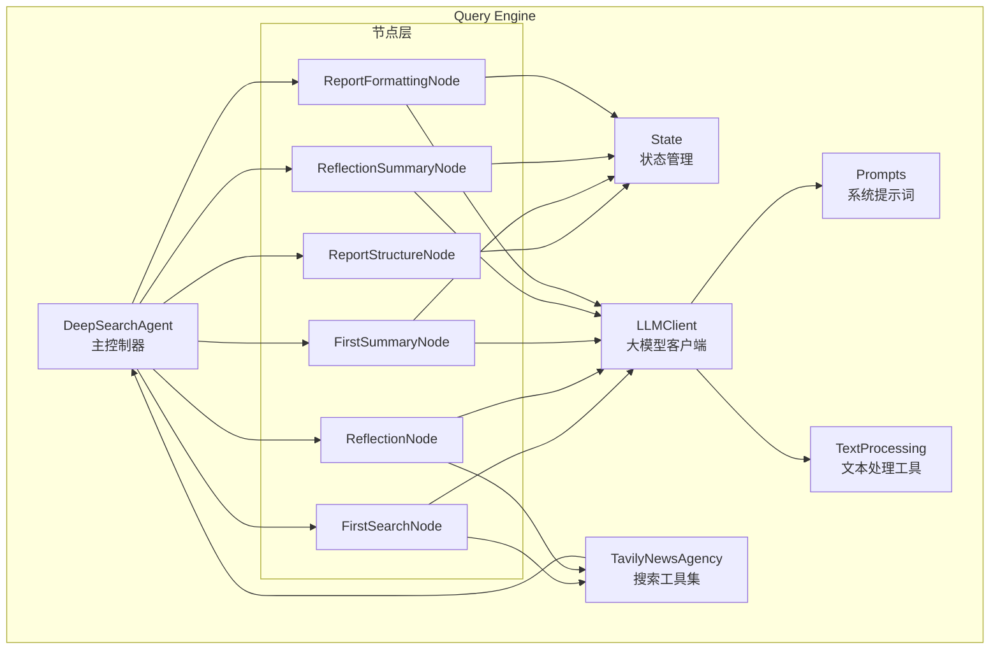
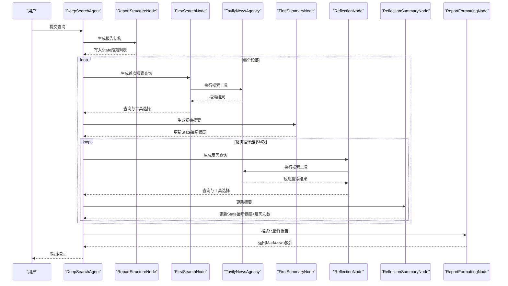
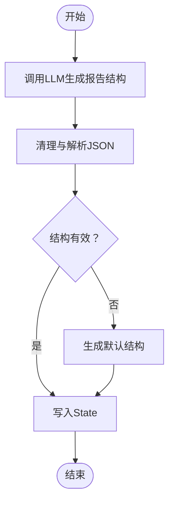
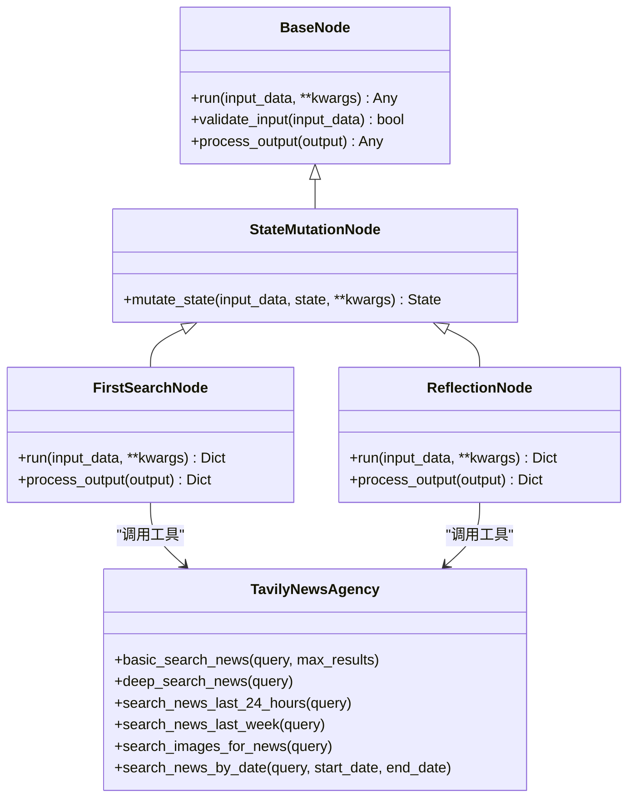
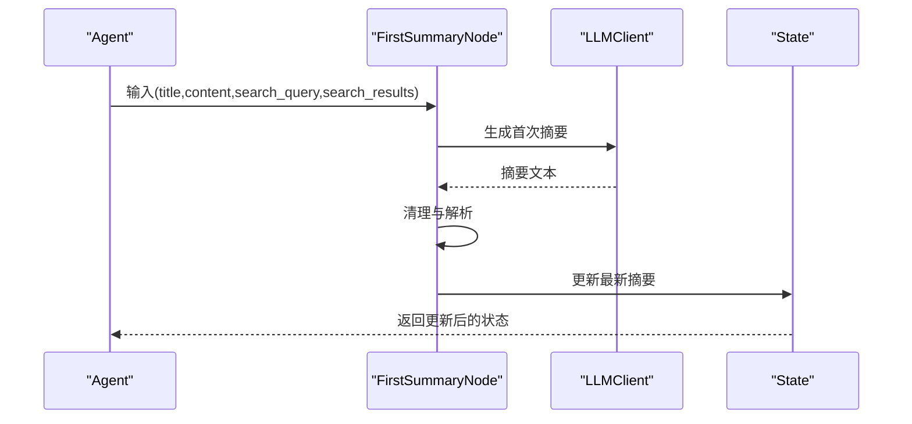
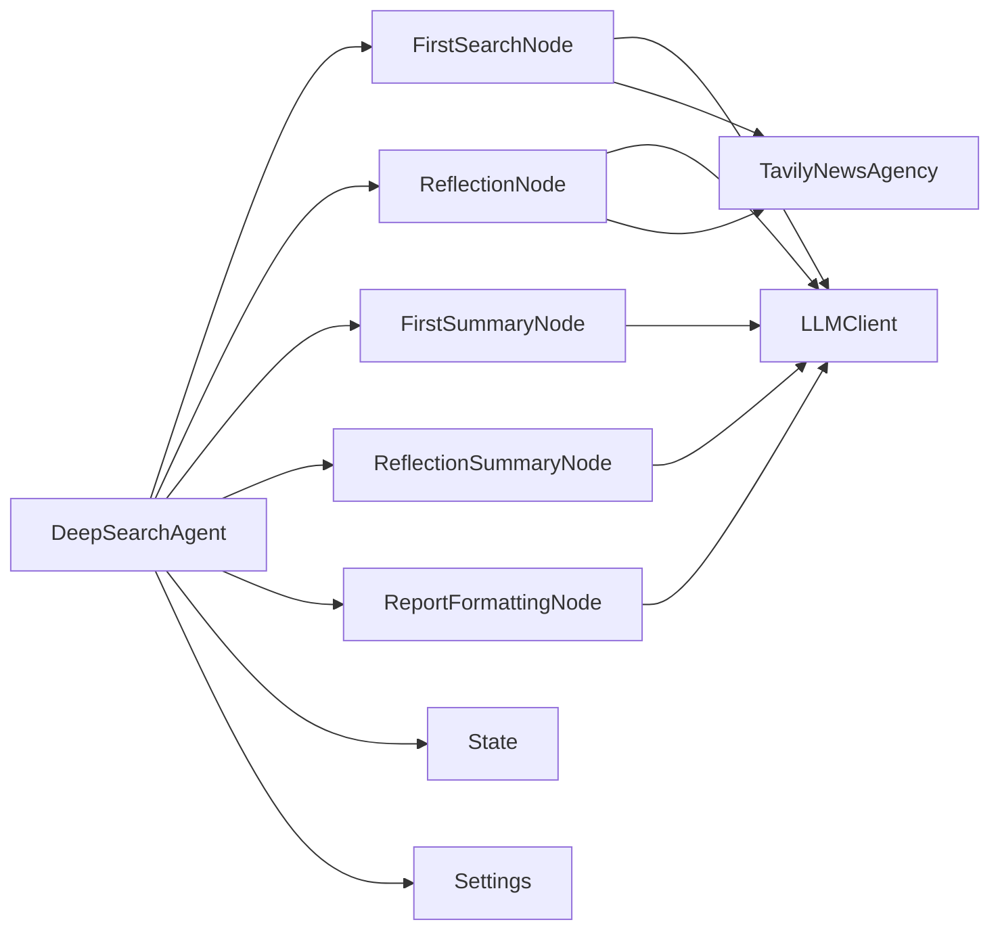

# 节点处理与搜索算法

<cite>
**本文档引用的文件**
- [QueryEngine/nodes/base_node.py](file://QueryEngine/nodes/base_node.py)
- [QueryEngine/nodes/search_node.py](file://QueryEngine/nodes/search_node.py)
- [QueryEngine/nodes/summary_node.py](file://QueryEngine/nodes/summary_node.py)
- [QueryEngine/nodes/report_structure_node.py](file://QueryEngine/nodes/report_structure_node.py)
- [QueryEngine/nodes/formatting_node.py](file://QueryEngine/nodes/formatting_node.py)
- [QueryEngine/state/state.py](file://QueryEngine/state/state.py)
- [QueryEngine/utils/text_processing.py](file://QueryEngine/utils/text_processing.py)
- [QueryEngine/prompts/prompts.py](file://QueryEngine/prompts/prompts.py)
- [QueryEngine/tools/search.py](file://QueryEngine/tools/search.py)
- [QueryEngine/agent.py](file://QueryEngine/agent.py)
- [QueryEngine/llms/base.py](file://QueryEngine/llms/base.py)
- [QueryEngine/utils/config.py](file://QueryEngine/utils/config.py)
- [SingleEngineApp/query_engine_streamlit_app.py](file://SingleEngineApp/query_engine_streamlit_app.py)
</cite>

## 目录
1. [简介](#简介)
2. [项目结构](#项目结构)
3. [核心组件](#核心组件)
4. [架构总览](#架构总览)
5. [详细组件分析](#详细组件分析)
6. [依赖关系分析](#依赖关系分析)
7. [性能考量](#性能考量)
8. [故障排查指南](#故障排查指南)
9. [结论](#结论)
10. [附录](#附录)

## 简介
本文件面向Query Engine的节点处理与搜索算法，系统阐述节点化处理架构的设计原理与实现细节，重点覆盖以下内容：
- BaseNode基类的抽象设计与扩展点
- 搜索算法节点（FirstSearchNode、ReflectionNode）的实现与多源信息检索机制
- 摘要节点（FirstSummaryNode、ReflectionSummaryNode）的信息整合算法
- 报告结构节点（ReportFormattingNode）的查询优化逻辑
- 关键词匹配、相关性评分与结果排序的实现思路
- 算法优化与自定义搜索策略的开发指导
- 典型节点（FirstSearchNode、ReflectionNode、FirstSummaryNode、ReflectionSummaryNode、ReportFormattingNode）的职责、输入输出与处理流程

## 项目结构
Query Engine采用“节点化处理 + 状态驱动”的架构，围绕State状态对象贯穿各阶段处理，通过LLMClient统一调用大模型，借助Tavily搜索工具集实现多源信息检索。

**图表来源**
- [QueryEngine/agent.py](file://QueryEngine/agent.py#L26-L180)
- [QueryEngine/nodes/report_structure_node.py](file://QueryEngine/nodes/report_structure_node.py#L22-L65)
- [QueryEngine/nodes/search_node.py](file://QueryEngine/nodes/search_node.py#L21-L80)
- [QueryEngine/nodes/summary_node.py](file://QueryEngine/nodes/summary_node.py#L34-L117)
- [QueryEngine/nodes/formatting_node.py](file://QueryEngine/nodes/formatting_node.py#L18-L85)
- [QueryEngine/state/state.py](file://QueryEngine/state/state.py#L142-L259)
- [QueryEngine/prompts/prompts.py](file://QueryEngine/prompts/prompts.py#L126-L446)
- [QueryEngine/utils/text_processing.py](file://QueryEngine/utils/text_processing.py#L12-L134)
- [QueryEngine/llms/base.py](file://QueryEngine/llms/base.py#L30-L167)
- [QueryEngine/tools/search.py](file://QueryEngine/tools/search.py#L77-L251)

**章节来源**
- [QueryEngine/agent.py](file://QueryEngine/agent.py#L26-L180)
- [QueryEngine/nodes/base_node.py](file://QueryEngine/nodes/base_node.py#L13-L95)
- [QueryEngine/state/state.py](file://QueryEngine/state/state.py#L142-L259)

## 核心组件
- BaseNode与StateMutationNode：定义节点抽象接口、输入校验、输出处理与状态变更接口，统一节点行为规范。
- ReportStructureNode：根据用户查询生成报告结构（段落数量、标题、内容概要），并写入State。
- FirstSearchNode/ReflectionNode：基于LLM生成搜索查询与工具选择，支持多工具（基础搜索、深度分析、最近24小时/一周、图片、按日期范围）。
- FirstSummaryNode/ReflectionSummaryNode：将搜索结果与上下文整合，生成或更新段落摘要，维护研究历史与反思次数。
- ReportFormattingNode：将最终段落摘要格式化为Markdown报告，提供手动回退方案。
- State：数据类封装搜索历史、最新摘要、反思次数、完成状态等，支持序列化与进度统计。
- TextProcessing：提供JSON清理、推理文本剥离、不完整JSON修复、内容截断与格式化等工具。
- Prompts：定义各阶段系统提示词与JSON Schema，约束LLM输出结构。
- LLMClient：OpenAI兼容客户端，支持流式调用与重试。
- TavilyNewsAgency：封装Tavily搜索API，提供6种工具与重试机制。

**章节来源**
- [QueryEngine/nodes/base_node.py](file://QueryEngine/nodes/base_node.py#L13-L95)
- [QueryEngine/nodes/report_structure_node.py](file://QueryEngine/nodes/report_structure_node.py#L22-L167)
- [QueryEngine/nodes/search_node.py](file://QueryEngine/nodes/search_node.py#L21-L287)
- [QueryEngine/nodes/summary_node.py](file://QueryEngine/nodes/summary_node.py#L34-L369)
- [QueryEngine/nodes/formatting_node.py](file://QueryEngine/nodes/formatting_node.py#L18-L169)
- [QueryEngine/state/state.py](file://QueryEngine/state/state.py#L12-L259)
- [QueryEngine/utils/text_processing.py](file://QueryEngine/utils/text_processing.py#L12-L309)
- [QueryEngine/prompts/prompts.py](file://QueryEngine/prompts/prompts.py#L10-L446)
- [QueryEngine/llms/base.py](file://QueryEngine/llms/base.py#L30-L167)
- [QueryEngine/tools/search.py](file://QueryEngine/tools/search.py#L77-L251)

## 架构总览
Query Engine遵循“结构生成—搜索—摘要—反思—格式化”的流水线式处理，每个阶段均通过节点实现职责分离与可扩展性。

**图表来源**
- [QueryEngine/agent.py](file://QueryEngine/agent.py#L141-L424)
- [QueryEngine/nodes/search_node.py](file://QueryEngine/nodes/search_node.py#L45-L151)
- [QueryEngine/nodes/summary_node.py](file://QueryEngine/nodes/summary_node.py#L60-L200)
- [QueryEngine/nodes/formatting_node.py](file://QueryEngine/nodes/formatting_node.py#L48-L115)
- [QueryEngine/tools/search.py](file://QueryEngine/tools/search.py#L127-L190)

## 详细组件分析

### BaseNode与状态变更节点
- BaseNode：定义run抽象方法、输入校验与输出处理钩子，提供日志记录与LLMClient注入。
- StateMutationNode：扩展mutate_state抽象方法，用于节点直接修改State，保证状态一致性。
- 设计要点：统一节点生命周期、错误处理与可观测性；通过validate_input与process_output解耦输入输出格式。

**章节来源**
- [QueryEngine/nodes/base_node.py](file://QueryEngine/nodes/base_node.py#L13-L95)

### 报告结构节点（ReportStructureNode）
- 职责：根据用户查询生成报告段落结构（标题与内容概要），写入State。
- 输入：初始化时的查询字符串；运行时可接受任意输入但不使用。
- 输出：段落结构列表（title/content），并更新State.query、State.report_title与段落集合。
- 处理流程：调用LLM生成结构→清理与解析JSON→默认结构回退→写入State。
- 优化建议：限制段落数量、校验标题/内容非空、对异常输出进行严格验证与回退。

**图表来源**
- [QueryEngine/nodes/report_structure_node.py](file://QueryEngine/nodes/report_structure_node.py#L40-L167)
- [QueryEngine/prompts/prompts.py](file://QueryEngine/prompts/prompts.py#L126-L140)
- [QueryEngine/utils/text_processing.py](file://QueryEngine/utils/text_processing.py#L12-L134)

**章节来源**
- [QueryEngine/nodes/report_structure_node.py](file://QueryEngine/nodes/report_structure_node.py#L22-L205)
- [QueryEngine/prompts/prompts.py](file://QueryEngine/prompts/prompts.py#L10-L140)
- [QueryEngine/utils/text_processing.py](file://QueryEngine/utils/text_processing.py#L12-L134)

### 搜索节点（FirstSearchNode、ReflectionNode）
- FirstSearchNode：为段落生成首次搜索查询与工具选择，支持多工具（基础、深度、最近24小时/一周、图片、按日期范围）。
- ReflectionNode：基于当前段落最新状态生成反思查询，补充缺失信息。
- 输入校验：严格校验title/content（首次）或title/content/paragraph_latest_state（反思）。
- 输出处理：剥离推理文本、清理JSON标签、尝试修复不完整JSON、提取search_query与reasoning。
- 多源检索机制：通过TavilyNewsAgency的6种工具实现多维度信息采集；按需传入时间范围参数。
- 关键词匹配与相关性：搜索结果自带score字段；Agent在处理阶段截断内容并限制最大结果数，保障上下文长度可控。

**图表来源**
- [QueryEngine/nodes/search_node.py](file://QueryEngine/nodes/search_node.py#L21-L287)
- [QueryEngine/tools/search.py](file://QueryEngine/tools/search.py#L77-L190)
- [QueryEngine/prompts/prompts.py](file://QueryEngine/prompts/prompts.py#L142-L304)
- [QueryEngine/utils/text_processing.py](file://QueryEngine/utils/text_processing.py#L48-L134)

**章节来源**
- [QueryEngine/nodes/search_node.py](file://QueryEngine/nodes/search_node.py#L21-L287)
- [QueryEngine/prompts/prompts.py](file://QueryEngine/prompts/prompts.py#L142-L304)
- [QueryEngine/utils/text_processing.py](file://QueryEngine/utils/text_processing.py#L48-L134)
- [QueryEngine/tools/search.py](file://QueryEngine/tools/search.py#L77-L190)

### 摘要节点（FirstSummaryNode、ReflectionSummaryNode）
- FirstSummaryNode：结合搜索查询与搜索结果生成段落首次摘要，支持读取HOST发言增强上下文。
- ReflectionSummaryNode：基于反思搜索结果与当前摘要更新段落内容，递增反思次数。
- 输入校验：严格校验title/content/search_query/search_results/paragraph_latest_state。
- 输出处理：清理JSON、修复不完整JSON、提取paragraph_latest_state或updated_paragraph_latest_state。
- 状态变更：通过mutate_state更新State.paragraphs[i].research.latest_summary与时间戳。

**图表来源**
- [QueryEngine/nodes/summary_node.py](file://QueryEngine/nodes/summary_node.py#L60-L200)
- [QueryEngine/state/state.py](file://QueryEngine/state/state.py#L46-L100)

**章节来源**
- [QueryEngine/nodes/summary_node.py](file://QueryEngine/nodes/summary_node.py#L34-L369)
- [QueryEngine/state/state.py](file://QueryEngine/state/state.py#L46-L100)

### 报告格式化节点（ReportFormattingNode）
- 职责：将最终段落摘要格式化为Markdown报告，提供手动回退方案。
- 输入校验：校验输入为包含title与paragraph_latest_state的列表。
- 输出处理：剥离推理与Markdown标签，确保报告有基本结构与标题。
- 手动格式化：当LLM失败时，按固定模板与分隔线生成报告骨架。

**章节来源**
- [QueryEngine/nodes/formatting_node.py](file://QueryEngine/nodes/formatting_node.py#L18-L169)

### 关键词匹配、相关性评分与结果排序
- 关键词匹配：由FirstSearchNode/ReflectionNode基于LLM生成查询，结合Tavily工具的语义搜索实现。
- 相关性评分：Tavily返回结果包含score字段；Agent在处理阶段截断内容并限制最大结果数，避免上下文过长。
- 结果排序：LLM输出通过JSON Schema约束，确保结构化与可解析性；Agent在最终报告阶段可进一步组织结构（如表格、时间线）提升可读性。

**章节来源**
- [QueryEngine/tools/search.py](file://QueryEngine/tools/search.py#L127-L190)
- [QueryEngine/utils/text_processing.py](file://QueryEngine/utils/text_processing.py#L264-L309)
- [QueryEngine/prompts/prompts.py](file://QueryEngine/prompts/prompts.py#L330-L446)

### 算法优化与自定义搜索策略
- 优化策略
  - 控制上下文长度：通过truncate_content与SEARCH_CONTENT_MAX_LENGTH限制单条结果长度。
  - 限制结果数量：MAX_SEARCH_RESULTS与前K条结果策略，平衡质量与成本。
  - 重试与降级：LLM与搜索工具均具备重试机制；JSON解析失败时采用修复与默认回退。
  - 反思轮数：MAX_REFLECTIONS控制反思次数，避免过度迭代。
- 自定义搜索策略
  - 新增工具：在TavilyNewsAgency中扩展新工具，Agent侧映射工具名与参数。
  - 自定义提示词：在prompts中扩展对应SYSTEM_PROMPT与Schema，确保LLM输出结构化。
  - 自定义节点：继承BaseNode/StateMutationNode，实现run与mutate_state，接入Agent流程。

**章节来源**
- [QueryEngine/utils/config.py](file://QueryEngine/utils/config.py#L22-L56)
- [QueryEngine/agent.py](file://QueryEngine/agent.py#L100-L140)
- [QueryEngine/prompts/prompts.py](file://QueryEngine/prompts/prompts.py#L10-L123)

## 依赖关系分析
- 节点依赖：各节点依赖LLMClient与提示词，部分节点依赖Tavily工具集；摘要节点依赖State。
- 工具依赖：TavilyNewsAgency封装API调用与重试；TextProcessing提供JSON与文本处理工具。
- 配置依赖：Settings集中管理LLM、搜索与输出配置；Streamlit应用读取配置并驱动Agent。

**图表来源**
- [QueryEngine/agent.py](file://QueryEngine/agent.py#L67-L74)
- [QueryEngine/nodes/search_node.py](file://QueryEngine/nodes/search_node.py#L21-L287)
- [QueryEngine/nodes/summary_node.py](file://QueryEngine/nodes/summary_node.py#L34-L369)
- [QueryEngine/nodes/formatting_node.py](file://QueryEngine/nodes/formatting_node.py#L18-L169)
- [QueryEngine/state/state.py](file://QueryEngine/state/state.py#L142-L259)
- [QueryEngine/utils/config.py](file://QueryEngine/utils/config.py#L22-L56)

**章节来源**
- [QueryEngine/agent.py](file://QueryEngine/agent.py#L67-L74)
- [QueryEngine/utils/config.py](file://QueryEngine/utils/config.py#L22-L56)

## 性能考量
- 流式调用：LLMClient支持流式返回，避免长文本截断；最终以字节拼接方式安全解码。
- 上下文控制：通过truncate_content与最大结果数限制，降低提示词长度与Token消耗。
- 重试机制：搜索与LLM调用具备重试配置，提升稳定性与成功率。
- 并发与批处理：当前实现为串行流水线，可考虑在段落级别并行处理（需保证State一致性）。

**章节来源**
- [QueryEngine/llms/base.py](file://QueryEngine/llms/base.py#L86-L154)
- [QueryEngine/utils/text_processing.py](file://QueryEngine/utils/text_processing.py#L264-L286)
- [QueryEngine/tools/search.py](file://QueryEngine/tools/search.py#L95-L124)

## 故障排查指南
- LLM输出解析失败
  - 现象：JSON解析异常或不完整。
  - 处理：使用clean_json_tags、remove_reasoning_from_output、fix_incomplete_json与extract_clean_response；必要时回退默认查询/摘要。
- 搜索工具异常
  - 现象：API Key缺失、网络超时、参数错误。
  - 处理：检查TAVILY_API_KEY与日期格式；对search_news_by_date进行参数校验与回退。
- 状态更新失败
  - 现象：段落索引越界或状态对象异常。
  - 处理：在mutate_state中增加边界检查与异常捕获；记录详细日志。
- 报告格式化失败
  - 现象：LLM输出为空或格式异常。
  - 处理：启用format_report_manually回退方案，确保输出基本结构。

**章节来源**
- [QueryEngine/nodes/search_node.py](file://QueryEngine/nodes/search_node.py#L81-L151)
- [QueryEngine/nodes/summary_node.py](file://QueryEngine/nodes/summary_node.py#L118-L169)
- [QueryEngine/nodes/formatting_node.py](file://QueryEngine/nodes/formatting_node.py#L87-L115)
- [QueryEngine/agent.py](file://QueryEngine/agent.py#L100-L140)

## 结论
Query Engine通过节点化架构实现了从“查询—结构—搜索—摘要—反思—格式化”的完整闭环，结合多源搜索与结构化提示词，确保输出的准确性与可读性。BaseNode与StateMutationNode的抽象设计为扩展与定制提供了清晰边界；TextProcessing与LLMClient的工具化封装提升了鲁棒性与可维护性。建议在生产环境中进一步引入并行化与缓存策略，以提升吞吐与响应速度。

## 附录
- 使用示例（Streamlit应用）
  - 应用入口：SingleEngineApp/query_engine_streamlit_app.py
  - 功能：自动初始化Agent、生成报告结构、处理段落、反思循环、生成并保存报告
  - 配置：从Settings读取API Key与模型参数，支持自动查询与进度展示

**章节来源**
- [SingleEngineApp/query_engine_streamlit_app.py](file://SingleEngineApp/query_engine_streamlit_app.py#L124-L184)
- [QueryEngine/utils/config.py](file://QueryEngine/utils/config.py#L55-L80)