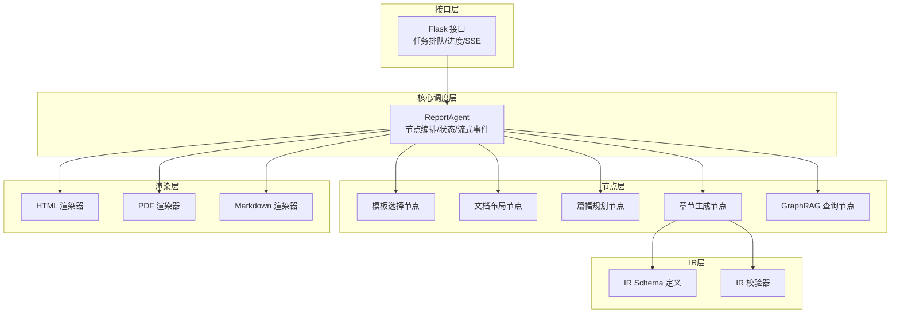
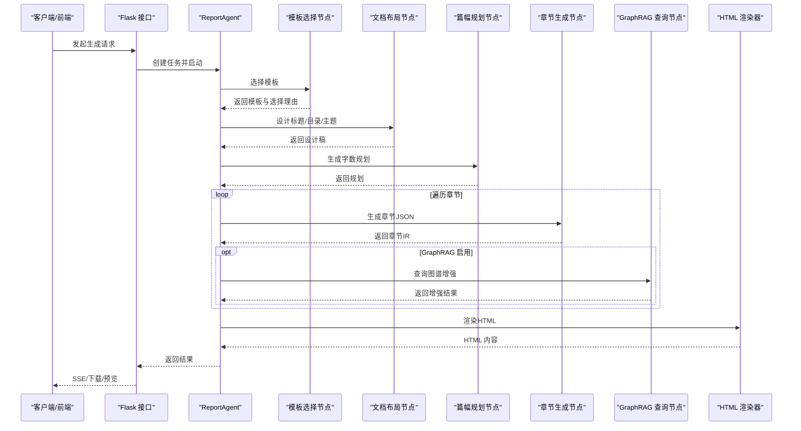
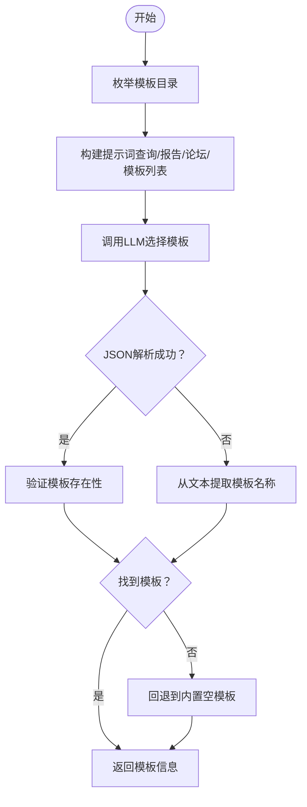
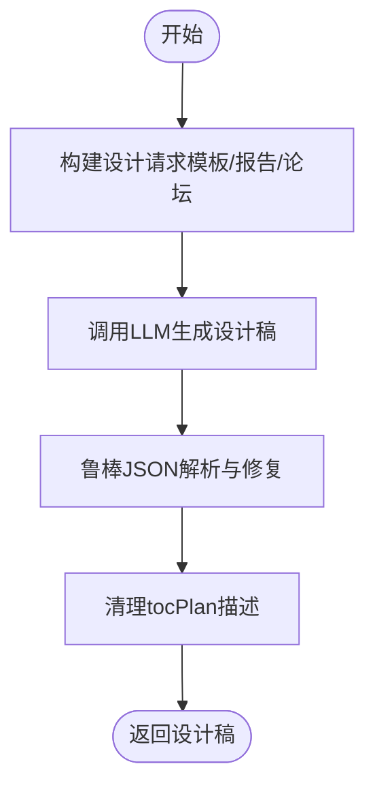
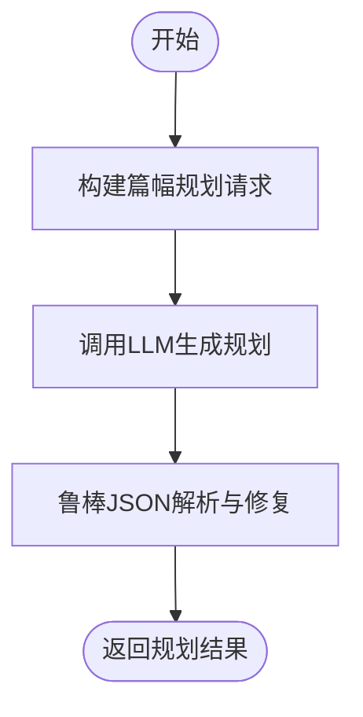
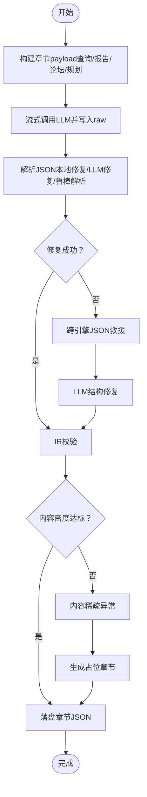
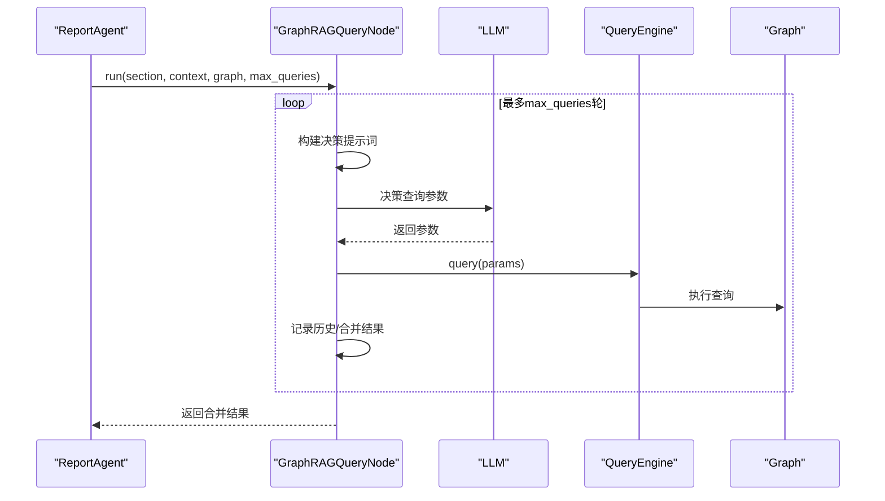
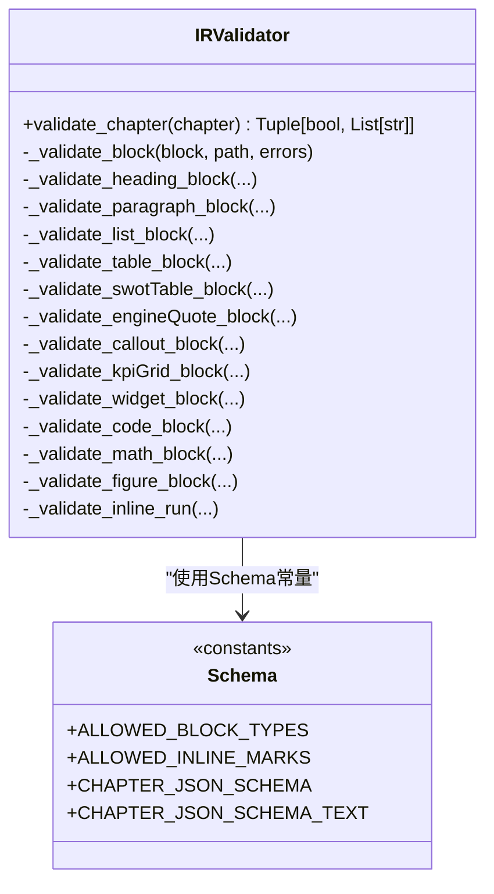
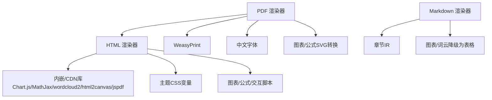
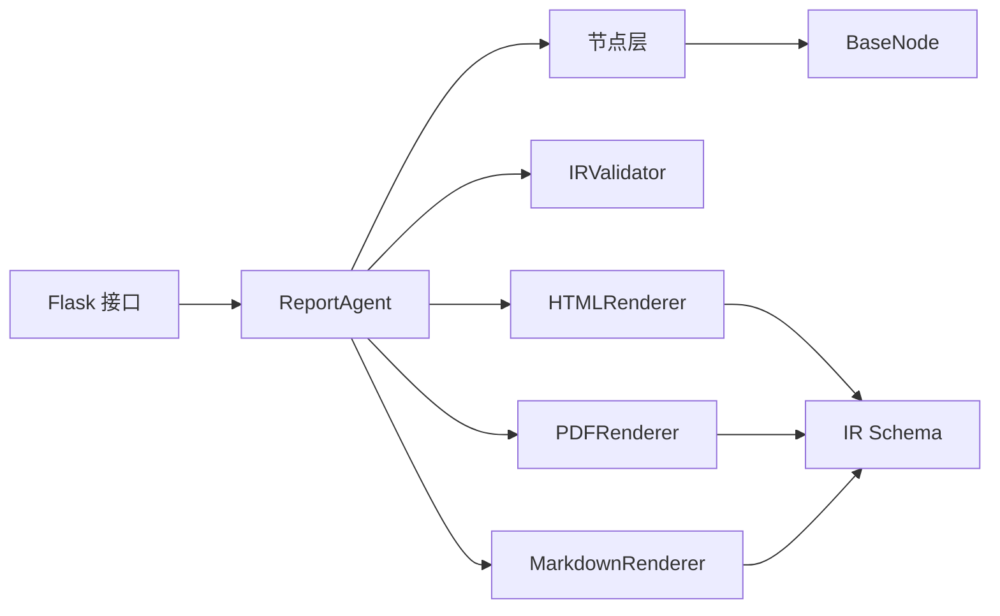

# 报告引擎（智能报告生成引擎）

<cite>
**本文档引用的文件**
- [ReportEngine/__init__.py](file://ReportEngine/__init__.py)
- [ReportEngine/agent.py](file://ReportEngine/agent.py)
- [ReportEngine/flask_interface.py](file://ReportEngine/flask_interface.py)
- [ReportEngine/state/state.py](file://ReportEngine/state/state.py)
- [ReportEngine/nodes/base_node.py](file://ReportEngine/nodes/base_node.py)
- [ReportEngine/nodes/chapter_generation_node.py](file://ReportEngine/nodes/chapter_generation_node.py)
- [ReportEngine/nodes/document_layout_node.py](file://ReportEngine/nodes/document_layout_node.py)
- [ReportEngine/nodes/template_selection_node.py](file://ReportEngine/nodes/template_selection_node.py)
- [ReportEngine/nodes/word_budget_node.py](file://ReportEngine/nodes/word_budget_node.py)
- [ReportEngine/nodes/graphrag_query_node.py](file://ReportEngine/nodes/graphrag_query_node.py)
- [ReportEngine/ir/schema.py](file://ReportEngine/ir/schema.py)
- [ReportEngine/ir/validator.py](file://ReportEngine/ir/validator.py)
- [ReportEngine/renderers/html_renderer.py](file://ReportEngine/renderers/html_renderer.py)
- [ReportEngine/renderers/pdf_renderer.py](file://ReportEngine/renderers/pdf_renderer.py)
- [ReportEngine/renderers/markdown_renderer.py](file://ReportEngine/renderers/markdown_renderer.py)
</cite>

## 目录
1. [简介](#简介)
2. [项目结构](#项目结构)
3. [核心组件](#核心组件)
4. [架构总览](#架构总览)
5. [详细组件分析](#详细组件分析)
6. [依赖关系分析](#依赖关系分析)
7. [性能考量](#性能考量)
8. [故障排查指南](#故障排查指南)
9. [结论](#结论)
10. [附录](#附录)

## 简介
报告引擎（Report Engine）是一个面向多源分析与论坛协同的智能报告生成系统，能够将 Query/Media/Insight 三个子引擎的分析结果与论坛日志融合，经由模板选择、布局设计、篇幅规划、章节生成与 IR 装订，最终输出结构化 HTML 报告，并支持 PDF 与 Markdown 多格式导出。其核心特色包括：
- 模板驱动的章节生成流水线，具备强大的结构校验与容错修复能力
- 基于 GraphRAG 的知识图谱增强，提升章节内容的深度与跨引擎洞察
- 多格式渲染器（HTML/PDF/Markdown），兼顾美观、可打印性与可编辑性
- 完整的状态管理与流式事件推送，便于前端实时交互与任务监控

## 项目结构
报告引擎采用模块化分层设计：
- 核心调度层：Agent 负责编排节点、状态管理与流式事件分发
- 节点层：模板选择、文档布局、篇幅规划、章节生成、GraphRAG 查询等推理节点
- IR 层：章节 IR 的 Schema 定义与校验器，确保结构一致性
- 渲染层：HTML/PDF/Markdown 渲染器，负责多格式输出
- 接口层：Flask 接口提供 HTTP/SSE 服务，支持任务排队、进度查询与日志转发

**图表来源**
- [ReportEngine/flask_interface.py](file://ReportEngine/flask_interface.py#L1-L1454)
- [ReportEngine/agent.py](file://ReportEngine/agent.py#L1-L1736)
- [ReportEngine/nodes/template_selection_node.py](file://ReportEngine/nodes/template_selection_node.py#L1-L287)
- [ReportEngine/nodes/document_layout_node.py](file://ReportEngine/nodes/document_layout_node.py#L1-L209)
- [ReportEngine/nodes/word_budget_node.py](file://ReportEngine/nodes/word_budget_node.py#L1-L127)
- [ReportEngine/nodes/chapter_generation_node.py](file://ReportEngine/nodes/chapter_generation_node.py#L1-L2062)
- [ReportEngine/nodes/graphrag_query_node.py](file://ReportEngine/nodes/graphrag_query_node.py#L1-L402)
- [ReportEngine/ir/schema.py](file://ReportEngine/ir/schema.py#L1-L546)
- [ReportEngine/ir/validator.py](file://ReportEngine/ir/validator.py#L1-L339)
- [ReportEngine/renderers/html_renderer.py](file://ReportEngine/renderers/html_renderer.py#L1-L6537)
- [ReportEngine/renderers/pdf_renderer.py](file://ReportEngine/renderers/pdf_renderer.py#L1-L1610)
- [ReportEngine/renderers/markdown_renderer.py](file://ReportEngine/renderers/markdown_renderer.py#L1-L995)

**章节来源**
- [ReportEngine/__init__.py](file://ReportEngine/__init__.py#L1-L14)
- [ReportEngine/agent.py](file://ReportEngine/agent.py#L1-L1736)
- [ReportEngine/flask_interface.py](file://ReportEngine/flask_interface.py#L1-L1454)

## 核心组件
- ReportAgent：总调度中心，串联模板选择、布局设计、篇幅规划、章节生成、IR 校验与渲染，负责错误兜底、流式事件分发与落盘清单
- 节点体系：模板选择、文档布局、篇幅规划、章节生成、GraphRAG 查询，均继承自统一的节点基类，具备输入校验、输出处理与日志记录能力
- IR 系统：定义章节 IR 的 JSON Schema 与校验规则，确保章节结构合法、可渲染
- 渲染器：HTML/PDF/Markdown 渲染器分别满足网页浏览、打印导出与可编辑文本需求，具备图表/公式/字体等增强能力

**章节来源**
- [ReportEngine/agent.py](file://ReportEngine/agent.py#L190-L800)
- [ReportEngine/nodes/base_node.py](file://ReportEngine/nodes/base_node.py#L1-L108)
- [ReportEngine/ir/schema.py](file://ReportEngine/ir/schema.py#L1-L546)
- [ReportEngine/ir/validator.py](file://ReportEngine/ir/validator.py#L1-L339)
- [ReportEngine/renderers/html_renderer.py](file://ReportEngine/renderers/html_renderer.py#L1-L6537)
- [ReportEngine/renderers/pdf_renderer.py](file://ReportEngine/renderers/pdf_renderer.py#L1-L1610)
- [ReportEngine/renderers/markdown_renderer.py](file://ReportEngine/renderers/markdown_renderer.py#L1-L995)

## 架构总览
报告引擎的生成流程如下：
1. 输入归一化：从三个子引擎与论坛日志读取最新报告，构建统一输入
2. 模板选择：根据查询、报告与论坛日志选择最优模板
3. 文档布局：生成标题、目录与主题设计
4. 篇幅规划：为各章节分配字数与重点
5. 章节生成：逐章调用 LLM，流式写入原始输出，解析 JSON，校验 IR，修复容错
6. GraphRAG 增强：可选启用，按章节目标与图谱历史进行多轮查询，增强上下文
7. IR 装订：将章节 IR 组装为整本文档 IR
8. 多格式渲染：HTML/PDF/Markdown 输出，支持图表、公式、字体与交互

**图表来源**
- [ReportEngine/agent.py](file://ReportEngine/agent.py#L424-L800)
- [ReportEngine/nodes/template_selection_node.py](file://ReportEngine/nodes/template_selection_node.py#L43-L181)
- [ReportEngine/nodes/document_layout_node.py](file://ReportEngine/nodes/document_layout_node.py#L38-L86)
- [ReportEngine/nodes/word_budget_node.py](file://ReportEngine/nodes/word_budget_node.py#L38-L83)
- [ReportEngine/nodes/chapter_generation_node.py](file://ReportEngine/nodes/chapter_generation_node.py#L171-L294)
- [ReportEngine/nodes/graphrag_query_node.py](file://ReportEngine/nodes/graphrag_query_node.py#L111-L227)
- [ReportEngine/renderers/html_renderer.py](file://ReportEngine/renderers/html_renderer.py#L278-L336)

**章节来源**
- [ReportEngine/agent.py](file://ReportEngine/agent.py#L424-L800)
- [ReportEngine/flask_interface.py](file://ReportEngine/flask_interface.py#L436-L576)

## 详细组件分析

### 模板选择节点（TemplateSelectionNode）
- 职责：综合查询、三引擎报告与论坛日志，调用 LLM 选择最佳模板
- 关键流程：
  - 枚举本地模板目录，读取模板内容与描述
  - 构造提示词，调用 LLM 返回模板名称与选择理由
  - 若 LLM 返回非结构化文本，尝试从文本中提取模板名称
  - 若失败，回退到内置空模板，让 LLM 自行设计结构
- 容错机制：鲁棒 JSON 解析器，失败时降级匹配

**图表来源**
- [ReportEngine/nodes/template_selection_node.py](file://ReportEngine/nodes/template_selection_node.py#L82-L181)
- [ReportEngine/nodes/template_selection_node.py](file://ReportEngine/nodes/template_selection_node.py#L217-L287)

**章节来源**
- [ReportEngine/nodes/template_selection_node.py](file://ReportEngine/nodes/template_selection_node.py#L1-L287)

### 文档布局节点（DocumentLayoutNode）
- 职责：生成全局标题、目录与 Hero 设计，指导整书视觉与结构基调
- 关键流程：
  - 组装模板与报告摘要，调用 LLM 生成设计稿
  - 使用鲁棒 JSON 解析器修复与清理响应
  - 清理 tocPlan 描述中的 JSON 片段，保证目录项可读性

**图表来源**
- [ReportEngine/nodes/document_layout_node.py](file://ReportEngine/nodes/document_layout_node.py#L38-L136)

**章节来源**
- [ReportEngine/nodes/document_layout_node.py](file://ReportEngine/nodes/document_layout_node.py#L1-L209)

### 篇幅规划节点（WordBudgetNode）
- 职责：基于设计稿与素材，规划总字数、全局写作准则与每章/小节的字数约束
- 关键流程：
  - 组装请求（查询、设计稿、章节骨架、报告、论坛）
  - 调用 LLM 生成规划 JSON
  - 使用鲁棒解析器修复与类型校验

**图表来源**
- [ReportEngine/nodes/word_budget_node.py](file://ReportEngine/nodes/word_budget_node.py#L38-L124)

**章节来源**
- [ReportEngine/nodes/word_budget_node.py](file://ReportEngine/nodes/word_budget_node.py#L1-L127)

### 章节生成节点（ChapterGenerationNode）
- 职责：按章节调用 LLM，流式写入原始输出，解析 JSON，校验 IR，修复容错，最终落盘标准化 JSON
- 关键流程：
  - 构造章节级 payload 与提示词，支持 GraphRAG 增强
  - 流式调用 LLM，实时写入 raw 文件并透传 delta
  - 解析 JSON，尝试本地修复与跨引擎救援
  - 校验 IR 结构，确保最小内容密度与块级完整性
  - 落盘章节 JSON，记录错误日志与占位章节

**图表来源**
- [ReportEngine/nodes/chapter_generation_node.py](file://ReportEngine/nodes/chapter_generation_node.py#L171-L294)
- [ReportEngine/nodes/chapter_generation_node.py](file://ReportEngine/nodes/chapter_generation_node.py#L504-L564)
- [ReportEngine/nodes/chapter_generation_node.py](file://ReportEngine/nodes/chapter_generation_node.py#L652-L717)

**章节来源**
- [ReportEngine/nodes/chapter_generation_node.py](file://ReportEngine/nodes/chapter_generation_node.py#L1-L2062)

### GraphRAG 查询节点（GraphRAGQueryNode）
- 职责：与知识图谱交互，让 LLM 决定查询参数并执行多轮查询，维护查询历史防止重复
- 关键流程：
  - 构建查询决策提示词（章节目标、图谱概览、历史查询）
  - 调用 LLM 决策查询参数（关键词、节点类型、引擎筛选、深度）
  - 执行查询并记录历史，合并多轮结果，生成跨引擎洞察

**图表来源**
- [ReportEngine/nodes/graphrag_query_node.py](file://ReportEngine/nodes/graphrag_query_node.py#L111-L227)

**章节来源**
- [ReportEngine/nodes/graphrag_query_node.py](file://ReportEngine/nodes/graphrag_query_node.py#L1-L402)

### IR 系统（Schema 与 Validator）
- IR Schema：定义章节 IR 的 JSON 结构，涵盖标题、段落、列表、表格、SWOT/PEST 表、引用、代码、数学、图表、KPI、目录等块类型与内联标记
- IRValidator：对章节 IR 进行细粒度校验，定位缺失字段、非法类型与块结构错误，支持 path 语法便于追踪

**图表来源**
- [ReportEngine/ir/validator.py](file://ReportEngine/ir/validator.py#L21-L339)
- [ReportEngine/ir/schema.py](file://ReportEngine/ir/schema.py#L15-L546)

**章节来源**
- [ReportEngine/ir/schema.py](file://ReportEngine/ir/schema.py#L1-L546)
- [ReportEngine/ir/validator.py](file://ReportEngine/ir/validator.py#L1-L339)

### 渲染器架构
- HTML 渲染器：构建响应式 HTML，内嵌 Chart.js、MathJax、wordcloud2 等库，支持主题变量、目录、章节与交互脚本
- PDF 渲染器：基于 WeasyPrint，将 HTML 转 PDF，支持中文字体与图表/公式 SVG 注入
- Markdown 渲染器：将 IR 转换为 Markdown，图表与词云降级为表格，尽量保留通用特性

**图表来源**
- [ReportEngine/renderers/html_renderer.py](file://ReportEngine/renderers/html_renderer.py#L35-L522)
- [ReportEngine/renderers/pdf_renderer.py](file://ReportEngine/renderers/pdf_renderer.py#L83-L766)
- [ReportEngine/renderers/markdown_renderer.py](file://ReportEngine/renderers/markdown_renderer.py#L11-L800)

**章节来源**
- [ReportEngine/renderers/html_renderer.py](file://ReportEngine/renderers/html_renderer.py#L1-L6537)
- [ReportEngine/renderers/pdf_renderer.py](file://ReportEngine/renderers/pdf_renderer.py#L1-L1610)
- [ReportEngine/renderers/markdown_renderer.py](file://ReportEngine/renderers/markdown_renderer.py#L1-L995)

## 依赖关系分析
- ReportAgent 依赖节点层（模板选择、布局、篇幅、章节、GraphRAG 查询）、IR 校验器、章节存储与渲染器
- 节点层均依赖统一的节点基类，具备日志、输入校验与输出处理能力
- 渲染器依赖 IR Schema 与校验器，确保输出一致性
- Flask 接口负责任务生命周期管理、流式事件与日志转发

**图表来源**
- [ReportEngine/agent.py](file://ReportEngine/agent.py#L21-L51)
- [ReportEngine/nodes/base_node.py](file://ReportEngine/nodes/base_node.py#L13-L108)
- [ReportEngine/renderers/html_renderer.py](file://ReportEngine/renderers/html_renderer.py#L23-L33)
- [ReportEngine/renderers/pdf_renderer.py](file://ReportEngine/renderers/pdf_renderer.py#L70-L74)
- [ReportEngine/renderers/markdown_renderer.py](file://ReportEngine/renderers/markdown_renderer.py#L8-L9)
- [ReportEngine/flask_interface.py](file://ReportEngine/flask_interface.py#L21-L23)

**章节来源**
- [ReportEngine/agent.py](file://ReportEngine/agent.py#L1-L1736)
- [ReportEngine/nodes/base_node.py](file://ReportEngine/nodes/base_node.py#L1-L108)
- [ReportEngine/flask_interface.py](file://ReportEngine/flask_interface.py#L1-L1454)

## 性能考量
- 流式生成：章节生成节点采用流式调用 LLM，边生成边写入，降低延迟并支持实时预览
- 图表与公式处理：HTML 渲染器内嵌库并提供 CDN 回退，PDF 渲染器提前将图表/公式转换为 SVG，减少渲染开销
- 依赖检测：PDF 渲染器在导入前自动补充 macOS/Homebrew 与 Windows GTK/Pango 路径，避免运行时失败
- 内容密度阈值：章节生成节点对内容密度进行阈值控制，避免生成过短章节，提高报告质量

[本节为通用指导，不涉及具体文件分析]

## 故障排查指南
- 模板选择失败：检查模板目录是否存在、LLM 是否返回合法 JSON，必要时回退到内置空模板
- 章节 JSON 解析失败：查看章节错误日志文件，确认是否启用跨引擎救援通道；关注内容稀疏与结构校验失败
- GraphRAG 查询异常：确认图谱构建状态与查询轮次上限，检查知识日志记录
- PDF 导出失败：检查 WeasyPrint 与 Pango 依赖是否正确安装与配置，查看依赖检测日志
- SSE 事件丢失：检查任务历史队列与 Last-Event-ID 补发逻辑，确认心跳与保活策略

**章节来源**
- [ReportEngine/nodes/chapter_generation_node.py](file://ReportEngine/nodes/chapter_generation_node.py#L504-L564)
- [ReportEngine/nodes/graphrag_query_node.py](file://ReportEngine/nodes/graphrag_query_node.py#L111-L227)
- [ReportEngine/renderers/pdf_renderer.py](file://ReportEngine/renderers/pdf_renderer.py#L41-L68)
- [ReportEngine/flask_interface.py](file://ReportEngine/flask_interface.py#L74-L110)

## 结论
报告引擎通过模板驱动的流水线、严格的 IR 校验与多格式渲染能力，实现了从多源分析与论坛协同到高质量报告的自动化落地。GraphRAG 的可选增强进一步提升了内容深度与跨引擎洞察。配合 Flask 接口的流式事件与任务管理，系统在可扩展性、可观测性与用户体验方面表现优异。

[本节为总结性内容，不涉及具体文件分析]

## 附录

### 使用示例
- 启动服务：通过 Flask 接口创建任务，提供查询与可选自定义模板，系统自动检查输入文件并生成报告
- 任务监控：通过 /status 与 /progress 接口查询状态与进度，SSE 流实时推送事件
- 下载与预览：生成完成后可通过接口下载 HTML/PDF/Markdown 文件，或在前端进行预览

**章节来源**
- [ReportEngine/flask_interface.py](file://ReportEngine/flask_interface.py#L578-L747)
- [ReportEngine/flask_interface.py](file://ReportEngine/flask_interface.py#L750-L800)

### 模板定制与格式优化建议
- 模板定制：在模板目录中添加 Markdown 模板，系统将自动枚举并参与模板选择；建议为不同主题提供清晰的描述字段
- 格式优化：利用文档布局节点生成的标题/目录/主题设计，确保整书风格一致；合理设置篇幅规划，突出重点章节
- 图表与公式：在章节中使用图表与公式时，确保数据结构规范，HTML/PDF 渲染器会自动进行验证与转换

**章节来源**
- [ReportEngine/nodes/template_selection_node.py](file://ReportEngine/nodes/template_selection_node.py#L217-L252)
- [ReportEngine/nodes/document_layout_node.py](file://ReportEngine/nodes/document_layout_node.py#L38-L86)
- [ReportEngine/nodes/word_budget_node.py](file://ReportEngine/nodes/word_budget_node.py#L38-L83)