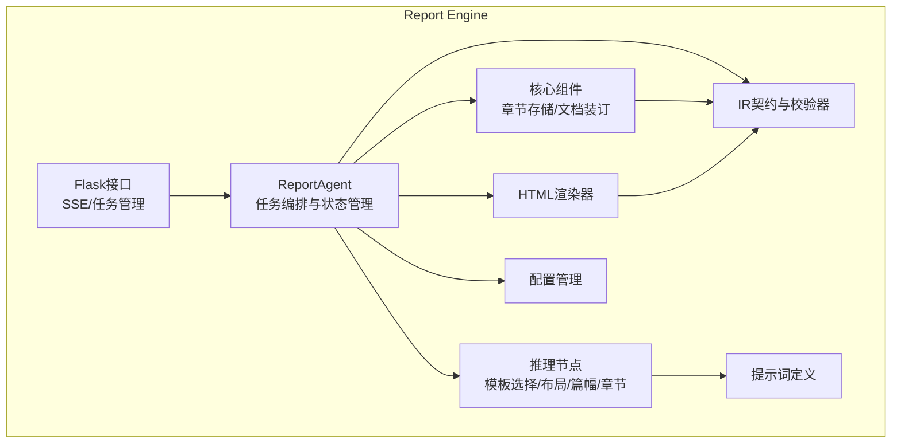
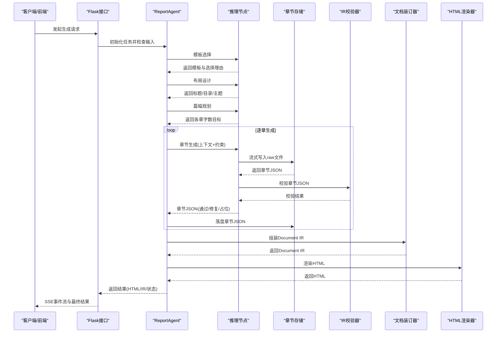
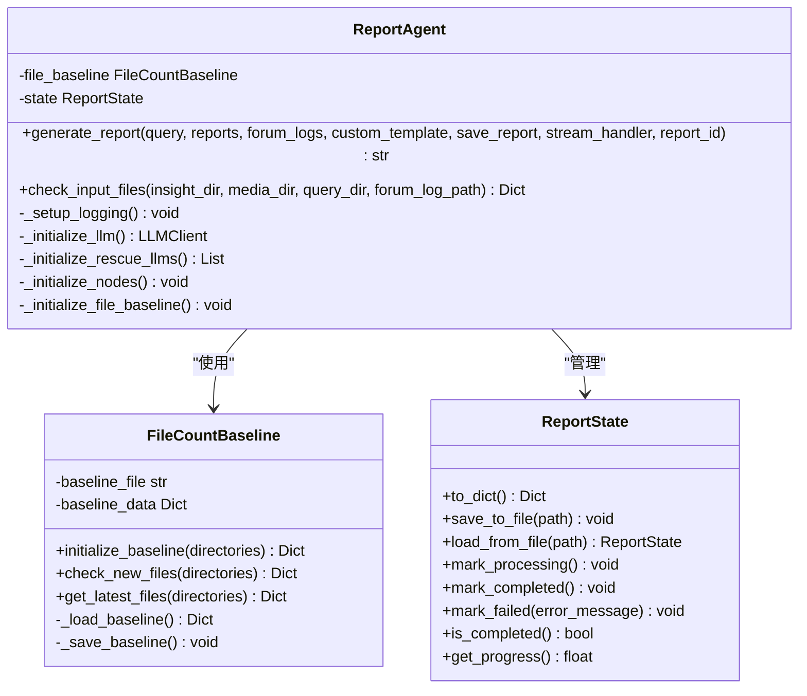
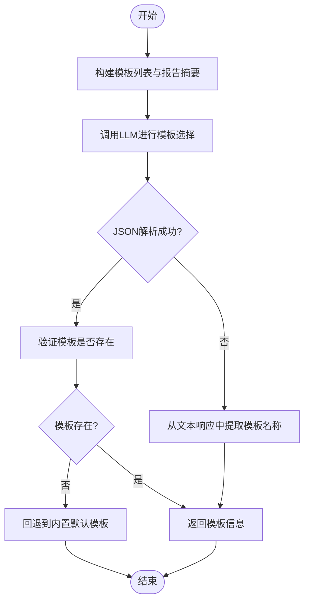
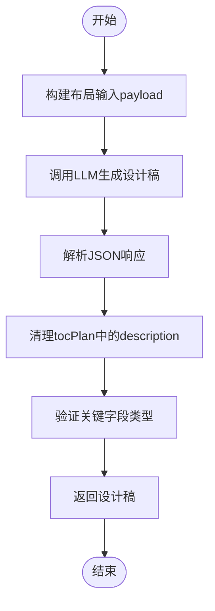
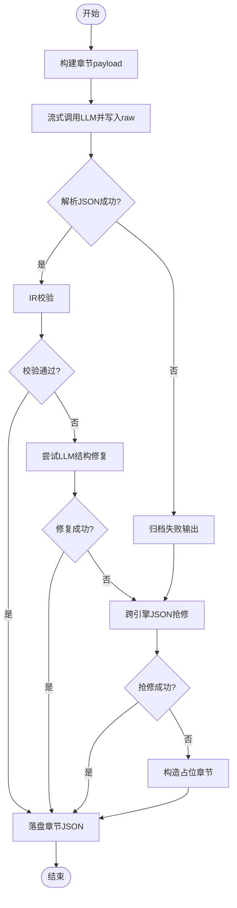
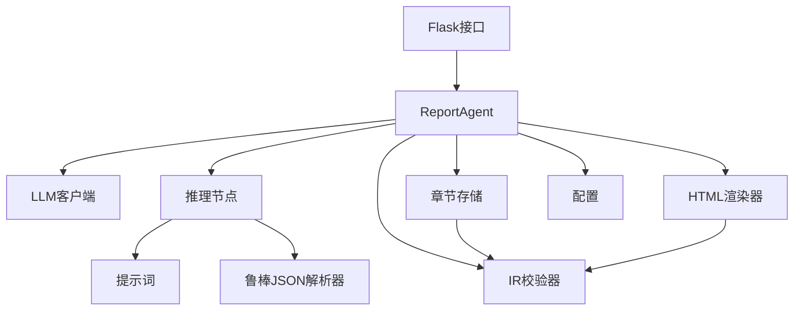

# 核心代理与生成流程

<cite>
**本文档引用的文件**
- [ReportEngine/agent.py](file://ReportEngine/agent.py)
- [ReportEngine/state/state.py](file://ReportEngine/state/state.py)
- [ReportEngine/nodes/base_node.py](file://ReportEngine/nodes/base_node.py)
- [ReportEngine/nodes/template_selection_node.py](file://ReportEngine/nodes/template_selection_node.py)
- [ReportEngine/nodes/document_layout_node.py](file://ReportEngine/nodes/document_layout_node.py)
- [ReportEngine/nodes/word_budget_node.py](file://ReportEngine/nodes/word_budget_node.py)
- [ReportEngine/nodes/chapter_generation_node.py](file://ReportEngine/nodes/chapter_generation_node.py)
- [ReportEngine/core/chapter_storage.py](file://ReportEngine/core/chapter_storage.py)
- [ReportEngine/core/stitcher.py](file://ReportEngine/core/stitcher.py)
- [ReportEngine/renderers/html_renderer.py](file://ReportEngine/renderers/html_renderer.py)
- [ReportEngine/ir/schema.py](file://ReportEngine/ir/schema.py)
- [ReportEngine/ir/validator.py](file://ReportEngine/ir/validator.py)
- [ReportEngine/prompts/prompts.py](file://ReportEngine/prompts/prompts.py)
- [ReportEngine/utils/config.py](file://ReportEngine/utils/config.py)
- [ReportEngine/flask_interface.py](file://ReportEngine/flask_interface.py)
</cite>

## 目录
1. [简介](#简介)
2. [项目结构](#项目结构)
3. [核心组件](#核心组件)
4. [架构总览](#架构总览)
5. [详细组件分析](#详细组件分析)
6. [依赖关系分析](#依赖关系分析)
7. [性能考虑](#性能考虑)
8. [故障排查指南](#故障排查指南)
9. [结论](#结论)

## 简介
本文件聚焦Report Engine的核心代理与生成流程，系统阐述报告生成代理类的设计架构、生成流程控制、节点协调机制与状态管理。文档覆盖从输入数据处理到最终输出的完整流程，解释生成策略选择机制、质量控制与错误处理流程，并提供配置参数说明与生成优化指导。同时，深入解析文件基准管理器的实现原理，说明如何监控三个分析引擎的报告产出并确保生成流程的正确时机。

## 项目结构
Report Engine采用模块化设计，围绕ReportAgent为核心，串联模板选择、布局设计、篇幅规划、章节生成、IR装订与HTML渲染等子流程。核心目录与职责如下：
- ReportEngine/agent.py：ReportAgent主类，负责任务编排、状态管理、流式事件分发与文件基准管理。
- ReportEngine/nodes/*：推理节点模块，包括模板选择、文档布局、篇幅规划、章节生成等。
- ReportEngine/core/*：核心基础设施，包括章节存储、文档装订器等。
- ReportEngine/ir/*：IR契约与校验器，确保章节JSON结构一致性。
- ReportEngine/renderers/*：渲染器，将Document IR渲染为HTML。
- ReportEngine/prompts/*：提示词定义，规范各阶段LLM输出结构。
- ReportEngine/utils/config.py：统一配置管理。
- ReportEngine/flask_interface.py：Flask接口，提供SSE流式事件与任务管理。

**图表来源**
- [ReportEngine/agent.py](file://ReportEngine/agent.py#L190-L252)
- [ReportEngine/nodes/base_node.py](file://ReportEngine/nodes/base_node.py#L13-L33)
- [ReportEngine/core/chapter_storage.py](file://ReportEngine/core/chapter_storage.py#L50-L70)
- [ReportEngine/core/stitcher.py](file://ReportEngine/core/stitcher.py#L15-L29)
- [ReportEngine/renderers/html_renderer.py](file://ReportEngine/renderers/html_renderer.py#L35-L43)
- [ReportEngine/ir/schema.py](file://ReportEngine/ir/schema.py#L13-L18)
- [ReportEngine/prompts/prompts.py](file://ReportEngine/prompts/prompts.py#L1-L20)
- [ReportEngine/utils/config.py](file://ReportEngine/utils/config.py#L12-L85)
- [ReportEngine/flask_interface.py](file://ReportEngine/flask_interface.py#L26-L33)

**章节来源**
- [ReportEngine/agent.py](file://ReportEngine/agent.py#L1-L120)
- [ReportEngine/flask_interface.py](file://ReportEngine/flask_interface.py#L246-L272)

## 核心组件
- ReportAgent：报告生成总调度中心，负责初始化LLM客户端、节点、章节存储与渲染器，管理任务状态与流式事件分发，协调三个分析引擎与论坛日志，驱动模板选择→布局设计→篇幅规划→章节生成→IR装订→HTML渲染的完整流程。
- FileCountBaseline：文件数量基准管理器，监控insight/media/query三个引擎目录的Markdown文件数量变化，判断输入是否准备就绪，为Flask层提供“输入是否准备完毕”的依据。
- ReportState：报告状态管理，记录任务ID、查询词、状态、输入输出与元数据，供Agent与Flask层共享。
- 节点体系：TemplateSelectionNode、DocumentLayoutNode、WordBudgetNode、ChapterGenerationNode，分别负责模板选择、文档布局、篇幅规划与章节JSON生成。
- 章节存储：ChapterStorage，负责章节流式写入raw文件、校验通过后持久化chapter.json，并维护manifest清单。
- 文档装订：DocumentComposer，将章节按顺序组装为Document IR，注入唯一锚点与元数据。
- IR校验器：IRValidator，对章节JSON进行结构校验，确保渲染期不会崩溃。
- 渲染器：HTMLRenderer，将Document IR渲染为HTML，内置图表校验与修复、主题变量注入与CDN回退机制。
- 提示词：集中定义各阶段系统提示词与Schema，确保LLM输出结构一致。
- 配置：Settings，统一读取环境变量，提供类型安全的访问方式。

**章节来源**
- [ReportEngine/agent.py](file://ReportEngine/agent.py#L190-L252)
- [ReportEngine/state/state.py](file://ReportEngine/state/state.py#L31-L77)
- [ReportEngine/nodes/base_node.py](file://ReportEngine/nodes/base_node.py#L13-L33)
- [ReportEngine/core/chapter_storage.py](file://ReportEngine/core/chapter_storage.py#L50-L70)
- [ReportEngine/core/stitcher.py](file://ReportEngine/core/stitcher.py#L15-L29)
- [ReportEngine/renderers/html_renderer.py](file://ReportEngine/renderers/html_renderer.py#L35-L43)
- [ReportEngine/ir/validator.py](file://ReportEngine/ir/validator.py#L21-L34)
- [ReportEngine/prompts/prompts.py](file://ReportEngine/prompts/prompts.py#L203-L465)
- [ReportEngine/utils/config.py](file://ReportEngine/utils/config.py#L12-L85)

## 架构总览
ReportAgent作为核心代理，串联模板选择、布局设计、篇幅规划、章节生成、IR装订与HTML渲染等子流程。其控制流如下：
- 初始化：加载配置、建立日志、初始化LLM客户端与救援通道、构造节点、初始化文件基准、创建状态容器。
- 输入归一化：将三引擎报告与论坛日志归一化为统一结构。
- 模板选择：根据查询、报告与论坛日志选择最佳模板。
- 布局设计：生成标题、目录、Hero与主题设计。
- 篇幅规划：为各章节分配字数目标与重点。
- 章节生成：逐章调用LLM生成章节JSON，自动修复与校验，流式写入raw文件并落盘。
- IR装订：将章节组装为Document IR，注入唯一锚点与元数据。
- HTML渲染：渲染器将IR转换为HTML，内置图表校验与修复、主题注入与CDN回退。
- 输出落盘：可选保存HTML、IR与状态文件。

**图表来源**
- [ReportEngine/agent.py](file://ReportEngine/agent.py#L424-L800)
- [ReportEngine/nodes/template_selection_node.py](file://ReportEngine/nodes/template_selection_node.py#L43-L79)
- [ReportEngine/nodes/document_layout_node.py](file://ReportEngine/nodes/document_layout_node.py#L38-L86)
- [ReportEngine/nodes/word_budget_node.py](file://ReportEngine/nodes/word_budget_node.py#L38-L83)
- [ReportEngine/nodes/chapter_generation_node.py](file://ReportEngine/nodes/chapter_generation_node.py#L171-L294)
- [ReportEngine/core/chapter_storage.py](file://ReportEngine/core/chapter_storage.py#L130-L178)
- [ReportEngine/core/stitcher.py](file://ReportEngine/core/stitcher.py#L29-L79)
- [ReportEngine/renderers/html_renderer.py](file://ReportEngine/renderers/html_renderer.py#L278-L336)

**章节来源**
- [ReportEngine/agent.py](file://ReportEngine/agent.py#L424-L800)

## 详细组件分析

### ReportAgent：核心代理与状态管理
- 职责与初始化
  - 解析配置并接入日志/LLM/渲染等核心组件。
  - 构造四个推理节点（模板选择、布局设计、篇幅规划、章节生成）。
  - 初始化文件基准与章节落盘目录。
  - 构建可序列化的状态容器，供外部服务查询。
- 生成流程控制
  - 归一化三引擎报告与论坛日志，输出流式事件。
  - 模板选择→模板切片→文档布局→篇幅规划→章节生成→IR装订→HTML渲染。
  - 支持自定义模板与跨引擎章节修复。
- 节点协调机制
  - 通过上下文字典传递查询、报告、论坛日志、模板、布局与篇幅规划等信息。
  - 逐章生成时，章节节点负责流式写入raw文件并通过回调将delta透传给前端。
- 状态管理
  - ReportState记录任务ID、查询词、状态、输入输出与元数据。
  - 提供进度计算、状态转换与序列化/反序列化能力。
- 错误处理与质量控制
  - 章节生成阶段对JSON解析失败、内容稀疏与结构校验失败进行分类处理与重试。
  - 支持跨引擎修复通道，优先使用Report Engine，其次Forum/Insight/Media。
  - 通过IRValidator确保章节JSON结构一致，渲染期不崩溃。
- 文件基准管理器
  - FileCountBaseline负责记录insight/media/query三个引擎目录的Markdown文件数量，轮询判断是否有新报告落地，为Flask层提供“输入是否准备完毕”的依据。
  - 支持初始化基准、检查新文件与获取最新文件。

**图表来源**
- [ReportEngine/agent.py](file://ReportEngine/agent.py#L190-L252)
- [ReportEngine/agent.py](file://ReportEngine/agent.py#L63-L188)
- [ReportEngine/state/state.py](file://ReportEngine/state/state.py#L31-L77)

**章节来源**
- [ReportEngine/agent.py](file://ReportEngine/agent.py#L190-L252)
- [ReportEngine/agent.py](file://ReportEngine/agent.py#L336-L348)
- [ReportEngine/agent.py](file://ReportEngine/agent.py#L424-L800)
- [ReportEngine/state/state.py](file://ReportEngine/state/state.py#L31-L143)

### 模板选择节点：策略与质量控制
- 功能概述
  - 综合用户查询、三引擎报告与论坛日志，调用LLM挑选最合适的报告骨架。
  - 若LLM失败，回退到内置默认模板。
- 质量控制
  - 使用鲁棒JSON解析器，支持多种修复策略。
  - 从文本响应中提取模板名称的关键字作为降级方案。
- 配置与扩展
  - 模板目录通过配置项指定，默认为“ReportEngine/report_template”。

**图表来源**
- [ReportEngine/nodes/template_selection_node.py](file://ReportEngine/nodes/template_selection_node.py#L82-L181)
- [ReportEngine/nodes/template_selection_node.py](file://ReportEngine/nodes/template_selection_node.py#L217-L287)

**章节来源**
- [ReportEngine/nodes/template_selection_node.py](file://ReportEngine/nodes/template_selection_node.py#L18-L79)
- [ReportEngine/nodes/template_selection_node.py](file://ReportEngine/nodes/template_selection_node.py#L82-L181)
- [ReportEngine/nodes/template_selection_node.py](file://ReportEngine/nodes/template_selection_node.py#L217-L287)

### 文档布局节点：全局设计与主题
- 功能概述
  - 结合模板切片、报告摘要与论坛讨论，生成全局标题、目录与Hero设计。
  - 输出主题色板与布局备注，指导渲染期视觉表现。
- 质量控制
  - 使用鲁棒JSON解析器，对tocPlan中的description字段进行清理，移除可能的JSON片段。
  - 对关键字段进行类型校验与默认值处理。

**图表来源**
- [ReportEngine/nodes/document_layout_node.py](file://ReportEngine/nodes/document_layout_node.py#L38-L86)
- [ReportEngine/nodes/document_layout_node.py](file://ReportEngine/nodes/document_layout_node.py#L88-L136)
- [ReportEngine/nodes/document_layout_node.py](file://ReportEngine/nodes/document_layout_node.py#L137-L205)

**章节来源**
- [ReportEngine/nodes/document_layout_node.py](file://ReportEngine/nodes/document_layout_node.py#L21-L86)
- [ReportEngine/nodes/document_layout_node.py](file://ReportEngine/nodes/document_layout_node.py#L88-L136)
- [ReportEngine/nodes/document_layout_node.py](file://ReportEngine/nodes/document_layout_node.py#L137-L205)

### 篇幅规划节点：目标分配与约束
- 功能概述
  - 基于设计稿与素材，为各章节分配字数目标、最小/最大字数与重点强调。
  - 输出全局写作准则与逐章/小节的字数约束。
- 质量控制
  - 使用鲁棒JSON解析器，对关键字段进行类型校验与默认值处理。

**章节来源**
- [ReportEngine/nodes/word_budget_node.py](file://ReportEngine/nodes/word_budget_node.py#L21-L83)
- [ReportEngine/nodes/word_budget_node.py](file://ReportEngine/nodes/word_budget_node.py#L85-L123)

### 章节生成节点：JSON生成与修复
- 功能概述
  - 针对单个章节调用LLM，流式写入raw文件并透传delta；尝试修复/解析LLM输出，并使用IRValidator校验；对block结构做容错修复，确保最终JSON可渲染。
- 质量控制与错误处理
  - 分类异常：JSON解析失败、内容稀疏、结构校验失败。
  - 修复策略：本地修复（括号平衡、逗号补全、控制字符转义等）、json_repair库修复、跨引擎修复通道。
  - 占位章节：在所有修复失败时构造可渲染的占位章节，并记录日志文件。
- 跨引擎修复
  - 顺序遵循“Report → Forum → Insight → Media”，缺失配置会被自动跳过。
- 配置参数
  - 章节JSON最大尝试次数、错误日志目录等。

**图表来源**
- [ReportEngine/nodes/chapter_generation_node.py](file://ReportEngine/nodes/chapter_generation_node.py#L171-L294)
- [ReportEngine/nodes/chapter_generation_node.py](file://ReportEngine/nodes/chapter_generation_node.py#L504-L564)
- [ReportEngine/nodes/chapter_generation_node.py](file://ReportEngine/nodes/chapter_generation_node.py#L593-L650)
- [ReportEngine/nodes/chapter_generation_node.py](file://ReportEngine/nodes/chapter_generation_node.py#L652-L717)

**章节来源**
- [ReportEngine/nodes/chapter_generation_node.py](file://ReportEngine/nodes/chapter_generation_node.py#L92-L170)
- [ReportEngine/nodes/chapter_generation_node.py](file://ReportEngine/nodes/chapter_generation_node.py#L171-L294)
- [ReportEngine/nodes/chapter_generation_node.py](file://ReportEngine/nodes/chapter_generation_node.py#L504-L564)
- [ReportEngine/nodes/chapter_generation_node.py](file://ReportEngine/nodes/chapter_generation_node.py#L593-L650)
- [ReportEngine/nodes/chapter_generation_node.py](file://ReportEngine/nodes/chapter_generation_node.py#L652-L717)

### 章节存储与IR装订：落盘与清单管理
- 章节存储
  - 为每次报告创建独立run目录与manifest快照；在章节流式生成时即时写入stream.raw；校验通过后持久化chapter.json并更新manifest状态。
- 文档装订
  - 将章节按order排序并注入唯一锚点，形成整本IR；合并metadata/themeTokens/assets，供渲染器直接消费。

**章节来源**
- [ReportEngine/core/chapter_storage.py](file://ReportEngine/core/chapter_storage.py#L50-L178)
- [ReportEngine/core/stitcher.py](file://ReportEngine/core/stitcher.py#L15-L79)

### IR契约与校验器：结构一致性保障
- IR契约
  - 定义IR版本、允许的block类型与inline marks、引擎Agent标题等。
- 校验器
  - 对章节JSON进行细粒度校验，包括必填字段、block类型、嵌套结构与字段值约束，返回path语法的错误定位。

**章节来源**
- [ReportEngine/ir/schema.py](file://ReportEngine/ir/schema.py#L13-L546)
- [ReportEngine/ir/validator.py](file://ReportEngine/ir/validator.py#L21-L339)

### HTML渲染器：图表校验与主题注入
- 功能概述
  - 将Document IR渲染为HTML，内置Chart.js数据验证/修复、MathJax/Chart.js/html2canvas/jspdf等依赖内联与CDN回退、思源宋体子集字体。
- 质量控制
  - 图表验证与修复，记录总量/修复来源/失败数量统计；对目录锚点有效性进行验证；主题变量注入与CSS变量生成。

**章节来源**
- [ReportEngine/renderers/html_renderer.py](file://ReportEngine/renderers/html_renderer.py#L35-L139)
- [ReportEngine/renderers/html_renderer.py](file://ReportEngine/renderers/html_renderer.py#L278-L336)

### 提示词与Schema：统一输出结构
- 提示词
  - 集中定义模板选择、章节JSON、文档布局、篇幅规划等阶段的系统提示词，并提供输入输出Schema文本，确保LLM理解结构约束。
- Schema
  - 定义章节JSON的结构约束，包括block类型、inline marks、SWOT/PEST块的使用规则等。

**章节来源**
- [ReportEngine/prompts/prompts.py](file://ReportEngine/prompts/prompts.py#L1-L641)
- [ReportEngine/ir/schema.py](file://ReportEngine/ir/schema.py#L501-L530)

### 配置参数说明与优化指导
- 关键配置项
  - LLM相关：REPORT_ENGINE_API_KEY、REPORT_ENGINE_BASE_URL、REPORT_ENGINE_MODEL_NAME、FORUM_HOST_*、INSIGHT_ENGINE_*、MEDIA_ENGINE_*。
  - 目录与输出：OUTPUT_DIR、CHAPTER_OUTPUT_DIR、DOCUMENT_IR_OUTPUT_DIR、TEMPLATE_DIR。
  - 重试与超时：CHAPTER_JSON_MAX_ATTEMPTS、API_TIMEOUT、MAX_RETRY_DELAY、MAX_RETRIES。
  - 日志与导出：LOG_FILE、ENABLE_PDF_EXPORT、CHART_STYLE、JSON_ERROR_LOG_DIR。
  - GraphRAG：GRAPHRAG_ENABLED、GRAPHRAG_MAX_QUERIES。
- 优化建议
  - 合理设置CHAPTER_JSON_MAX_ATTEMPTS，平衡生成质量与性能。
  - 启用GraphRAG可提升章节内容的结构化信息，但需权衡构建成本与查询次数上限。
  - 通过JSON_ERROR_LOG_DIR定位无法修复的JSON块，便于后续人工干预。
  - 使用稳定的LLM供应商与合理的超时配置，避免频繁重试。

**章节来源**
- [ReportEngine/utils/config.py](file://ReportEngine/utils/config.py#L12-L114)

## 依赖关系分析
ReportAgent与各模块的依赖关系如下：
- ReportAgent依赖LLM客户端、节点、章节存储、IR校验器、渲染器与配置。
- 节点依赖提示词与鲁棒JSON解析器，确保输出结构一致。
- 章节存储与文档装订器依赖IR契约，保证章节与整本IR的结构一致性。
- Flask接口依赖ReportAgent，提供SSE事件流与任务管理。

**图表来源**
- [ReportEngine/agent.py](file://ReportEngine/agent.py#L21-L41)
- [ReportEngine/nodes/base_node.py](file://ReportEngine/nodes/base_node.py#L21-L33)
- [ReportEngine/nodes/chapter_generation_node.py](file://ReportEngine/nodes/chapter_generation_node.py#L135-L170)
- [ReportEngine/flask_interface.py](file://ReportEngine/flask_interface.py#L21-L23)

**章节来源**
- [ReportEngine/agent.py](file://ReportEngine/agent.py#L21-L41)
- [ReportEngine/nodes/base_node.py](file://ReportEngine/nodes/base_node.py#L21-L33)
- [ReportEngine/nodes/chapter_generation_node.py](file://ReportEngine/nodes/chapter_generation_node.py#L135-L170)
- [ReportEngine/flask_interface.py](file://ReportEngine/flask_interface.py#L21-L23)

## 性能考虑
- 流式生成与落盘：章节生成采用流式写入raw文件，完成后校验并落盘，降低内存压力并支持断点续传。
- 重试与退避：章节JSON解析失败时进行有限次数重试，并采用指数退避策略，缓解瞬时网络抖动。
- 图表校验与修复：渲染前对图表配置进行本地与LLM兜底修复，避免渲染期崩溃与重复修复。
- 日志与SSE：实时日志写入与SSE事件流，前端可实时感知生成进度与错误，提升用户体验。

## 故障排查指南
- 模板选择失败
  - 检查模板目录是否存在与可读；确认LLM输出是否符合JSON Schema；必要时回退到内置默认模板。
- 章节生成异常
  - JSON解析失败：检查LLM输出是否包含合法JSON；查看JSON_ERROR_LOG_DIR中的错误日志；尝试跨引擎修复。
  - 内容稀疏：增加目标字数或强调点，触发重试；检查GraphRAG查询结果是否充分。
  - 结构校验失败：查看IR校验器返回的错误路径，修正block结构与字段。
- 输入文件未准备就绪
  - 使用FileCountBaseline检查insight/media/query三个引擎目录的Markdown文件数量变化；确认论坛日志是否存在。
- 渲染问题
  - 图表配置错误：检查图表验证统计；确认数据格式与渲染器支持的配置；必要时使用LLM兜底修复。
  - 主题与字体：确认主题变量注入与字体文件可用性；检查CDN回退机制。

**章节来源**
- [ReportEngine/nodes/chapter_generation_node.py](file://ReportEngine/nodes/chapter_generation_node.py#L42-L90)
- [ReportEngine/nodes/chapter_generation_node.py](file://ReportEngine/nodes/chapter_generation_node.py#L504-L564)
- [ReportEngine/nodes/chapter_generation_node.py](file://ReportEngine/nodes/chapter_generation_node.py#L593-L650)
- [ReportEngine/agent.py](file://ReportEngine/agent.py#L63-L188)
- [ReportEngine/renderers/html_renderer.py](file://ReportEngine/renderers/html_renderer.py#L192-L203)

## 结论
Report Engine通过ReportAgent实现了从输入数据到最终HTML输出的完整自动化流程。其核心优势在于：
- 统一的节点体系与提示词定义，确保各阶段LLM输出结构一致；
- 严格的IR契约与校验器，保障章节与整本IR的结构一致性；
- 完善的质量控制与错误处理机制，包括JSON修复、跨引擎救援与占位章节；
- 流式生成与落盘策略，降低内存压力并支持断点续传；
- 文件基准管理器与Flask接口，确保输入准备与实时事件分发。

通过合理配置与优化，Report Engine能够在保证质量的前提下高效生成高质量的综合报告。