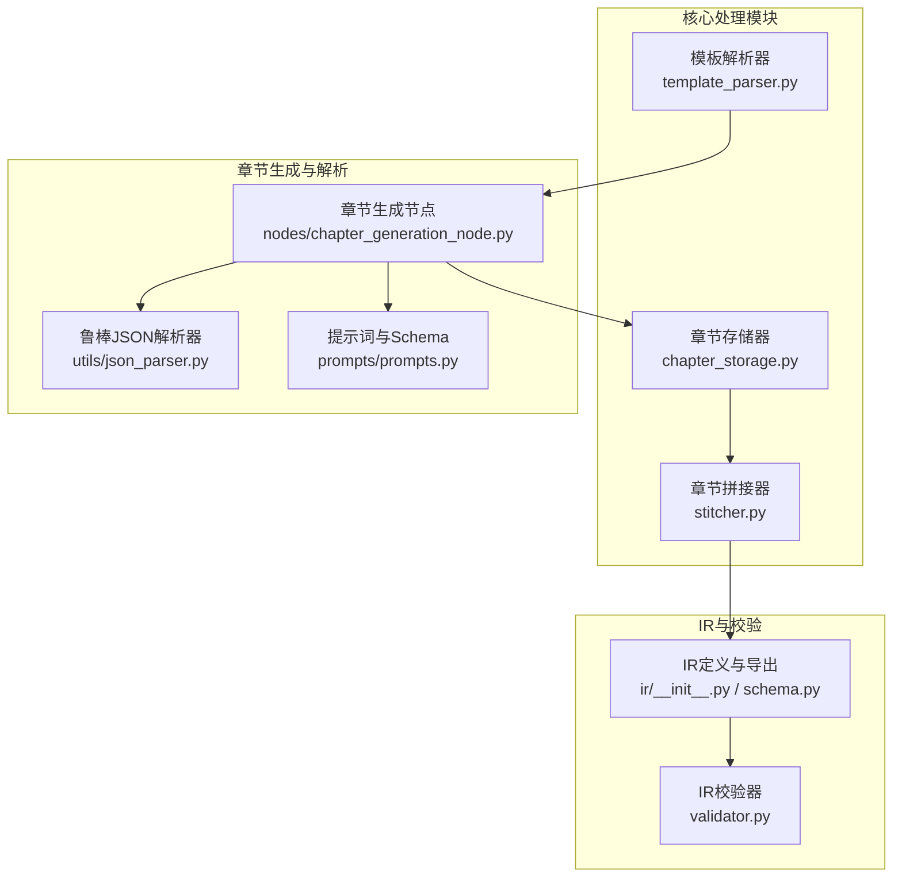
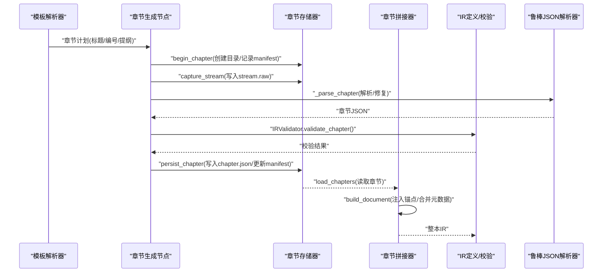
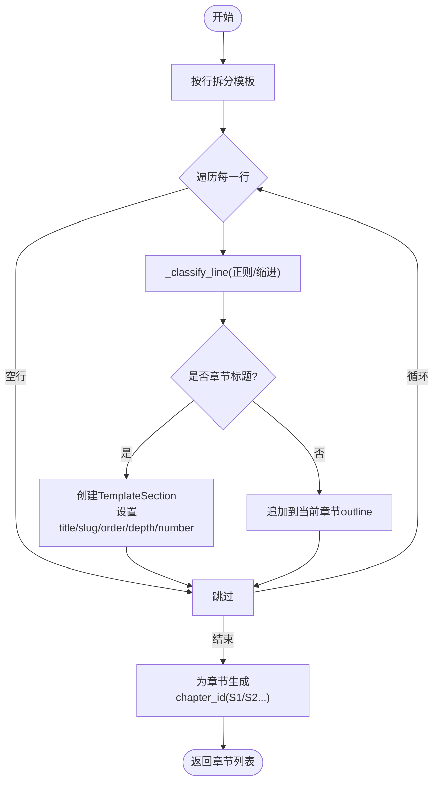
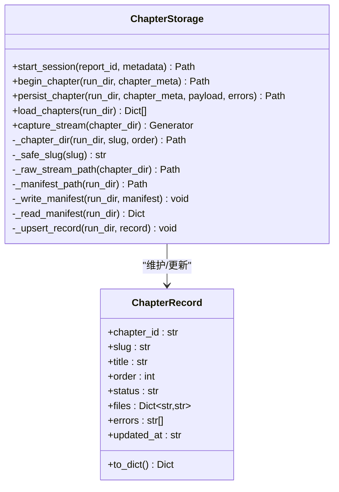
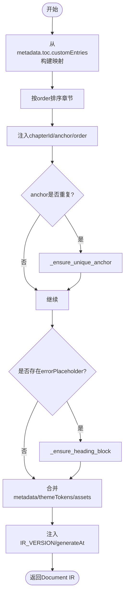
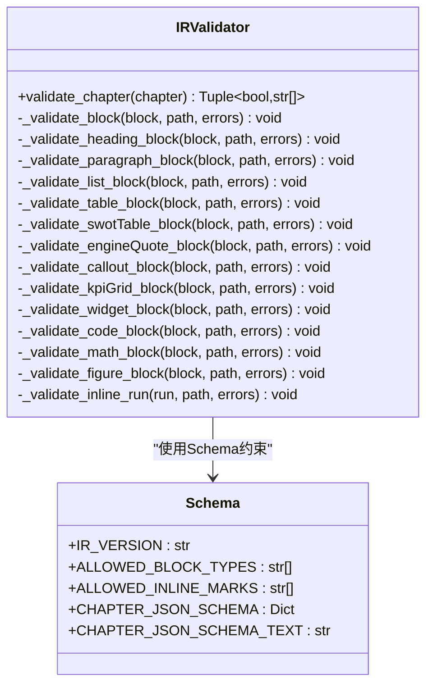
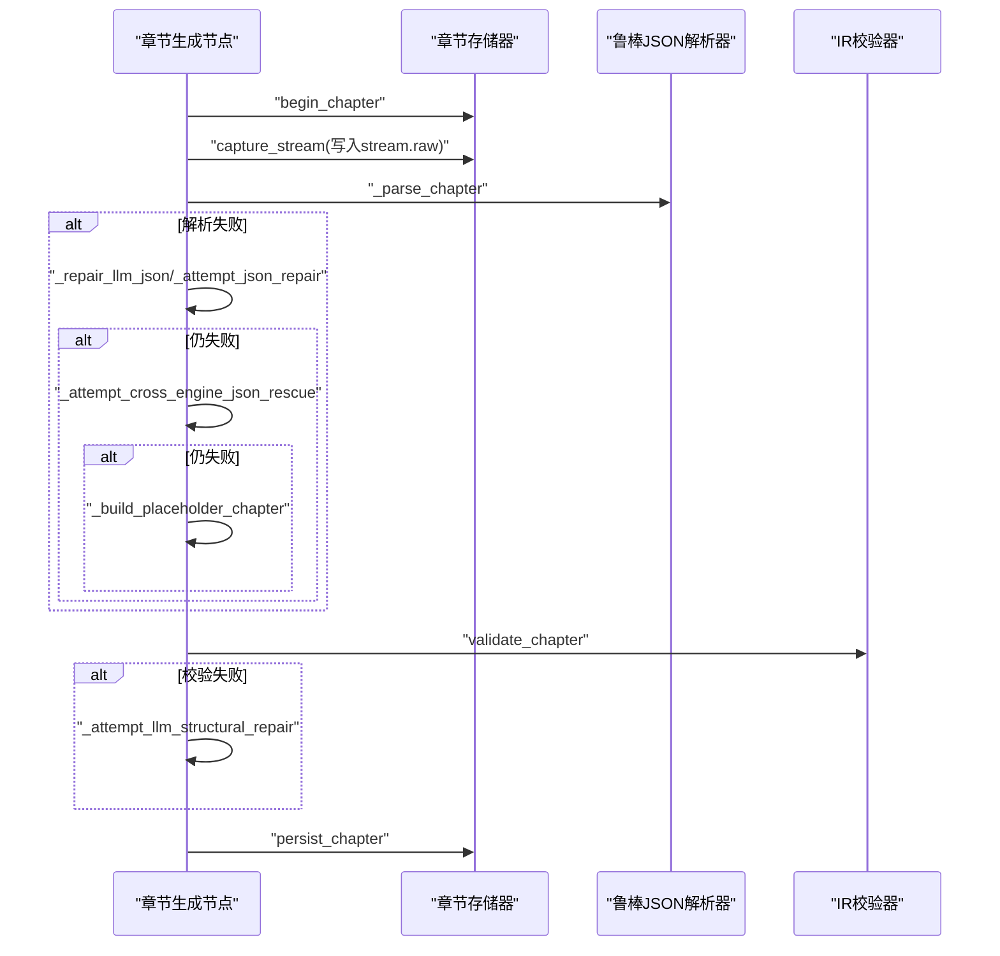
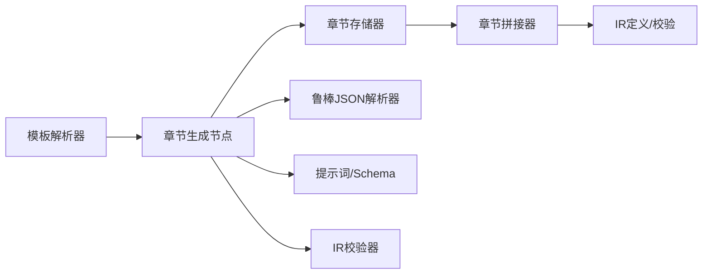

# 核心处理模块

<cite>
**本文引用的文件**
- [ReportEngine/core/__init__.py](file://ReportEngine/core/__init__.py)
- [ReportEngine/core/chapter_storage.py](file://ReportEngine/core/chapter_storage.py)
- [ReportEngine/core/stitcher.py](file://ReportEngine/core/stitcher.py)
- [ReportEngine/core/template_parser.py](file://ReportEngine/core/template_parser.py)
- [ReportEngine/ir/__init__.py](file://ReportEngine/ir/__init__.py)
- [ReportEngine/ir/schema.py](file://ReportEngine/ir/schema.py)
- [ReportEngine/ir/validator.py](file://ReportEngine/ir/validator.py)
- [ReportEngine/nodes/chapter_generation_node.py](file://ReportEngine/nodes/chapter_generation_node.py)
- [ReportEngine/utils/json_parser.py](file://ReportEngine/utils/json_parser.py)
- [ReportEngine/prompts/prompts.py](file://ReportEngine/prompts/prompts.py)
- [tests/test_report_engine_sanitization.py](file://tests/test_report_engine_sanitization.py)
</cite>

## 目录
1. [简介](#简介)
2. [项目结构](#项目结构)
3. [核心组件](#核心组件)
4. [架构总览](#架构总览)
5. [详细组件分析](#详细组件分析)
6. [依赖关系分析](#依赖关系分析)
7. [性能考量](#性能考量)
8. [故障排查指南](#故障排查指南)
9. [结论](#结论)
10. [附录](#附录)

## 简介
本文件聚焦 Report Engine 的核心处理模块，系统性阐述章节拼接器的合并算法、章节存储器的持久化机制与模板解析器的解析逻辑。文档还详细说明报告片段的拼接策略、存储格式与模板适配机制，解释中间表示（IR）的处理流程与数据转换算法，并提供核心模块扩展与自定义处理的技术指导，涵盖章节存储的目录结构设计、文件命名规则与版本管理机制。

## 项目结构
核心处理模块位于 ReportEngine/core，配合 IR 定义与校验、章节生成节点、鲁棒 JSON 解析与提示词工程，构成从模板到章节再到整本 IR 的完整流水线。



**图表来源**
- [ReportEngine/core/template_parser.py](file://ReportEngine/core/template_parser.py#L1-L303)
- [ReportEngine/core/chapter_storage.py](file://ReportEngine/core/chapter_storage.py#L1-L291)
- [ReportEngine/core/stitcher.py](file://ReportEngine/core/stitcher.py#L1-L134)
- [ReportEngine/ir/schema.py](file://ReportEngine/ir/schema.py#L1-L546)
- [ReportEngine/ir/validator.py](file://ReportEngine/ir/validator.py#L1-L339)
- [ReportEngine/nodes/chapter_generation_node.py](file://ReportEngine/nodes/chapter_generation_node.py#L1-L2062)
- [ReportEngine/utils/json_parser.py](file://ReportEngine/utils/json_parser.py#L1-L764)
- [ReportEngine/prompts/prompts.py](file://ReportEngine/prompts/prompts.py#L1-L641)

**章节来源**
- [ReportEngine/core/__init__.py](file://ReportEngine/core/__init__.py#L1-L18)

## 核心组件
- 模板解析器：将 Markdown 模板切分为结构化章节队列，生成稳定的 chapter_id、slug、order 与提纲，兼容多种标题与列表写法。
- 章节存储器：为每次报告创建独立 run 目录与 manifest，流式写入 raw 文件并在校验通过后持久化 chapter.json，同时维护章节状态与错误列表。
- 章节拼接器：将多个章节按 order 排序，注入唯一锚点，合并 metadata/themeTokens/assets，形成整本 IR。
- IR 定义与校验：集中维护章节级 JSON Schema 与校验逻辑，确保章节生成、校验与渲染对同一结构有统一认知。
- 章节生成节点：按章节调用 LLM，流式写入 raw，解析/修复 JSON，使用 IRValidator 校验，落盘并通过占位章节兜底。
- 鲁棒 JSON 解析器：提供多种修复策略，支持本地修复、json_repair 库与可选 LLM 辅助修复。
- 提示词与 Schema：提供章节 JSON 生成、修复、恢复等系统提示词与输入输出 Schema 文本。

**章节来源**
- [ReportEngine/core/template_parser.py](file://ReportEngine/core/template_parser.py#L1-L303)
- [ReportEngine/core/chapter_storage.py](file://ReportEngine/core/chapter_storage.py#L1-L291)
- [ReportEngine/core/stitcher.py](file://ReportEngine/core/stitcher.py#L1-L134)
- [ReportEngine/ir/schema.py](file://ReportEngine/ir/schema.py#L1-L546)
- [ReportEngine/ir/validator.py](file://ReportEngine/ir/validator.py#L1-L339)
- [ReportEngine/nodes/chapter_generation_node.py](file://ReportEngine/nodes/chapter_generation_node.py#L1-L2062)
- [ReportEngine/utils/json_parser.py](file://ReportEngine/utils/json_parser.py#L1-L764)
- [ReportEngine/prompts/prompts.py](file://ReportEngine/prompts/prompts.py#L1-L641)

## 架构总览
Report Engine 的核心处理架构围绕“模板 -> 章节 -> 拼接 -> IR”的流水线展开。模板解析器负责将模板切分为章节计划；章节生成节点按章节调用 LLM，流式写入 raw 并解析/修复 JSON；章节存储器负责落盘与 manifest 管理；章节拼接器将章节合并为整本 IR；IR 定义与校验保障结构一致性；鲁棒 JSON 解析器与提示词工程贯穿全流程。



**图表来源**
- [ReportEngine/core/template_parser.py](file://ReportEngine/core/template_parser.py#L87-L141)
- [ReportEngine/nodes/chapter_generation_node.py](file://ReportEngine/nodes/chapter_generation_node.py#L171-L294)
- [ReportEngine/core/chapter_storage.py](file://ReportEngine/core/chapter_storage.py#L98-L178)
- [ReportEngine/core/stitcher.py](file://ReportEngine/core/stitcher.py#L29-L79)
- [ReportEngine/ir/validator.py](file://ReportEngine/ir/validator.py#L37-L55)
- [ReportEngine/utils/json_parser.py](file://ReportEngine/utils/json_parser.py#L86-L164)

## 详细组件分析

### 模板解析器：解析逻辑与适配机制
- 功能职责
  - 将 Markdown 模板解析为结构化章节队列，记录标题、slug、序号、层级、原始标题、章节编号与提纲。
  - 兼容“# 标题”“- **1.0 标题** /   - 1.1 子标题”等多种写法，通过正则与缩进启发式识别章节与提纲。
- 关键算法
  - 行分类：使用正则识别标题、列表与编号行，推导 depth/slug/number。
  - 去重 slug：对重复 slug 自动追加序号，确保锚点唯一。
  - 章节编号：为每个章节生成稳定的 chapter_id（如 S1/S2…）。
  - 提纲收集：在当前章节下累积 outline 条目。
- 复杂度与健壮性
  - 时间复杂度 O(N)，N 为模板行数；空间复杂度 O(N)。
  - 通过避免贪婪正则与显式去重，降低正则 DoS 风险与重复锚点风险。
- 适配机制
  - 支持目录配置映射（toc.customEntries）为章节注入自定义 anchor。
  - 生成的章节信息可直接用于提示词上下文与布局/预算节点输入。



**图表来源**
- [ReportEngine/core/template_parser.py](file://ReportEngine/core/template_parser.py#L87-L141)
- [ReportEngine/core/template_parser.py](file://ReportEngine/core/template_parser.py#L144-L209)
- [ReportEngine/core/template_parser.py](file://ReportEngine/core/template_parser.py#L277-L299)

**章节来源**
- [ReportEngine/core/template_parser.py](file://ReportEngine/core/template_parser.py#L1-L303)

### 章节存储器：持久化机制与目录结构
- 功能职责
  - 为每次报告创建独立 run 目录与 manifest，记录全局 metadata。
  - 在章节流式生成时即时写入 stream.raw，校验通过后持久化 chapter.json，并更新 manifest 状态。
- 目录结构与命名规则
  - run 目录：以 report_id 命名。
  - 章节目录：形如 {order:03d}-{safe_slug}，确保稳定排序与可读性。
  - 文件命名：stream.raw（流式输出）、chapter.json（最终章节 JSON）。
  - manifest.json：记录 reportId、createdAt、metadata、chapters 列表。
- 持久化流程
  - start_session：创建 run 目录与 manifest。
  - begin_chapter：创建章节目录，登记 streaming 状态与 raw 文件路径。
  - capture_stream：上下文管理器，实时写入 raw。
  - persist_chapter：写入 chapter.json，更新 manifest 状态（ready/invalid），记录错误列表。
  - load_chapters：按 order 读取并排序所有章节 JSON。
- 版本管理与并发
  - 通过内存缓存 + 磁盘快照 + 键值映射避免重复读取。
  - _read_manifest 支持进程重启/多实例写盘时恢复上下文。



**图表来源**
- [ReportEngine/core/chapter_storage.py](file://ReportEngine/core/chapter_storage.py#L50-L290)

**章节来源**
- [ReportEngine/core/chapter_storage.py](file://ReportEngine/core/chapter_storage.py#L1-L291)

### 章节拼接器：合并算法与锚点策略
- 功能职责
  - 将多个章节按 order 排序，注入唯一锚点，合并 metadata/themeTokens/assets，形成整本 IR。
- 合并算法
  - toc_anchor_map：从 metadata.toc.customEntries 构建 chapterId -> anchor 映射。
  - 锚点生成优先级：目录配置 anchor > 章节自带 anchor > 默认 anchor（section-{idx}）。
  - _ensure_unique_anchor：若冲突则追加 -2/-3…，确保全局唯一。
  - 为占位章节注入 heading block，保证目录可导航。
- IR 版本与时间戳
  - 注入 IR_VERSION 与 generatedAt（若未提供则自动生成）。
- 复杂度
  - 时间复杂度 O(M log M)（排序）+ O(M)（锚点去重与注入），M 为章节数量。



**图表来源**
- [ReportEngine/core/stitcher.py](file://ReportEngine/core/stitcher.py#L29-L79)
- [ReportEngine/core/stitcher.py](file://ReportEngine/core/stitcher.py#L81-L89)
- [ReportEngine/core/stitcher.py](file://ReportEngine/core/stitcher.py#L91-L112)
- [ReportEngine/core/stitcher.py](file://ReportEngine/core/stitcher.py#L114-L130)

**章节来源**
- [ReportEngine/core/stitcher.py](file://ReportEngine/core/stitcher.py#L1-L134)

### IR 定义与校验：中间表示处理流程
- IR 定义
  - IR_VERSION：当前 IR 版本。
  - ALLOWED_BLOCK_TYPES / ALLOWED_INLINE_MARKS：允许的区块与内联标记类型。
  - CHAPTER_JSON_SCHEMA：章节级 JSON Schema，定义 chapterId、title、anchor、order、blocks 等字段与嵌套规则。
- 校验流程
  - validate_chapter：校验章节对象必填字段与 blocks 结构。
  - _validate_block：按 block.type 分派到具体校验器。
  - 针对 heading/paragraph/list/table/swot/pest/engineQuote/callout/kpi/widget/math/figure/toc 等区块进行细粒度校验。
  - 错误定位采用 path 语法，便于快速追踪。
- 处理复杂度
  - 时间复杂度 O(B)，B 为 blocks 数量；空间复杂度 O(1)（不考虑输出）。



**图表来源**
- [ReportEngine/ir/validator.py](file://ReportEngine/ir/validator.py#L21-L339)
- [ReportEngine/ir/schema.py](file://ReportEngine/ir/schema.py#L13-L546)

**章节来源**
- [ReportEngine/ir/__init__.py](file://ReportEngine/ir/__init__.py#L1-L27)
- [ReportEngine/ir/schema.py](file://ReportEngine/ir/schema.py#L1-L546)
- [ReportEngine/ir/validator.py](file://ReportEngine/ir/validator.py#L1-L339)

### 章节生成节点：流式解析、修复与落盘
- 功能职责
  - 构造章节级 payload 与提示词，流式写入 raw 文件并透传 delta。
  - 尝试修复/解析 LLM 输出，使用 IRValidator 校验，对 block 结构做容错修复。
  - 对内容密度不足或解析失败的章节降级为占位章节并记录错误日志。
- 解析与修复策略
  - _parse_chapter：清洗 ```json 包裹、提取首个 JSON 结构、候选集解析。
  - _repair_llm_json：修复 ":="、控制字符、括号不平衡、缺少逗号等常见错误。
  - _attempt_json_repair：可选使用 json_repair 库。
  - _attempt_cross_engine_json_rescue：跨引擎 API 抢修。
  - _attempt_llm_structural_repair：LLM 兜底修复。
  - _sanitize_chapter_blocks：递归规整 list/items 嵌套、engineQuote 限制、widget 数据完整性等。
- 内容密度校验
  - _ensure_content_density：统计非标题区块数量与正文字符数，触发 ChapterContentError 以便重试。
- 占位章节
  - _build_placeholder_chapter：构造可渲染的占位章节，记录错误日志文件引用。



**图表来源**
- [ReportEngine/nodes/chapter_generation_node.py](file://ReportEngine/nodes/chapter_generation_node.py#L171-L294)
- [ReportEngine/nodes/chapter_generation_node.py](file://ReportEngine/nodes/chapter_generation_node.py#L652-L717)
- [ReportEngine/nodes/chapter_generation_node.py](file://ReportEngine/nodes/chapter_generation_node.py#L771-L805)
- [ReportEngine/nodes/chapter_generation_node.py](file://ReportEngine/nodes/chapter_generation_node.py#L943-L955)
- [ReportEngine/nodes/chapter_generation_node.py](file://ReportEngine/nodes/chapter_generation_node.py#L957-L985)
- [ReportEngine/nodes/chapter_generation_node.py](file://ReportEngine/nodes/chapter_generation_node.py#L1066-L1110)
- [ReportEngine/nodes/chapter_generation_node.py](file://ReportEngine/nodes/chapter_generation_node.py#L593-L650)

**章节来源**
- [ReportEngine/nodes/chapter_generation_node.py](file://ReportEngine/nodes/chapter_generation_node.py#L1-L2062)
- [ReportEngine/utils/json_parser.py](file://ReportEngine/utils/json_parser.py#L1-L764)

### 鲁棒 JSON 解析器：多策略修复与验证
- 功能职责
  - 清理 markdown 代码块标记、思考内容等额外信息。
  - 本地修复：括号平衡、逗号补全、控制字符转义、尾随逗号移除、三层列表折叠等。
  - 可选使用 json_repair 库与 LLM 辅助修复。
  - 提取包裹键、验证必需键、键名别名映射与最佳元素提取。
- 复杂度
  - 时间复杂度取决于候选数量与修复策略组合；空间复杂度与输入长度线性相关。

**章节来源**
- [ReportEngine/utils/json_parser.py](file://ReportEngine/utils/json_parser.py#L1-L764)

### 提示词与 Schema：模板适配与约束
- 系统提示词
  - SYSTEM_PROMPT_CHAPTER_JSON：章节 JSON 生成约束与 IR Schema。
  - SYSTEM_PROMPT_CHAPTER_JSON_REPAIR：章节 JSON 修复约束。
  - SYSTEM_PROMPT_CHAPTER_JSON_RECOVERY：跨引擎 JSON 抢修约束。
  - SYSTEM_PROMPT_DOCUMENT_LAYOUT / WORD_BUDGET：文档布局与篇幅规划约束。
- 输入输出 Schema
  - 模板选择、章节 JSON、文档布局、篇幅规划等的 JSON Schema 文本，便于 LLM 理解结构约束。

**章节来源**
- [ReportEngine/prompts/prompts.py](file://ReportEngine/prompts/prompts.py#L1-L641)

## 依赖关系分析
- 模块耦合
  - 模板解析器与章节生成节点：模板解析器输出章节计划，章节生成节点据此调用 LLM。
  - 章节生成节点与章节存储器：节点负责解析/修复与落盘，存储器负责目录与 manifest 管理。
  - 章节存储器与章节拼接器：存储器提供章节 JSON，拼接器进行合并与锚点注入。
  - 章节拼接器与 IR 定义/校验：拼接器输出整本 IR，IR 定义/校验保障结构一致性。
  - 章节生成节点与鲁棒 JSON 解析器：节点依赖解析器进行多策略修复。
  - 章节生成节点与提示词工程：节点使用提示词与 Schema 文本构造 LLM 输入。
- 外部依赖
  - 可选依赖 json_repair（用于高级修复）。
  - LLM 客户端接口（stream_invoke/invoke）。



**图表来源**
- [ReportEngine/core/template_parser.py](file://ReportEngine/core/template_parser.py#L1-L303)
- [ReportEngine/nodes/chapter_generation_node.py](file://ReportEngine/nodes/chapter_generation_node.py#L1-L2062)
- [ReportEngine/core/chapter_storage.py](file://ReportEngine/core/chapter_storage.py#L1-L291)
- [ReportEngine/core/stitcher.py](file://ReportEngine/core/stitcher.py#L1-L134)
- [ReportEngine/ir/schema.py](file://ReportEngine/ir/schema.py#L1-L546)
- [ReportEngine/ir/validator.py](file://ReportEngine/ir/validator.py#L1-L339)
- [ReportEngine/utils/json_parser.py](file://ReportEngine/utils/json_parser.py#L1-L764)
- [ReportEngine/prompts/prompts.py](file://ReportEngine/prompts/prompts.py#L1-L641)

**章节来源**
- [ReportEngine/core/__init__.py](file://ReportEngine/core/__init__.py#L1-L18)

## 性能考量
- 模板解析：O(N) 线性扫描，正则与缩进启发式避免复杂度退化。
- 章节存储：磁盘写入为瓶颈，建议批量写入与异步落盘；manifest 读写采用内存缓存 + 键值映射减少 IO。
- 拼接器：排序 O(M log M)，锚点去重 O(M)，整体线性可控。
- 校验器：O(B) 线性遍历 blocks，按类型分派校验，性能稳定。
- JSON 解析：候选集 + 本地修复 + 可选库修复，通常在可接受范围内；对超大 JSON 建议分块处理或流式解析。

[本节为通用性能讨论，不直接分析具体文件]

## 故障排查指南
- 章节 JSON 解析失败
  - 现象：ChapterJsonParseError 异常，原始输出被记录到错误日志。
  - 处理：查看 _persist_error_payload 生成的日志文件，定位解析失败原因；确认提示词与 Schema 是否匹配。
- 章节结构校验失败
  - 现象：IRValidator 抛出 ChapterValidationError，错误列表包含 path 语法。
  - 处理：根据错误定位字段缺失或类型不符，必要时启用 _attempt_llm_structural_repair。
- 内容密度不足
  - 现象：ChapterContentError，统计非标题区块数量与正文字符数低于阈值。
  - 处理：调整篇幅规划或触发重试。
- 占位章节
  - 现象：章节降级为占位，包含错误日志引用与提示信息。
  - 处理：检查错误日志文件，修复上游数据或提示词。

**章节来源**
- [ReportEngine/nodes/chapter_generation_node.py](file://ReportEngine/nodes/chapter_generation_node.py#L42-L90)
- [ReportEngine/nodes/chapter_generation_node.py](file://ReportEngine/nodes/chapter_generation_node.py#L1066-L1110)
- [ReportEngine/nodes/chapter_generation_node.py](file://ReportEngine/nodes/chapter_generation_node.py#L593-L650)
- [tests/test_report_engine_sanitization.py](file://tests/test_report_engine_sanitization.py#L1-L170)

## 结论
Report Engine 的核心处理模块通过模板解析器、章节存储器与章节拼接器形成闭环，配合 IR 定义与校验、鲁棒 JSON 解析与提示词工程，实现了从模板到章节再到整本 IR 的稳定流水线。其设计注重结构一致性、可扩展性与容错能力，既满足高质量渲染需求，又为后续扩展与自定义提供了清晰的接口与机制。

[本节为总结性内容，不直接分析具体文件]

## 附录

### 目录结构与文件命名规范
- run 目录：以 report_id 命名，包含 manifest.json。
- 章节目录：形如 {order:03d}-{safe_slug}，safe_slug 由 slugify 处理，避免非法字符。
- 文件命名：
  - stream.raw：章节流式输出。
  - chapter.json：章节最终 JSON。
  - manifest.json：章节清单与元数据快照。

**章节来源**
- [ReportEngine/core/chapter_storage.py](file://ReportEngine/core/chapter_storage.py#L229-L244)
- [ReportEngine/core/chapter_storage.py](file://ReportEngine/core/chapter_storage.py#L237-L240)

### 版本管理机制
- IR_VERSION：章节级 IR 版本号，拼接器注入到整本 IR。
- schema.py 中集中维护 IR 版本与 Schema 文本，validator 与提示词均引用该版本，确保生成与校验一致。

**章节来源**
- [ReportEngine/ir/schema.py](file://ReportEngine/ir/schema.py#L13-L13)
- [ReportEngine/core/stitcher.py](file://ReportEngine/core/stitcher.py#L68-L68)

### 扩展与自定义技术指导
- 自定义模板解析
  - 在 TemplateSection 中扩展字段（如 outline 之外的元信息），并在提示词中传递。
  - 通过 _ensure_unique_slug 与 _build_slug 保证锚点唯一性与可读性。
- 自定义章节存储
  - 在 ChapterStorage 中扩展记录字段（如额外元数据），并在 _upsert_record 中维护排序与写回。
  - 通过 _read_manifest 支持重启/多实例恢复。
- 自定义拼接策略
  - 在 DocumentComposer 中扩展锚点映射与占位章节处理逻辑。
  - 通过 _ensure_heading_block 保证目录可导航。
- 自定义校验规则
  - 在 IRValidator 中新增区块类型校验器，或扩展现有校验逻辑。
  - 通过 CHAPTER_JSON_SCHEMA_TEXT 与提示词 Schema 保持一致性。
- 自定义解析修复
  - 在 RobustJSONParser 中增加新的修复策略或正则模式。
  - 在 ChapterGenerationNode 中启用可选修复链路。

**章节来源**
- [ReportEngine/core/template_parser.py](file://ReportEngine/core/template_parser.py#L277-L299)
- [ReportEngine/core/chapter_storage.py](file://ReportEngine/core/chapter_storage.py#L272-L287)
- [ReportEngine/core/stitcher.py](file://ReportEngine/core/stitcher.py#L81-L130)
- [ReportEngine/ir/validator.py](file://ReportEngine/ir/validator.py#L59-L336)
- [ReportEngine/utils/json_parser.py](file://ReportEngine/utils/json_parser.py#L290-L340)
- [ReportEngine/nodes/chapter_generation_node.py](file://ReportEngine/nodes/chapter_generation_node.py#L771-L805)