# 渲染器系统与多格式导出

<cite>
**本文档引用的文件**
- [renderers/__init__.py](file://ReportEngine/renderers/__init__.py)
- [renderers/html_renderer.py](file://ReportEngine/renderers/html_renderer.py)
- [renderers/pdf_renderer.py](file://ReportEngine/renderers/pdf_renderer.py)
- [renderers/markdown_renderer.py](file://ReportEngine/renderers/markdown_renderer.py)
- [renderers/chart_to_svg.py](file://ReportEngine/renderers/chart_to_svg.py)
- [renderers/math_to_svg.py](file://ReportEngine/renderers/math_to_svg.py)
- [renderers/pdf_layout_optimizer.py](file://ReportEngine/renderers/pdf_layout_optimizer.py)
- [utils/chart_review_service.py](file://ReportEngine/utils/chart_review_service.py)
- [utils/chart_validator.py](file://ReportEngine/utils/chart_validator.py)
</cite>

## 目录
1. [引言](#引言)
2. [项目结构](#项目结构)
3. [核心组件](#核心组件)
4. [架构概览](#架构概览)
5. [详细组件分析](#详细组件分析)
6. [依赖关系分析](#依赖关系分析)
7. [性能考虑](#性能考虑)
8. [故障排除指南](#故障排除指南)
9. [结论](#结论)

## 引言

Report Engine的渲染器系统是一个高度模块化的多格式输出框架，支持HTML、PDF和Markdown三种格式的报告生成。该系统的核心设计目标是在保证渲染质量的同时，提供灵活的扩展机制和强大的图表处理能力。

系统采用"统一IR（Intermediate Representation）+ 多渲染器"的架构模式，通过标准化的文档中间表示来实现格式无关的渲染能力。每个渲染器都有其独特的技术特点和优化策略：

- **HTML渲染器**：专注于交互式Web体验，内置Chart.js数据验证和修复机制
- **PDF渲染器**：基于WeasyPrint的高质量PDF生成，支持完整的CSS样式和中文字体
- **Markdown渲染器**：提供简洁的纯文本格式输出，确保图表数据的完整性

## 项目结构

渲染器系统位于`ReportEngine/renderers/`目录下，采用清晰的功能模块划分：

**图表来源**
- [renderers/__init__.py](file://ReportEngine/renderers/__init__.py#L1-L34)
- [renderers/html_renderer.py](file://ReportEngine/renderers/html_renderer.py#L35-L139)
- [renderers/pdf_renderer.py](file://ReportEngine/renderers/pdf_renderer.py#L83-L130)

**章节来源**
- [renderers/__init__.py](file://ReportEngine/renderers/__init__.py#L1-L34)

## 核心组件

### HTML渲染器架构

HTML渲染器是整个系统的核心组件，负责将Document IR转换为完整的HTML文档。其设计特点包括：

- **内置图表验证系统**：集成Chart.js数据验证和修复机制
- **CDN回退机制**：确保在网络环境不佳时的可靠性
- **主题系统**：支持动态主题切换和CSS变量注入
- **交互式功能**：提供打印、导出等用户交互功能

### PDF渲染器架构

PDF渲染器基于WeasyPrint实现高质量的PDF生成，具有以下特性：

- **矢量图形支持**：将图表转换为SVG矢量图形
- **字体嵌入**：支持中文字体的完整嵌入
- **布局优化**：智能的页面布局和排版优化
- **公式渲染**：LaTeX数学公式的SVG转换

### Markdown渲染器架构

Markdown渲染器专注于提供简洁的纯文本输出，确保数据完整性：

- **图表降级**：将复杂图表转换为表格形式
- **格式保持**：尽量保留原文档的结构和格式
- **兼容性**：支持主流Markdown解析器

**章节来源**
- [renderers/html_renderer.py](file://ReportEngine/renderers/html_renderer.py#L35-L139)
- [renderers/pdf_renderer.py](file://ReportEngine/renderers/pdf_renderer.py#L83-L130)
- [renderers/markdown_renderer.py](file://ReportEngine/renderers/markdown_renderer.py#L11-L23)

## 架构概览

渲染器系统的整体架构采用分层设计，确保各组件间的松耦合和高内聚：

**图表来源**
- [renderers/html_renderer.py](file://ReportEngine/renderers/html_renderer.py#L114-L130)
- [renderers/pdf_renderer.py](file://ReportEngine/renderers/pdf_renderer.py#L105-L130)
- [utils/chart_review_service.py](file://ReportEngine/utils/chart_review_service.py#L64-L118)

## 详细组件分析

### HTML渲染器详细分析

HTML渲染器采用面向对象的设计模式，通过状态管理和组件化的方式实现复杂的渲染逻辑：

#### 核心类结构

**图表来源**
- [renderers/html_renderer.py](file://ReportEngine/renderers/html_renderer.py#L35-L139)
- [utils/chart_review_service.py](file://ReportEngine/utils/chart_review_service.py#L64-L118)
- [utils/chart_validator.py](file://ReportEngine/utils/chart_validator.py#L57-L169)

#### 渲染流程分析

HTML渲染器的渲染流程遵循严格的步骤顺序：

```mermaid
sequenceDiagram
participant Client as "客户端"
participant Renderer as "HTMLRenderer"
participant Service as "ChartReviewService"
participant Validator as "ChartValidator"
Client->>Renderer : render(document_ir)
Renderer->>Service : review_document()
Service->>Validator : validate(widget_block)
Validator-->>Service : ValidationResult
Service-->>Renderer : ReviewStats
Renderer->>Renderer : _render_head()
Renderer->>Renderer : _render_body()
Renderer-->>Client : 完整HTML字符串
```

**图表来源**
- [renderers/html_renderer.py](file://ReportEngine/renderers/html_renderer.py#L278-L336)
- [utils/chart_review_service.py](file://ReportEngine/utils/chart_review_service.py#L152-L210)

#### 图表验证机制

HTML渲染器内置了完整的图表验证和修复系统：

**图表来源**
- [utils/chart_review_service.py](file://ReportEngine/utils/chart_review_service.py#L268-L367)
- [utils/chart_validator.py](file://ReportEngine/utils/chart_validator.py#L415-L500)

**章节来源**
- [renderers/html_renderer.py](file://ReportEngine/renderers/html_renderer.py#L278-L336)
- [utils/chart_review_service.py](file://ReportEngine/utils/chart_review_service.py#L152-L210)
- [utils/chart_validator.py](file://ReportEngine/utils/chart_validator.py#L366-L500)

### PDF渲染器详细分析

PDF渲染器是系统中最复杂的组件，负责将HTML转换为高质量的PDF文档：

#### PDF渲染流程

**图表来源**
- [renderers/pdf_renderer.py](file://ReportEngine/renderers/pdf_renderer.py#L821-L895)
- [renderers/pdf_layout_optimizer.py](file://ReportEngine/renderers/pdf_layout_optimizer.py#L194-L215)

#### 布局优化算法

PDF布局优化器采用智能的分析和调整机制：

**图表来源**
- [renderers/pdf_layout_optimizer.py](file://ReportEngine/renderers/pdf_layout_optimizer.py#L217-L268)
- [renderers/pdf_layout_optimizer.py](file://ReportEngine/renderers/pdf_layout_optimizer.py#L475-L687)

**章节来源**
- [renderers/pdf_renderer.py](file://ReportEngine/renderers/pdf_renderer.py#L821-L895)
- [renderers/pdf_layout_optimizer.py](file://ReportEngine/renderers/pdf_layout_optimizer.py#L194-L215)

### 图表转换系统

图表转换系统是PDF渲染器的核心技术组件，负责将Chart.js图表转换为SVG矢量图形：

#### Chart.js到SVG转换流程

**图表来源**
- [renderers/chart_to_svg.py](file://ReportEngine/renderers/chart_to_svg.py#L129-L204)
- [renderers/chart_to_svg.py](file://ReportEngine/renderers/chart_to_svg.py#L446-L701)

#### 数学公式渲染机制

数学公式渲染采用LaTeX到SVG的转换方式：

**图表来源**
- [renderers/math_to_svg.py](file://ReportEngine/renderers/math_to_svg.py#L32-L130)

**章节来源**
- [renderers/chart_to_svg.py](file://ReportEngine/renderers/chart_to_svg.py#L129-L204)
- [renderers/math_to_svg.py](file://ReportEngine/renderers/math_to_svg.py#L32-L130)

### Markdown渲染器详细分析

Markdown渲染器采用渐进式的设计理念，确保在简化输出的同时保持数据完整性：

#### 渲染策略对比

| 组件 | 目标 | 策略 | 适用场景 |
|------|------|------|----------|
| HTML渲染器 | 交互式Web体验 | 完整功能支持 | Web发布、交互演示 |
| PDF渲染器 | 高质量打印输出 | 矢量化图形 | 报告存档、正式发布 |
| Markdown渲染器 | 简洁文本输出 | 数据降级策略 | 文档备份、代码集成 |

**章节来源**
- [renderers/markdown_renderer.py](file://ReportEngine/renderers/markdown_renderer.py#L11-L23)

## 依赖关系分析

渲染器系统的依赖关系体现了清晰的层次结构和职责分离：

**图表来源**
- [renderers/pdf_renderer.py](file://ReportEngine/renderers/pdf_renderer.py#L41-L81)
- [renderers/html_renderer.py](file://ReportEngine/renderers/html_renderer.py#L14-L33)
- [utils/chart_review_service.py](file://ReportEngine/utils/chart_review_service.py#L24-L31)

**章节来源**
- [renderers/pdf_renderer.py](file://ReportEngine/renderers/pdf_renderer.py#L41-L81)
- [renderers/html_renderer.py](file://ReportEngine/renderers/html_renderer.py#L14-L33)

## 性能考虑

### 渲染性能优化策略

1. **缓存机制**：HTML渲染器使用`_lib_cache`和`_pdf_font_base64`缓存第三方库和字体数据
2. **延迟加载**：PDF渲染器采用按需转换策略，避免不必要的图表处理
3. **内存管理**：使用`copy.deepcopy()`避免数据污染，同时控制内存使用
4. **并行处理**：图表转换支持多线程并行处理（在支持的环境中）

### 内存使用优化

**图表来源**
- [renderers/html_renderer.py](file://ReportEngine/renderers/html_renderer.py#L150-L190)
- [renderers/pdf_renderer.py](file://ReportEngine/renderers/pdf_renderer.py#L197-L220)

### 导出性能优化

PDF导出过程中的性能优化措施：

1. **增量更新**：只处理发生变化的图表和公式
2. **批量操作**：将多个SVG注入操作合并为批量处理
3. **资源复用**：字体和样式表的重复使用避免重复加载
4. **进度监控**：提供详细的处理进度反馈

## 故障排除指南

### 常见问题诊断

#### 图表渲染失败

**症状**：图表显示为表格或空白

**诊断步骤**：
1. 检查图表数据格式是否符合Chart.js规范
2. 验证图表类型是否受支持
3. 确认数据类型是否为数值类型
4. 检查标签长度是否与数据长度匹配

**解决方案**：
- 使用`ChartReviewService`进行自动修复
- 手动调整数据格式
- 降级为表格显示

#### PDF导出失败

**症状**：PDF生成过程中出现错误

**诊断步骤**：
1. 检查WeasyPrint依赖是否正确安装
2. 验证字体文件是否存在
3. 确认CSS样式是否兼容
4. 检查内存使用情况

**解决方案**：
- 重新安装WeasyPrint依赖
- 使用系统字体替代嵌入字体
- 简化CSS样式
- 增加系统内存

#### 字体显示问题

**症状**：PDF中字体显示异常或缺失

**诊断步骤**：
1. 检查字体文件完整性
2. 验证字体嵌入过程
3. 确认字体格式支持

**解决方案**：
- 使用系统字体替代
- 检查字体文件权限
- 验证字体格式兼容性

**章节来源**
- [utils/chart_review_service.py](file://ReportEngine/utils/chart_review_service.py#L490-L502)
- [renderers/pdf_renderer.py](file://ReportEngine/renderers/pdf_renderer.py#L35-L81)

## 结论

Report Engine的渲染器系统展现了现代文档处理系统的最佳实践，通过模块化设计、智能优化和完善的错误处理机制，实现了高质量的多格式输出能力。

### 系统优势

1. **架构清晰**：分层设计确保了组件间的松耦合
2. **功能完整**：支持多种输出格式满足不同需求
3. **性能优秀**：通过缓存和优化策略提升处理效率
4. **扩展性强**：提供丰富的扩展接口和自定义选项
5. **稳定性高**：完善的错误处理和恢复机制

### 技术特色

- **智能图表处理**：内置验证、修复和转换机制
- **高质量PDF输出**：矢量化图形和完整样式支持
- **灵活的主题系统**：支持动态主题切换和定制
- **完善的依赖管理**：CDN回退和本地缓存策略

该系统为报告生成和文档处理提供了坚实的技术基础，能够满足从简单文档到复杂报告的各种应用场景需求。