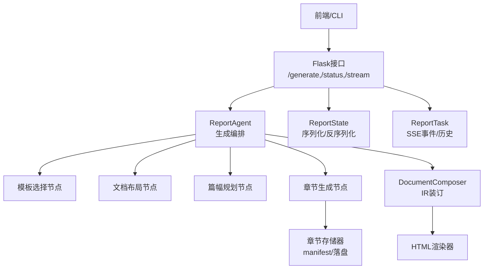
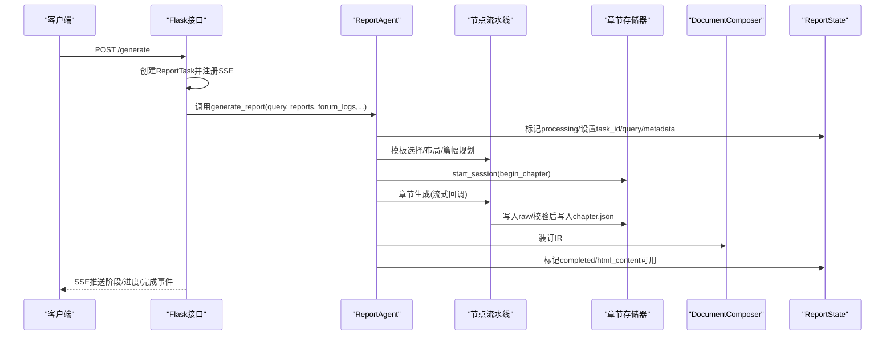
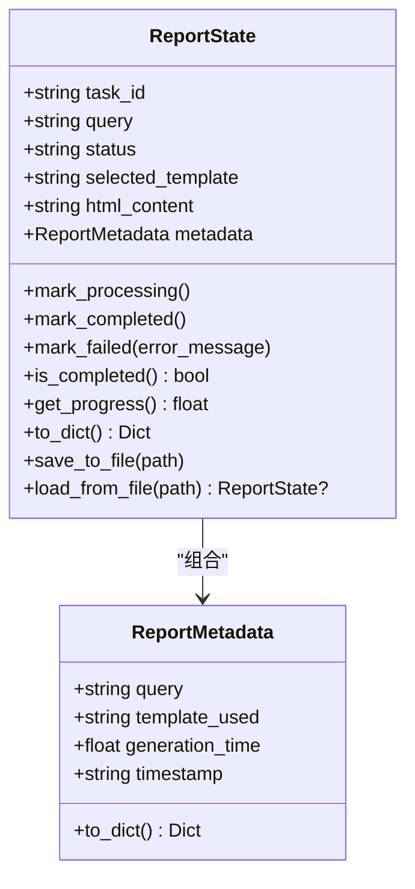
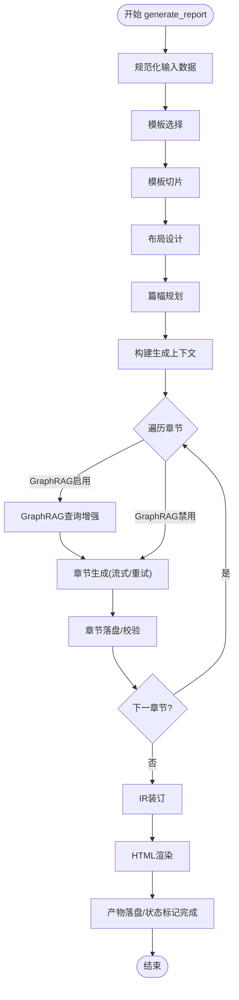
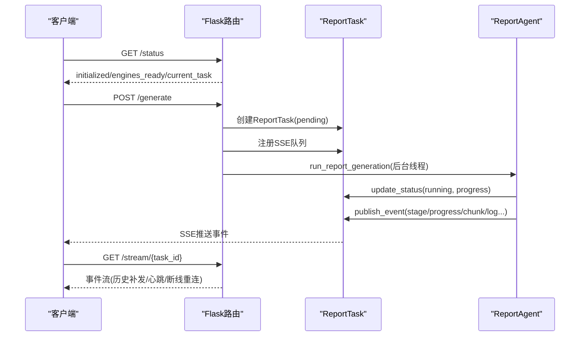
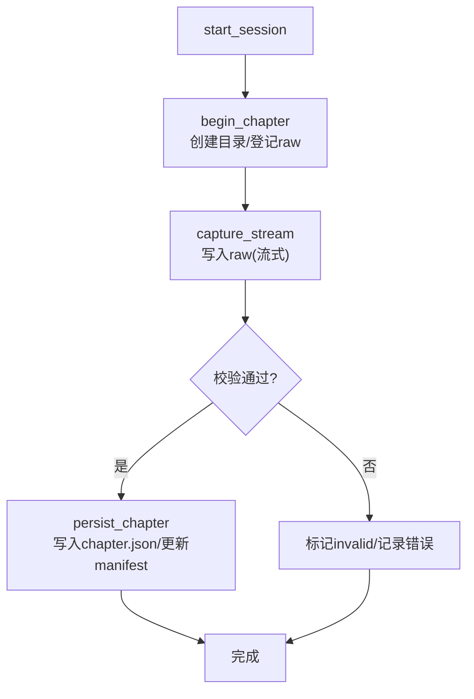
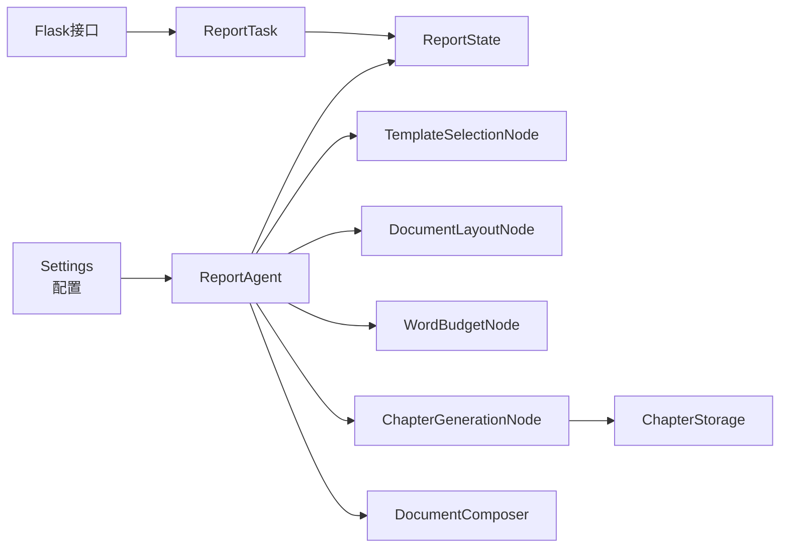

# 状态协调与生成控制

<cite>
**本文引用的文件**
- [ReportEngine/state/state.py](file://ReportEngine/state/state.py)
- [ReportEngine/agent.py](file://ReportEngine/agent.py)
- [ReportEngine/flask_interface.py](file://ReportEngine/flask_interface.py)
- [ReportEngine/utils/config.py](file://ReportEngine/utils/config.py)
- [ReportEngine/nodes/base_node.py](file://ReportEngine/nodes/base_node.py)
- [ReportEngine/nodes/chapter_generation_node.py](file://ReportEngine/nodes/chapter_generation_node.py)
- [ReportEngine/core/chapter_storage.py](file://ReportEngine/core/chapter_storage.py)
- [ReportEngine/core/stitcher.py](file://ReportEngine/core/stitcher.py)
</cite>

## 目录
1. [简介](#简介)
2. [项目结构](#项目结构)
3. [核心组件](#核心组件)
4. [架构总览](#架构总览)
5. [详细组件分析](#详细组件分析)
6. [依赖分析](#依赖分析)
7. [性能考虑](#性能考虑)
8. [故障排查指南](#故障排查指南)
9. [结论](#结论)
10. [附录](#附录)

## 简介
本文件聚焦 Report Engine 的“状态协调与生成控制”。围绕报告状态、章节状态与渲染状态的数据结构与流转，系统阐述状态在生成流程中的传递机制（生成进度、中间结果、最终输出）、状态持久化与并发控制、错误恢复策略，并提供状态序列化/反序列化与状态迁移的实现细节与优化建议。

## 项目结构
Report Engine 的状态与生成控制横跨以下模块：
- 状态定义与序列化：ReportEngine/state/state.py
- 生成编排与状态驱动：ReportEngine/agent.py
- 前后端交互与并发事件流：ReportEngine/flask_interface.py
- 配置与运行参数：ReportEngine/utils/config.py
- 节点抽象与状态变更接口：ReportEngine/nodes/base_node.py
- 章节生成与状态变更：ReportEngine/nodes/chapter_generation_node.py
- 章节落盘与清单管理：ReportEngine/core/chapter_storage.py
- 整本 IR 装订：ReportEngine/core/stitcher.py

**图表来源**
- [ReportEngine/flask_interface.py](file://ReportEngine/flask_interface.py#L246-L576)
- [ReportEngine/agent.py](file://ReportEngine/agent.py#L424-L800)
- [ReportEngine/state/state.py](file://ReportEngine/state/state.py#L30-L143)
- [ReportEngine/core/chapter_storage.py](file://ReportEngine/core/chapter_storage.py#L50-L291)
- [ReportEngine/core/stitcher.py](file://ReportEngine/core/stitcher.py#L15-L134)

**章节来源**
- [ReportEngine/flask_interface.py](file://ReportEngine/flask_interface.py#L246-L576)
- [ReportEngine/agent.py](file://ReportEngine/agent.py#L424-L800)
- [ReportEngine/state/state.py](file://ReportEngine/state/state.py#L30-L143)
- [ReportEngine/core/chapter_storage.py](file://ReportEngine/core/chapter_storage.py#L50-L291)
- [ReportEngine/core/stitcher.py](file://ReportEngine/core/stitcher.py#L15-L134)

## 核心组件
- 报告状态容器 ReportState：承载任务ID、查询、状态、输入输出、元数据，并提供进度计算、序列化/反序列化与保存/加载能力。
- 生成编排器 ReportAgent：串联模板选择、布局设计、篇幅规划、章节生成、IR装订与渲染，驱动状态变更与事件分发。
- 前端接口与并发控制 ReportTask/Flask：提供SSE事件流、任务历史、并发订阅与清理、日志转发。
- 章节存储 ChapterStorage：按章节流式写入 raw，校验后写入 chapter.json，并维护 manifest。
- 节点抽象 BaseNode/StateMutationNode：统一节点行为与状态变更接口。
- IR 装订 DocumentComposer：将章节合并为整本 IR，注入锚点、顺序与元数据。

**章节来源**
- [ReportEngine/state/state.py](file://ReportEngine/state/state.py#L30-L143)
- [ReportEngine/agent.py](file://ReportEngine/agent.py#L190-L252)
- [ReportEngine/flask_interface.py](file://ReportEngine/flask_interface.py#L274-L406)
- [ReportEngine/nodes/base_node.py](file://ReportEngine/nodes/base_node.py#L13-L108)
- [ReportEngine/core/chapter_storage.py](file://ReportEngine/core/chapter_storage.py#L50-L291)
- [ReportEngine/core/stitcher.py](file://ReportEngine/core/stitcher.py#L15-L134)

## 架构总览
Report Engine 的状态协调以 ReportState 为核心载体，在生成流程中贯穿“模板/内容”两阶段的粗略进度估计，并通过 ReportAgent 的事件回调与 Flask 的 SSE 推送，实现前端可观测与可恢复的生成过程。

**图表来源**
- [ReportEngine/flask_interface.py](file://ReportEngine/flask_interface.py#L436-L576)
- [ReportEngine/agent.py](file://ReportEngine/agent.py#L424-L800)
- [ReportEngine/core/chapter_storage.py](file://ReportEngine/core/chapter_storage.py#L73-L178)
- [ReportEngine/core/stitcher.py](file://ReportEngine/core/stitcher.py#L29-L79)
- [ReportEngine/state/state.py](file://ReportEngine/state/state.py#L61-L104)

## 详细组件分析

### 报告状态与元数据：ReportState
- 数据结构要点
  - 任务标识与查询：task_id、query
  - 状态机：pending → processing → completed 或 failed
  - 输入与输出：query_engine_report、media_engine_report、insight_engine_report、forum_logs、selected_template、html_content
  - 元数据：ReportMetadata（query、template_used、generation_time、timestamp）
- 进度与状态
  - get_progress：基于模板选择与HTML生成的粗略百分比
  - is_completed：状态为completed且存在HTML内容
- 序列化/持久化
  - to_dict：导出前端友好的状态字典
  - save_to_file/load_from_file：保存/加载状态文件（不包含html_content）

**图表来源**
- [ReportEngine/state/state.py](file://ReportEngine/state/state.py#L12-L143)

**章节来源**
- [ReportEngine/state/state.py](file://ReportEngine/state/state.py#L12-L143)

### 生成编排与状态驱动：ReportAgent
- 职责
  - 统一调度模板选择、布局设计、篇幅规划、章节生成、IR装订与渲染
  - 管理输入数据与状态，协调三个分析引擎、论坛日志与模板
  - 错误兜底、流式事件分发、落盘清单与最终成果保存
- 关键流程
  - 初始化：配置、LLM客户端、节点、章节存储、文件基准、状态容器
  - generate_report：规范化输入 → 模板选择 → 模板切片 → 布局设计 → 篇幅规划 → 章节生成（含GraphRAG增强）→ IR装订 → HTML渲染 → 产物落盘
  - 事件分发：emit回调将阶段/进度/章节增量/日志等事件推送到SSE
- 错误恢复
  - 章节生成阶段对结构异常进行重试与降级（内容稀疏、JSON解析失败、结构校验失败）
  - 支持跨引擎备用LLM客户端进行章节修复

**图表来源**
- [ReportEngine/agent.py](file://ReportEngine/agent.py#L424-L800)
- [ReportEngine/nodes/chapter_generation_node.py](file://ReportEngine/nodes/chapter_generation_node.py#L171-L200)

**章节来源**
- [ReportEngine/agent.py](file://ReportEngine/agent.py#L190-L252)
- [ReportEngine/agent.py](file://ReportEngine/agent.py#L424-L800)
- [ReportEngine/nodes/chapter_generation_node.py](file://ReportEngine/nodes/chapter_generation_node.py#L42-L90)

### 前后端交互与并发控制：ReportTask 与 Flask
- ReportTask
  - 任务生命周期：pending → running → completed/error
  - 事件历史：使用有界deque缓存最近事件，支持Last-Event-ID补发
  - 并发安全：事件队列与锁保护
- Flask 接口
  - /generate：创建任务、后台线程执行、SSE地址返回
  - /status：引擎就绪与当前任务信息
  - /stream：SSE事件流，心跳与断线重连
  - 任务清理：最多保留N个历史任务，避免内存膨胀
- 日志转发
  - 将Report Engine日志实时转发到SSE，过滤其他引擎日志

**图表来源**
- [ReportEngine/flask_interface.py](file://ReportEngine/flask_interface.py#L578-L750)
- [ReportEngine/flask_interface.py](file://ReportEngine/flask_interface.py#L750-L800)
- [ReportEngine/flask_interface.py](file://ReportEngine/flask_interface.py#L436-L576)

**章节来源**
- [ReportEngine/flask_interface.py](file://ReportEngine/flask_interface.py#L274-L406)
- [ReportEngine/flask_interface.py](file://ReportEngine/flask_interface.py#L578-L750)
- [ReportEngine/flask_interface.py](file://ReportEngine/flask_interface.py#L750-L800)

### 章节状态与持久化：ChapterStorage 与 ChapterRecord
- 会话与清单
  - start_session：为报告创建run目录与manifest快照
  - begin_chapter：创建章节目录，登记raw文件路径，状态为streaming
  - persist_chapter：写入最终chapter.json，更新manifest状态（ready/invalid）
- 文件与上下文
  - capture_stream：上下文管理器，将流式输出写入raw文件
  - _upsert_record：更新或追加章节记录，保证顺序一致并写回磁盘
- 读取与恢复
  - load_chapters：按order排序读取chapter.json，供IR装订使用

**图表来源**
- [ReportEngine/core/chapter_storage.py](file://ReportEngine/core/chapter_storage.py#L73-L178)
- [ReportEngine/core/chapter_storage.py](file://ReportEngine/core/chapter_storage.py#L209-L226)

**章节来源**
- [ReportEngine/core/chapter_storage.py](file://ReportEngine/core/chapter_storage.py#L18-L48)
- [ReportEngine/core/chapter_storage.py](file://ReportEngine/core/chapter_storage.py#L73-L178)
- [ReportEngine/core/chapter_storage.py](file://ReportEngine/core/chapter_storage.py#L180-L206)

### IR 装订与渲染状态：DocumentComposer
- 功能
  - 按order排序章节，补充默认chapterId
  - 防止anchor重复，生成全局唯一锚点
  - 注入 IR 版本与生成时间戳，合并metadata/themeTokens/assets
- 与章节存储的关系
  - 从ChapterStorage.load_chapters读取章节，组装为整本IR供渲染器消费

**章节来源**
- [ReportEngine/core/stitcher.py](file://ReportEngine/core/stitcher.py#L29-L79)

### 节点抽象与状态变更：BaseNode 与 StateMutationNode
- BaseNode
  - 统一日志、输入校验、输出处理与LLM客户端依赖注入
- StateMutationNode
  - 适用于需要直接写入 ReportState 的节点，定义 mutate_state 接口

**章节来源**
- [ReportEngine/nodes/base_node.py](file://ReportEngine/nodes/base_node.py#L13-L108)

## 依赖分析
- 组件耦合
  - ReportAgent 依赖 ReportState、节点集合、章节存储、IR校验器、渲染器
  - Flask 层通过 ReportTask 与 ReportAgent 解耦，仅通过事件回调与状态容器交互
  - 章节生成节点依赖 ChapterStorage 与 IRValidator，负责落盘与校验
- 并发与一致性
  - Flask 层使用线程锁与有界事件队列，避免竞态与内存泄漏
  - ReportTask 的事件历史与Last-Event-ID保障断线重连一致性
- 外部依赖
  - 配置通过 Settings 统一读取，影响API超时、重试、输出目录、GraphRAG开关等

**图表来源**
- [ReportEngine/utils/config.py](file://ReportEngine/utils/config.py#L12-L85)
- [ReportEngine/agent.py](file://ReportEngine/agent.py#L203-L252)
- [ReportEngine/flask_interface.py](file://ReportEngine/flask_interface.py#L274-L406)

**章节来源**
- [ReportEngine/utils/config.py](file://ReportEngine/utils/config.py#L12-L85)
- [ReportEngine/agent.py](file://ReportEngine/agent.py#L203-L252)
- [ReportEngine/flask_interface.py](file://ReportEngine/flask_interface.py#L274-L406)

## 性能考虑
- 进度估算
  - ReportState.get_progress 以模板/内容两阶段粗略估算，适合前端反馈
- 事件流与日志
  - Flask 层使用行缓冲与同步写入，保证前端实时可见
  - 日志过滤避免其他引擎日志干扰
- 章节落盘
  - 流式写入 raw，校验通过后写入 chapter.json，降低内存压力
- 重试与退避
  - 章节生成阶段对结构异常进行有限重试，指数退避缓解限流
- 任务清理
  - 限制历史任务数量，避免长期运行内存膨胀

[本节为通用性能建议，不直接分析具体文件]

## 故障排查指南
- 常见异常与恢复
  - 章节JSON解析失败：ChapterJsonParseError，触发重试或备用LLM通道
  - 章节内容稀疏：ChapterContentError，记录正文特征，达到阈值后触发备用策略
  - 结构校验失败：ChapterValidationError，记录错误列表，触发章节级重试
- 日志与事件
  - 使用 /status 查看引擎就绪与当前任务
  - 通过 /stream/{task_id} 观察事件流，结合 Last-Event-ID 进行断线重连
  - 日志转发仅显示 Report Engine 相关信息，便于定位问题
- 状态文件
  - ReportState.save_to_file/load_from_file 用于调试与恢复，注意不包含html_content

**章节来源**
- [ReportEngine/nodes/chapter_generation_node.py](file://ReportEngine/nodes/chapter_generation_node.py#L42-L90)
- [ReportEngine/flask_interface.py](file://ReportEngine/flask_interface.py#L578-L750)
- [ReportEngine/state/state.py](file://ReportEngine/state/state.py#L106-L143)

## 结论
Report Engine 的状态协调以 ReportState 为核心，结合 ReportAgent 的节点编排、ChapterStorage 的章节落盘与 IR 装订，以及 Flask 的并发事件流，实现了可观测、可恢复、可调试的报告生成体系。通过合理的进度估算、事件历史与断线重连机制、章节级重试与备用通道，系统在复杂生成流程中保持稳定性与用户体验。

[本节为总结性内容，不直接分析具体文件]

## 附录

### 状态序列化与反序列化
- ReportState.to_dict：导出前端所需的关键字段（不含html_content）
- ReportState.save_to_file/load_from_file：保存/加载状态文件（不含html_content），便于调试与恢复

**章节来源**
- [ReportEngine/state/state.py](file://ReportEngine/state/state.py#L93-L143)

### 状态迁移与转换
- 状态机：pending → processing → completed 或 failed
- 进度迁移：模板选择（约30%）→ HTML生成（约70%），最终100%
- 章节状态：streaming → ready/invalid，由 ChapterStorage 维护 manifest

**章节来源**
- [ReportEngine/state/state.py](file://ReportEngine/state/state.py#L61-L92)
- [ReportEngine/core/chapter_storage.py](file://ReportEngine/core/chapter_storage.py#L119-L178)