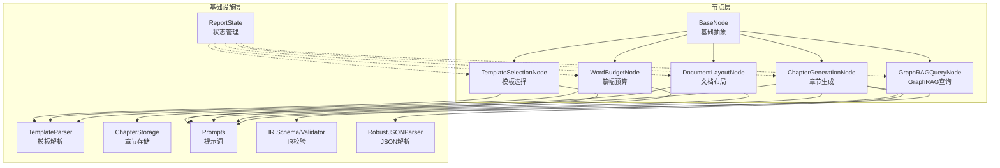
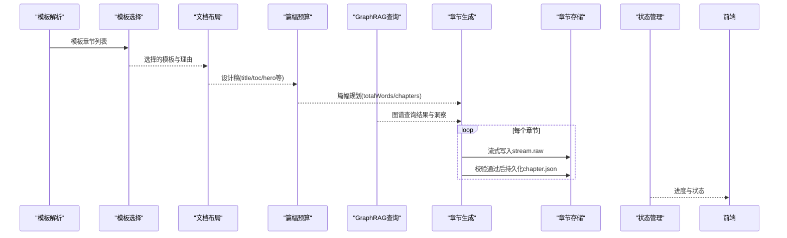
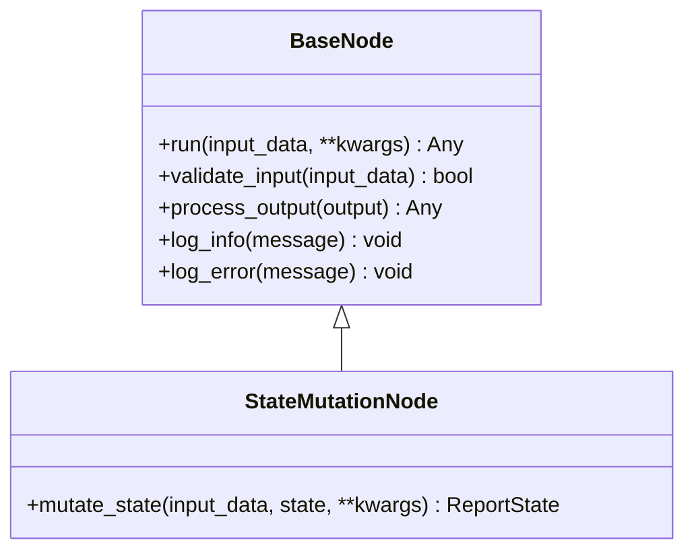
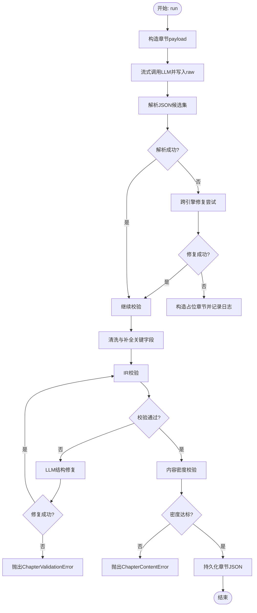
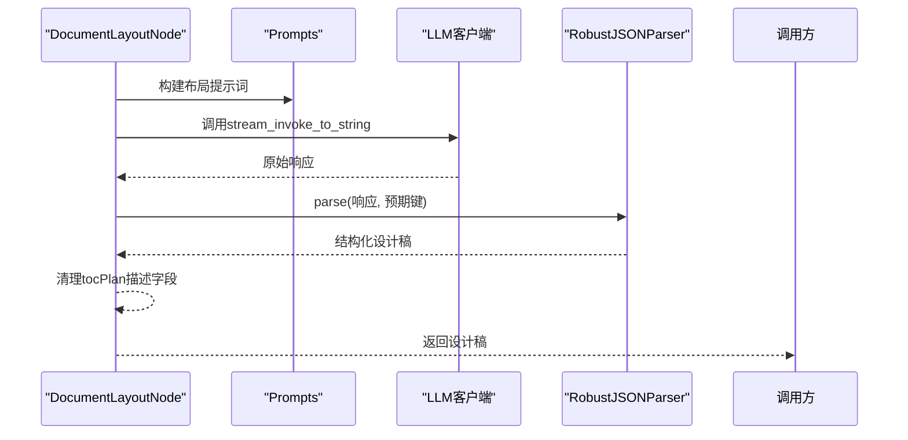
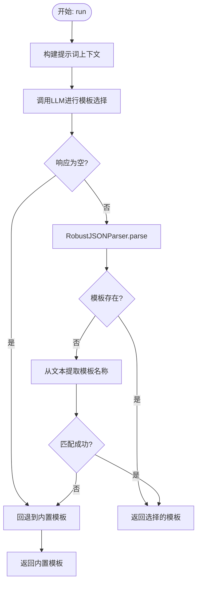
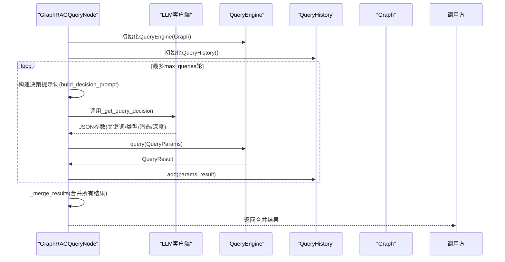
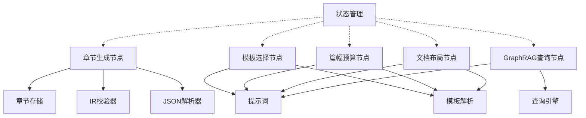

# 生成节点系统

<cite>
**本文档引用的文件**
- [ReportEngine/nodes/base_node.py](file://ReportEngine/nodes/base_node.py)
- [ReportEngine/nodes/chapter_generation_node.py](file://ReportEngine/nodes/chapter_generation_node.py)
- [ReportEngine/nodes/document_layout_node.py](file://ReportEngine/nodes/document_layout_node.py)
- [ReportEngine/nodes/graphrag_query_node.py](file://ReportEngine/nodes/graphrag_query_node.py)
- [ReportEngine/nodes/template_selection_node.py](file://ReportEngine/nodes/template_selection_node.py)
- [ReportEngine/nodes/word_budget_node.py](file://ReportEngine/nodes/word_budget_node.py)
- [ReportEngine/core/chapter_storage.py](file://ReportEngine/core/chapter_storage.py)
- [ReportEngine/state/state.py](file://ReportEngine/state/state.py)
- [ReportEngine/prompts/prompts.py](file://ReportEngine/prompts/prompts.py)
- [ReportEngine/utils/json_parser.py](file://ReportEngine/utils/json_parser.py)
- [ReportEngine/ir/schema.py](file://ReportEngine/ir/schema.py)
- [ReportEngine/ir/validator.py](file://ReportEngine/ir/validator.py)
- [ReportEngine/core/template_parser.py](file://ReportEngine/core/template_parser.py)
</cite>

## 目录
1. [简介](#简介)
2. [项目结构](#项目结构)
3. [核心组件](#核心组件)
4. [架构总览](#架构总览)
5. [详细组件分析](#详细组件分析)
6. [依赖关系分析](#依赖关系分析)
7. [性能考虑](#性能考虑)
8. [故障排除指南](#故障排除指南)
9. [结论](#结论)
10. [附录](#附录)

## 简介
本文件系统化阐述 Report Engine 的生成节点体系，围绕节点化生成架构的设计理念，深入解析 BaseNode 基类的抽象设计与各生成节点的实现细节。文档涵盖章节生成节点的内容组织算法、文档布局节点的版面设计机制、模板选择节点的适配逻辑、篇幅预算节点的长度控制策略，以及 GraphRAG 查询节点的知识整合算法。同时阐明节点间的协作关系与数据流转机制，提供节点扩展与自定义生成逻辑的开发指导，并总结错误处理机制、重试策略与流式回调功能。

## 项目结构
Report Engine 的生成节点系统位于 ReportEngine/nodes 目录，配合核心基础设施（模板解析、章节存储、状态管理、提示词与校验）共同构成完整的生成流水线。主要模块包括：
- 节点基类与通用能力：base_node.py
- 章节生成节点：chapter_generation_node.py
- 文档布局节点：document_layout_node.py
- 模板选择节点：template_selection_node.py
- 篇幅预算节点：word_budget_node.py
- GraphRAG 查询节点：graphrag_query_node.py
- 核心基础设施：chapter_storage.py、template_parser.py
- 状态管理：state.py
- 提示词与Schema：prompts.py、ir/schema.py、ir/validator.py
- JSON解析与修复：utils/json_parser.py

**图表来源**
- [ReportEngine/nodes/base_node.py](file://ReportEngine/nodes/base_node.py#L13-L108)
- [ReportEngine/nodes/template_selection_node.py](file://ReportEngine/nodes/template_selection_node.py#L18-L287)
- [ReportEngine/nodes/word_budget_node.py](file://ReportEngine/nodes/word_budget_node.py#L21-L127)
- [ReportEngine/nodes/document_layout_node.py](file://ReportEngine/nodes/document_layout_node.py#L21-L209)
- [ReportEngine/nodes/chapter_generation_node.py](file://ReportEngine/nodes/chapter_generation_node.py#L92-L295)
- [ReportEngine/nodes/graphrag_query_node.py](file://ReportEngine/nodes/graphrag_query_node.py#L95-L227)
- [ReportEngine/core/template_parser.py](file://ReportEngine/core/template_parser.py#L87-L142)
- [ReportEngine/core/chapter_storage.py](file://ReportEngine/core/chapter_storage.py#L50-L291)
- [ReportEngine/state/state.py](file://ReportEngine/state/state.py#L31-L143)
- [ReportEngine/prompts/prompts.py](file://ReportEngine/prompts/prompts.py#L1-L641)
- [ReportEngine/ir/schema.py](file://ReportEngine/ir/schema.py#L1-L546)
- [ReportEngine/ir/validator.py](file://ReportEngine/ir/validator.py#L21-L339)
- [ReportEngine/utils/json_parser.py](file://ReportEngine/utils/json_parser.py#L40-L764)

**章节来源**
- [ReportEngine/nodes/__init__.py](file://ReportEngine/nodes/__init__.py#L1-L32)

## 核心组件
本节聚焦节点基类与通用能力，奠定后续各节点实现的统一抽象与约定。

- BaseNode 基类
  - 统一日志、输入校验与输出处理接口，屏蔽 LLM 客户端依赖注入，使节点专注于业务逻辑。
  - 提供日志记录方法与错误记录方法，统一输出前缀，便于排障。
  - validate_input 与 process_output 可由子类覆写，实现结构化或校验。
- StateMutationNode 子类
  - 专用于需要直接写入 ReportState 的场景，定义 mutate_state 抽象方法，返回新的状态对象或在原地修改后回传。

这些抽象确保节点具备一致的生命周期管理、错误处理与状态变更能力，为流水线的稳定运行提供保障。

**章节来源**
- [ReportEngine/nodes/base_node.py](file://ReportEngine/nodes/base_node.py#L13-L108)

## 架构总览
生成节点系统采用“节点化流水线”的架构，各节点围绕统一的输入/输出契约与提示词规范协同工作。整体流程如下：
- 模板解析：将 Markdown 模板切分为结构化章节队列，提供章节元信息与提纲。
- 模板选择：综合用户查询、三引擎报告与论坛日志，选择最合适的报告骨架。
- 文档布局：结合模板与多源内容，生成整本报告的标题、目录与主题设计。
- 篇幅预算：根据设计稿与素材，规划各章节字数与重点，指导生成阶段的长度控制。
- 章节生成：按章节调用 LLM，流式写入 raw 文件，解析/修复 JSON，校验 IR 合规性，落盘标准化 JSON。
- GraphRAG 查询：与知识图谱交互，多轮决策查询，整合跨引擎洞察，增强章节内容。
- 状态管理：贯穿全流程的状态记录与进度计算，便于前端展示与后台线程调度。

**图表来源**
- [ReportEngine/core/template_parser.py](file://ReportEngine/core/template_parser.py#L87-L142)
- [ReportEngine/nodes/template_selection_node.py](file://ReportEngine/nodes/template_selection_node.py#L43-L79)
- [ReportEngine/nodes/document_layout_node.py](file://ReportEngine/nodes/document_layout_node.py#L38-L86)
- [ReportEngine/nodes/word_budget_node.py](file://ReportEngine/nodes/word_budget_node.py#L38-L83)
- [ReportEngine/nodes/graphrag_query_node.py](file://ReportEngine/nodes/graphrag_query_node.py#L111-L227)
- [ReportEngine/nodes/chapter_generation_node.py](file://ReportEngine/nodes/chapter_generation_node.py#L171-L294)
- [ReportEngine/core/chapter_storage.py](file://ReportEngine/core/chapter_storage.py#L130-L178)
- [ReportEngine/state/state.py](file://ReportEngine/state/state.py#L78-L91)

## 详细组件分析

### BaseNode 基类与扩展点
- 统一接口
  - run 方法：执行节点处理逻辑，接收输入数据与可选参数，返回处理结果。
  - validate_input/process_output：默认通过，子类可覆写实现字段检查与结构化处理。
- 日志与错误
  - log_info/log_error：自动附加节点名前缀，便于定位问题。
- 状态变更
  - StateMutationNode：定义 mutate_state 抽象方法，用于直接写入 ReportState 的场景。

**图表来源**
- [ReportEngine/nodes/base_node.py](file://ReportEngine/nodes/base_node.py#L13-L108)

**章节来源**
- [ReportEngine/nodes/base_node.py](file://ReportEngine/nodes/base_node.py#L13-L108)

### 章节生成节点（ChapterGenerationNode）
- 核心职责
  - 构造章节级 payload 与提示词，流式写入 raw 文件并透传 delta。
  - 尝试修复/解析 LLM 输出，使用 IRValidator 校验，对 block 结构做容错修复，确保最终 JSON 可渲染。
- 输入/输出
  - 输入：TemplateSection、上下文（主题、篇幅、布局等）、运行目录、可选流式回调。
  - 输出：通过 IR 校验的章节 JSON。
- 关键机制
  - 流式回调：将 delta 推送给前端，支持 SSE。
  - 跨引擎修复：当章节 JSON 无法解析时，依次调用 Report/Forum/Insight/Media 四套 API 尝试修复。
  - 占位章节：修复失败时构造可渲染的占位章节，并记录错误日志文件。
  - 内容密度校验：对正文字符数、叙事字符数与非标题块数量进行阈值检查，不足则触发重试。
- 异常体系
  - ChapterJsonParseError：章节 LLM 输出无法解析为合法 JSON。
  - ChapterContentError：章节内容稀疏，正文密度不足或仅有标题。
  - ChapterValidationError：章节结构在本地和 LLM 修复后仍无法通过校验。

**图表来源**
- [ReportEngine/nodes/chapter_generation_node.py](file://ReportEngine/nodes/chapter_generation_node.py#L171-L294)
- [ReportEngine/core/chapter_storage.py](file://ReportEngine/core/chapter_storage.py#L130-L178)
- [ReportEngine/ir/validator.py](file://ReportEngine/ir/validator.py#L37-L55)

**章节来源**
- [ReportEngine/nodes/chapter_generation_node.py](file://ReportEngine/nodes/chapter_generation_node.py#L92-L295)
- [ReportEngine/core/chapter_storage.py](file://ReportEngine/core/chapter_storage.py#L50-L291)
- [ReportEngine/ir/validator.py](file://ReportEngine/ir/validator.py#L21-L339)

### 文档布局节点（DocumentLayoutNode）
- 核心职责
  - 综合模板与多源报告，生成整本报告的标题、目录与 Hero 设计。
- 输入/输出
  - 输入：模板切片后的章节列表、模板 Markdown、三引擎报告、论坛日志、查询词、可选模板概览。
  - 输出：包含 title/subtitle/tocPlan/hero/themeTokens 等设计信息的字典。
- 关键机制
  - 使用鲁棒 JSON 解析器进行多重修复（清理 markdown 标记、语法修复、json_repair、可选 LLM 修复）。
  - tocPlan 描述字段清理，确保纯文本描述，避免嵌入 JSON 片段。

**图表来源**
- [ReportEngine/nodes/document_layout_node.py](file://ReportEngine/nodes/document_layout_node.py#L38-L136)
- [ReportEngine/prompts/prompts.py](file://ReportEngine/prompts/prompts.py#L507-L514)
- [ReportEngine/utils/json_parser.py](file://ReportEngine/utils/json_parser.py#L86-L164)

**章节来源**
- [ReportEngine/nodes/document_layout_node.py](file://ReportEngine/nodes/document_layout_node.py#L21-L209)
- [ReportEngine/utils/json_parser.py](file://ReportEngine/utils/json_parser.py#L40-L764)

### 模板选择节点（TemplateSelectionNode）
- 核心职责
  - 综合用户查询、三引擎报告与论坛日志，调用 LLM 选择最合适的报告骨架。
- 输入/输出
  - 输入：包含 query、reports、forum_logs 的字典。
  - 输出：选择的模板信息（名称、内容与选择理由）。
- 关键机制
  - 可用模板枚举与描述生成，支持回退到内置模板。
  - LLM 模板选择失败时的降级策略（回退模板）。
  - 文本响应中的模板名称关键字匹配，实现从文本提取模板信息的降级。

**图表来源**
- [ReportEngine/nodes/template_selection_node.py](file://ReportEngine/nodes/template_selection_node.py#L43-L181)
- [ReportEngine/utils/json_parser.py](file://ReportEngine/utils/json_parser.py#L86-L164)

**章节来源**
- [ReportEngine/nodes/template_selection_node.py](file://ReportEngine/nodes/template_selection_node.py#L18-L287)

### 篇幅预算节点（WordBudgetNode）
- 核心职责
  - 根据设计稿与素材规划各章节字数，输出总字数、全局写作准则与逐章字数约束。
- 输入/输出
  - 输入：模板章节列表、布局设计稿、三引擎报告、论坛日志、查询词、可选模板概览。
  - 输出：包含 totalWords、globalGuidelines 与 chapters 的篇幅规划结果。
- 关键机制
  - 使用鲁棒 JSON 解析器进行多重修复，验证关键字段类型与完整性。

**章节来源**
- [ReportEngine/nodes/word_budget_node.py](file://ReportEngine/nodes/word_budget_node.py#L21-L127)
- [ReportEngine/utils/json_parser.py](file://ReportEngine/utils/json_parser.py#L40-L764)

### GraphRAG 查询节点（GraphRAGQueryNode）
- 核心职责
  - 与知识图谱交互，让 LLM 决定查询参数并执行多轮查询，维护查询历史防止重复，整合跨引擎洞察。
- 输入/输出
  - 输入：当前章节信息、生成上下文、图谱对象、最大查询轮次。
  - 输出：合并后的查询结果（matched_sections/matched_queries/matched_sources/total_nodes/cross_engine_insights）。
- 关键机制
  - 查询历史记录器：记录每次查询的参数与结果摘要，生成供 LLM 参考的历史上下文。
  - LLM 决策：将章节目标、图谱概览、历史查询摘要整合为提示词，指导 LLM 生成下一轮 QueryParams。
  - 结果合并与去重：按 id 去重合并段落、搜索词与来源，生成跨引擎洞察。

**图表来源**
- [ReportEngine/nodes/graphrag_query_node.py](file://ReportEngine/nodes/graphrag_query_node.py#L111-L227)
- [ReportEngine/nodes/graphrag_query_node.py](file://ReportEngine/nodes/graphrag_query_node.py#L229-L281)
- [ReportEngine/nodes/graphrag_query_node.py](file://ReportEngine/nodes/graphrag_query_node.py#L329-L374)

**章节来源**
- [ReportEngine/nodes/graphrag_query_node.py](file://ReportEngine/nodes/graphrag_query_node.py#L95-L402)

## 依赖关系分析
- 节点与基础设施
  - 章节生成节点依赖章节存储（落盘与清单管理）、IR 校验器（结构合规性）、鲁棒 JSON 解析器（修复与解析）。
  - 模板选择与篇幅预算节点依赖提示词模块与鲁棒 JSON 解析器。
  - 文档布局节点依赖提示词模块与鲁棒 JSON 解析器。
  - GraphRAG 查询节点依赖提示词模块、查询引擎与知识日志记录。
- 节点间耦合
  - 模板解析为模板选择与篇幅预算提供输入；文档布局为篇幅预算提供设计稿；章节生成依赖前述所有上游结果。
  - GraphRAG 查询结果作为增强信息注入章节生成，提升内容质量与一致性。
- 状态管理
  - ReportState 提供任务状态、进度与元数据，贯穿各节点，便于前端展示与后台线程调度。

**图表来源**
- [ReportEngine/nodes/chapter_generation_node.py](file://ReportEngine/nodes/chapter_generation_node.py#L135-L170)
- [ReportEngine/nodes/template_selection_node.py](file://ReportEngine/nodes/template_selection_node.py#L26-L42)
- [ReportEngine/nodes/word_budget_node.py](file://ReportEngine/nodes/word_budget_node.py#L28-L36)
- [ReportEngine/nodes/document_layout_node.py](file://ReportEngine/nodes/document_layout_node.py#L28-L36)
- [ReportEngine/nodes/graphrag_query_node.py](file://ReportEngine/nodes/graphrag_query_node.py#L108-L110)
- [ReportEngine/core/chapter_storage.py](file://ReportEngine/core/chapter_storage.py#L60-L70)
- [ReportEngine/ir/validator.py](file://ReportEngine/ir/validator.py#L31-L33)
- [ReportEngine/utils/json_parser.py](file://ReportEngine/utils/json_parser.py#L65-L84)
- [ReportEngine/prompts/prompts.py](file://ReportEngine/prompts/prompts.py#L1-L641)
- [ReportEngine/core/template_parser.py](file://ReportEngine/core/template_parser.py#L87-L142)
- [ReportEngine/state/state.py](file://ReportEngine/state/state.py#L31-L143)

**章节来源**
- [ReportEngine/nodes/__init__.py](file://ReportEngine/nodes/__init__.py#L1-L32)

## 性能考虑
- 流式生成与落盘
  - 章节生成节点采用流式写入 raw 文件，降低内存占用，提升大体量报告的生成效率。
- JSON 解析与修复
  - 鲁棒 JSON 解析器集成多策略修复（本地语法修复、json_repair、可选 LLM 修复），在保证准确性的同时减少失败重试成本。
- 查询轮次控制
  - GraphRAG 查询节点限制最大查询轮次，结合查询历史防止重复查询，平衡质量与性能。
- 结构化校验
  - IR 校验器在落盘前进行轻量级结构校验，避免渲染期崩溃，减少返工成本。

[本节为通用性能讨论，不直接分析具体文件]

## 故障排除指南
- 章节生成异常
  - JSON 解析失败：检查 ChapterJsonParseError 与跨引擎修复日志，确认是否触发占位章节与错误日志记录。
  - 内容稀疏：关注 ChapterContentError，检查正文字符数与非标题块数量阈值，必要时调整篇幅预算或提示词。
  - 校验失败：使用 LLM 结构修复或查看 IR 校验器错误路径，修正 block 结构与字段。
- 模板选择失败
  - LLM 返回空或解析失败：启用回退模板，检查可用模板枚举与描述生成逻辑。
- 文档布局与篇幅预算
  - JSON 解析失败：检查鲁棒 JSON 解析器的修复策略与预期键，确保输出符合 Schema。
- GraphRAG 查询
  - LLM 决策解析失败：检查提示词构建与 JSON 提取逻辑，确保 QueryParams 合法。
- 状态与进度
  - ReportState 提供进度计算与状态标记，便于前端展示与后台线程调度。

**章节来源**
- [ReportEngine/nodes/chapter_generation_node.py](file://ReportEngine/nodes/chapter_generation_node.py#L42-L91)
- [ReportEngine/nodes/template_selection_node.py](file://ReportEngine/nodes/template_selection_node.py#L74-L78)
- [ReportEngine/nodes/document_layout_node.py](file://ReportEngine/nodes/document_layout_node.py#L133-L135)
- [ReportEngine/nodes/word_budget_node.py](file://ReportEngine/nodes/word_budget_node.py#L121-L123)
- [ReportEngine/nodes/graphrag_query_node.py](file://ReportEngine/nodes/graphrag_query_node.py#L298-L327)
- [ReportEngine/state/state.py](file://ReportEngine/state/state.py#L78-L91)

## 结论
Report Engine 的生成节点系统通过统一的节点基类抽象、完善的错误处理与重试策略、鲁棒的 JSON 解析与 IR 校验，以及清晰的提示词与 Schema 约束，实现了高质量、可扩展的报告生成流水线。章节生成节点的内容组织算法、文档布局节点的版面设计机制、模板选择节点的适配逻辑、篇幅预算节点的长度控制策略与 GraphRAG 查询节点的知识整合算法，共同构成了稳健的节点化生成架构。开发者可基于 BaseNode 扩展新节点，遵循统一的输入/输出契约与提示词规范，快速接入新的生成能力。

[本节为总结性内容，不直接分析具体文件]

## 附录
- 开发指导
  - 扩展新节点：继承 BaseNode 或 StateMutationNode，实现 run/mutate_state、validate_input/process_output 与日志记录。
  - 集成提示词：在 prompts 模块中定义系统提示词与 Schema，使用 build_*_prompt 构造输入。
  - JSON 解析：优先使用 RobustJSONParser，确保多策略修复与错误定位。
  - IR 校验：在落盘前调用 IRValidator.validate_chapter，确保结构合规。
  - 流式回调：在章节生成节点中实现流式回调，将 delta 推送给前端。
  - 错误处理：定义专用异常类型，记录错误日志并触发重试或占位策略。
- 相关文件索引
  - 节点基类与扩展：[ReportEngine/nodes/base_node.py](file://ReportEngine/nodes/base_node.py#L13-L108)
  - 章节生成：[ReportEngine/nodes/chapter_generation_node.py](file://ReportEngine/nodes/chapter_generation_node.py#L92-L295)
  - 文档布局：[ReportEngine/nodes/document_layout_node.py](file://ReportEngine/nodes/document_layout_node.py#L21-L209)
  - 模板选择：[ReportEngine/nodes/template_selection_node.py](file://ReportEngine/nodes/template_selection_node.py#L18-L287)
  - 篇幅预算：[ReportEngine/nodes/word_budget_node.py](file://ReportEngine/nodes/word_budget_node.py#L21-L127)
  - GraphRAG 查询：[ReportEngine/nodes/graphrag_query_node.py](file://ReportEngine/nodes/graphrag_query_node.py#L95-L402)
  - 章节存储：[ReportEngine/core/chapter_storage.py](file://ReportEngine/core/chapter_storage.py#L50-L291)
  - 模板解析：[ReportEngine/core/template_parser.py](file://ReportEngine/core/template_parser.py#L87-L303)
  - 状态管理：[ReportEngine/state/state.py](file://ReportEngine/state/state.py#L31-L143)
  - 提示词与 Schema：[ReportEngine/prompts/prompts.py](file://ReportEngine/prompts/prompts.py#L1-L641)、[ReportEngine/ir/schema.py](file://ReportEngine/ir/schema.py#L1-L546)
  - IR 校验器：[ReportEngine/ir/validator.py](file://ReportEngine/ir/validator.py#L21-L339)
  - JSON 解析器：[ReportEngine/utils/json_parser.py](file://ReportEngine/utils/json_parser.py#L40-L764)

[本节为附录内容，不直接分析具体文件]