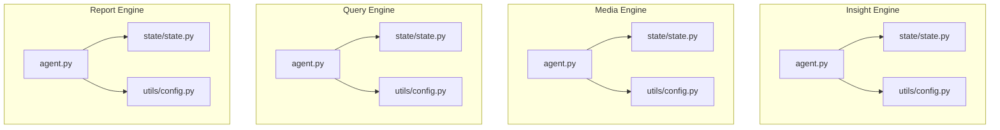
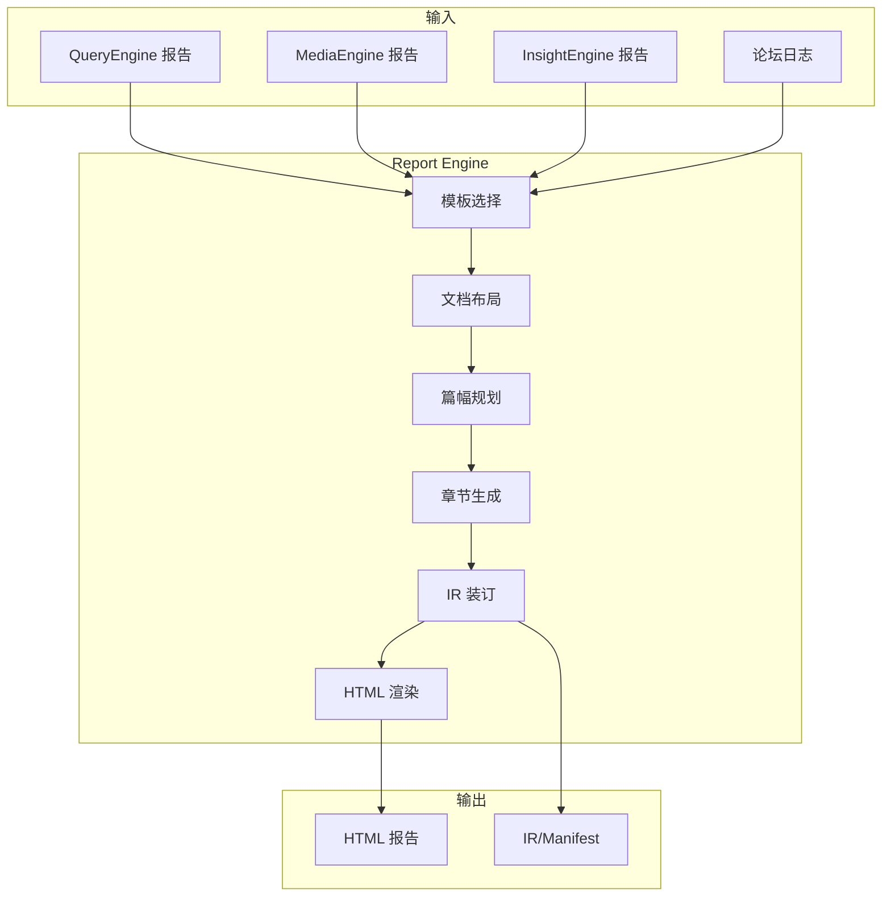
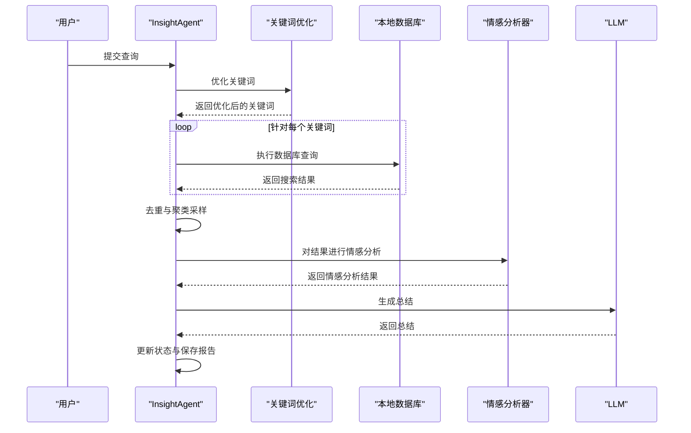
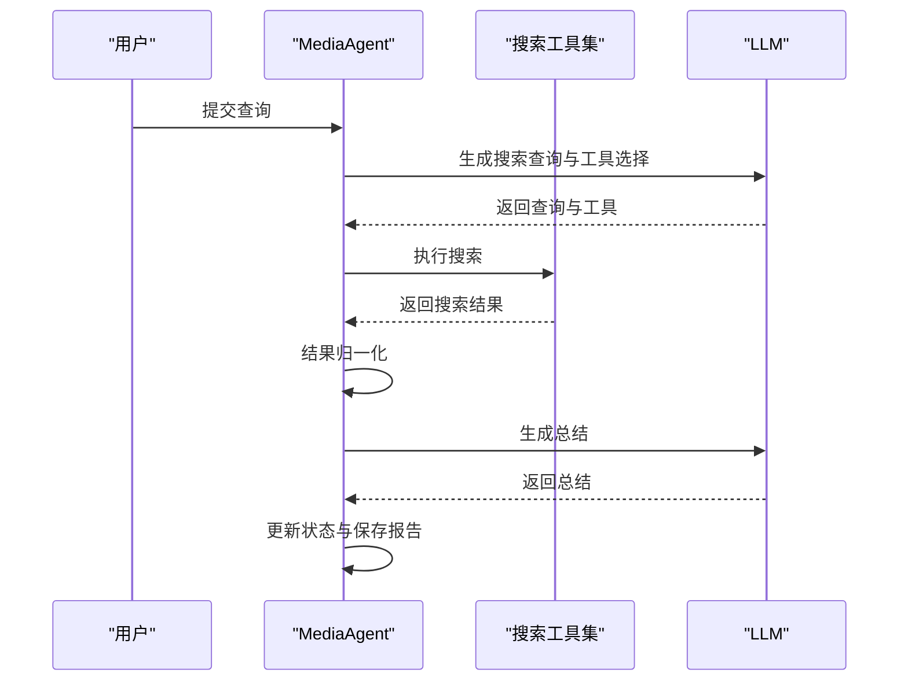
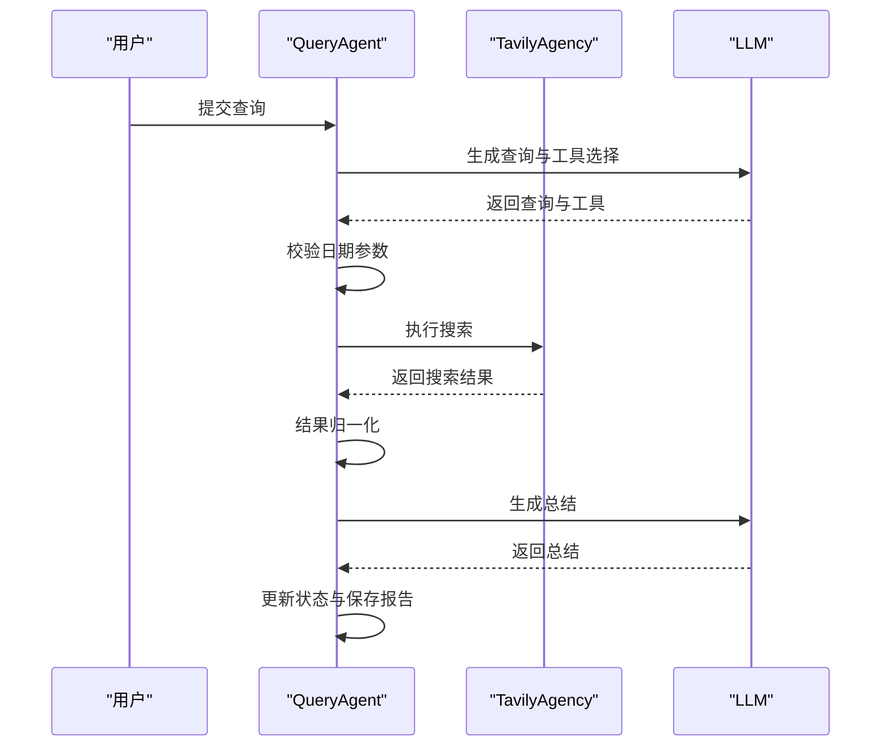
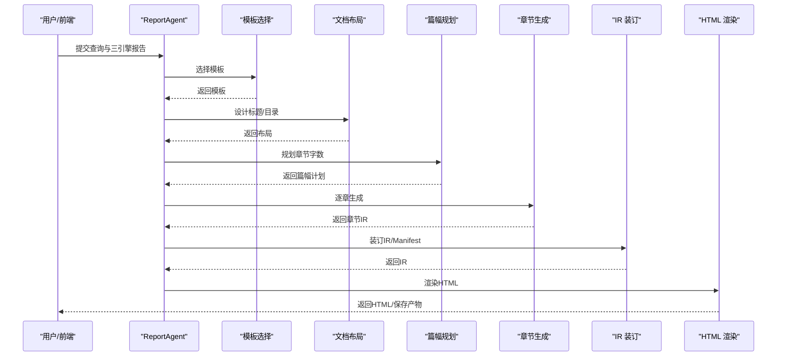
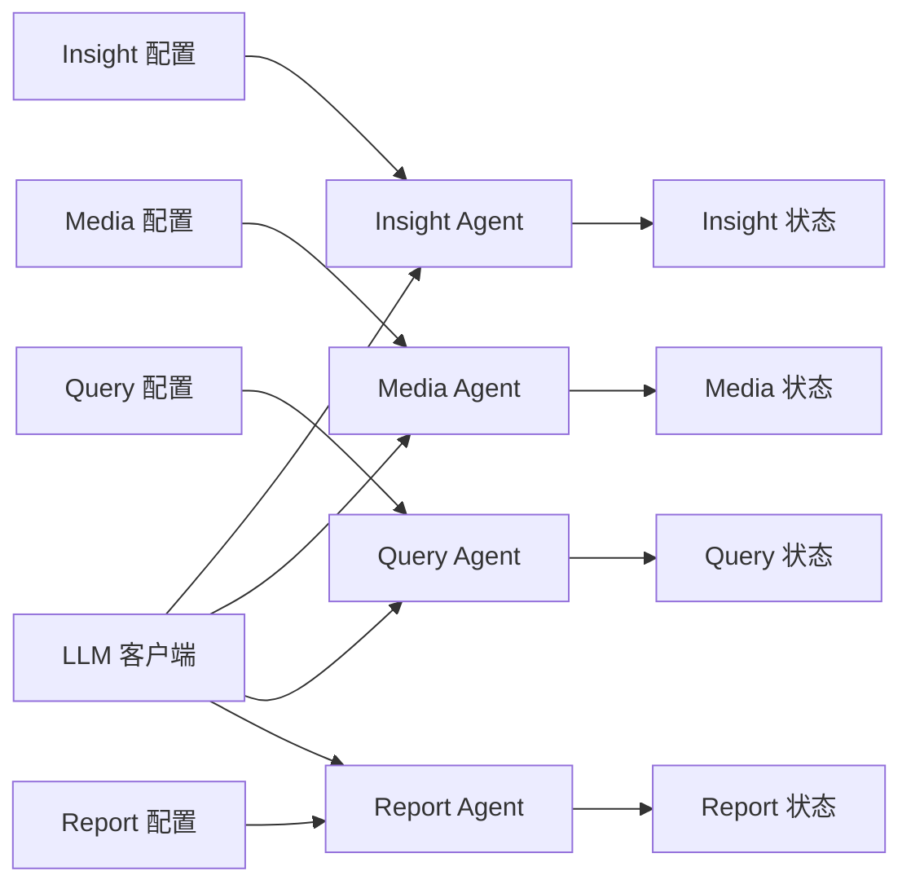

# 核心引擎模块

<cite>
**本文档引用的文件**
- [InsightEngine/__init__.py](file://InsightEngine/__init__.py)
- [InsightEngine/agent.py](file://InsightEngine/agent.py)
- [InsightEngine/utils/config.py](file://InsightEngine/utils/config.py)
- [InsightEngine/state/state.py](file://InsightEngine/state/state.py)
- [MediaEngine/__init__.py](file://MediaEngine/__init__.py)
- [MediaEngine/agent.py](file://MediaEngine/agent.py)
- [MediaEngine/utils/config.py](file://MediaEngine/utils/config.py)
- [MediaEngine/state/state.py](file://MediaEngine/state/state.py)
- [QueryEngine/__init__.py](file://QueryEngine/__init__.py)
- [QueryEngine/agent.py](file://QueryEngine/agent.py)
- [QueryEngine/utils/config.py](file://QueryEngine/utils/config.py)
- [QueryEngine/state/state.py](file://QueryEngine/state/state.py)
- [ReportEngine/__init__.py](file://ReportEngine/__init__.py)
- [ReportEngine/agent.py](file://ReportEngine/agent.py)
- [ReportEngine/utils/config.py](file://ReportEngine/utils/config.py)
- [ReportEngine/state/state.py](file://ReportEngine/state/state.py)
</cite>

## 目录
1. [简介](#简介)
2. [项目结构](#项目结构)
3. [核心组件](#核心组件)
4. [架构总览](#架构总览)
5. [详细组件分析](#详细组件分析)
6. [依赖关系分析](#依赖关系分析)
7. [性能考虑](#性能考虑)
8. [故障排除指南](#故障排除指南)
9. [结论](#结论)
10. [附录](#附录)

## 简介
本文件为 BettaFish 核心引擎模块的综合性技术文档，聚焦四大引擎：Insight Engine（私有数据库挖掘）、Media Engine（多模态内容分析）、Query Engine（精准信息搜索）与 Report Engine（智能报告生成）。文档从架构设计、数据流、状态管理、错误处理、配置选项到使用示例进行全面阐述，帮助开发者深入理解各引擎职责分工、协作方式与扩展路径。

## 项目结构
四大引擎模块采用“按引擎分层”的组织方式，每个引擎包含以下典型层次：
- agent.py：引擎主控制器，编排节点、工具与状态
- nodes/：推理节点集合（搜索、总结、反思、格式化等）
- tools/：外部工具封装（数据库查询、网络搜索、情感分析等）
- state/：状态数据结构与持久化
- utils/：配置、工具函数与辅助模块
- prompts/：提示词模板
- llms/：LLM 客户端封装

**图表来源**
- [InsightEngine/agent.py](file://InsightEngine/agent.py#L1-L980)
- [MediaEngine/agent.py](file://MediaEngine/agent.py#L1-L508)
- [QueryEngine/agent.py](file://QueryEngine/agent.py#L1-L474)
- [ReportEngine/agent.py](file://ReportEngine/agent.py#L1-L1736)

**章节来源**
- [InsightEngine/__init__.py](file://InsightEngine/__init__.py#L1-L13)
- [MediaEngine/__init__.py](file://MediaEngine/__init__.py#L1-L13)
- [QueryEngine/__init__.py](file://QueryEngine/__init__.py#L1-L13)
- [ReportEngine/__init__.py](file://ReportEngine/__init__.py#L1-L14)

## 核心组件
- 搜索与总结流水线：每个引擎均提供统一的研究流程，包含“生成报告结构 → 初始搜索与总结 → 反思循环 → 生成最终报告 → 保存输出”
- LLM 客户端：统一的 LLMClient 封装，支持不同引擎的 API Key、Base URL 与模型名配置
- 工具集：Insight 使用本地数据库查询与情感分析；Media 使用 Bocha/Anspire 多模态搜索；Query 使用 Tavily 新闻搜索
- 状态管理：标准化的数据类结构，支持 JSON 序列化与文件持久化，便于断点续跑与调试
- 报告装配：Report Engine 负责模板选择、布局设计、章节生成、IR 装订与 HTML 渲染

**章节来源**
- [InsightEngine/agent.py](file://InsightEngine/agent.py#L512-L547)
- [MediaEngine/agent.py](file://MediaEngine/agent.py#L133-L172)
- [QueryEngine/agent.py](file://QueryEngine/agent.py#L141-L180)
- [ReportEngine/agent.py](file://ReportEngine/agent.py#L424-L474)

## 架构总览
四大引擎采用“并行独立 + 统一装配”的架构：各引擎独立完成信息收集与总结，Report Engine 负责将三引擎报告与论坛日志整合为最终 HTML 报告。

**图表来源**
- [ReportEngine/agent.py](file://ReportEngine/agent.py#L424-L631)

**章节来源**
- [ReportEngine/agent.py](file://ReportEngine/agent.py#L190-L253)

## 详细组件分析

### Insight Engine（私有数据库挖掘）
- 职责：基于本地数据库的深度挖掘，支持热点内容、话题搜索、评论抓取与情感分析
- 关键能力：
  - 关键词优化中间件：提升搜索质量
  - 聚类采样：对结果进行主题聚类，减少冗余
  - 情感分析：对查询结果进行多语言情感打分
- 数据流：搜索工具 → 关键词优化 → 结果去重/聚类 → 情感分析 → LLM 总结 → 状态更新 → 报告生成

**图表来源**
- [InsightEngine/agent.py](file://InsightEngine/agent.py#L190-L371)
- [InsightEngine/agent.py](file://InsightEngine/agent.py#L389-L434)

**章节来源**
- [InsightEngine/agent.py](file://InsightEngine/agent.py#L41-L103)
- [InsightEngine/agent.py](file://InsightEngine/agent.py#L190-L371)
- [InsightEngine/agent.py](file://InsightEngine/agent.py#L389-L510)
- [InsightEngine/utils/config.py](file://InsightEngine/utils/config.py#L13-L45)
- [InsightEngine/state/state.py](file://InsightEngine/state/state.py#L12-L259)

### Media Engine（多模态内容分析）
- 职责：基于 Bocha/Anspire 的多模态网络搜索，支持综合搜索、结构化数据查询、近实时新闻检索
- 关键能力：
  - 多工具适配：综合搜索、网页搜索、结构化数据、24小时/一周检索
  - 统一结果格式：将不同来源结果归一化为统一结构
- 数据流：LLM 生成搜索查询 → 选择搜索工具 → 执行网络搜索 → 结果归一化 → LLM 总结 → 状态更新 → 报告生成

**图表来源**
- [MediaEngine/agent.py](file://MediaEngine/agent.py#L98-L131)
- [MediaEngine/agent.py](file://MediaEngine/agent.py#L209-L289)

**章节来源**
- [MediaEngine/agent.py](file://MediaEngine/agent.py#L26-L72)
- [MediaEngine/agent.py](file://MediaEngine/agent.py#L98-L131)
- [MediaEngine/agent.py](file://MediaEngine/agent.py#L209-L372)
- [MediaEngine/utils/config.py](file://MediaEngine/utils/config.py#L16-L89)
- [MediaEngine/state/state.py](file://MediaEngine/state/state.py#L12-L293)

### Query Engine（精准信息搜索）
- 职责：基于 Tavily 的新闻搜索，支持基础新闻、深度分析、图片搜索、按日期检索
- 关键能力：
  - 日期参数校验：严格校验 YYYY-MM-DD 格式
  - 工具路由：根据 LLM 推荐选择具体搜索工具
- 数据流：LLM 生成查询 → 工具选择 → 执行搜索 → 结果归一化 → LLM 总结 → 状态更新 → 报告生成

**图表来源**
- [QueryEngine/agent.py](file://QueryEngine/agent.py#L100-L140)
- [QueryEngine/agent.py](file://QueryEngine/agent.py#L217-L305)

**章节来源**
- [QueryEngine/agent.py](file://QueryEngine/agent.py#L26-L73)
- [QueryEngine/agent.py](file://QueryEngine/agent.py#L100-L140)
- [QueryEngine/agent.py](file://QueryEngine/agent.py#L217-L396)
- [QueryEngine/utils/config.py](file://QueryEngine/utils/config.py#L22-L80)
- [QueryEngine/state/state.py](file://QueryEngine/state/state.py#L12-L259)

### Report Engine（智能报告生成）
- 职责：统一装配三引擎报告与论坛日志，生成最终 HTML 报告
- 关键能力：
  - 模板选择与切片：根据查询与输入动态选择模板
  - 文档布局与篇幅规划：生成标题、目录与章节字数目标
  - 章节生成与 IR 装订：章节 JSON → IR → HTML 渲染
  - 流式事件与断点续跑：支持 SSE 事件与状态持久化
  - GraphRAG 增强：可选启用知识图谱增强章节生成
- 数据流：输入归一化 → 模板选择 → 布局设计 → 篇幅规划 → 章节生成 → IR 装订 → HTML 渲染 → 输出

**图表来源**
- [ReportEngine/agent.py](file://ReportEngine/agent.py#L424-L631)
- [ReportEngine/agent.py](file://ReportEngine/agent.py#L633-L800)

**章节来源**
- [ReportEngine/agent.py](file://ReportEngine/agent.py#L190-L253)
- [ReportEngine/agent.py](file://ReportEngine/agent.py#L424-L631)
- [ReportEngine/agent.py](file://ReportEngine/agent.py#L633-L800)
- [ReportEngine/utils/config.py](file://ReportEngine/utils/config.py#L12-L114)
- [ReportEngine/state/state.py](file://ReportEngine/state/state.py#L30-L143)

## 依赖关系分析
- 配置管理：各引擎使用 pydantic-settings 从 .env 与环境变量加载配置，字段命名规范统一
- 状态管理：各引擎状态结构一致，便于 Report Engine 统一处理
- LLM 客户端：统一封装，支持不同引擎的 API Key/Base URL/ModelName
- 工具适配：Insight 使用本地数据库与情感分析；Media 使用 Bocha/Anspire；Query 使用 Tavily

**图表来源**
- [InsightEngine/utils/config.py](file://InsightEngine/utils/config.py#L13-L45)
- [MediaEngine/utils/config.py](file://MediaEngine/utils/config.py#L16-L89)
- [QueryEngine/utils/config.py](file://QueryEngine/utils/config.py#L22-L80)
- [ReportEngine/utils/config.py](file://ReportEngine/utils/config.py#L12-L114)

**章节来源**
- [InsightEngine/utils/config.py](file://InsightEngine/utils/config.py#L13-L45)
- [MediaEngine/utils/config.py](file://MediaEngine/utils/config.py#L16-L89)
- [QueryEngine/utils/config.py](file://QueryEngine/utils/config.py#L22-L80)
- [ReportEngine/utils/config.py](file://ReportEngine/utils/config.py#L12-L114)

## 性能考虑
- 搜索结果采样：Insight 引擎提供聚类采样策略，控制 LLM 输入规模，平衡覆盖率与质量
- 结果上限：各引擎通过配置项限制传递给 LLM 的结果数量，避免上下文溢出
- 超时与重试：统一的 API 超时与重试策略，GraphRAG 查询支持最大查询次数
- 图表与渲染：Report Engine 提供图表样式与 PDF 导出开关，兼顾渲染性能与输出质量

[本节为通用性能建议，无需列出具体文件来源]

## 故障排除指南
- 搜索工具参数校验：Query/Insight/Media 引擎均对日期格式进行严格校验，错误时自动降级为默认工具
- 情感分析降级：当情感分析模型初始化失败或被禁用时，系统将透传原始文本并记录警告
- 章节生成重试：Report Engine 对章节 JSON 解析失败提供最大尝试次数，必要时使用最佳候选进行兜底
- 日志隔离：Report Engine 使用专用日志文件与过滤器，避免与其他引擎日志混淆

**章节来源**
- [QueryEngine/agent.py](file://QueryEngine/agent.py#L75-L98)
- [InsightEngine/agent.py](file://InsightEngine/agent.py#L104-L128)
- [MediaEngine/agent.py](file://MediaEngine/agent.py#L73-L96)
- [ReportEngine/agent.py](file://ReportEngine/agent.py#L254-L335)
- [ReportEngine/agent.py](file://ReportEngine/agent.py#L722-L755)

## 结论
BettaFish 四大核心引擎通过统一的 LLM 客户端、标准化状态管理与清晰的流水线设计，实现了从私有数据库挖掘、多模态网络搜索到智能报告生成的完整闭环。Report Engine 作为装配中枢，将三引擎报告与论坛日志融合为高质量 HTML 报告，具备良好的扩展性与可维护性。

[本节为总结性内容，无需列出具体文件来源]

## 附录

### 使用示例与配置选项
- Insight Engine
  - 配置项：API Key、Base URL、模型名、数据库连接、最大反思次数、段落数、搜索超时、内容长度、默认搜索限制、LLM 结果上限、情感分析上限、输出目录、中间状态保存
  - 示例流程：初始化 Agent → 执行搜索工具 → 生成报告 → 保存状态与报告
- Media Engine
  - 配置项：多引擎 API Key/URL/ModelName、Bocha/Anspire API Key、搜索超时、内容长度、反思轮数、段落数、输出目录、中间状态保存
  - 示例流程：初始化 Agent → 选择搜索工具 → 执行搜索 → 归一化结果 → 生成报告
- Query Engine
  - 配置项：API Key、Base URL、模型名、Tavily API Key、搜索超时、内容长度、反思轮数、段落数、最大搜索结果数、输出目录、中间状态保存
  - 示例流程：初始化 Agent → 生成查询与工具 → 校验日期 → 执行搜索 → 归一化结果 → 生成报告
- Report Engine
  - 配置项：API Key/URL/ModelName、跨引擎修复 API Key/URL/ModelName、最大内容长度、输出目录、章节 JSON 目录、整本 IR 目录、最大尝试次数、模板目录、API 超时与重试、日志文件、PDF 导出、图表样式、GraphRAG 开关与查询上限
  - 示例流程：初始化 Agent → 输入归一化 → 模板选择 → 布局设计 → 篇幅规划 → 章节生成 → IR 装订 → HTML 渲染 → 输出

**章节来源**
- [InsightEngine/utils/config.py](file://InsightEngine/utils/config.py#L13-L45)
- [MediaEngine/utils/config.py](file://MediaEngine/utils/config.py#L16-L89)
- [QueryEngine/utils/config.py](file://QueryEngine/utils/config.py#L22-L80)
- [ReportEngine/utils/config.py](file://ReportEngine/utils/config.py#L12-L114)