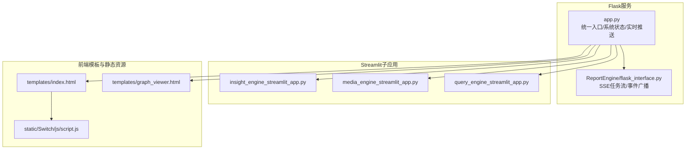
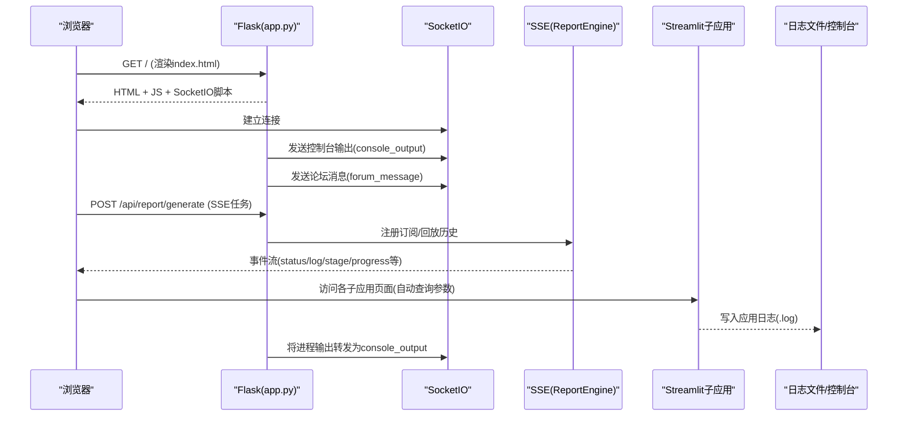
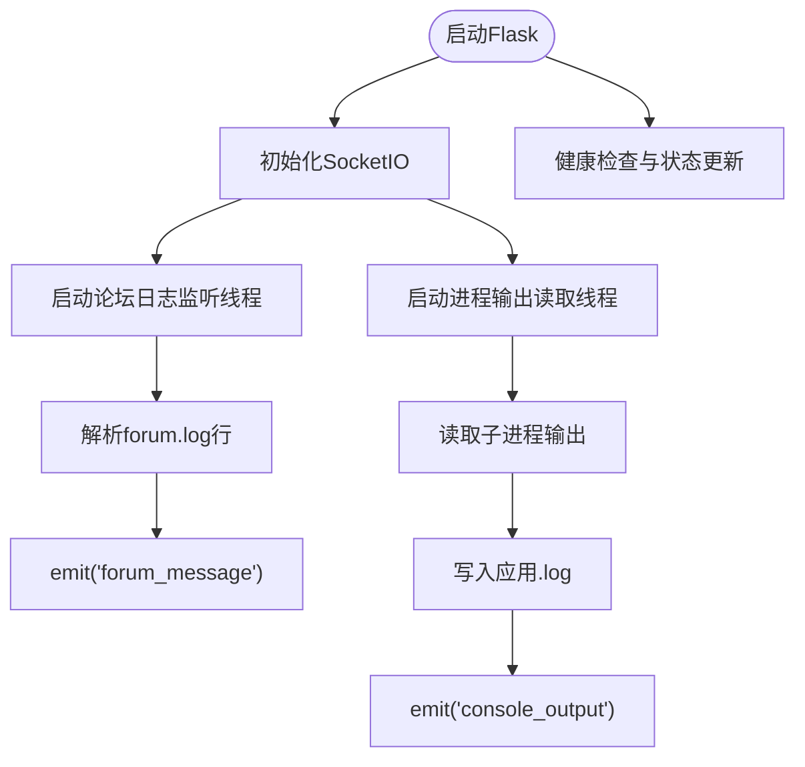
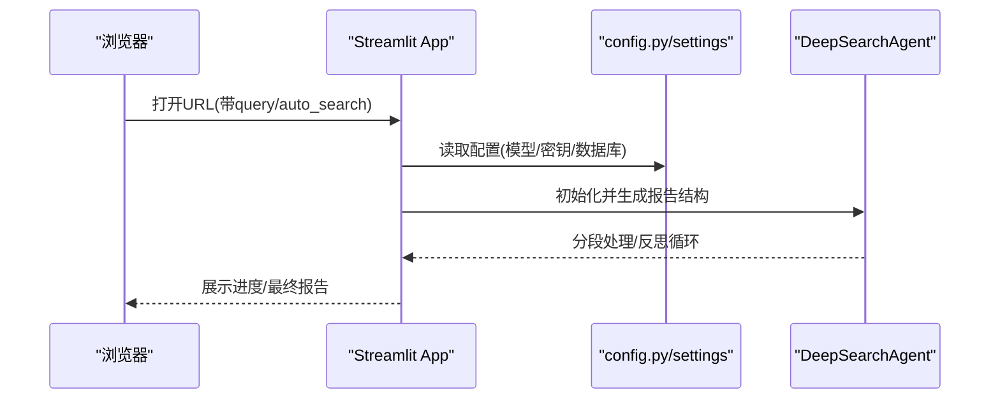
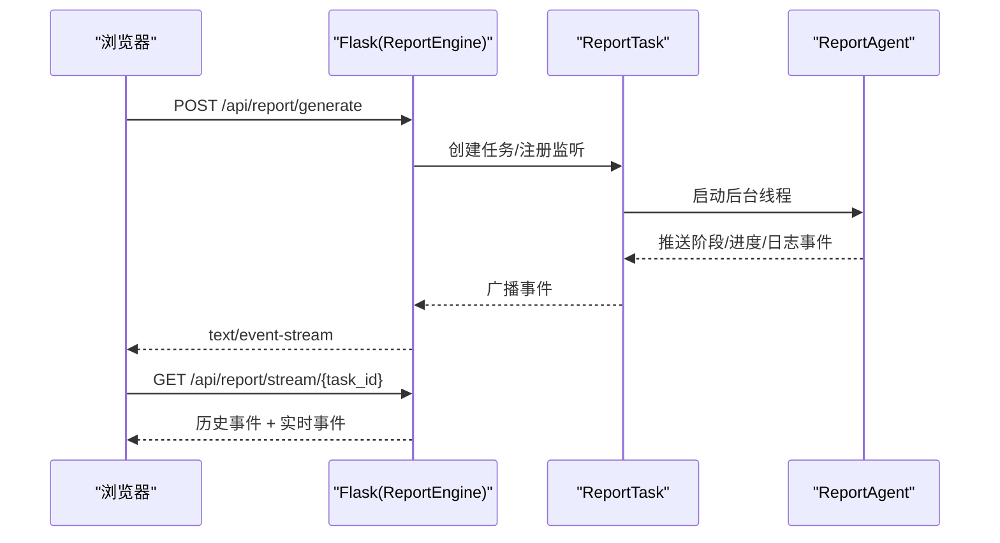
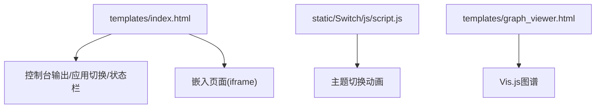
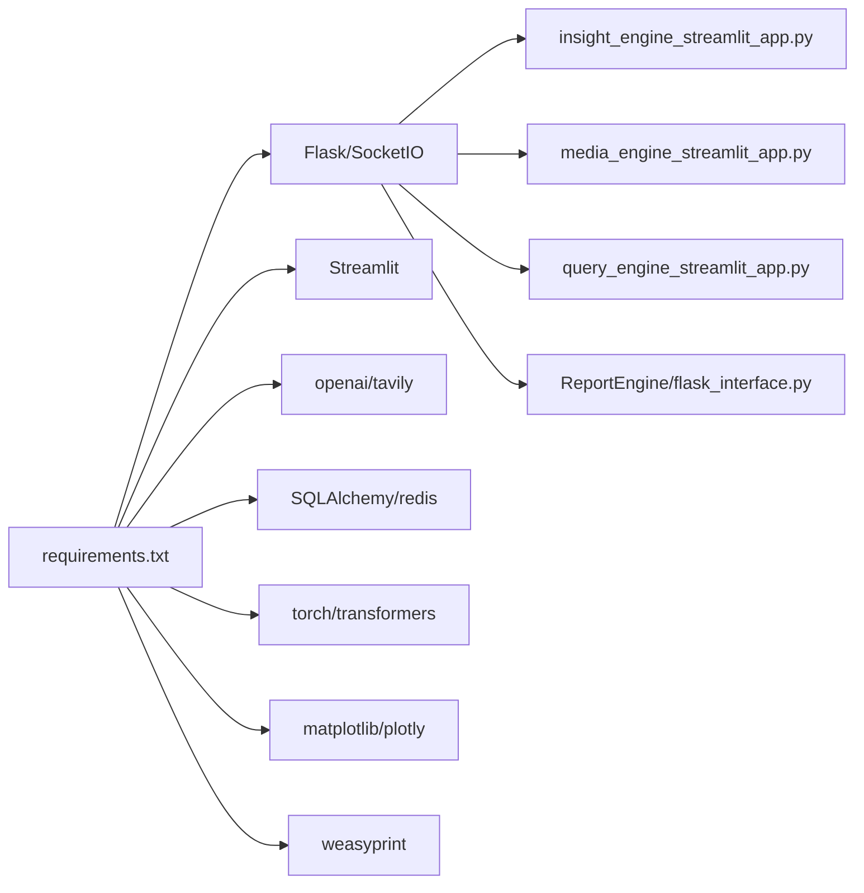

# 用户界面与交互

<cite>
**本文引用的文件**
- [app.py](file://app.py)
- [config.py](file://config.py)
- [requirements.txt](file://requirements.txt)
- [templates/index.html](file://templates/index.html)
- [templates/graph_viewer.html](file://templates/graph_viewer.html)
- [static/Switch/js/script.js](file://static/Switch/js/script.js)
- [SingleEngineApp/insight_engine_streamlit_app.py](file://SingleEngineApp/insight_engine_streamlit_app.py)
- [SingleEngineApp/media_engine_streamlit_app.py](file://SingleEngineApp/media_engine_streamlit_app.py)
- [SingleEngineApp/query_engine_streamlit_app.py](file://SingleEngineApp/query_engine_streamlit_app.py)
- [ReportEngine/flask_interface.py](file://ReportEngine/flask_interface.py)
</cite>

## 目录
1. [简介](#简介)
2. [项目结构](#项目结构)
3. [核心组件](#核心组件)
4. [架构总览](#架构总览)
5. [详细组件分析](#详细组件分析)
6. [依赖关系分析](#依赖关系分析)
7. [性能考虑](#性能考虑)
8. [故障排除指南](#故障排除指南)
9. [结论](#结论)
10. [附录](#附录)

## 简介
本文件面向开发者与运维人员，系统化梳理BettaFish的用户界面与交互体系，涵盖基于Flask与Streamlit的主界面布局、实时通信机制（SocketIO与SSE）、响应式设计与前端资源管理、静态文件处理、以及用户体验优化策略。文档同时提供界面定制指南、样式修改方法与功能扩展建议，帮助快速集成与二次开发。

## 项目结构
BettaFish采用“Flask统一入口 + Streamlit子应用 + 报告引擎SSE”的混合架构：
- Flask负责统一调度、系统状态管理、实时日志推送、配置读写与报告引擎蓝图注册。
- Streamlit子应用分别承载Insight/Media/Query三大引擎的Web界面。
- 报告引擎通过Flask蓝图提供SSE流式事件，实现报告生成过程的实时反馈。
- 前端模板与静态资源位于templates与static目录，支持主题切换与可视化组件。

图表来源
- [app.py](file://app.py#L41-L83)
- [ReportEngine/flask_interface.py](file://ReportEngine/flask_interface.py#L26-L44)
- [SingleEngineApp/insight_engine_streamlit_app.py](file://SingleEngineApp/insight_engine_streamlit_app.py#L35-L131)
- [SingleEngineApp/media_engine_streamlit_app.py](file://SingleEngineApp/media_engine_streamlit_app.py#L35-L149)
- [SingleEngineApp/query_engine_streamlit_app.py](file://SingleEngineApp/query_engine_streamlit_app.py#L35-L121)
- [templates/index.html](file://templates/index.html#L1-L120)
- [templates/graph_viewer.html](file://templates/graph_viewer.html#L1-L120)
- [static/Switch/js/script.js](file://static/Switch/js/script.js#L1-L60)

章节来源
- [app.py](file://app.py#L41-L83)
- [ReportEngine/flask_interface.py](file://ReportEngine/flask_interface.py#L26-L44)

## 核心组件
- Flask主应用与SocketIO实时推送：负责系统状态、日志流、论坛监控、Streamlit子应用生命周期管理与健康检查。
- Streamlit子应用：Insight/Media/Query三个引擎的Web界面，支持自动查询参数注入与进度展示。
- 报告引擎SSE：提供任务状态、阶段事件、日志流的实时推送，支持断线重连与历史事件补发。
- 前端模板与静态资源：主界面布局、主题切换动画、知识图谱可视化页面与依赖库。

章节来源
- [app.py](file://app.py#L13-L25)
- [SingleEngineApp/insight_engine_streamlit_app.py](file://SingleEngineApp/insight_engine_streamlit_app.py#L35-L131)
- [SingleEngineApp/media_engine_streamlit_app.py](file://SingleEngineApp/media_engine_streamlit_app.py#L35-L149)
- [SingleEngineApp/query_engine_streamlit_app.py](file://SingleEngineApp/query_engine_streamlit_app.py#L35-L121)
- [ReportEngine/flask_interface.py](file://ReportEngine/flask_interface.py#L578-L703)
- [templates/index.html](file://templates/index.html#L1-L120)
- [templates/graph_viewer.html](file://templates/graph_viewer.html#L1-L120)
- [static/Switch/js/script.js](file://static/Switch/js/script.js#L1-L60)

## 架构总览
下图展示了Flask与前端、子应用、报告引擎之间的交互关系与实时通信链路。

图表来源
- [app.py](file://app.py#L41-L83)
- [app.py](file://app.py#L443-L507)
- [app.py](file://app.py#L574-L644)
- [ReportEngine/flask_interface.py](file://ReportEngine/flask_interface.py#L578-L703)
- [ReportEngine/flask_interface.py](file://ReportEngine/flask_interface.py#L750-L803)
- [templates/index.html](file://templates/index.html#L1-L120)

## 详细组件分析

### Flask主应用与实时通信
- SocketIO配置与事件：
  - 配置跨域与Secret Key，提供论坛日志监听线程与进程输出读取线程，将日志实时推送到前端。
  - 论坛日志解析与去重，按来源区分“主持人”和“Agent”，并同步控制台输出。
- 进程管理：
  - 启动/停止Streamlit子应用，健康检查端口可达性，记录输出到日志文件并通过SocketIO推送。
- 配置读写：
  - 读取Pydantic Settings并暴露到前端；写入.env文件并重新加载配置模块。

图表来源
- [app.py](file://app.py#L41-L83)
- [app.py](file://app.py#L443-L507)
- [app.py](file://app.py#L574-L644)
- [app.py](file://app.py#L778-L803)

章节来源
- [app.py](file://app.py#L41-L83)
- [app.py](file://app.py#L443-L507)
- [app.py](file://app.py#L574-L644)
- [app.py](file://app.py#L778-L803)

### Streamlit子应用（Insight/Media/Query）
- 页面布局与自动查询：
  - 通过URL参数接收查询与自动搜索标志，支持只读展示当前查询，避免重复提交。
- 配置注入：
  - 从全局配置读取API Key与数据库参数，构建Settings对象，确保与后端一致。
- 进度与结果：
  - 展示进度条与状态文本，生成最终报告并以标签页形式呈现“研究小结”和“引用信息”。

图表来源
- [SingleEngineApp/insight_engine_streamlit_app.py](file://SingleEngineApp/insight_engine_streamlit_app.py#L35-L131)
- [SingleEngineApp/media_engine_streamlit_app.py](file://SingleEngineApp/media_engine_streamlit_app.py#L35-L149)
- [SingleEngineApp/query_engine_streamlit_app.py](file://SingleEngineApp/query_engine_streamlit_app.py#L35-L121)
- [config.py](file://config.py#L23-L115)

章节来源
- [SingleEngineApp/insight_engine_streamlit_app.py](file://SingleEngineApp/insight_engine_streamlit_app.py#L35-L131)
- [SingleEngineApp/media_engine_streamlit_app.py](file://SingleEngineApp/media_engine_streamlit_app.py#L35-L149)
- [SingleEngineApp/query_engine_streamlit_app.py](file://SingleEngineApp/query_engine_streamlit_app.py#L35-L121)
- [config.py](file://config.py#L23-L115)

### 报告引擎SSE（实时事件流）
- 任务生命周期：
  - pending → running → completed/error，支持进度与阶段事件推送。
- 事件广播与历史补发：
  - 使用有界队列缓存事件，SSE客户端可携带Last-Event-ID进行历史补发。
- 日志过滤：
  - 过滤来自其他引擎的日志，避免混入，保证前端日志清晰。

图表来源
- [ReportEngine/flask_interface.py](file://ReportEngine/flask_interface.py#L578-L703)
- [ReportEngine/flask_interface.py](file://ReportEngine/flask_interface.py#L750-L803)
- [ReportEngine/flask_interface.py](file://ReportEngine/flask_interface.py#L436-L576)

章节来源
- [ReportEngine/flask_interface.py](file://ReportEngine/flask_interface.py#L578-L703)
- [ReportEngine/flask_interface.py](file://ReportEngine/flask_interface.py#L750-L803)
- [ReportEngine/flask_interface.py](file://ReportEngine/flask_interface.py#L436-L576)

### 前端模板与主题切换
- 主界面布局：
  - 搜索区、嵌入页面区、控制台输出区、应用切换按钮与状态栏，支持响应式与滚动优化。
- 主题切换动画：
  - 自定义Web Components实现昼夜主题切换，包含云朵、月亮、星星等动画元素。
- 知识图谱可视化：
  - 基于Vis.js的图谱页面，支持搜索、过滤、缩放、全屏与图例面板。

图表来源
- [templates/index.html](file://templates/index.html#L1-L120)
- [static/Switch/js/script.js](file://static/Switch/js/script.js#L1-L60)
- [templates/graph_viewer.html](file://templates/graph_viewer.html#L1-L120)

章节来源
- [templates/index.html](file://templates/index.html#L1-L120)
- [static/Switch/js/script.js](file://static/Switch/js/script.js#L1-L60)
- [templates/graph_viewer.html](file://templates/graph_viewer.html#L1-L120)

## 依赖关系分析
- 运行时依赖：
  - Flask、Flask-SocketIO、eventlet、streamlit、requests、aiohttp、openai、tavily、SQLAlchemy、redis、torch、matplotlib、plotly、weasyprint、loguru、pydantic-settings等。
- 关键耦合点：
  - Flask与SocketIO：实时日志与论坛消息推送。
  - Flask与ReportEngine蓝图：SSE任务流与事件广播。
  - Streamlit子应用与全局配置：统一的Settings与API Key注入。

图表来源
- [requirements.txt](file://requirements.txt#L6-L91)
- [app.py](file://app.py#L41-L83)
- [ReportEngine/flask_interface.py](file://ReportEngine/flask_interface.py#L26-L44)
- [SingleEngineApp/insight_engine_streamlit_app.py](file://SingleEngineApp/insight_engine_streamlit_app.py#L30-L32)
- [SingleEngineApp/media_engine_streamlit_app.py](file://SingleEngineApp/media_engine_streamlit_app.py#L30-L32)
- [SingleEngineApp/query_engine_streamlit_app.py](file://SingleEngineApp/query_engine_streamlit_app.py#L30-L32)

章节来源
- [requirements.txt](file://requirements.txt#L6-L91)

## 性能考虑
- SocketIO与SSE：
  - 使用有界事件队列与Last-Event-ID补发，降低断线重连成本。
  - 控制台输出采用非阻塞读取与分块写入，避免主线程阻塞。
- 前端渲染优化：
  - 控制台层使用transform与will-change提升滚动性能；骨架屏与渐进式渲染改善首屏体验。
- 进程管理：
  - 健康检查与Grace Period避免误判；超时终止与强制kill保障资源回收。
- 依赖与资源：
  - PDF导出依赖需满足系统环境；ML模型加载建议按需初始化。

## 故障排除指南
- SocketIO连接异常：
  - eventlet环境下ConnectionAbortedError的防御包装，避免日志污染。
- 进程输出读取失败：
  - 捕获异常并写入日志文件，同时向前端推送错误信息。
- 报告引擎SSE：
  - 客户端断开检测与心跳维持；任务结束后自动注销监听，避免孤儿连接。
- 配置读写：
  - .env文件写入与重新加载，确保前端配置更新生效。

章节来源
- [app.py](file://app.py#L47-L74)
- [app.py](file://app.py#L598-L643)
- [ReportEngine/flask_interface.py](file://ReportEngine/flask_interface.py#L775-L787)
- [ReportEngine/flask_interface.py](file://ReportEngine/flask_interface.py#L143-L159)

## 结论
BettaFish的用户界面与交互体系以Flask为核心，结合SocketIO与SSE实现了从系统状态、日志流到报告生成的全链路实时反馈；Streamlit子应用提供简洁直观的引擎界面；前端模板与静态资源则确保了良好的用户体验与可定制性。通过合理的依赖管理与性能优化策略，系统在复杂多引擎场景下仍保持稳定与高效。

## 附录

### WebSocket通信协议与SocketIO实时更新
- 协议要点：
  - 前端引入Socket.IO客户端脚本，建立持久连接。
  - 服务端通过emit('console_output')与emit('forum_message')推送事件。
  - 客户端监听事件并更新控制台与论坛面板。
- 适用场景：
  - 实时日志查看、论坛监控、系统状态通知。

章节来源
- [templates/index.html](file://templates/index.html#L7-L11)
- [app.py](file://app.py#L443-L507)
- [app.py](file://app.py#L574-L644)

### SSE实时更新（报告引擎）
- 协议要点：
  - 任务创建后返回SSE流地址；客户端可携带Last-Event-ID进行历史补发。
  - 事件类型覆盖status、stage、log、progress、error等。
- 适用场景：
  - 报告生成过程的进度与日志实时展示。

章节来源
- [ReportEngine/flask_interface.py](file://ReportEngine/flask_interface.py#L578-L703)
- [ReportEngine/flask_interface.py](file://ReportEngine/flask_interface.py#L750-L803)

### 响应式设计与用户体验优化
- 响应式布局：
  - 使用flexbox与min-height/overflow控制布局，确保在不同屏幕尺寸下稳定显示。
- 控制台优化：
  - GPU加速transform、contain属性与懒渲染，显著提升滚动性能。
- 骨架屏与渐进式渲染：
  - 骨架屏动画与占位符提升加载感知，减少空白等待。
- 主题切换：
  - 自定义Web Components实现昼夜主题切换，动画流畅自然。

章节来源
- [templates/index.html](file://templates/index.html#L262-L537)
- [static/Switch/js/script.js](file://static/Switch/js/script.js#L1-L60)

### 界面定制指南与样式修改
- 修改主界面布局与颜色：
  - 在templates/index.html中调整CSS变量与选择器，注意控制台输出区与应用切换区的相对定位与滚动容器。
- 自定义主题：
  - 修改static/Switch/js/script.js中的颜色与动画参数，或替换为外部主题CSS。
- 知识图谱页面：
  - 在templates/graph_viewer.html中调整Vis.js配置与工具栏位置，确保与主界面风格一致。

章节来源
- [templates/index.html](file://templates/index.html#L12-L537)
- [static/Switch/js/script.js](file://static/Switch/js/script.js#L212-L243)
- [templates/graph_viewer.html](file://templates/graph_viewer.html#L1-L120)

### 功能扩展建议
- 新增引擎界面：
  - 参考SingleEngineApp下的三个Streamlit应用，新增子应用并接入Flask路由。
- 自定义SSE事件：
  - 在ReportEngine/flask_interface.py中扩展事件类型与推送逻辑。
- 前端组件复用：
  - 将通用UI组件抽取为独立模板或Web Components，提升一致性与可维护性。
- 性能监控：
  - 在SocketIO与SSE通道中增加心跳与丢包统计，辅助诊断网络问题。

章节来源
- [SingleEngineApp/insight_engine_streamlit_app.py](file://SingleEngineApp/insight_engine_streamlit_app.py#L35-L131)
- [ReportEngine/flask_interface.py](file://ReportEngine/flask_interface.py#L274-L405)

### 前端资源管理与静态文件处理
- 资源加载：
  - 模板中通过CDN引入Socket.IO、html2canvas、jspdf、Vis.js等依赖。
- 静态文件：
  - JavaScript与CSS放置于static目录，通过Flask模板渲染时自动加载。
- PDF导出：
  - 依赖html2canvas与jspdf，确保浏览器支持Canvas与PDF生成。

章节来源
- [templates/index.html](file://templates/index.html#L7-L11)
- [templates/graph_viewer.html](file://templates/graph_viewer.html#L7-L11)