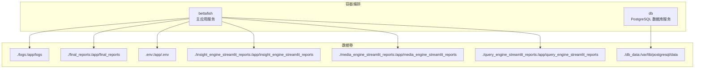
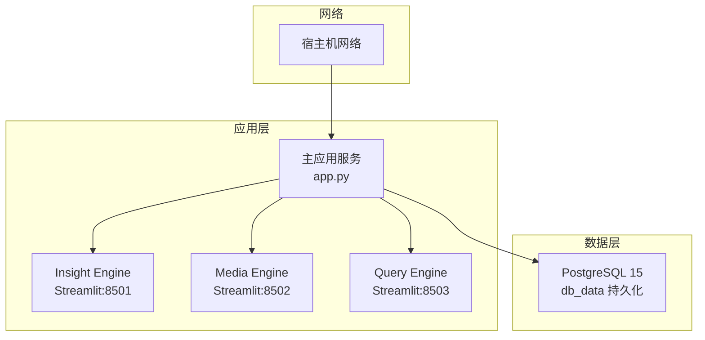
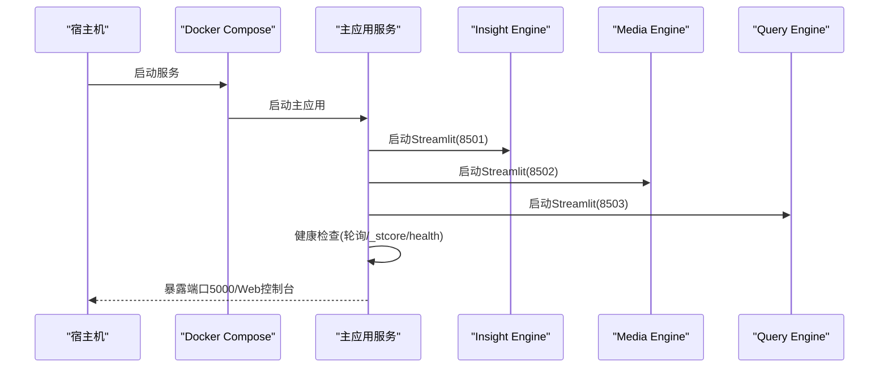
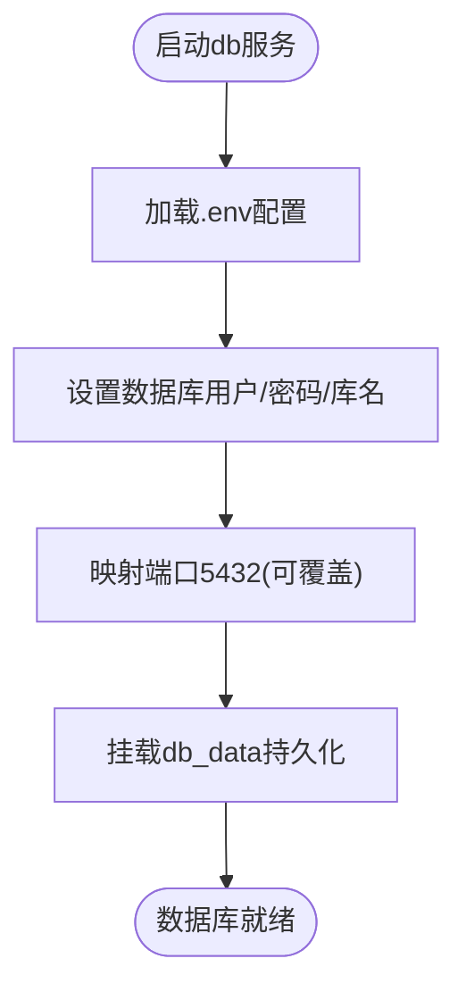
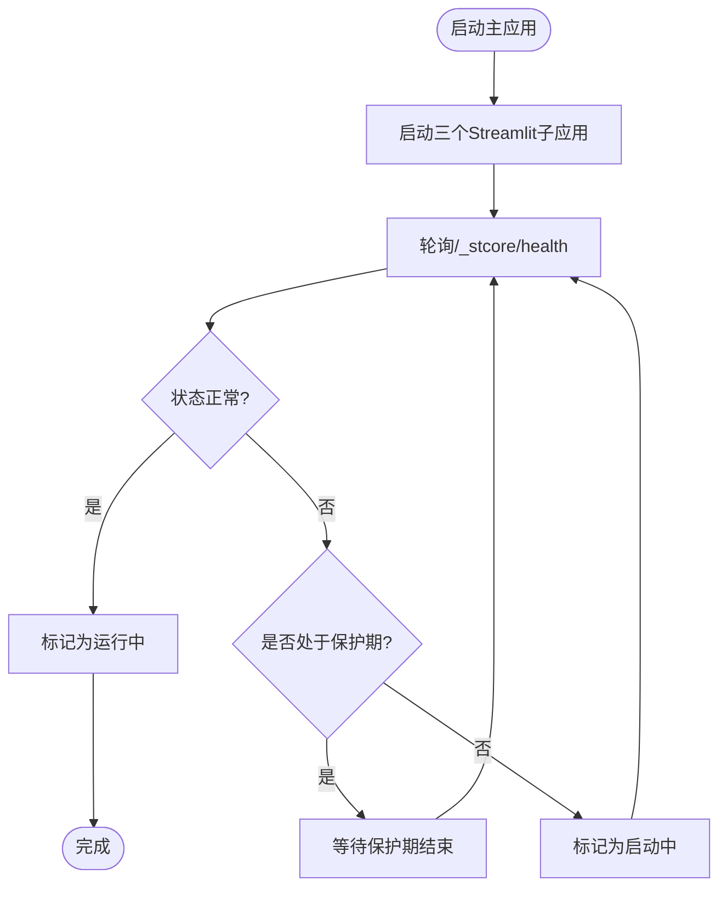
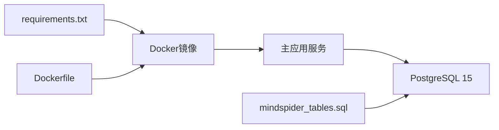

# Docker容器化部署

<cite>
**本文档引用的文件**
- [docker-compose.yml](file://docker-compose.yml)
- [Dockerfile](file://Dockerfile)
- [.dockerignore](file://.dockerignore)
- [.env.example](file://.env.example)
- [app.py](file://app.py)
- [requirements.txt](file://requirements.txt)
- [config.py](file://config.py)
- [README.md](file://README.md)
- [MindSpider/schema/mindspider_tables.sql](file://MindSpider/schema/mindspider_tables.sql)
</cite>

## 目录
1. [简介](#简介)
2. [项目结构](#项目结构)
3. [核心组件](#核心组件)
4. [架构总览](#架构总览)
5. [详细组件分析](#详细组件分析)
6. [依赖关系分析](#依赖关系分析)
7. [性能考虑](#性能考虑)
8. [故障排除指南](#故障排除指南)
9. [结论](#结论)
10. [附录](#附录)

## 简介
本文件为 BettaFish 系统的 Docker 容器化部署指南，围绕 docker-compose.yml 的服务编排、镜像构建流程、网络与端口映射、卷挂载策略、环境变量传递机制、启动顺序与健康检查、重启策略、生产最佳实践、资源限制与安全加固等方面进行深入说明。文档旨在帮助运维与开发人员快速、稳定地在生产环境中部署与维护 BettaFish。

## 项目结构
BettaFish 采用多服务编排，包含主应用服务与 PostgreSQL 数据库服务。主应用服务负责统一调度三个 Streamlit 子应用（Insight、Media、Query），并通过 WebSocket 提供实时日志与状态推送；数据库服务提供持久化存储。

**图表来源**
- [docker-compose.yml](file://docker-compose.yml#L3-L25)
- [docker-compose.yml](file://docker-compose.yml#L26-L40)

**章节来源**
- [docker-compose.yml](file://docker-compose.yml#L1-L40)
- [README.md](file://README.md#L299-L335)

## 核心组件
- 主应用服务（bettafish）
  - 基于预构建镜像 ghcr.io/666ghj/bettafish:latest（可切换为国内镜像源）
  - 暴露端口：5000（主 Web 控制台）、8501/8502/8503（三个 Streamlit 子应用）
  - 挂载日志、报告输出、配置文件与各子应用输出目录
  - 环境变量：禁用 Python 缓冲、关闭文件监听，提升日志实时性
  - 重启策略：unless-stopped
- 数据库服务（db）
  - 基于官方 PostgreSQL 15 镜像
  - 端口映射：默认 5432，可通过环境变量覆盖
  - 挂载数据目录，确保持久化
  - 通过 .env 注入数据库凭据与名称

**章节来源**
- [docker-compose.yml](file://docker-compose.yml#L4-L25)
- [docker-compose.yml](file://docker-compose.yml#L26-L40)
- [.env.example](file://.env.example#L1-L88)

## 架构总览
整体架构采用“主应用 + 多子应用 + 数据库”的三层结构。主应用通过子进程方式启动三个 Streamlit 应用，并通过健康检查判断子应用状态；数据库为 PostgreSQL，支持通过 .env 配置连接参数。

**图表来源**
- [docker-compose.yml](file://docker-compose.yml#L4-L25)
- [docker-compose.yml](file://docker-compose.yml#L26-L40)
- [app.py](file://app.py#L509-L521)

## 详细组件分析

### 主应用服务（bettafish）
- 镜像与启动
  - 使用预构建镜像 ghcr.io/666ghj/bettafish:latest，支持通过注释切换为国内镜像源
  - CMD 启动主应用入口，负责启动并监控三个 Streamlit 子应用
- 端口映射
  - 5000：主 Web 控制台（Flask + SocketIO）
  - 8501：Insight Engine 子应用
  - 8502：Media Engine 子应用
  - 8503：Query Engine 子应用
- 卷挂载
  - logs：运行日志持久化
  - final_reports：最终报告输出
  - .env：运行时配置注入
  - 各子应用输出目录：insight_engine_streamlit_reports、media_engine_streamlit_reports、query_engine_streamlit_reports
- 环境变量
  - PYTHONUNBUFFERED=1：禁用缓冲，确保日志实时输出
  - STREAMLIT_SERVER_ENABLE_FILE_WATCHER=false：关闭文件监听，避免容器内文件变更触发不必要的重启
- 重启策略
  - unless-stopped：容器退出后自动重启，除非被显式停止

**图表来源**
- [docker-compose.yml](file://docker-compose.yml#L4-L25)
- [app.py](file://app.py#L755-L800)

**章节来源**
- [docker-compose.yml](file://docker-compose.yml#L4-L25)
- [app.py](file://app.py#L509-L521)
- [app.py](file://app.py#L755-L800)

### 数据库服务（db）
- 镜像与版本
  - postgres:15
- 端口映射
  - 默认 5432，可通过环境变量覆盖（如 5444:5432）
- 挂载
  - db_data：PostgreSQL 数据目录持久化
- 环境变量
  - 通过 env_file: .env 注入数据库用户、密码、库名
  - 也可直接在 environment 字段中指定（如 POSTGRES_USER/POSTGRES_PASSWORD/POSTGRES_DB）

**图表来源**
- [docker-compose.yml](file://docker-compose.yml#L26-L40)
- [.env.example](file://.env.example#L7-L21)

**章节来源**
- [docker-compose.yml](file://docker-compose.yml#L26-L40)
- [.env.example](file://.env.example#L7-L21)

### 环境变量与配置传递
- .env.example 提供完整的配置项说明，包括：
  - 主应用：HOST、PORT
  - 数据库：DB_HOST、DB_PORT、DB_USER、DB_PASSWORD、DB_NAME、DB_CHARSET、DB_DIALECT
  - LLM 相关：各 Agent 的 API_KEY、BASE_URL、MODEL_NAME
  - 网络工具：TAVILY_API_KEY、SEARCH_TOOL_TYPE、Anspire/Bocha 相关配置
  - GraphRAG：GRAPHRAG_ENABLED、GRAPHRAG_MAX_QUERIES
- 运行时通过 .env 注入，主应用通过 pydantic-settings 自动加载，支持运行时重载

**章节来源**
- [.env.example](file://.env.example#L1-L88)
- [config.py](file://config.py#L23-L115)

### 端口映射规则详解
- 5000：主 Web 控制台（Flask + SocketIO），用于系统状态展示与日志推送
- 8501：Insight Engine 子应用（私有数据库挖掘）
- 8502：Media Engine 子应用（多模态内容分析）
- 8503：Query Engine 子应用（国内外新闻广度搜索）
- 数据库端口：默认 5432，可通过环境变量覆盖（如 5444:5432）

**章节来源**
- [docker-compose.yml](file://docker-compose.yml#L13-L17)
- [docker-compose.yml](file://docker-compose.yml#L37-L37)
- [app.py](file://app.py#L509-L521)

### 卷挂载策略
- logs：主应用运行日志持久化
- final_reports：最终报告输出目录
- .env：运行时配置注入，支持动态更新
- 各子应用输出目录：insight_engine_streamlit_reports、media_engine_streamlit_reports、query_engine_streamlit_reports
- db_data：PostgreSQL 数据持久化

**章节来源**
- [docker-compose.yml](file://docker-compose.yml#L18-L24)
- [docker-compose.yml](file://docker-compose.yml#L39-L39)

### 健康检查与启动顺序
- 启动顺序
  - 主应用服务启动后，依次启动三个 Streamlit 子应用（Insight:8501、Media:8502、Query:8503）
  - 启动完成后，主应用通过健康检查接口轮询子应用状态
- 健康检查
  - 接口路径：/_stcore/health
  - 超时：2 秒
  - 保护期：启动后 15 秒内忽略失败，避免冷启动误判
- 重启策略
  - unless-stopped：容器退出后自动重启，除非被显式停止

**图表来源**
- [app.py](file://app.py#L755-L800)

**章节来源**
- [app.py](file://app.py#L755-L800)

## 依赖关系分析
- 主应用依赖
  - Python 运行时与依赖包（requirements.txt）
  - Playwright 浏览器二进制（Dockerfile 中安装）
  - PostgreSQL 驱动（SQLAlchemy、asyncpg、psycopg 等）
- 数据库依赖
  - PostgreSQL 15
  - MindSpider 数据库表结构（SQL 文件定义）

**图表来源**
- [requirements.txt](file://requirements.txt#L1-L91)
- [Dockerfile](file://Dockerfile#L1-L78)
- [MindSpider/schema/mindspider_tables.sql](file://MindSpider/schema/mindspider_tables.sql#L1-L202)

**章节来源**
- [requirements.txt](file://requirements.txt#L1-L91)
- [Dockerfile](file://Dockerfile#L1-L78)
- [MindSpider/schema/mindspider_tables.sql](file://MindSpider/schema/mindspider_tables.sql#L1-L202)

## 性能考虑
- 镜像构建优化
  - 使用 uv 进行依赖安装，提升安装速度
  - 分层缓存：先复制 requirements.txt 再安装依赖，充分利用 Docker 层缓存
  - 系统依赖安装采用条件分支，适配不同系统包名
- 运行时性能
  - 禁用 Python 缓冲与文件监听，降低 I/O 压力
  - Streamlit 子应用使用 headless 模式，避免 GUI 开销
  - 健康检查超时短、保护期合理，避免误判与频繁重启
- 资源限制建议
  - 在生产环境中为容器设置 CPU/内存限制，防止资源争用
  - 对数据库设置连接池大小与超时参数，避免连接过多导致阻塞

[本节为通用性能建议，不直接分析具体文件]

## 故障排除指南
- 端口冲突
  - 5000、8501、8502、8503 端口被占用时，修改 docker-compose.yml 中的宿主机端口映射
- 数据库连接失败
  - 检查 .env 中 DB_HOST 是否指向 db 服务名，DB_PORT 是否为 5432（或映射后的端口）
  - 确认数据库初始化与权限配置正确
- 子应用无法启动
  - 查看 logs 目录下的应用日志，确认 LLM API 配置正确
  - 检查网络工具（Tavily、Anspire/Bocha）的 API 密钥与 Base URL
- 健康检查失败
  - 等待 15 秒保护期后再观察
  - 检查 Streamlit 子应用的启动参数与端口配置

**章节来源**
- [docker-compose.yml](file://docker-compose.yml#L13-L17)
- [docker-compose.yml](file://docker-compose.yml#L37-L37)
- [.env.example](file://.env.example#L7-L88)
- [app.py](file://app.py#L755-L800)

## 结论
通过 docker-compose.yml 的服务编排与 Dockerfile 的多阶段构建，BettaFish 实现了主应用与数据库的解耦部署，配合 .env 的集中配置与卷挂载策略，满足生产环境的稳定性与可维护性需求。结合健康检查与合理的重启策略，系统能够在异常情况下自动恢复，保障服务连续性。

[本节为总结性内容，不直接分析具体文件]

## 附录

### Docker 镜像构建流程
- 基础镜像：python:3.11-slim
- 环境变量：禁用 .pyc、禁用缓冲、禁用缓存、Playwright 浏览器路径
- 系统依赖：针对不同系统适配 gdk-pixbuf 包名，安装 GTK、Pango、Cairo、FFmpeg 等
- 依赖安装：使用 uv 安装 requirements.txt
- Playwright：安装 Chromium 浏览器二进制
- 应用复制：复制 .env.example 为 .env，复制源码
- 目录准备：确保运行时目录存在
- 暴露端口：5000、8501、8502、8503
- 启动命令：python app.py

**章节来源**
- [Dockerfile](file://Dockerfile#L1-L78)

### 生产环境最佳实践
- 网络
  - 使用自定义桥接网络隔离服务
  - 限制对外暴露端口，仅开放必要端口
- 安全
  - 使用只读根文件系统与最小权限原则
  - 通过 .env 注入敏感配置，避免硬编码
  - 定期更新镜像与依赖，修补安全漏洞
- 监控与日志
  - 挂载日志目录，结合外部日志收集系统
  - 设置健康检查与告警
- 备份与恢复
  - 定期备份 db_data 与 final_reports
  - 制定灾难恢复流程

[本节为通用最佳实践，不直接分析具体文件]