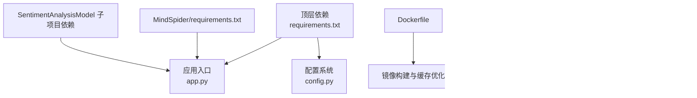

# 依赖管理与版本控制

<cite>
**本文引用的文件**
- [requirements.txt](file://requirements.txt)
- [Dockerfile](file://Dockerfile)
- [docker-compose.yml](file://docker-compose.yml)
- [.dockerignore](file://.dockerignore)
- [.env.example](file://.env.example)
- [config.py](file://config.py)
- [app.py](file://app.py)
- [ReportEngine/utils/dependency_check.py](file://ReportEngine/utils/dependency_check.py)
- [static/Partial README for PDF Exporting/README-EN.md](file://static/Partial README for PDF Exporting/README-EN.md)
- [MindSpider/requirements.txt](file://MindSpider/requirements.txt)
- [SentimentAnalysisModel/WeiboSentiment_MachineLearning/requirements.txt](file://SentimentAnalysisModel/WeiboSentiment_MachineLearning/requirements.txt)
- [SentimentAnalysisModel/WeiboSentiment_Finetuned/GPT2-Lora/requirements.txt](file://SentimentAnalysisModel/WeiboSentiment_Finetuned/GPT2-Lora/requirements.txt)
- [SentimentAnalysisModel/WeiboSentiment_SmallQwen/requirements.txt](file://SentimentAnalysisModel/WeiboSentiment_SmallQwen/requirements.txt)
- [report_engine_only.py](file://report_engine_only.py)
</cite>

## 目录
1. [简介](#简介)
2. [项目结构](#项目结构)
3. [核心组件](#核心组件)
4. [架构总览](#架构总览)
5. [详细组件分析](#详细组件分析)
6. [依赖关系分析](#依赖关系分析)
7. [性能考量](#性能考量)
8. [故障排查指南](#故障排查指南)
9. [结论](#结论)
10. [附录](#附录)

## 简介
本文件面向BettaFish系统的依赖管理与版本控制，围绕以下目标展开：
- 解释requirements.txt中的依赖分类、版本约束规则与冲突化解法
- 说明Dockerfile中的Python环境配置、包安装优化与镜像层缓存利用
- 提供依赖更新流程、安全漏洞扫描与兼容性测试方法
- 明确开发与生产环境差异、依赖锁定与版本回滚策略
- 分析依赖性能、包体积与加载时间优化技巧
- 规范第三方依赖许可证合规与开源治理最佳实践

## 项目结构
BettaFish采用多模块架构，核心依赖集中在顶层requirements.txt，容器化通过Dockerfile与docker-compose.yml统一构建与编排。PDF导出依赖由ReportEngine子系统负责检测与引导。

**图示来源**
- [requirements.txt](file://requirements.txt#L1-L91)
- [Dockerfile](file://Dockerfile#L1-L78)
- [docker-compose.yml](file://docker-compose.yml#L1-L40)
- [config.py](file://config.py#L1-L136)
- [app.py](file://app.py#L112-L260)
- [ReportEngine/utils/dependency_check.py](file://ReportEngine/utils/dependency_check.py#L1-L210)
- [MindSpider/requirements.txt](file://MindSpider/requirements.txt#L1-L63)
- [SentimentAnalysisModel/WeiboSentiment_MachineLearning/requirements.txt](file://SentimentAnalysisModel/WeiboSentiment_MachineLearning/requirements.txt#L1-L9)
- [SentimentAnalysisModel/WeiboSentiment_Finetuned/GPT2-Lora/requirements.txt](file://SentimentAnalysisModel/WeiboSentiment_Finetuned/GPT2-Lora/requirements.txt#L1-L10)
- [SentimentAnalysisModel/WeiboSentiment_SmallQwen/requirements.txt](file://SentimentAnalysisModel/WeiboSentiment_SmallQwen/requirements.txt#L1-L11)

**章节来源**
- [requirements.txt](file://requirements.txt#L1-L91)
- [Dockerfile](file://Dockerfile#L1-L78)
- [docker-compose.yml](file://docker-compose.yml#L1-L40)
- [config.py](file://config.py#L1-L136)
- [app.py](file://app.py#L112-L260)
- [ReportEngine/utils/dependency_check.py](file://ReportEngine/utils/dependency_check.py#L1-L210)
- [static/Partial README for PDF Exporting/README-EN.md](file://static/Partial README for PDF Exporting/README-EN.md#L1-L87)

## 核心组件
- 顶层依赖清单：集中管理Web框架、HTTP/异步、LLM接口、搜索API、数据处理、数据库、爬虫、可视化、PDF、机器学习、工具库与可选开发工具等类别，并对关键包设定精确版本或范围约束。
- Docker环境：基于python:3.11-slim，禁用.pyc与stdout缓冲，使用uv加速pip安装，分层COPY与RUN以最大化缓存命中；Playwright浏览器二进制在容器内预装。
- 配置与环境：通过pydantic-settings从.env与环境变量加载，支持运行时重载；.env.example提供完整键位与默认值占位。
- PDF导出前置检测：跨平台检测Pango/cairo/gdk-pixbuf等系统依赖，提供平台化安装指引与自动路径注入。

**章节来源**
- [requirements.txt](file://requirements.txt#L1-L91)
- [Dockerfile](file://Dockerfile#L1-L78)
- [.env.example](file://.env.example#L1-L88)
- [config.py](file://config.py#L1-L136)
- [ReportEngine/utils/dependency_check.py](file://ReportEngine/utils/dependency_check.py#L1-L210)

## 架构总览
下图展示依赖管理在系统中的位置与交互：

**图示来源**
- [requirements.txt](file://requirements.txt#L1-L91)
- [Dockerfile](file://Dockerfile#L1-L78)
- [docker-compose.yml](file://docker-compose.yml#L1-L40)
- [config.py](file://config.py#L1-L136)
- [app.py](file://app.py#L112-L260)
- [ReportEngine/utils/dependency_check.py](file://ReportEngine/utils/dependency_check.py#L1-L210)

## 详细组件分析

### 依赖清单分类与版本约束
- 分类维度
  - Web框架与实时通信：Flask、Flask-SocketIO、Streamlit、python-socketio、eventlet、FastAPI、Uvicorn
  - HTTP与异步：requests、httpx、aiohttp、aiofiles、PySocks、socksio
  - LLM接口：openai（>=1.3.0）
  - 搜索API：tavily-python（>=0.3.0）
  - 数据处理：pandas（>=2.0.0）、numpy（>=1.24.0）、regex、jieba（==0.42.1）
  - 数据库：pymysql（==1.1.0）、aiomysql（==0.2.0）、aiosqlite（==0.21.0）、motor（>=3.3.0）、redis（>=4.6.0）、SQLAlchemy（==2.0.35）、asyncpg（==0.29.0）、psycopg[binary]（>=3.1.0）、cryptography（==42.0.7）
  - 爬虫与媒体：playwright（==1.45.0）、Pillow（==9.5.0）、opencv-python（>=4.8.0）、beautifulsoup4（>=4.12.0）、lxml（>=4.9.0）、parsel（==1.9.1）、pyexecjs（==1.5.1）、xhshow（>=0.1.3）
  - 可视化：plotly（>=5.17.0）、matplotlib（==3.9.0）、wordcloud（==1.9.3）
  - PDF导出：weasyprint（>=60.0）
  - 机器学习：torch（>=2.0.0）、transformers（>=4.30.0）、sentence-transformers（>=2.2.2）、scikit-learn（>=1.3.0）、xgboost（>=2.0.0）
  - 工具库：typer（>=0.9.0）、python-dotenv（>=1.0.0）、python-dateutil（>=2.8.2）、pytz（>=2023.3）、tqdm（>=4.65.0）、tenacity（==8.2.2）、loguru（>=0.7.0）、pydantic（==2.5.2）、pydantic-settings（==2.2.1）、json-repair（==0.53.0）
  - 开发工具（可选）：pytest（>=7.4.0）、black（>=23.0.0）、flake8（>=6.0.0）

- 版本约束规则
  - 精确版本：如Flask、SQLAlchemy、aiosqlite、Pillow、matplotlib、cryptography等，确保行为稳定与可复现
  - 上界/下界范围：如pandas、numpy、redis、playwright、opencv-python、plotly、weasyprint、torch、transformers、sentence-transformers、scikit-learn、xgboost、aiohttp、PySocks、httpx、beautifulsoup4、lxml、loguru、tqdm、tenacity、pydantic、pydantic-settings、json-repair等，采用>=或>=、<组合，平衡稳定性与安全性
  - 特殊注释：对GPU版torch给出安装指引，避免误装

- 冲突化解法
  - 优先使用精确版本与明确范围，减少解析空间
  - 对于可选开发工具与运行时依赖分离，避免生产镜像冗余
  - 通过容器化隔离系统依赖，降低宿主机差异影响

**章节来源**
- [requirements.txt](file://requirements.txt#L1-L91)

### Dockerfile中的Python环境配置与包安装优化
- Python基础镜像与环境变量
  - 基础镜像：python:3.11-slim
  - 禁止生成.pyc、禁用stdout缓冲、禁用pip缓存、统一工具路径、指定Playwright浏览器路径
- 系统依赖安装
  - 一次性apt安装科学计算、GUI渲染、音视频等所需库，减少后续层变更
  - 兼容不同发行版的gdk-pixbuf包名差异
- 包安装优化
  - 使用uv替代pip，提升安装速度与确定性
  - 先COPY requirements.txt再安装，利用Docker层缓存
  - Playwright浏览器二进制在容器内预装，避免运行时下载
- 镜像层缓存利用
  - 固定顺序：更新包管理器→安装系统依赖→安装uv→复制依赖→安装Python依赖→复制应用源码→创建运行时目录→暴露端口→启动命令
  - .dockerignore排除日志、缓存与临时文件，缩小镜像体积

**章节来源**
- [Dockerfile](file://Dockerfile#L1-L78)
- [.dockerignore](file://.dockerignore#L1-L13)

### 开发环境与生产环境差异管理
- 环境变量与配置
  - .env.example提供所有配置键位与默认值占位，支持大小写不敏感与额外键
  - config.py通过pydantic-settings从当前工作目录或项目根目录的.env加载，支持运行时reload
  - app.py提供读取与写回配置的能力，便于前端交互与持久化
- 服务编排
  - docker-compose.yml映射端口与卷，挂载日志与报告输出目录，以及.env文件
  - 通过环境变量控制运行参数（如禁用文件监听）

**章节来源**
- [.env.example](file://.env.example#L1-L88)
- [config.py](file://config.py#L1-L136)
- [app.py](file://app.py#L112-L260)
- [docker-compose.yml](file://docker-compose.yml#L1-L40)

### 依赖更新流程、安全扫描与兼容性测试
- 更新流程
  - 识别受影响模块：定位对应requirements.txt（如顶层、MindSpider、SentimentAnalysisModel子项目）
  - 评估版本范围：结合语义化版本与项目约束，选择兼容范围内的新版本
  - 本地验证：在隔离环境中安装新版本，运行关键功能（PDF导出、LLM调用、爬虫、可视化）
  - CI集成：在CI中执行单元测试与集成测试，确保无回归
- 安全扫描
  - 使用pip-audit或类似工具扫描已安装包的安全漏洞
  - 结合SAST工具（如bandit、semgrep）扫描代码中的安全风险
- 兼容性测试
  - 跨平台测试：在Linux/macOS/Windows上验证PDF导出与GUI依赖
  - 浏览器兼容：Playwright预装chromium，验证自动化流程
  - LLM接口：切换不同供应商或模型，验证响应一致性

**章节来源**
- [requirements.txt](file://requirements.txt#L1-L91)
- [MindSpider/requirements.txt](file://MindSpider/requirements.txt#L1-L63)
- [SentimentAnalysisModel/WeiboSentiment_MachineLearning/requirements.txt](file://SentimentAnalysisModel/WeiboSentiment_MachineLearning/requirements.txt#L1-L9)
- [SentimentAnalysisModel/WeiboSentiment_Finetuned/GPT2-Lora/requirements.txt](file://SentimentAnalysisModel/WeiboSentiment_Finetuned/GPT2-Lora/requirements.txt#L1-L10)
- [SentimentAnalysisModel/WeiboSentiment_SmallQwen/requirements.txt](file://SentimentAnalysisModel/WeiboSentiment_SmallQwen/requirements.txt#L1-L11)

### 依赖锁定与版本回滚策略
- 锁定机制
  - 使用uv的锁定能力生成确定性安装列表（建议在CI中执行）
  - 在Dockerfile中固定Python版本与系统依赖，避免镜像漂移
- 回滚策略
  - 保留历史镜像标签，快速回退到上一个稳定版本
  - 通过docker-compose切换镜像标签，实现快速回滚
  - 若为依赖升级导致的问题，回退至上一版requirements.txt并重建镜像

**章节来源**
- [Dockerfile](file://Dockerfile#L1-L78)
- [docker-compose.yml](file://docker-compose.yml#L1-L40)

### 依赖性能分析、包大小优化与加载时间减少
- 性能分析
  - 使用import time与memory_profiler测量关键模块导入耗时与内存占用
  - 对大型库（如torch、transformers、sentence-transformers、opencv-python、Pillow）进行按需加载与懒初始化
- 包大小优化
  - 使用python:3.11-slim基础镜像
  - .dockerignore排除不必要的文件
  - 仅安装生产所需系统依赖，避免开发工具进入生产镜像
- 加载时间减少
  - 将高频模块放入独立进程或异步任务队列
  - 对PDF导出与可视化模块延迟初始化，仅在需要时触发

**章节来源**
- [Dockerfile](file://Dockerfile#L1-L78)
- [.dockerignore](file://.dockerignore#L1-L13)

### 第三方依赖许可证合规与开源治理
- 许可证检查
  - 使用pip-licenses或pipdeptree+许可证元数据核对第三方包许可证
  - 对强 copyleft 许可证（如GPL）保持警惕，避免无意引入
- 最佳实践
  - 建立许可证白名单/黑名单策略
  - 在CI中加入许可证扫描步骤
  - 为每个依赖记录来源、版本与许可证信息，形成合规档案

**章节来源**
- [requirements.txt](file://requirements.txt#L1-L91)

## 依赖关系分析
下图展示顶层依赖与关键子系统的依赖关系：

**图示来源**
- [requirements.txt](file://requirements.txt#L1-L91)
- [MindSpider/requirements.txt](file://MindSpider/requirements.txt#L1-L63)
- [SentimentAnalysisModel/WeiboSentiment_MachineLearning/requirements.txt](file://SentimentAnalysisModel/WeiboSentiment_MachineLearning/requirements.txt#L1-L9)
- [SentimentAnalysisModel/WeiboSentiment_Finetuned/GPT2-Lora/requirements.txt](file://SentimentAnalysisModel/WeiboSentiment_Finetuned/GPT2-Lora/requirements.txt#L1-L10)
- [SentimentAnalysisModel/WeiboSentiment_SmallQwen/requirements.txt](file://SentimentAnalysisModel/WeiboSentiment_SmallQwen/requirements.txt#L1-L11)

**章节来源**
- [requirements.txt](file://requirements.txt#L1-L91)
- [MindSpider/requirements.txt](file://MindSpider/requirements.txt#L1-L63)
- [SentimentAnalysisModel/WeiboSentiment_MachineLearning/requirements.txt](file://SentimentAnalysisModel/WeiboSentiment_MachineLearning/requirements.txt#L1-L9)
- [SentimentAnalysisModel/WeiboSentiment_Finetuned/GPT2-Lora/requirements.txt](file://SentimentAnalysisModel/WeiboSentiment_Finetuned/GPT2-Lora/requirements.txt#L1-L10)
- [SentimentAnalysisModel/WeiboSentiment_SmallQwen/requirements.txt](file://SentimentAnalysisModel/WeiboSentiment_SmallQwen/requirements.txt#L1-L11)

## 性能考量
- 安装性能
  - 使用uv替代pip，显著缩短安装时间
  - 通过分层COPY与RUN最大化缓存命中
- 运行性能
  - 对大型库进行按需加载与懒初始化
  - 将CPU密集型任务（如PDF导出、图像处理）放入独立进程或队列
- 资源占用
  - 严格限定系统依赖范围，避免安装不必要的GUI或开发工具
  - 使用轻量级基础镜像与最小化APT安装

**章节来源**
- [Dockerfile](file://Dockerfile#L1-L78)

## 故障排查指南
- PDF导出失败
  - 使用ReportEngine/utils/dependency_check.py检测Pango/cairo/gdk-pixbuf依赖
  - 参考static/Partial README for PDF Exporting/README-EN.md中的平台化安装步骤
  - 在Windows上确保GTK3运行时路径已注入PATH或DLL目录
- 端口与卷挂载
  - docker-compose.yml映射5000/8501/8502/8503端口，确认未被占用
  - 确认日志与报告输出目录已正确挂载
- 配置读写
  - app.py提供读取与写回配置的能力，确保.env文件存在且可写
  - 使用config.py的reload_settings在运行时刷新配置

**图示来源**
- [app.py](file://app.py#L112-L260)
- [config.py](file://config.py#L1-L136)
- [ReportEngine/utils/dependency_check.py](file://ReportEngine/utils/dependency_check.py#L1-L210)

**章节来源**
- [ReportEngine/utils/dependency_check.py](file://ReportEngine/utils/dependency_check.py#L1-L210)
- [static/Partial README for PDF Exporting/README-EN.md](file://static/Partial README for PDF Exporting/README-EN.md#L1-L87)
- [docker-compose.yml](file://docker-compose.yml#L1-L40)
- [app.py](file://app.py#L112-L260)
- [config.py](file://config.py#L1-L136)

## 结论
BettaFish的依赖管理以“分层清晰、版本可控、容器化隔离、可审计可回滚”为核心原则。通过顶层requirements.txt统一约束、Dockerfile与docker-compose实现可复现构建与运行、ReportEngine的依赖检测保障PDF导出可用性，配合开发/生产差异管理与安全扫描，形成完整的依赖生命周期管理体系。

## 附录
- 关键流程图：PDF导出依赖检查流程

**图示来源**
- [ReportEngine/utils/dependency_check.py](file://ReportEngine/utils/dependency_check.py#L1-L210)
- [report_engine_only.py](file://report_engine_only.py#L51-L78)