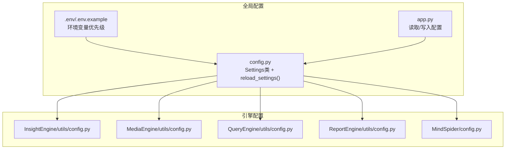
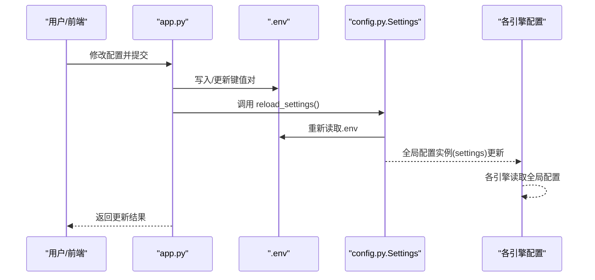
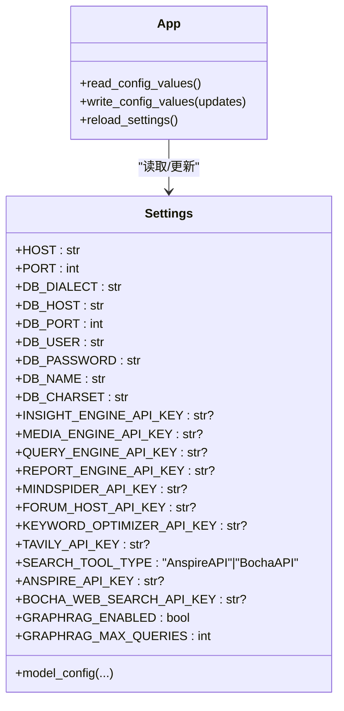
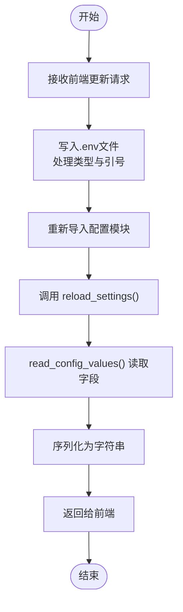
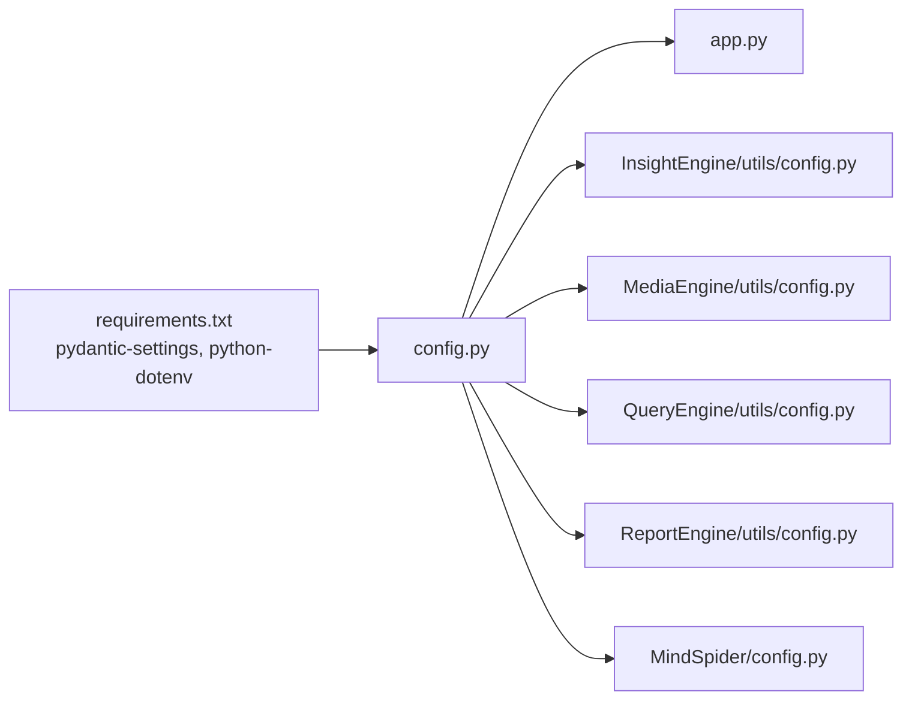

# 环境配置管理

<cite>
**本文引用的文件**
- [.env.example](file://.env.example)
- [config.py](file://config.py)
- [app.py](file://app.py)
- [requirements.txt](file://requirements.txt)
- [InsightEngine/utils/config.py](file://InsightEngine/utils/config.py)
- [MediaEngine/utils/config.py](file://MediaEngine/utils/config.py)
- [QueryEngine/utils/config.py](file://QueryEngine/utils/config.py)
- [ReportEngine/utils/config.py](file://ReportEngine/utils/config.py)
- [MindSpider/config.py](file://MindSpider/config.py)
- [MindSpider/config.py.example](file://MindSpider/config.py.example)
</cite>

## 目录
1. [简介](#简介)
2. [项目结构](#项目结构)
3. [核心组件](#核心组件)
4. [架构总览](#架构总览)
5. [详细组件分析](#详细组件分析)
6. [依赖关系分析](#依赖关系分析)
7. [性能考量](#性能考量)
8. [故障排查指南](#故障排查指南)
9. [结论](#结论)
10. [附录](#附录)

## 简介
本文件面向BettaFish系统的环境配置管理，围绕以下目标展开：
- 全面解读.env.example中的配置项，覆盖数据库、LLM服务、搜索引擎、GraphRAG等关键变量
- 解释config.py中的配置类设计模式、Pydantic Settings验证机制与配置优先级
- 对比开发/测试/生产三类环境的配置差异与切换方法
- 提供敏感信息保护、配置热更新机制与验证最佳实践
- 汇总第三方服务集成（OpenAI兼容、Tavily、Anspire、Bocha等）与本地开发快速搭建指南

## 项目结构
BettaFish采用“全局配置 + 引擎内独立配置”的双层配置体系：
- 全局配置：集中于项目根目录的config.py，通过Pydantic Settings从.env与环境变量加载
- 引擎配置：各子引擎（Insight/Media/Query/Report/MindSpider）各自维护utils/config.py，遵循统一的命名与优先级策略
- 应用入口：app.py提供配置读取与热更新能力，支持前端可视化修改并持久化至.env

**图表来源**
- [config.py](file://config.py#L17-L115)
- [app.py](file://app.py#L128-L231)
- [InsightEngine/utils/config.py](file://InsightEngine/utils/config.py#L13-L44)
- [MediaEngine/utils/config.py](file://MediaEngine/utils/config.py#L11-L85)
- [QueryEngine/utils/config.py](file://QueryEngine/utils/config.py#L16-L52)
- [ReportEngine/utils/config.py](file://ReportEngine/utils/config.py#L12-L83)
- [MindSpider/config.py](file://MindSpider/config.py#L11-L34)

**章节来源**
- [config.py](file://config.py#L17-L115)
- [app.py](file://app.py#L128-L231)

## 核心组件
- 全局Settings类：集中定义所有环境变量字段、默认值与校验规则，支持从.env与环境变量自动加载
- 配置优先级：当前工作目录下的.env优先于项目根目录；若两者都存在，以cwd为准
- 热更新机制：通过reload_settings()与app.py中的write_config_values()实现运行时配置更新
- 引擎内Settings：各引擎独立维护自身配置，保持与全局配置的字段一致性与命名规范

**章节来源**
- [config.py](file://config.py#L23-L115)
- [app.py](file://app.py#L128-L231)
- [requirements.txt](file://requirements.txt#L73-L80)

## 架构总览
下图展示配置加载与热更新的关键流程：

**图表来源**
- [app.py](file://app.py#L178-L231)
- [config.py](file://config.py#L122-L135)
- [config.py](file://config.py#L110-L115)

## 详细组件分析

### .env.example 配置项详解
- 服务器与通用
  - HOST/PORT：服务监听地址与端口
- 数据库
  - DB_DIALECT/DB_HOST/DB_PORT/DB_USER/DB_PASSWORD/DB_NAME/DB_CHARSET：数据库类型、主机、端口、账号、密码、库名、字符集
- LLM服务（OpenAI兼容）
  - INSIGHT_ENGINE_*、MEDIA_ENGINE_*、QUERY_ENGINE_*、REPORT_ENGINE_*、MINDSPIDER_*、FORUM_HOST_*、KEYWORD_OPTIMIZER_*：分别对应各Agent的API Key、Base URL与模型名
  - 支持直接使用兼容OpenAI格式的任意厂商服务
- 搜索引擎
  - TAVILY_API_KEY：Tavily搜索API密钥
  - SEARCH_TOOL_TYPE：AnspireAPI或BochaAPI
  - ANSPIRE_*、BOCHA_*：Anspire与Bocha搜索服务的Base URL与密钥
- GraphRAG
  - GRAPHRAG_ENABLED：是否启用GraphRAG
  - GRAPHRAG_MAX_QUERIES：每章节最大查询次数

**章节来源**
- [.env.example](file://.env.example#L1-L88)

### config.py 配置类设计与验证
- 设计模式
  - 使用Pydantic V2的BaseSettings作为配置基类，结合Field定义字段、默认值与描述
  - 通过model_config指定env_file、env_prefix、大小写敏感与额外字段策略
- 优先级与加载
  - 自动计算.env路径：优先当前工作目录，其次项目根目录
  - 通过ConfigDict的env_file绑定实际文件
- 热更新
  - reload_settings()创建新实例并替换全局settings，确保后续读取使用最新值
- 字段覆盖范围
  - 包含服务器、数据库、LLM、搜索、GraphRAG等全部关键配置

**图表来源**
- [config.py](file://config.py#L23-L115)
- [app.py](file://app.py#L142-L231)

**章节来源**
- [config.py](file://config.py#L23-L115)
- [config.py](file://config.py#L122-L135)

### 各引擎配置一致性
- InsightEngine/MediaEngine/QueryEngine/ReportEngine/MindSpider均提供独立的Settings类，遵循统一命名与优先级策略
- 关键差异
  - MediaEngine与ReportEngine在某些字段上更偏向“跨引擎兜底”（如跨引擎API Key），便于章节修复
  - MindSpider提供独立的config.py.example，强调数据库与MINDSPIDER API的组合配置

**章节来源**
- [InsightEngine/utils/config.py](file://InsightEngine/utils/config.py#L13-L44)
- [MediaEngine/utils/config.py](file://MediaEngine/utils/config.py#L16-L85)
- [QueryEngine/utils/config.py](file://QueryEngine/utils/config.py#L22-L52)
- [ReportEngine/utils/config.py](file://ReportEngine/utils/config.py#L12-L83)
- [MindSpider/config.py](file://MindSpider/config.py#L16-L34)
- [MindSpider/config.py.example](file://MindSpider/config.py.example#L16-L34)

### 配置热更新机制
- 写入流程
  - app.py的write_config_values()负责将前端提交的键值对写入.env，并自动处理布尔/数字/字符串/带空格的值
  - 写入完成后调用_load_config_module()重新导入配置模块，确保.env变更立即生效
- 读取流程
  - read_config_values()通过reload_settings()刷新全局settings，再将选定字段序列化为字符串返回前端
- 注意事项
  - 热更新仅影响通过Pydantic Settings读取的配置；直接使用os.getenv()的引擎仍需重启进程或显式刷新

**图表来源**
- [app.py](file://app.py#L178-L231)
- [config.py](file://config.py#L122-L135)

**章节来源**
- [app.py](file://app.py#L128-L231)
- [config.py](file://config.py#L122-L135)

### 不同环境的配置差异与切换
- 开发环境
  - 使用本地数据库与LLM厂商的沙箱或免费额度
  - 可开启较宽松的超时与内容长度限制，便于调试
- 测试环境
  - 使用隔离的数据库与独立的API密钥
  - GraphRAG可按需开启，查询次数适度降低
- 生产环境
  - 使用稳定可用的数据库与高并发LLM服务
  - 严格控制超时、重试与导出策略，确保稳定性与合规性
- 切换方法
  - 通过不同的.env文件或环境变量覆盖实现环境隔离
  - 使用容器编排时，可通过卷挂载或环境注入切换

[本节为概念性说明，不直接分析具体文件]

### 敏感信息保护与验证最佳实践
- 敏感信息保护
  - 将API Key与密码置于.env中，加入.gitignore
  - 在写入.env时避免明文泄露，必要时使用加密存储与密钥管理服务
- 验证与校验
  - 使用Pydantic Field的类型约束与默认值，减少运行期错误
  - 对必填字段使用非可选类型或明确的默认值，确保关键配置不为空
  - 对枚举型字段（如SEARCH_TOOL_TYPE）限定取值范围
- 运行期校验
  - 在业务入口处对关键配置进行有效性检查，失败时优雅降级或阻断启动

[本节为通用实践说明，不直接分析具体文件]

### 第三方服务集成配置
- OpenAI兼容LLM
  - 通过INSIGHT_ENGINE_*、MEDIA_ENGINE_*、QUERY_ENGINE_*、REPORT_ENGINE_*、MINDSPIDER_*、FORUM_HOST_*、KEYWORD_OPTIMIZER_*字段配置
  - 支持任意兼容OpenAI格式的服务商，只需正确填写Base URL与模型名
- Tavily搜索
  - TAVILY_API_KEY用于启用Tavily网络搜索
- Anspire/Bocha搜索
  - SEARCH_TOOL_TYPE选择AnspireAPI或BochaAPI
  - ANSPIRE_*与BOCHA_*字段分别配置对应服务的Base URL与密钥

**章节来源**
- [.env.example](file://.env.example#L23-L94)
- [config.py](file://config.py#L41-L94)
- [MediaEngine/utils/config.py](file://MediaEngine/utils/config.py#L30-L79)
- [ReportEngine/utils/config.py](file://ReportEngine/utils/config.py#L12-L45)

### 本地开发环境快速搭建
- 安装依赖
  - 使用requirements.txt安装所需包，注意python-dotenv与pydantic-settings版本
- 准备配置
  - 复制.env.example为.env，按需填写数据库、LLM与搜索服务的密钥
  - 若使用MindSpider，参考其config.py.example完善数据库与API配置
- 启动应用
  - 通过app.py提供的接口读取/写入配置，或直接运行Flask/Streamlit入口
- 验证
  - 使用read_config_values()确认关键字段已正确加载
  - 对LLM与搜索服务进行连通性测试

**章节来源**
- [requirements.txt](file://requirements.txt#L73-L80)
- [.env.example](file://.env.example#L1-L88)
- [MindSpider/config.py.example](file://MindSpider/config.py.example#L16-L34)
- [app.py](file://app.py#L142-L161)

## 依赖关系分析
- 配置依赖
  - 全局config.py依赖pydantic-settings与python-dotenv
  - 各引擎配置依赖pydantic-settings，部分引擎还使用dataclasses或自定义Config
- 运行时依赖
  - app.py依赖importlib与pathlib实现模块热加载与.env路径解析
  - 引擎内部可能使用os.getenv()读取特定键，建议逐步迁移到Pydantic Settings

**图表来源**
- [requirements.txt](file://requirements.txt#L73-L80)
- [config.py](file://config.py#L10-L14)
- [app.py](file://app.py#L128-L139)
- [InsightEngine/utils/config.py](file://InsightEngine/utils/config.py#L9-L11)
- [MediaEngine/utils/config.py](file://MediaEngine/utils/config.py#L5-L8)
- [QueryEngine/utils/config.py](file://QueryEngine/utils/config.py#L9-L13)
- [ReportEngine/utils/config.py](file://ReportEngine/utils/config.py#L6-L10)
- [MindSpider/config.py](file://MindSpider/config.py#L6-L9)

**章节来源**
- [requirements.txt](file://requirements.txt#L73-L80)
- [config.py](file://config.py#L10-L14)
- [app.py](file://app.py#L128-L139)

## 性能考量
- 配置读取
  - Pydantic Settings在首次加载时完成解析与校验，后续通过reload_settings()创建新实例，避免重复I/O
- 热更新
  - 写入.env后立即重新导入模块，减少配置不一致窗口
- 搜索与LLM
  - 合理设置超时与内容长度限制，避免长尾请求拖慢整体性能
- 数据库
  - 选择合适的DB_DIALECT与连接池参数，确保高并发场景下的稳定性

[本节为通用性能建议，不直接分析具体文件]

## 故障排查指南
- 配置未生效
  - 检查.env路径是否正确（当前工作目录优先）
  - 确认字段大小写与命名与Settings一致
  - 使用read_config_values()核对关键字段值
- 热更新无效
  - 确认通过write_config_values()写入.env并触发reload_settings()
  - 检查是否有直接使用os.getenv()的旧逻辑未同步更新
- LLM/搜索失败
  - 核对API Key与Base URL是否正确
  - 检查网络连通性与超时设置
- 数据库连接问题
  - 校验DB_DIALECT/DB_HOST/DB_PORT/DB_USER/DB_PASSWORD/DB_NAME/DB_CHARSET
  - 确认数据库服务可达且凭据正确

**章节来源**
- [app.py](file://app.py#L142-L161)
- [config.py](file://config.py#L122-L135)

## 结论
BettaFish的配置体系以Pydantic Settings为核心，实现了强类型、可验证、可热更新的环境管理。通过统一的命名规范与优先级策略，既能满足多引擎协同，又能保证不同环境的隔离与一致性。建议在团队内推广使用.env与Pydantic Settings，逐步淘汰直接依赖os.getenv()的硬编码方式，进一步提升系统的可维护性与安全性。

## 附录
- 配置字段速查
  - 服务器：HOST、PORT
  - 数据库：DB_DIALECT、DB_HOST、DB_PORT、DB_USER、DB_PASSWORD、DB_NAME、DB_CHARSET
  - LLM：各Agent的API_KEY、BASE_URL、MODEL_NAME
  - 搜索：TAVILY_API_KEY、SEARCH_TOOL_TYPE、ANSPIRE_*、BOCHA_*
  - GraphRAG：GRAPHRAG_ENABLED、GRAPHRAG_MAX_QUERIES
- 环境准备清单
  - 安装依赖：requirements.txt
  - 准备.env：.env.example
  - MindSpider：MindSpider/config.py.example
  - 启动应用：app.py