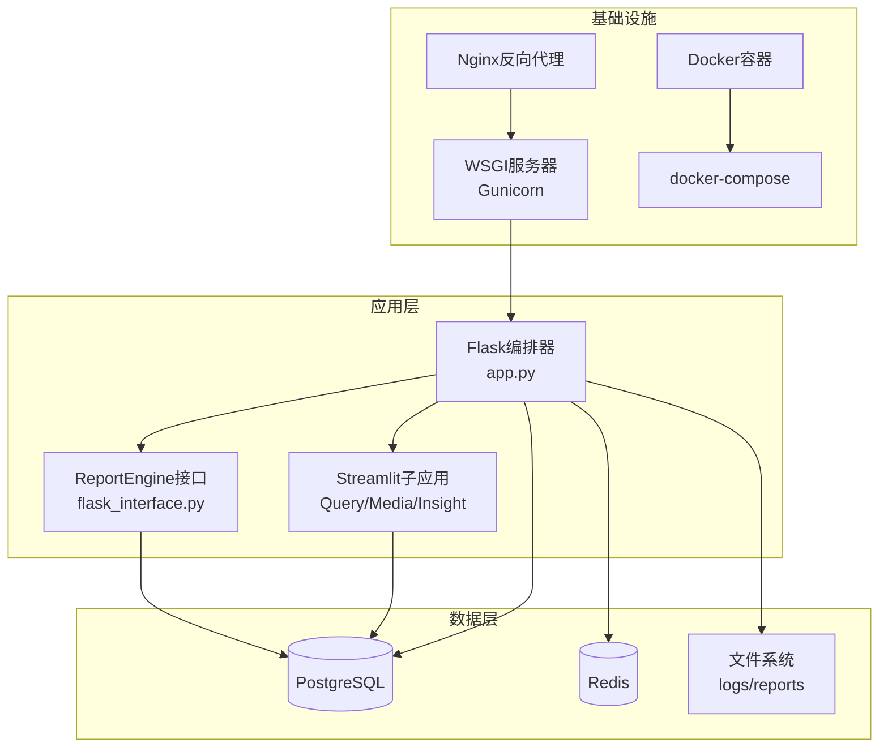
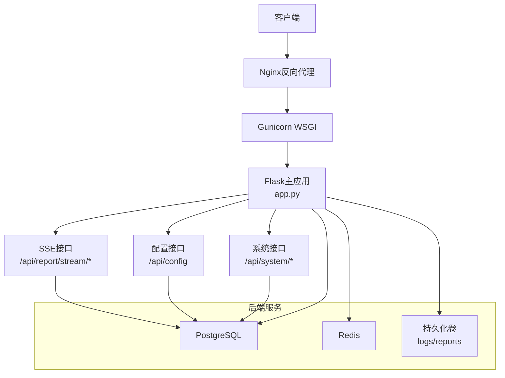
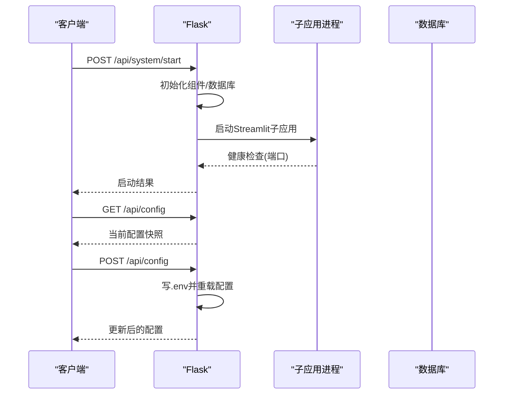
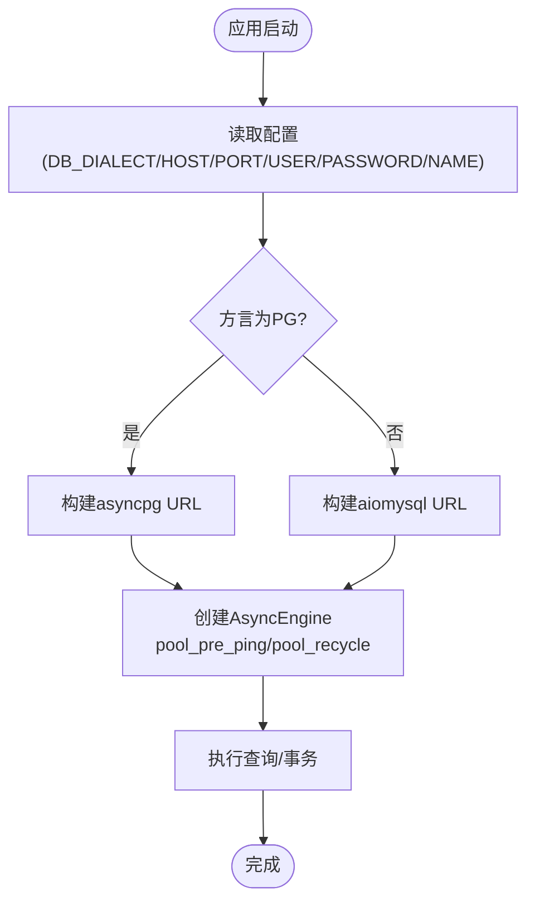
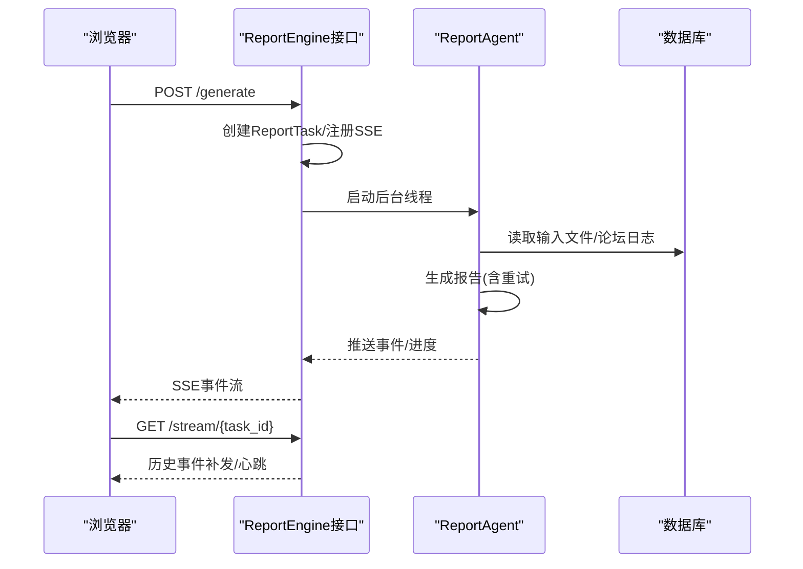
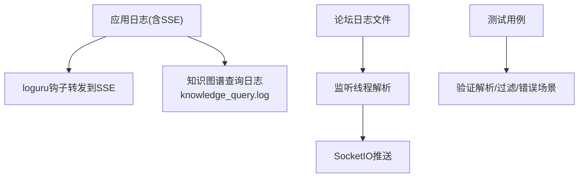
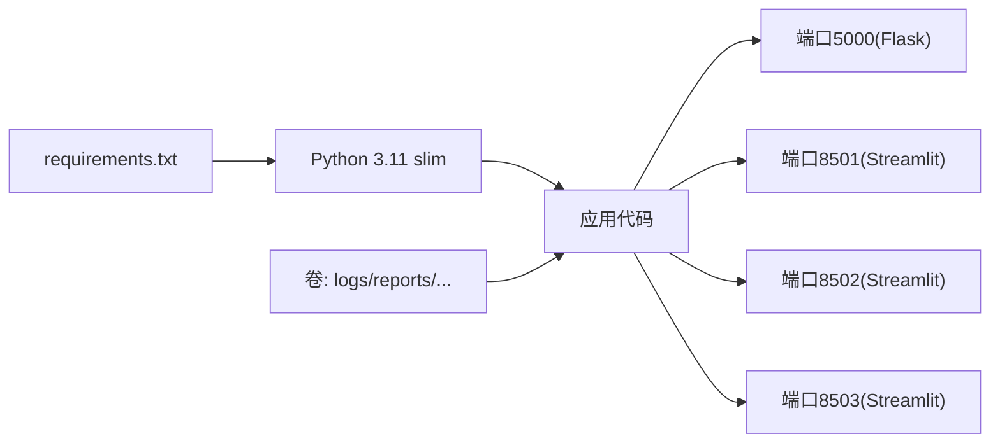

# 生产环境优化

<cite>
**本文引用的文件**
- [app.py](file://app.py)
- [config.py](file://config.py)
- [Dockerfile](file://Dockerfile)
- [docker-compose.yml](file://docker-compose.yml)
- [requirements.txt](file://requirements.txt)
- [.env.example](file://.env.example)
- [InsightEngine/utils/db.py](file://InsightEngine/utils/db.py)
- [ReportEngine/flask_interface.py](file://ReportEngine/flask_interface.py)
- [utils/knowledge_logger.py](file://utils/knowledge_logger.py)
- [MindSpider/schema/db_manager.py](file://MindSpider/schema/db_manager.py)
- [MindSpider/DeepSentimentCrawling/platform_crawler.py](file://MindSpider/DeepSentimentCrawling/platform_crawler.py)
- [tests/test_monitor.py](file://tests/test_monitor.py)
</cite>

## 目录
1. [简介](#简介)
2. [项目结构](#项目结构)
3. [核心组件](#核心组件)
4. [架构总览](#架构总览)
5. [详细组件分析](#详细组件分析)
6. [依赖分析](#依赖分析)
7. [性能考虑](#性能考虑)
8. [故障排查指南](#故障排查指南)
9. [结论](#结论)
10. [附录](#附录)

## 简介
本指南面向BettaFish系统在生产环境的优化与运维，围绕性能调优（Gunicorn进程配置、异步任务处理、数据库连接池与缓存）、负载均衡与反向代理（Nginx）、SSL证书、资源管理（内存/CPU/磁盘I/O）、监控与日志、错误追踪、安全加固、备份与高可用等方面，提供可落地的实践建议与参考配置。

## 项目结构
BettaFish采用多引擎协同架构：主应用通过Flask编排多个Streamlit子应用与ReportEngine接口，配合MindSpider爬虫与数据库，形成“采集-分析-报告”的闭环。容器化部署通过Docker与Compose实现，数据库默认使用PostgreSQL。

**图表来源**
- [app.py](file://app.py#L1-L160)
- [ReportEngine/flask_interface.py](file://ReportEngine/flask_interface.py#L1-L120)
- [docker-compose.yml](file://docker-compose.yml#L1-L40)
- [Dockerfile](file://Dockerfile#L1-L78)

**章节来源**
- [app.py](file://app.py#L1-L160)
- [docker-compose.yml](file://docker-compose.yml#L1-L40)
- [Dockerfile](file://Dockerfile#L1-L78)

## 核心组件
- 配置管理：集中于config.py与.env，支持运行时重载与前端暴露。
- 数据库访问：InsightEngine提供异步SQLAlchemy引擎，支持MySQL/PG。
- 报告引擎：基于Flask与SSE的任务流式处理，具备日志转发与事件历史。
- 日志系统：统一使用loguru，辅以知识图谱查询专用日志文件。
- 爬虫与数据库：MindSpider提供数据库管理与多平台爬取配置。

**章节来源**
- [config.py](file://config.py#L1-L136)
- [.env.example](file://.env.example#L1-L88)
- [InsightEngine/utils/db.py](file://InsightEngine/utils/db.py#L1-L73)
- [ReportEngine/flask_interface.py](file://ReportEngine/flask_interface.py#L1-L200)
- [utils/knowledge_logger.py](file://utils/knowledge_logger.py#L1-L96)
- [MindSpider/schema/db_manager.py](file://MindSpider/schema/db_manager.py#L1-L120)

## 架构总览
生产环境建议采用“Nginx + Gunicorn + Flask + 多容器”组合，数据库与缓存独立部署，日志与报告产物持久化挂载。

**图表来源**
- [app.py](file://app.py#L1200-L1311)
- [ReportEngine/flask_interface.py](file://ReportEngine/flask_interface.py#L570-L760)
- [docker-compose.yml](file://docker-compose.yml#L1-L40)

## 详细组件分析

### 配置与系统接口（生产优化要点）
- 运行时配置更新：支持将前端修改写回.env并重载配置，便于灰度与热切换。
- 系统启停：统一启动/停止子应用与论坛监控，健康检查通过本地端口探测。
- 事件与日志：对eventlet断开进行安全包装，避免异常堆栈污染。

**图表来源**
- [app.py](file://app.py#L1212-L1280)

**章节来源**
- [app.py](file://app.py#L1212-L1280)
- [config.py](file://config.py#L118-L136)

### 数据库连接池与缓存（生产优化要点）
- 异步引擎：InsightEngine使用SQLAlchemy 2.x异步引擎，支持pool_pre_ping与pool_recycle，提升连接稳定性。
- 多驱动选择：PG使用asyncpg，MySQL使用aiomysql，按配置方言自动选择。
- MindSpider：提供数据库管理工具，支持表统计、数据清理与连接配置。

**图表来源**
- [InsightEngine/utils/db.py](file://InsightEngine/utils/db.py#L28-L58)
- [MindSpider/schema/db_manager.py](file://MindSpider/schema/db_manager.py#L35-L47)

**章节来源**
- [InsightEngine/utils/db.py](file://InsightEngine/utils/db.py#L1-L73)
- [MindSpider/schema/db_manager.py](file://MindSpider/schema/db_manager.py#L1-L120)

### 报告引擎与异步任务（SSE流式处理）
- 任务模型：ReportTask维护状态、进度、事件历史与SSE事件队列。
- 事件历史：有界队列缓存最近事件，支持Last-Event-ID补发。
- 日志转发：通过loguru钩子将ReportEngine日志定向到SSE，避免混入其他引擎日志。
- 重试与降级：章节JSON修复与指数退避重试，保障生成稳定性。

**图表来源**
- [ReportEngine/flask_interface.py](file://ReportEngine/flask_interface.py#L246-L272)
- [ReportEngine/flask_interface.py](file://ReportEngine/flask_interface.py#L436-L576)
- [ReportEngine/flask_interface.py](file://ReportEngine/flask_interface.py#L750-L800)

**章节来源**
- [ReportEngine/flask_interface.py](file://ReportEngine/flask_interface.py#L1-L200)
- [ReportEngine/flask_interface.py](file://ReportEngine/flask_interface.py#L246-L576)
- [ReportEngine/flask_interface.py](file://ReportEngine/flask_interface.py#L750-L800)

### 日志与监控（生产优化要点）
- 统一日志：loguru作为主日志，知识图谱查询单独写入knowledge_query.log，避免大字段污染。
- 前端联动：论坛日志监听线程解析并推送至SocketIO，支持断线重连与去重。
- 测试验证：单元测试覆盖日志解析、过滤与错误场景，确保论坛内容质量。

**图表来源**
- [utils/knowledge_logger.py](file://utils/knowledge_logger.py#L60-L96)
- [app.py](file://app.py#L440-L508)
- [tests/test_monitor.py](file://tests/test_monitor.py#L1-L120)

**章节来源**
- [utils/knowledge_logger.py](file://utils/knowledge_logger.py#L1-L96)
- [app.py](file://app.py#L440-L508)
- [tests/test_monitor.py](file://tests/test_monitor.py#L1-L120)

### 爬虫与数据库（生产优化要点）
- 多数据库适配：MindSpider根据DB_DIALECT自动选择MySQL或PostgreSQL配置。
- 数据库管理：提供表清单、统计、近期数据与清理工具，支持Dry-run预览。
- 平台爬取：统一数据库配置注入，降低耦合。

**章节来源**
- [MindSpider/DeepSentimentCrawling/platform_crawler.py](file://MindSpider/DeepSentimentCrawling/platform_crawler.py#L41-L141)
- [MindSpider/schema/db_manager.py](file://MindSpider/schema/db_manager.py#L120-L299)

## 依赖分析
- Python运行时：Python 3.11 slim镜像，禁用.pyc与缓存，提升一致性。
- 依赖安装：使用uv安装requirements.txt，Playwright二进制预装。
- 端口映射：Flask 5000与三个Streamlit应用端口8501-8503。
- 服务编排：Compose挂载日志、报告、.env与各应用输出目录。

**图表来源**
- [Dockerfile](file://Dockerfile#L1-L78)
- [docker-compose.yml](file://docker-compose.yml#L1-L40)
- [requirements.txt](file://requirements.txt#L1-L91)

**章节来源**
- [Dockerfile](file://Dockerfile#L1-L78)
- [docker-compose.yml](file://docker-compose.yml#L1-L40)
- [requirements.txt](file://requirements.txt#L1-L91)

## 性能考虑
- Gunicorn进程配置（生产建议）
  - workers：CPU核数×2+1，结合CPU密集型（LLM）与I/O密集型（网络/文件）权衡。
  - threads：每个worker线程数建议1-2，避免GIL争用；若存在大量I/O，可适度增加。
  - keepalive：设置为60-90秒，平衡连接复用与资源占用。
  - 启动方式：gevent/eventlet需与SocketIO兼容，eventlet已在应用侧做断开保护。
- 异步任务处理
  - 使用SSE推送事件，避免阻塞主线程；对历史事件采用有界队列，防止内存膨胀。
  - 对重试与降级策略（如章节JSON修复）设置指数退避，避免雪崩。
- 数据库连接池优化
  - pool_pre_ping=true，pool_recycle=1800，确保连接健康与回收。
  - 根据并发请求峰值设置pool_size与max_overflow，结合慢查询日志定位瓶颈。
- 缓存策略
  - Redis用于高频查询与会话缓存，注意序列化与过期策略。
  - MindSpider提供Redis/Memory/SQLite多种缓存类型，按场景选择。
- 内存/CPU/磁盘I/O
  - 禁用Python缓冲（已设置），确保日志实时性。
  - 控制SSE事件历史数量与心跳间隔，避免内存泄漏。
  - 报告生成使用WeasyPrint，建议限制并发与页面大小，磁盘I/O可通过SSD优化。
- 容器与资源
  - 为Flask与各子应用分别设置CPU/内存限制，避免资源争用。
  - 使用只读根文件系统与最小权限原则，挂载必要卷。

[本节为通用性能指导，不直接分析具体文件]

## 故障排查指南
- 连接断开与异常
  - eventlet断开保护已在应用层实现，关注日志中的“客户端已主动断开”警告。
- 健康检查失败
  - 检查Streamlit应用端口可达性与/_stcore/health响应状态。
- 报告生成异常
  - 查看SSE事件流中的warning/error事件，定位章节JSON修复与重试过程。
  - 关注loguru钩子转发的ReportEngine日志，排除其他引擎日志干扰。
- 日志问题
  - knowledge_query.log过大时，结合测试用例验证解析与过滤逻辑。
  - 论坛日志监听线程避免重复处理，注意processed_lines集合大小控制。

**章节来源**
- [app.py](file://app.py#L45-L76)
- [app.py](file://app.py#L778-L801)
- [ReportEngine/flask_interface.py](file://ReportEngine/flask_interface.py#L74-L123)
- [utils/knowledge_logger.py](file://utils/knowledge_logger.py#L60-L96)
- [tests/test_monitor.py](file://tests/test_monitor.py#L246-L328)

## 结论
通过容器化与多引擎架构，BettaFish可在生产环境中实现高可用与可扩展。建议以Nginx+Gunicorn为入口，结合异步数据库连接池、SSE流式任务与Redis缓存，完善监控与日志体系，并强化安全与备份策略，确保系统稳定运行。

[本节为总结性内容，不直接分析具体文件]

## 附录

### A. Nginx反向代理与SSL配置（建议）
- 反向代理
  - upstream指向Gunicorn或多个Flask实例。
  - 静态资源走Nginx，动态接口走后端WSGI。
  - 启用gzip压缩与缓存头，减少带宽。
- SSL/TLS
  - 使用Let’s Encrypt自动签发证书，开启HTTP/2与TLS 1.3。
  - 强制HTTPS重定向与HSTS。
- 安全
  - 限制请求体大小、超时与速率，启用WAF规则（可选）。

[本节为通用配置建议，不直接分析具体文件]

### B. 监控指标与日志轮转
- 指标
  - 应用：请求QPS、P95/P99延迟、错误率、SSE事件速率。
  - 数据库：连接数、慢查询、锁等待、缓冲池命中率。
  - 系统：CPU使用率、内存占用、磁盘IO、文件句柄数。
- 日志轮转
  - 使用logrotate或systemd-journald，按大小/时间轮转，保留7-30天。
  - 分离access/error日志，知识查询日志单独轮转。

[本节为通用运维建议，不直接分析具体文件]

### C. 安全加固措施
- 防火墙
  - 仅开放Nginx端口，后端服务仅对内网开放。
- 访问控制
  - 配置IP白名单、速率限制与API鉴权（如需）。
- 数据加密
  - 传输：TLS 1.3；静态：文件系统加密（可选）。
  - 机密：将API密钥、数据库凭据放入环境变量或密钥管理服务。

[本节为通用安全建议，不直接分析具体文件]

### D. 备份与高可用
- 备份
  - 数据库定时快照与增量备份，验证恢复流程。
  - 挂载卷定期备份（logs/reports）。
- 高可用
  - 多副本部署，使用负载均衡与健康检查。
  - 数据库主从复制或托管高可用服务。

[本节为通用运维建议，不直接分析具体文件]