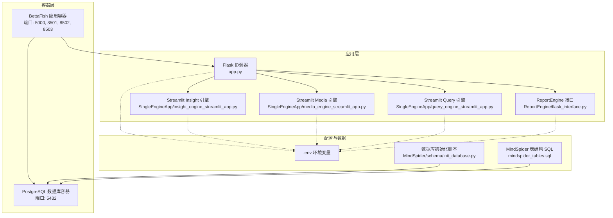
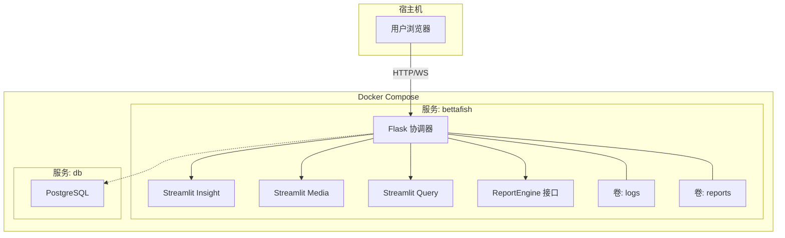
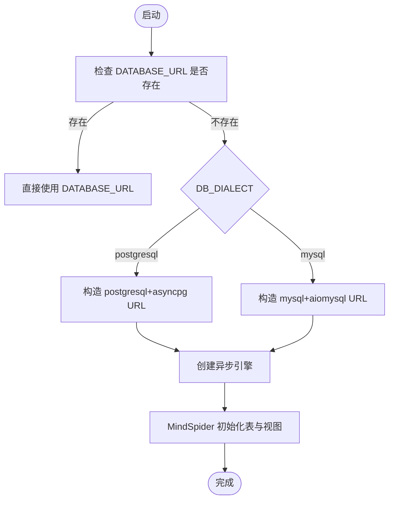
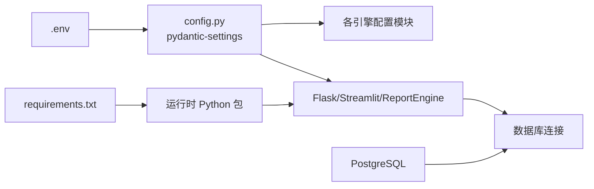

# 部署与配置

<cite>
**本文引用的文件**
- [Dockerfile](file://Dockerfile)
- [docker-compose.yml](file://docker-compose.yml)
- [.env.example](file://.env.example)
- [requirements.txt](file://requirements.txt)
- [config.py](file://config.py)
- [app.py](file://app.py)
- [MindSpider/config.py](file://MindSpider/config.py)
- [MindSpider/config.py.example](file://MindSpider/config.py.example)
- [InsightEngine/utils/config.py](file://InsightEngine/utils/config.py)
- [MediaEngine/utils/config.py](file://MediaEngine/utils/config.py)
- [InsightEngine/utils/db.py](file://InsightEngine/utils/db.py)
- [ReportEngine/flask_interface.py](file://ReportEngine/flask_interface.py)
- [MindSpider/schema/init_database.py](file://MindSpider/schema/init_database.py)
- [MindSpider/schema/mindspider_tables.sql](file://MindSpider/schema/mindspider_tables.sql)
</cite>

## 目录
1. [简介](#简介)
2. [项目结构](#项目结构)
3. [核心组件](#核心组件)
4. [架构总览](#架构总览)
5. [详细组件分析](#详细组件分析)
6. [依赖分析](#依赖分析)
7. [性能考虑](#性能考虑)
8. [故障排除指南](#故障排除指南)
9. [结论](#结论)
10. [附录](#附录)

## 简介
本文件面向运维与开发人员，提供 BettaFish 系统的完整部署与配置指南。内容覆盖：
- Docker 容器化与多服务编排
- 镜像构建与环境变量管理
- 生产环境优化、性能调优与监控
- 数据库配置、LLM 服务配置与第三方 API 集成
- 部署最佳实践、故障排除与维护策略

## 项目结构
BettaFish 采用多引擎架构，由一个 Flask 协调器统一调度多个 Streamlit 子应用，并集成 ReportEngine 的 HTTP/SSE 接口。系统通过 .env 统一管理配置，支持多数据库与多 LLM 供应商。

**图表来源**
- [docker-compose.yml](file://docker-compose.yml#L1-L40)
- [app.py](file://app.py#L1-L120)
- [ReportEngine/flask_interface.py](file://ReportEngine/flask_interface.py#L1-L60)
- [MindSpider/schema/init_database.py](file://MindSpider/schema/init_database.py#L1-L60)

**章节来源**
- [docker-compose.yml](file://docker-compose.yml#L1-L40)
- [Dockerfile](file://Dockerfile#L1-L78)
- [app.py](file://app.py#L1-L120)

## 核心组件
- Flask 协调器：统一启动/停止各子应用，提供 SSE 日志流与 ReportEngine 接口，负责健康检查与进程管理。
- Streamlit 引擎：分别对应 Insight/Media/Query 三个引擎，通过子进程方式启动，端口独立。
- ReportEngine：提供 HTTP/SSE 接口，支持任务队列、进度流式推送与日志下载。
- 数据库：支持 MySQL/PostgreSQL，MindSpider 使用异步 SQLAlchemy 初始化扩展表。
- 配置系统：基于 pydantic-settings，从 .env 与环境变量自动加载，支持运行时重载。

**章节来源**
- [app.py](file://app.py#L120-L240)
- [ReportEngine/flask_interface.py](file://ReportEngine/flask_interface.py#L1-L120)
- [InsightEngine/utils/db.py](file://InsightEngine/utils/db.py#L1-L73)
- [MindSpider/schema/init_database.py](file://MindSpider/schema/init_database.py#L1-L121)

## 架构总览
系统通过 docker-compose 启动两个服务：应用容器与数据库容器。应用容器内运行 Flask 协调器与多个 Streamlit 子应用，同时挂载日志与报告输出目录，便于持久化与运维查看。

**图表来源**
- [docker-compose.yml](file://docker-compose.yml#L1-L40)
- [app.py](file://app.py#L500-L800)
- [ReportEngine/flask_interface.py](file://ReportEngine/flask_interface.py#L1-L120)

## 详细组件分析

### Docker 容器化与镜像构建
- 基础镜像与工具链：基于 slim Python 镜像，安装 Playwright、WeasyPrint 所需系统依赖，使用 uv 加速依赖安装。
- 环境变量：禁用 pyc 编译、禁用 Python 缓冲、设置 PATH 与 Playwright 浏览器缓存路径。
- 依赖安装：先复制 requirements.txt，使用 uv 一次性安装，提升缓存命中率。
- Playwright：预装 Chromium 二进制，避免运行时下载。
- 工作目录与持久化：创建工作目录与运行时目录，暴露端口 5000 与 8501-8503。
- 默认命令：启动 Flask 协调器，后者负责拉起各子应用。

**章节来源**
- [Dockerfile](file://Dockerfile#L1-L78)

### 多服务编排与环境变量
- 应用服务：映射端口 5000 与 8501-8503，挂载日志与报告输出目录，挂载 .env 以注入配置。
- 数据库服务：PostgreSQL 15，默认端口 5432，通过 env_file 与环境变量注入凭据，数据持久化至 db_data。
- 端口与卷：确保日志与报告目录在宿主机可见，便于审计与归档。

**章节来源**
- [docker-compose.yml](file://docker-compose.yml#L1-L40)

### 配置系统与环境变量管理
- 统一配置源：config.py 使用 pydantic-settings 自动从 .env 与环境变量加载，支持运行时重载。
- 关键配置项：
  - 服务器：HOST、PORT
  - 数据库：DB_DIALECT、DB_HOST、DB_PORT、DB_USER、DB_PASSWORD、DB_NAME、DB_CHARSET
  - LLM：各引擎的 API_KEY、BASE_URL、MODEL_NAME
  - 第三方工具：TAVILY_API_KEY、SEARCH_TOOL_TYPE、Anspire/Bocha API
  - GraphRAG：GRAPHRAG_ENABLED、GRAPHRAG_MAX_QUERIES
- MindSpider 配置：MindSpider/config.py 与 .example 提供独立的数据库与 API 配置，优先从当前工作目录 .env 加载。

**章节来源**
- [config.py](file://config.py#L23-L120)
- [.env.example](file://.env.example#L1-L88)
- [MindSpider/config.py](file://MindSpider/config.py#L16-L36)
- [MindSpider/config.py.example](file://MindSpider/config.py.example#L16-L36)

### 数据库配置与初始化
- 数据库方言：支持 MySQL 与 PostgreSQL，异步驱动分别为 aiomysql 与 asyncpg。
- URL 构造：优先使用 DATABASE_URL，否则按 DB_DIALECT 构建连接串。
- MindSpider 初始化：异步创建扩展表与视图，支持 PostgreSQL/MySQL 通用 SQL。

**图表来源**
- [InsightEngine/utils/db.py](file://InsightEngine/utils/db.py#L28-L58)
- [MindSpider/schema/init_database.py](file://MindSpider/schema/init_database.py#L41-L114)

**章节来源**
- [InsightEngine/utils/db.py](file://InsightEngine/utils/db.py#L1-L73)
- [MindSpider/schema/init_database.py](file://MindSpider/schema/init_database.py#L1-L121)

### LLM 服务与第三方 API 集成
- LLM 适配：各引擎通过 OPENAI 兼容格式对接不同供应商，支持自定义 BASE_URL 与 MODEL_NAME。
- 第三方工具：
  - Tavily：网络搜索
  - Anspire/Bocha：多模态搜索
- 配置来源：集中于 .env，Insight/Media 引擎各自也有独立配置模块，优先从 .env 加载。

**章节来源**
- [.env.example](file://.env.example#L23-L95)
- [config.py](file://config.py#L41-L95)
- [InsightEngine/utils/config.py](file://InsightEngine/utils/config.py#L13-L45)
- [MediaEngine/utils/config.py](file://MediaEngine/utils/config.py#L16-L89)

### ReportEngine 接口与流式推送
- 接口蓝图：提供任务提交、进度查询、SSE 日志流与报告下载。
- 事件流：使用队列与订阅者模型，限制历史事件数量，心跳与空闲超时保障稳定性。
- 日志过滤：仅转发 ReportEngine 相关日志，避免其他引擎日志干扰。

**章节来源**
- [ReportEngine/flask_interface.py](file://ReportEngine/flask_interface.py#L1-L200)

### Flask 协调器与子应用生命周期
- 进程管理：通过子进程启动/停止各 Streamlit 应用，独立端口与日志文件。
- 健康检查：对各应用端口进行健康检查，Grace Period 内忽略失败。
- 日志采集：实时读取子进程输出并写入本地日志文件，同时通过 WebSocket 推送至前端。

**章节来源**
- [app.py](file://app.py#L500-L800)

## 依赖分析
- Python 依赖：Web 框架、HTTP/异步、LLM SDK、数据库驱动、爬虫与可视化、PDF、机器学习、工具库与 Web 服务器。
- 运行时依赖：Playwright 浏览器、PostgreSQL 服务。
- 配置依赖：.env 与环境变量，pydantic-settings。

**图表来源**
- [requirements.txt](file://requirements.txt#L1-L91)
- [config.py](file://config.py#L110-L136)

**章节来源**
- [requirements.txt](file://requirements.txt#L1-L91)
- [config.py](file://config.py#L110-L136)

## 性能考虑
- 镜像构建优化
  - 分层缓存：先复制 requirements.txt 再安装，提升缓存命中率。
  - uv 加速：使用 uv pip 安装依赖，减少安装耗时。
  - Playwright 预装：避免首次运行下载二进制。
- 运行时优化
  - 禁用 Python 缓冲与 pyc 编译，降低 IO 压力。
  - 异步数据库连接：使用 asyncpg/aiomysql，配合 pre_ping 与 recycle。
  - 健康检查 Grace Period：避免冷启动阶段误判。
- 资源与并发
  - 合理设置各引擎的 MAX_REFLECTIONS、MAX_PARAGRAPHS、SEARCH_TIMEOUT 等参数，避免长耗时请求。
  - GraphRAG 查询上限：GRAPHRAG_MAX_QUERIES 控制每次章节生成前的查询次数。
- 存储与日志
  - 挂载日志与报告目录，定期清理与归档，避免磁盘膨胀。
  - 使用轻量日志级别，避免过度 IO。

**章节来源**
- [Dockerfile](file://Dockerfile#L53-L78)
- [config.py](file://config.py#L79-L108)
- [InsightEngine/utils/db.py](file://InsightEngine/utils/db.py#L49-L58)
- [app.py](file://app.py#L755-L800)

## 故障排除指南
- 应用无法启动
  - 检查端口占用与防火墙，确认 5000 与 8501-8503 可用。
  - 查看 logs 目录下的应用日志，定位启动失败原因。
- 数据库连接失败
  - 确认 .env 中 DB_* 配置正确，数据库服务已就绪。
  - 若使用 DATABASE_URL，确保其格式正确。
- LLM API 无法访问
  - 核对 API_KEY、BASE_URL、MODEL_NAME 是否填写，供应商是否支持 OPENAI 兼容格式。
  - 检查网络代理与 DNS 设置。
- ReportEngine 任务无日志
  - 确认 SSE 连接正常，检查心跳与空闲超时设置。
  - 查看接口日志与 ReportEngine 自身日志。
- MindSpider 表未创建
  - 执行初始化脚本，确认数据库可连接且具备创建权限。
  - 检查视图创建 SQL 的方言兼容性。

**章节来源**
- [app.py](file://app.py#L500-L800)
- [ReportEngine/flask_interface.py](file://ReportEngine/flask_interface.py#L1-L200)
- [InsightEngine/utils/db.py](file://InsightEngine/utils/db.py#L28-L58)
- [MindSpider/schema/init_database.py](file://MindSpider/schema/init_database.py#L100-L121)

## 结论
通过 Docker 容器化与 docker-compose 编排，BettaFish 实现了多引擎协同与可扩展部署。结合统一的 .env 配置与 pydantic-settings，系统在灵活性与可维护性上取得平衡。生产环境中应重点关注数据库连接、LLM 供应商稳定性与日志/存储的可观测性与容量规划。

## 附录

### 部署最佳实践
- 使用独立的 .env 文件，区分开发/测试/生产环境。
- 在生产环境启用只读卷挂载 .env，避免容器内修改。
- 使用反向代理（Nginx/Traefik）统一入口与 TLS 终止。
- 对数据库与应用分别配置健康检查与重启策略。
- 定期备份 db_data 与日志目录，制定灾难恢复流程。

### 监控与告警
- 应用层：收集 Flask/Streamlit/ReportEngine 的日志与指标（启动耗时、任务时延、错误率）。
- 数据库层：监控连接池使用率、慢查询与连接数。
- LLM 层：监控请求延迟、错误率与配额使用情况。
- 告警阈值：健康检查失败、日志错误峰值、数据库连接异常、LLM 调用超时。

### 维护策略
- 定期更新依赖与系统依赖，关注 Playwright/WeasyPrint 的兼容性。
- 滚动升级：先更新镜像，再滚动重启容器，避免长时间停机。
- 配置变更：通过 .env 管理，变更后触发应用重载或重启。
- 数据库迁移：MindSpider 表结构变更时，先备份再执行初始化脚本。