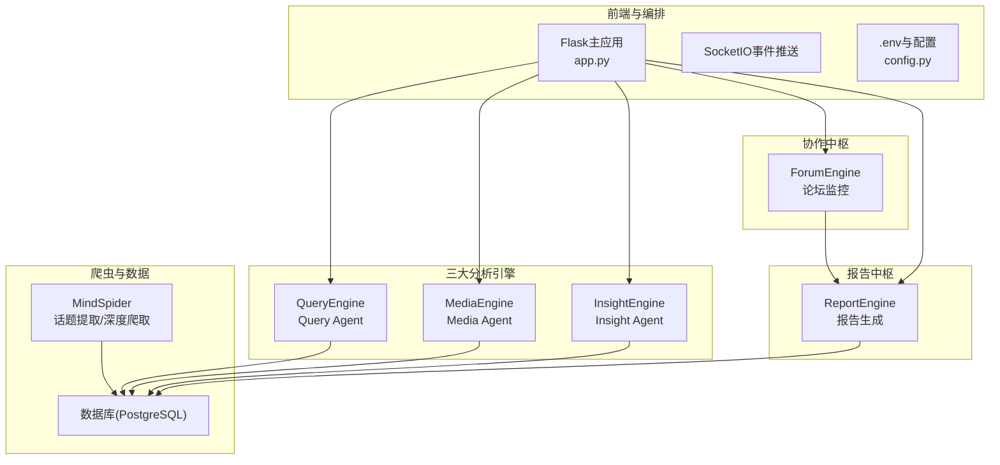
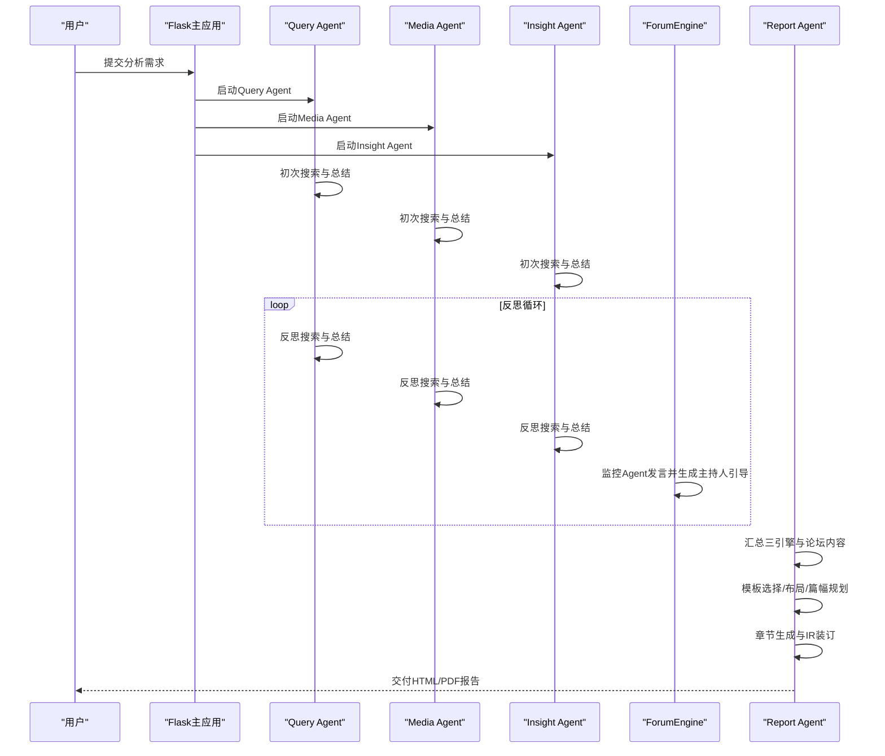
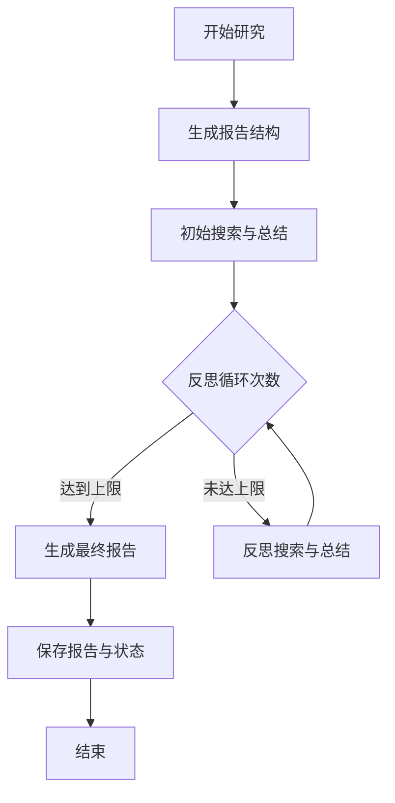
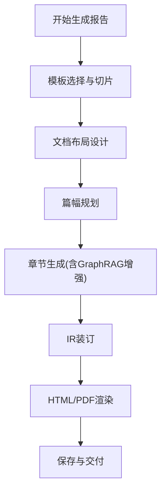
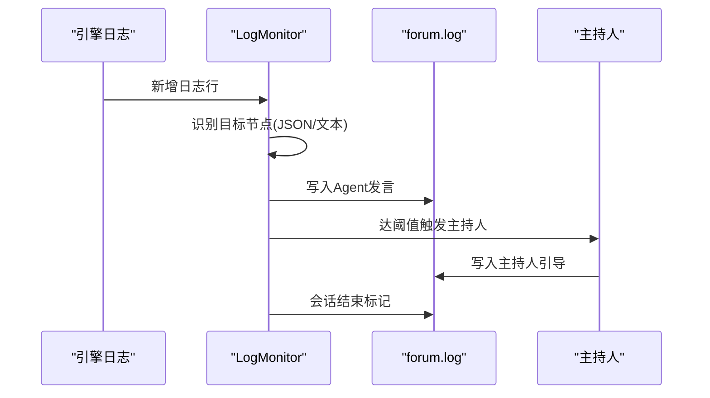
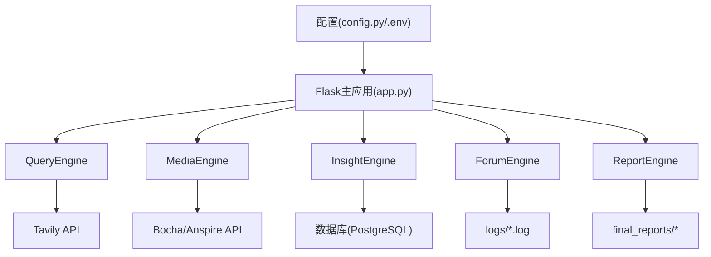

# 项目概述

<cite>
**本文引用的文件**
- [README.md](file://README.md)
- [app.py](file://app.py)
- [config.py](file://config.py)
- [docker-compose.yml](file://docker-compose.yml)
- [Dockerfile](file://Dockerfile)
- [InsightEngine/agent.py](file://InsightEngine/agent.py)
- [MediaEngine/agent.py](file://MediaEngine/agent.py)
- [QueryEngine/agent.py](file://QueryEngine/agent.py)
- [ReportEngine/agent.py](file://ReportEngine/agent.py)
- [ForumEngine/monitor.py](file://ForumEngine/monitor.py)
</cite>

## 目录
1. [简介](#简介)
2. [项目结构](#项目结构)
3. [核心组件](#核心组件)
4. [架构总览](#架构总览)
5. [详细组件分析](#详细组件分析)
6. [依赖关系分析](#依赖关系分析)
7. [性能考虑](#性能考虑)
8. [故障排查指南](#故障排查指南)
9. [结论](#结论)
10. [附录](#附录)

## 简介
“微舆”（BettaFish）是一个从零实现的多智能体舆情分析系统，旨在帮助用户破除信息茧房、还原舆情原貌并预测未来走向。系统通过“对话式”提问即可触发三个核心智能体并行工作：Query Agent（国内外新闻广度搜索）、Media Agent（多模态内容分析）、Insight Agent（私有数据库挖掘），并在论坛引擎的主持下进行链式思维碰撞与协作，最终由 Report Agent 生成可交互的综合报告。

系统具备六大核心优势：
- AI驱动的全域监控：7×24小时AI爬虫集群覆盖国内外主流社交媒体与评论数据，实时捕获热点并下钻海量用户评论。
- 超越LLM的复合分析引擎：融合多模型与中间件，实现深度、准度与多维视角的协同分析。
- 强大的多模态能力：突破图文限制，深度解析短视频内容，并精准提取结构化信息卡片。
- Agent“论坛”协作机制：引入辩论主持人模型，通过“论坛”机制进行链式思维碰撞，避免单一模型局限。
- 公私域数据无缝融合：支持将内部业务数据库与舆情数据集成，打通数据壁垒。
- 轻量化与高扩展性框架：纯Python模块化设计，一键式部署，便于二次开发与定制。

## 项目结构
系统采用前后端分离与多引擎协同的模块化架构：
- 前端与编排：Flask主应用统一启动三个Streamlit子应用与论坛监控，提供SSE事件推送与配置管理。
- 三大分析引擎：QueryEngine（新闻搜索）、MediaEngine（多模态搜索）、InsightEngine（数据库挖掘）。
- 协作中枢：ForumEngine实时监控各引擎日志，聚合Agent发言并生成主持人引导。
- 报告中枢：ReportEngine负责模板选择、布局设计、章节生成、IR装订与HTML/PDF渲染。
- 爬虫系统：MindSpider提供话题提取与深度舆情爬取能力，支持多平台与多模态数据采集。
- 情感分析：多套情感分析模型（BERT、GPT-2 LoRA、Qwen、多语言模型、传统ML）可选集成。

**图示来源**
- [app.py](file://app.py#L1-L200)
- [config.py](file://config.py#L1-L136)
- [README.md](file://README.md#L86-L120)

**章节来源**
- [README.md](file://README.md#L34-L120)
- [app.py](file://app.py#L1-L200)
- [config.py](file://config.py#L1-L136)

## 核心组件
- Insight Engine（私有数据库挖掘Agent）
  - 聚焦内部数据库与私域数据，提供热点内容、话题搜索、评论获取、情感分析与关键词优化等能力。
  - 支持聚类采样与多模型情感分析，提升结果代表性与可信度。
- Media Engine（多模态内容分析Agent）
  - 集成Bocha/Anspire等多模态搜索工具，支持网页搜索、结构化数据查询与近期信息检索。
  - 面向短视频、图片等多模态内容，提供结构化信息抽取与理解。
- Query Engine（精准信息搜索Agent）
  - 基于Tavily新闻搜索，提供基础/深度新闻分析、图片搜索、按日期范围检索等功能。
  - 支持反思循环，逐步完善搜索策略与结论。
- Report Engine（智能报告生成Agent）
  - 模板选择→布局设计→篇幅规划→章节生成→IR装订→HTML/PDF渲染的全流程。
  - 支持GraphRAG知识图谱增强，提供跨引擎与论坛上下文的智能增强。
- Forum Engine（论坛协作机制）
  - 实时监控三个引擎日志，聚合Agent发言并生成主持人引导，形成链式思维碰撞。
- MindSpider（社交爬虫系统）
  - 话题提取与深度舆情爬取，支持多平台与多模态数据采集，支撑全域监控能力。

**章节来源**
- [InsightEngine/agent.py](file://InsightEngine/agent.py#L1-L120)
- [MediaEngine/agent.py](file://MediaEngine/agent.py#L1-L120)
- [QueryEngine/agent.py](file://QueryEngine/agent.py#L1-L120)
- [ReportEngine/agent.py](file://ReportEngine/agent.py#L1-L120)
- [ForumEngine/monitor.py](file://ForumEngine/monitor.py#L1-L120)

## 架构总览
系统采用“并行分析 + 协同讨论 + 智能报告”的闭环流程：
- 用户通过Web界面提交分析需求，Flask主应用启动三个Agent并行工作。
- 各Agent在反思循环中不断深化研究，论坛引擎实时监控并生成主持人引导，促进Agent间的观点碰撞与融合。
- Report Agent汇总三引擎结果与论坛内容，动态选择模板、设计布局、规划篇幅，最终生成可交互HTML报告，并可选导出PDF。

**图示来源**
- [README.md](file://README.md#L102-L117)
- [app.py](file://app.py#L276-L348)
- [ReportEngine/agent.py](file://ReportEngine/agent.py#L424-L631)

**章节来源**
- [README.md](file://README.md#L86-L117)
- [app.py](file://app.py#L276-L348)

## 详细组件分析

### Insight Engine（私有数据库挖掘）
- 职责：对私有数据库进行深度挖掘，提供热点内容、话题搜索、评论获取、情感分析与关键词优化。
- 关键能力：
  - 多工具集：热点内容、全局/按日期话题搜索、平台定向搜索、评论获取。
  - 聚类采样：对搜索结果进行聚类，提升代表性与多样性。
  - 情感分析：多模型融合，支持批量与单条文本分析。
  - 关键词优化：基于中间件优化搜索关键词，提升召回质量。
- 流程要点：首次搜索→反思循环→总结→保存状态与报告。

**图示来源**
- [InsightEngine/agent.py](file://InsightEngine/agent.py#L512-L585)

**章节来源**
- [InsightEngine/agent.py](file://InsightEngine/agent.py#L1-L200)

### Media Engine（多模态内容分析）
- 职责：面向网页与多模态内容的综合搜索与分析，支持Bocha/Anspire等工具集。
- 关键能力：
  - 综合搜索、网页搜索、结构化数据查询、近期信息检索。
  - 多模态理解：支持短视频、图片等多模态内容的结构化信息抽取。
- 流程要点：首次搜索→反思循环→总结→保存报告。

**章节来源**
- [MediaEngine/agent.py](file://MediaEngine/agent.py#L1-L200)

### Query Engine（精准信息搜索）
- 职责：基于Tavily新闻搜索，提供新闻广度与深度分析。
- 关键能力：
  - 基础/深度新闻搜索、近期新闻检索、按日期范围检索、新闻图片搜索。
  - 反思循环：根据最新发现调整搜索策略。
- 流程要点：首次搜索→反思循环→总结→保存报告。

**章节来源**
- [QueryEngine/agent.py](file://QueryEngine/agent.py#L1-L200)

### Report Engine（智能报告生成）
- 职责：模板选择→布局设计→篇幅规划→章节生成→IR装订→HTML/PDF渲染。
- 关键能力：
  - 模板选择与切片：根据主题与上下文自动挑选模板。
  - 布局与篇幅：生成标题、目录与字数规划。
  - 章节生成：结合GraphRAG增强与多轮LLM生成，确保结构与内容质量。
  - IR装订与渲染：生成可交互HTML与可选PDF。
- GraphRAG增强：可选启用，将state与forum日志转化为知识图谱，增强章节生成的上下文质量。

**图示来源**
- [ReportEngine/agent.py](file://ReportEngine/agent.py#L424-L631)

**章节来源**
- [ReportEngine/agent.py](file://ReportEngine/agent.py#L1-L200)

### Forum Engine（论坛协作机制）
- 职责：实时监控Insight/Media/Query三个引擎日志，聚合Agent发言并生成主持人引导。
- 关键能力：
  - 多行JSON捕获：从日志中提取结构化总结内容。
  - 主持人引导：每N条Agent发言触发一次主持人总结，形成链式思维碰撞。
  - 超时与会话管理：自动结束长时间无活动的论坛会话。
- 流程要点：监控→捕获→清洗→写入forum.log→主持人引导→会话结束标记。

**图示来源**
- [ForumEngine/monitor.py](file://ForumEngine/monitor.py#L584-L702)

**章节来源**
- [ForumEngine/monitor.py](file://ForumEngine/monitor.py#L1-L200)

## 依赖关系分析
- 配置管理：统一通过config.py与.env管理LLM、数据库、搜索工具与GraphRAG等参数。
- 数据流：Insight/Media/Query引擎输出Markdown报告与状态文件，Report Engine读取并生成最终报告。
- 事件流：Flask主应用通过SocketIO向前端推送日志与论坛内容，实现实时可视化。
- 爬虫与数据库：MindSpider负责数据采集，Insight/Media/Query引擎通过数据库与搜索工具访问数据。

**图示来源**
- [config.py](file://config.py#L1-L136)
- [app.py](file://app.py#L1-L120)
- [docker-compose.yml](file://docker-compose.yml#L1-L40)

**章节来源**
- [config.py](file://config.py#L1-L136)
- [app.py](file://app.py#L1-L120)
- [docker-compose.yml](file://docker-compose.yml#L1-L40)

## 性能考虑
- 并行执行：三个Agent并行工作，显著缩短整体分析周期。
- 聚类采样：Insight Engine对搜索结果进行聚类采样，平衡代表性与性能。
- 流式事件：Report Engine章节生成支持流式回调，前端可实时渲染。
- GraphRAG可选：按需启用，避免不必要的计算开销。
- Docker化部署：统一依赖与运行环境，降低部署与运维成本。

[本节为通用指导，无需具体文件引用]

## 故障排查指南
- 配置问题：检查.env与config.py中的LLM、数据库与搜索工具参数是否正确。
- 日志定位：关注logs目录下的insight.log、media.log、query.log与forum.log，定位异常阶段。
- 事件流：确认Flask主应用的SocketIO事件推送是否正常，检查浏览器控制台与SSE连接。
- 报告生成：若章节生成失败，查看Report Engine日志与章节JSON错误日志，必要时启用备用LLM通道。
- 爬虫与数据库：确认MindSpider初始化与数据库连接状态，检查表结构与权限。

**章节来源**
- [app.py](file://app.py#L350-L400)
- [ReportEngine/agent.py](file://ReportEngine/agent.py#L254-L335)

## 结论
BettaFish通过“多智能体并行分析 + 论坛协作 + 智能报告生成”的闭环设计，实现了从数据采集、分析到报告交付的一体化解决方案。系统具备强大的多模态理解能力、公私域数据融合能力与高度可扩展的架构，适用于品牌声誉、市场竞争、政策解读、社会热点与突发事件等多类场景。依托Docker与一键式配置，开发者可快速部署并定制化扩展，满足多样化的业务需求。

[本节为总结性内容，无需具体文件引用]

## 附录

### 部署方案
- Docker一键部署
  - 拉取镜像或构建镜像，使用docker-compose启动服务与数据库容器。
  - 挂载logs、final_reports、各引擎输出目录，持久化数据与报告。
- 源码部署
  - 安装依赖、Playwright浏览器驱动与PDF导出系统依赖（可选）。
  - 配置.env与config.py，启动Flask主应用与三个Agent。
- 爬虫系统
  - 进入MindSpider目录，执行初始化与话题提取/深度爬取流程。

**章节来源**
- [README.md](file://README.md#L299-L541)
- [docker-compose.yml](file://docker-compose.yml#L1-L40)
- [Dockerfile](file://Dockerfile#L1-L78)

### 使用示例
- 完整系统：访问Web界面，提交分析需求，观察并行Agent工作与论坛协作，最终获得综合报告。
- 单独Agent：使用SingleEngineApp中的Streamlit应用独立运行某引擎。
- 命令行报告生成：使用report_engine_only.py直接读取最新日志生成报告，支持跳过PDF或Markdown生成。

**章节来源**
- [README.md](file://README.md#L453-L521)